# Technology Stack

## Architecture Overview

This document outlines the layered architecture of our application stack, showing the relationship between different layers and how they interact.

## Layer Architecture

```mermaid
graph TB
    subgraph Layer1["Application Layer"]
        A1["Business Logic"]
        A2["Application Workflows"]
        A3["Domain Models"]
    end
    
    subgraph Layer2["NestJS Framework Layer"]
        B1["Controllers"]
        B2["Services"]
        B3["Modules"]
        B4["Dependency Injection"]
        B5["Middleware & Guards"]
        B6["Pipes & Interceptors"]
    end
    
    subgraph Layer3["eqxjs-stub Foundation Layer"]
        C1["@corp-ais/eqxjs-commander<br/>Config & Commands"]
        C2["@corp-ais/eqxjs-decorator<br/>Metadata & Decorators"]
        C3["@corp-ais/eqxjs-transporter-http<br/>HTTP Transport"]
        C4["@corp-ais/eqxjs-logger<br/>Structured Logging"]
        C5["@corp-ais/eqxjs-pipes<br/>Transform & Validate"]
        C6["@corp-ais/eqxjs-utils<br/>Shared Utilities"]
        C7["@corp-ais/eqxjs-exception<br/>Error Handling"]
        C8["@corp-ais/eqxjs-security<br/>Auth & Security"]
    end
    
    Layer1 <--> Layer2
    Layer2 <--> Layer3
    
    style Layer1 fill:#e8f5e9,stroke:#2e7d32,stroke-width:3px,color:#1b5e20
    style Layer2 fill:#e3f2fd,stroke:#1565c0,stroke-width:3px,color:#0d47a1
    style Layer3 fill:#fff9c4,stroke:#f57f17,stroke-width:3px,color:#e65100
    
    style A1 fill:#c8e6c9,stroke:#2e7d32,color:#1b5e20
    style A2 fill:#c8e6c9,stroke:#2e7d32,color:#1b5e20
    style A3 fill:#c8e6c9,stroke:#2e7d32,color:#1b5e20
    
    style B1 fill:#bbdefb,stroke:#1565c0,color:#0d47a1
    style B2 fill:#bbdefb,stroke:#1565c0,color:#0d47a1
    style B3 fill:#bbdefb,stroke:#1565c0,color:#0d47a1
    style B4 fill:#bbdefb,stroke:#1565c0,color:#0d47a1
    style B5 fill:#bbdefb,stroke:#1565c0,color:#0d47a1
    style B6 fill:#bbdefb,stroke:#1565c0,color:#0d47a1
    
    style C1 fill:#fff59d,stroke:#f57f17,color:#e65100
    style C2 fill:#fff59d,stroke:#f57f17,color:#e65100
    style C3 fill:#fff59d,stroke:#f57f17,color:#e65100
    style C4 fill:#fff59d,stroke:#f57f17,color:#e65100
    style C5 fill:#fff59d,stroke:#f57f17,color:#e65100
    style C6 fill:#fff59d,stroke:#f57f17,color:#e65100
    style C7 fill:#fff59d,stroke:#f57f17,color:#e65100
    style C8 fill:#fff59d,stroke:#f57f17,color:#e65100
```

## Layer Description

### 1. Application (Business Logic)
The top layer contains the core business logic and application-specific functionality. This layer:
- Implements business rules and workflows
- Uses NestJS features to structure the application
- Leverages eqxjs-stub capabilities through NestJS

### 2. NestJS Framework
The middle layer provides the application framework and architectural patterns:
- **Controllers**: Handle incoming requests and return responses
- **Providers/Services**: Contain business logic and can be injected
- **Modules**: Organize application structure
- **Middleware & Guards**: Process requests and implement security
- **Pipes & Interceptors**: Transform and validate data

### 3. eqxjs-stub Foundation
The base layer provides core infrastructure and utilities through modular packages:
- **@corp-ais/eqxjs-commander**: Configuration management and command execution
- **@corp-ais/eqxjs-decorator**: Metadata management and custom decorators
- **@corp-ais/eqxjs-transporter-http**: HTTP client and transport layer
- **@corp-ais/eqxjs-logger**: Structured logging with multiple log levels
- **@corp-ais/eqxjs-pipes**: Data transformation and validation pipelines
- **@corp-ais/eqxjs-utils**: Shared utilities and helper functions
- **@corp-ais/eqxjs-exception**: Standardized error handling and exceptions
- **@corp-ais/eqxjs-security**: Authentication, authorization, and security features

## Component Interaction

All elements across NestJS and eqxjs-stub layers can be accessed and utilized through:

- **Dependency Injection**: NestJS DI system integrates eqxjs-stub components
- **Decorators**: Both layers provide decorators for cross-cutting concerns
- **Module System**: eqxjs-stub features are imported as NestJS modules
- **Configuration**: Centralized configuration accessible from any layer
- **Event System**: Kafka and event-driven communication across layers

## Technology Flow

```mermaid
graph TD
    A[Application Business Logic] --> C[NestJS]
    C --> Stub[eqxjs-stub]
    Stub --> Commander["@corp-ais/eqxjs-commander<br/>(config + commands)"]
    Stub --> Decorator["@corp-ais/eqxjs-decorator<br/>(metadata + decorators)"]
    Stub --> Http["@corp-ais/eqxjs-transporter-http<br/>HTTP client/transport"]
    Stub --> Logger["@corp-ais/eqxjs-logger<br/>structured logging"]
    Stub --> Pipes["@corp-ais/eqxjs-pipes<br/>transform/validate"]
    Stub --> Utils["@corp-ais/eqxjs-utils<br/>shared utilities"]
    Stub --> Exception["@corp-ais/eqxjs-exception<br/>standard errors"]
    Stub --> Security["@corp-ais/eqxjs-security<br/>validation + security"]
    C --> Commander
    C --> Decorator
    C --> Http
    C --> Logger
    C --> Pipes
    C --> Utils
    C --> Exception
    C --> Security
    
    style A fill:#c8e6c9,stroke:#2e7d32,stroke-width:3px,color:#1b5e20
    style C fill:#bbdefb,stroke:#1565c0,stroke-width:3px,color:#0d47a1
    style Stub fill:#fff59d,stroke:#f57f17,stroke-width:3px,color:#e65100
    
    style Commander fill:#ffe0b2,stroke:#ef6c00,stroke-width:2px,color:#bf360c
    style Decorator fill:#ffe0b2,stroke:#ef6c00,stroke-width:2px,color:#bf360c
    style Http fill:#ffe0b2,stroke:#ef6c00,stroke-width:2px,color:#bf360c
    style Logger fill:#ffe0b2,stroke:#ef6c00,stroke-width:2px,color:#bf360c
    style Pipes fill:#ffe0b2,stroke:#ef6c00,stroke-width:2px,color:#bf360c
    style Utils fill:#ffe0b2,stroke:#ef6c00,stroke-width:2px,color:#bf360c
    style Exception fill:#ffe0b2,stroke:#ef6c00,stroke-width:2px,color:#bf360c
    style Security fill:#ffe0b2,stroke:#ef6c00,stroke-width:2px,color:#bf360c
    
    linkStyle 0 stroke:#2e7d32,stroke-width:3px
    linkStyle 1 stroke:#1565c0,stroke-width:3px
    linkStyle 2,3,4,5,6,7,8,9 stroke:#f57f17,stroke-width:2px
    linkStyle 10,11,12,13,14,15,16,17 stroke:#1565c0,stroke-width:2px
```

## Key Benefits

1. **Separation of Concerns**: Each layer has clear responsibilities
2. **Modularity**: Components can be developed and tested independently
3. **Scalability**: Layers can be optimized independently
4. **Maintainability**: Changes in one layer have minimal impact on others
5. **Reusability**: eqxjs-stub provides reusable infrastructure components
6. **Type Safety**: Full TypeScript support across all layers

## Related Documentation

- [NestJS Course](./nestjs/README.md)
- [eqxjs-framework Stub](./eqxjs-framework/01-stub/README.md)
- [eqxjs-framework Custom Kafka Server](./eqxjs-framework/02-custom-kafka-server/README.md)
- [eqxjs-template](./eqxjs-template/README.md)
- [Kafka Integration](./kafka/README.md)
