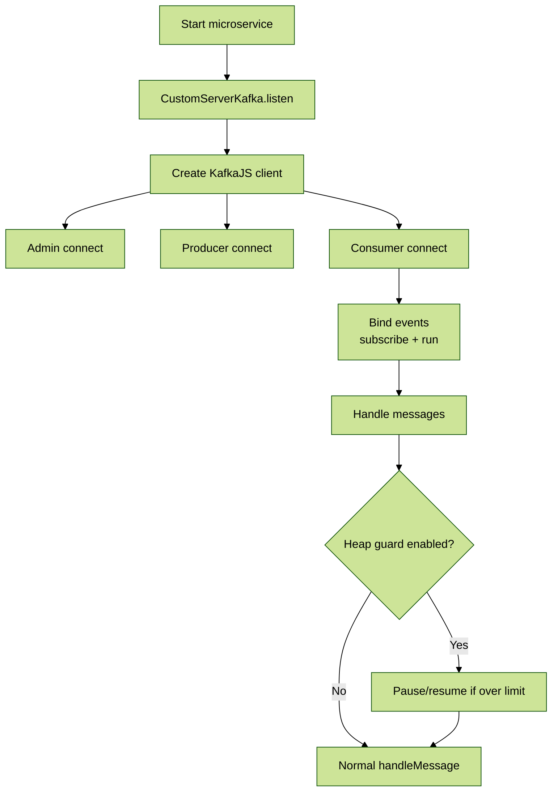

# Module 1: Introduction & Features

## 📚 Learning Objectives

By the end of this module, you will be able to:

- Explain what `@eqxjs/custom-kafka-server` provides
- Describe how it differs from the default Nest Kafka transport
- Identify the main runtime features and when to use them

---

## 1.1 What is `CustomServerKafka`?

`CustomServerKafka` is a NestJS microservices **custom strategy** built by extending `@nestjs/microservices`’ `ServerKafka` implementation.

It is designed for teams that want **standard production behavior** for Kafka consumers/producers, such as:

- consumer auto-recovery
- topic monitoring
- memory guardrails (pause/resume)

---

## 1.2 Key Features

### Consumer auto-recovery

- Listens to `consumer.crash`
- Uses KafkaJS `restartOnFailure` to trigger a recreate flow

### Optional separate producer options

You can pass `producerOptions` separately. If omitted, it uses consumer options.

### Topic validation and monitoring

- Derives “registered topics” from Nest message patterns
- Optionally calls `admin.listTopics()` to ensure they exist
- Optionally monitors for topic changes and triggers consumer recreate

### Heap guardrails

When enabled, checks V8 heap usage and temporarily pauses/resumes partitions.

---

## 🧭 Visual Flow (Mermaid)

---

## 1.3 Environment Variables (Feature Flags)

- `MONITOR_TOPICS` (default: enabled unless set to `false`)
- `KAFKA_MONITOR_INTERVAL` (default: 1800000 ms)
- `KAFKA_HEAP_USED_SIZE_CHECK_ENABLED` (default: false)
- `KAFKA_HEAP_USED_SIZE_PERCENT` (default: 80)
- `KAFKA_CONSUMER_PAUSE_TIME_MS` (default: 10000)

---

## ✅ Summary

- `CustomServerKafka` is a Nest custom transport strategy built on KafkaJS.
- It adds recovery, monitoring, and safety guardrails for production usage.

Next: [Module 2: Setup & NestJS Integration](module-02-setup-integration.md)
