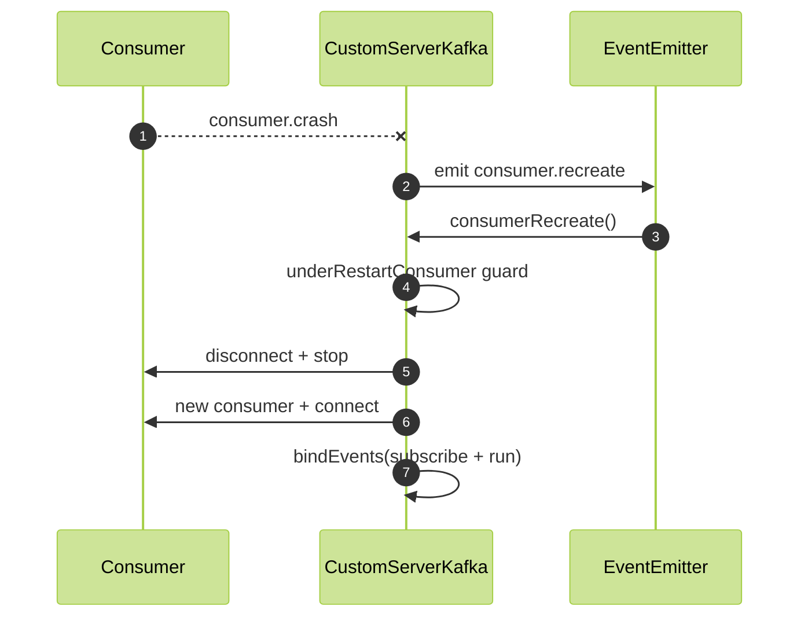

# Module 4: Resilience & Recovery

## 📚 Learning Objectives

By the end of this module, you will be able to:

- Explain what triggers consumer recreation
- Understand the recovery loop and backoff behavior
- Recognize safe/unsafe patterns when restarting

---

## 4.1 Crash-driven recovery

The strategy listens to KafkaJS consumer events:

- `consumer.crash` → emits `consumer.recreate`

It also configures (when a consumer config exists):

- `consumer.retry.restartOnFailure` → emits `consumer.recreate` and prevents KafkaJS from auto-restarting

---

## 4.2 Consumer recreate flow

Key steps:

- disconnect + stop the consumer
- create a new consumer with the same groupId
- reconnect
- re-bind events (subscribe + run)

A concurrency guard (`underRestartConsumer`) prevents overlapping restarts.

---

## 4.3 Producer recreate flow

A separate event path allows recreating the producer.

---

## 🧭 Visual Flow (Mermaid)

---

## ✅ Summary

- Recovery is explicit and controllable.
- Concurrency guard reduces restart storms.

Next: [Module 5: Topic Monitoring & Subscription](module-05-topic-monitoring.md)
