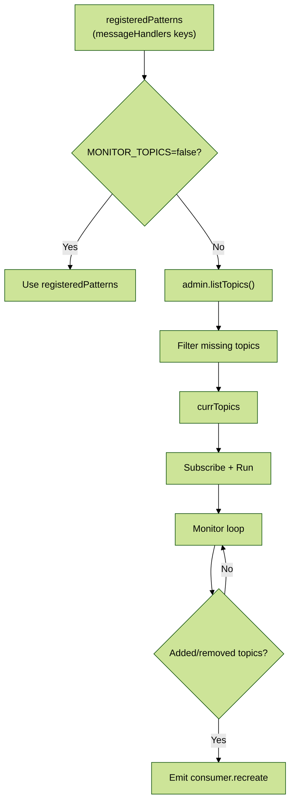

# Module 5: Topic Monitoring & Subscription

## 📚 Learning Objectives

By the end of this module, you will be able to:

- Explain how topics are derived from message patterns
- Understand what monitoring does and how it triggers recreate
- Configure monitoring via environment variables

---

## 5.1 Where do topics come from?

The strategy uses “registered patterns”:

- `registeredPatterns = [...this.messageHandlers.keys()]`

In Nest microservices, these correspond to your `@MessagePattern('topic')` registrations.

---

## 5.2 Topic validation

When monitoring is enabled, it compares registered patterns with:

- `admin.listTopics()`

Missing topics are logged and excluded from subscription.

---

## 5.3 Monitoring loop

When enabled, a loop:

- periodically refreshes topics
- if topics are added/removed compared to `currTopics`, it triggers consumer recreate

Configuration:

- `MONITOR_TOPICS=false` disables monitoring and uses only registered patterns
- `KAFKA_MONITOR_INTERVAL` controls polling interval (ms)

---

## 🧭 Visual Flow (Mermaid)

---

## ✅ Summary

- Monitoring helps keep subscription aligned to cluster reality.
- It trades extra admin calls for operational awareness.

Next: [Module 6: Memory Guardrails & Production Tuning](module-06-memory-production.md)
