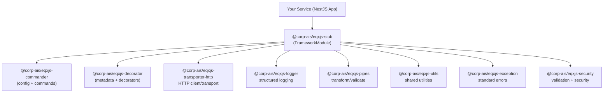

# Module 1: Introduction to EQXJS Framework

## 📚 Learning Objectives

By the end of this module, you will understand:

- What EQXJS Framework is and its role in enterprise development
- The complete EQXJS ecosystem and its components
- Framework philosophy and architectural principles
- Use cases and benefits for enterprise applications
- How EQXJS fits into modern microservices architecture

## 🧭 Visual Flow (Mermaid)



---

## 🎯 1.1 What is EQXJS Framework?

### Overview

**EQXJS Framework** (`@corp-ais/eqxjs-stub`) is a comprehensive enterprise-grade NestJS framework stub that serves as a bootstrapping library for building scalable, maintainable, and production-ready applications. It acts as the main entry point for the EQXJS ecosystem, consolidating and integrating multiple specialized modules.

### Key Characteristics

- **Enterprise-Grade**: Built specifically for enterprise application requirements
- **NestJS-Based**: Leverages the power and flexibility of NestJS
- **Modular Architecture**: Composed of specialized, reusable modules
- **Production-Ready**: Includes essential infrastructure components
- **Configuration-Driven**: Flexible configuration management system

### Core Purpose

The framework serves three primary purposes:

1. **Integration Hub**: Consolidates multiple EQXJS ecosystem modules
2. **Bootstrapping**: Provides application initialization and setup
3. **Infrastructure**: Offers essential enterprise application components

---

## 🏗️ 1.2 EQXJS Ecosystem Components

The EQXJS ecosystem consists of specialized modules that work together to provide comprehensive application infrastructure:

### Core Modules

#### 1. `@corp-ais/eqxjs-commander`

- **Purpose**: Command handling and configuration management
- **Features**: Environment-based configuration, command routing
- **Use Case**: Application configuration and startup commands

#### 2. `@corp-ais/eqxjs-decorator`

- **Purpose**: Custom decorators for application enhancement
- **Features**: Method decorators, class decorators, parameter decorators
- **Use Case**: Cross-cutting concerns, metadata management

#### 3. `@corp-ais/eqxjs-transporter-http`

- **Purpose**: HTTP transport layer
- **Features**: HTTP client management, request/response handling
- **Use Case**: External API integration, HTTP communications

#### 4. `@corp-ais/eqxjs-logger`

- **Purpose**: Comprehensive logging capabilities
- **Features**: Structured logging, log levels, output formatting
- **Use Case**: Application monitoring, debugging, audit trails

#### 5. `@corp-ais/eqxjs-pipes`

- **Purpose**: Data transformation pipes
- **Features**: Input validation, data transformation, sanitization
- **Use Case**: Request/response data processing

#### 6. `@corp-ais/eqxjs-utils`

- **Purpose**: Utility functions and services
- **Features**: Common utilities, helper functions, shared services
- **Use Case**: Cross-application utilities

#### 7. `@corp-ais/eqxjs-exception`

- **Purpose**: Exception handling framework
- **Features**: Custom exceptions, error handling, error formatting
- **Use Case**: Standardized error management

#### 8. `@corp-ais/eqxjs-security`

- **Purpose**: Security utilities and validation
- **Features**: Authentication, authorization, input validation
- **Use Case**: Application security, data validation

### Integration Benefits

When combined, these modules provide:

- **Unified Developer Experience**: Consistent APIs and patterns
- **Reduced Boilerplate**: Pre-configured integrations
- **Best Practices**: Enterprise-proven patterns and practices
- **Scalability**: Designed for large-scale applications

---

## 💭 1.3 Framework Philosophy

### Design Principles

#### 1. **Configuration-Driven Development**

```typescript
// Applications are configured through YAML files
// development.config.yaml, staging.config.yaml, production.config.yaml
```

#### 2. **Modular Architecture**

```typescript
// Each concern is separated into focused modules
@Module({
  imports: [
    FrameworkModule.register({
      configPath: "./config",
      zone: process.env.NODE_ENV,
    }),
  ],
})
export class AppModule {}
```

#### 3. **Enterprise Patterns**

- Dependency injection
- Aspect-oriented programming
- Domain-driven design
- Microservices architecture

#### 4. **Production-First Mindset**

- Built-in health checks
- Graceful shutdown handling
- Monitoring and observability
- Security by default

### Architectural Principles

#### Separation of Concerns

- **Business Logic**: Domain services and use cases
- **Infrastructure**: Framework modules and utilities
- **Configuration**: Environment-specific settings
- **Cross-Cutting**: Logging, security, monitoring

#### Dependency Inversion

```typescript
// High-level modules don't depend on low-level modules
// Both depend on abstractions (interfaces)
@Injectable()
export class UserService {
  constructor(
    private readonly userRepository: IUserRepository,
    private readonly logger: ILogger,
  ) {}
}
```

#### Single Responsibility

Each module has a single, well-defined responsibility:

- Commander: Configuration management
- Logger: Logging functionality
- Security: Security concerns

---

## 🎪 1.4 Use Cases & Benefits

### Primary Use Cases

#### 1. **Microservices Architecture**

- Service discovery and communication
- Configuration management across services
- Standardized logging and monitoring
- Health check endpoints

#### 2. **API Gateway Patterns**

- Request/response transformation
- Authentication and authorization
- Rate limiting and throttling
- Load balancing integration

#### 3. **Enterprise Service Bus (ESB)**

- Message routing and transformation
- Protocol adaptation
- Service orchestration
- Event-driven architecture

#### 4. **Cloud-Native Applications**

- Container-ready deployment
- Environment-based configuration
- Health monitoring
- Graceful shutdown handling

### Key Benefits

#### For Developers

- **Faster Development**: Pre-built components and patterns
- **Consistent Architecture**: Standardized project structure
- **Reduced Learning Curve**: Well-documented APIs and examples
- **Best Practices**: Enterprise-proven patterns built-in

#### For Organizations

- **Faster Time-to-Market**: Accelerated development cycles
- **Reduced Maintenance**: Standardized, well-tested components
- **Scalability**: Built for enterprise-scale applications
- **Cost Effectiveness**: Reduced development and operational costs

#### For Operations

- **Monitoring Ready**: Built-in health checks and metrics
- **Production Hardened**: Battle-tested in enterprise environments
- **Deployment Friendly**: Container and cloud-ready
- **Maintainable**: Clear separation of concerns

---

## 🏢 1.5 Enterprise Application Context

### Traditional Challenges

Enterprise applications typically face:

- **Complexity**: Multiple systems and integrations
- **Scalability**: High-throughput, high-availability requirements
- **Maintainability**: Large development teams, long lifecycles
- **Compliance**: Security, audit, and regulatory requirements

### EQXJS Solutions

#### Complexity Management

```typescript
// Single framework handles multiple concerns
@Module({
  imports: [
    FrameworkModule.register(config), // All-in-one setup
    DomainModule,
    InfrastructureModule,
  ],
})
export class AppModule {}
```

#### Scalability Features

- Non-blocking I/O with NestJS
- Horizontal scaling support
- Efficient resource utilization
- Performance monitoring

#### Maintainability Support

- Modular architecture
- Clear separation of concerns
- Comprehensive documentation
- Standardized patterns

#### Compliance Ready

- Security modules built-in
- Audit logging capabilities
- Configuration validation
- Health monitoring

---

## 🌟 1.6 Framework Evolution & Roadmap

### Current State (v3.x)

The framework is currently in its third major version, offering:

- Stable API with backward compatibility
- Comprehensive module ecosystem
- Production-proven reliability
- Active development and maintenance

### Key Milestones

- **v1.0**: Initial framework release with core modules
- **v2.0**: Enhanced configuration management and health checks
- **v3.0**: Advanced decorators, improved security, graceful shutdown
- **v3.2.6**: Current stable release with latest enhancements

### Future Direction

Planned enhancements include:

- Cloud-native improvements
- Enhanced observability
- Performance optimizations
- New integration modules

---

## 📊 1.7 Comparison with Other Frameworks

### vs. Plain NestJS

| Feature             | Plain NestJS             | EQXJS Framework           |
| ------------------- | ------------------------ | ------------------------- |
| Setup Time          | Manual configuration     | Pre-configured modules    |
| Enterprise Features | Manual implementation    | Built-in components       |
| Best Practices      | Developer responsibility | Framework enforced        |
| Monitoring          | Custom implementation    | Integrated health checks  |
| Security            | Manual setup             | Built-in security modules |

### vs. Express.js

| Feature              | Express.js              | EQXJS Framework               |
| -------------------- | ----------------------- | ----------------------------- |
| Architecture         | Minimal framework       | Enterprise-grade framework    |
| Type Safety          | Manual TypeScript setup | Built-in TypeScript support   |
| Dependency Injection | Manual implementation   | Native DI container           |
| Scalability          | Manual scaling patterns | Built-in scalability features |

### Key Advantages

1. **Reduced Development Time**: Pre-built enterprise components
2. **Consistency**: Standardized patterns and practices
3. **Reliability**: Battle-tested in production environments
4. **Support**: Comprehensive documentation and community

---

## 🎯 Summary

In this module, we've covered:

✅ **Framework Overview**: EQXJS as an enterprise NestJS framework  
✅ **Ecosystem Components**: Eight specialized modules working together  
✅ **Framework Philosophy**: Configuration-driven, modular, enterprise-focused  
✅ **Use Cases**: Microservices, API gateways, ESB, cloud-native apps  
✅ **Benefits**: For developers, organizations, and operations teams  
✅ **Enterprise Context**: Solving real-world enterprise challenges

### Key Takeaways

1. **EQXJS Framework is more than just a framework** - it's a complete ecosystem for enterprise application development
2. **Modular architecture** allows for flexibility while maintaining consistency
3. **Configuration-driven approach** enables easy environment management
4. **Production-ready features** are built-in, not afterthoughts
5. **Enterprise patterns** are enforced by framework design

---

## 🎓 Knowledge Check

Before proceeding to Module 2, ensure you understand:

- [ ] What EQXJS Framework is and its primary purpose
- [ ] The eight core modules in the EQXJS ecosystem
- [ ] Framework design principles and philosophy
- [ ] Primary use cases for EQXJS applications
- [ ] Benefits for different stakeholders
- [ ] How EQXJS compares to other frameworks

---

## ➡️ Next Steps

Ready to get hands-on with the framework?

👉 **Continue to [Module 2: Getting Started & Setup](module-02-getting-started.md)**

📝 **Complete the exercises**: [Module 1 Exercises](exercise/module-01-exercises.md)
