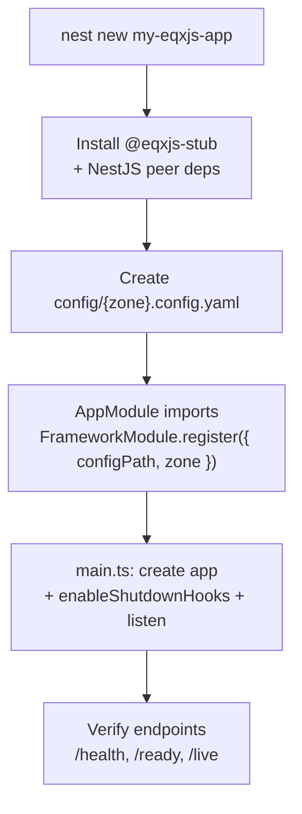

# Module 2: Getting Started & Setup

**Quick navigation:**

- Outline: `course-outline.md`
- Quick Start (minimal path): `QUICK_START.md`
- Exercises: `exercise/module-02-exercises.md`
- Previous module: `module-01-introduction.md`
- Next module: `module-03-framework-configuration.md`

## Before you start

- Make sure Node.js 22+ is installed and available on your PATH.
- Keep one terminal open for running the app while you follow along.

## 📚 Learning Objectives

By the end of this module, you will be able to:

- Install and configure EQXJS Framework in a new project
- Set up the required development environment
- Create a basic EQXJS application structure
- Configure environment-specific settings
- Run your first EQXJS application
- Understand project structure best practices

## 🧭 Visual Flow (Mermaid)



---

## 🛠️ 2.1 Installation & Dependencies

### Prerequisites

Before installing EQXJS Framework, ensure you have:

- **Node.js 22+** - Latest LTS version recommended
- **TypeScript 4.5+** - For type safety and modern JavaScript features
- **npm or yarn** - Package manager
- **Git** - Version control system

### Verify Prerequisites

```bash
# Check Node.js version
node --version  # Should be 22.0.0 or higher

# Check npm version
npm --version

# Check TypeScript (install globally if needed)
npx tsc --version
# or install globally: npm install -g typescript
```

### Create New Project

```bash
# Create project directory
mkdir my-eqxjs-app
cd my-eqxjs-app

# Initialize npm project
npm init -y

# Set up TypeScript configuration
npx tsc --init
```

### Install EQXJS Framework

```bash
# Install the main framework
npm install @eqxjs-stub

# Install NestJS dependencies (peer dependencies)
npm install @nestjs/common @nestjs/core @nestjs/platform-express

# Install development dependencies
npm install -D @nestjs/cli @nestjs/testing typescript @types/node
```

### Verify Installation

```bash
# Check installed packages
npm list --depth=0

# Verify EQXJS installation
node -e "console.log(require('@eqxjs-stub'))"
```

---

## 📁 2.2 Project Structure

### Recommended Folder Structure

```
my-eqxjs-app/
├── src/
│   ├── app.module.ts          # Main application module
│   ├── main.ts                # Application entry point
│   ├── health/                # Health check modules
│   ├── domain/                # Domain services
│   ├── infrastructure/        # Infrastructure services
│   └── shared/                # Shared utilities
├── config/                    # Configuration files
│   ├── development.config.yaml
│   ├── staging.config.yaml
│   └── production.config.yaml
├── test/                      # Test files
├── dist/                      # Compiled output
├── docs/                      # Documentation
├── scripts/                   # Build and deployment scripts
├── package.json
├── tsconfig.json
├── nest-cli.json
└── README.md
```

### Create Directory Structure

```bash
# Create source directories
mkdir -p src/{health,domain,infrastructure,shared}

# Create config directory
mkdir config

# Create other directories
mkdir -p test docs scripts
```

### Configuration Files Setup

Create `nest-cli.json`:

```json
{
  "collection": "@nestjs/schematics",
  "sourceRoot": "src",
  "compilerOptions": {
    "deleteOutDir": true
  }
}
```

Update `tsconfig.json`:

```json
{
  "compilerOptions": {
    "module": "commonjs",
    "declaration": true,
    "removeComments": true,
    "emitDecoratorMetadata": true,
    "experimentalDecorators": true,
    "allowSyntheticDefaultImports": true,
    "target": "ES2020",
    "sourceMap": true,
    "outDir": "./dist",
    "baseUrl": "./",
    "incremental": true,
    "skipLibCheck": true,
    "strictNullChecks": false,
    "noImplicitAny": false,
    "strictBindCallApply": false,
    "forceConsistentCasingInFileNames": false,
    "noFallthroughCasesInSwitch": false,
    "paths": {
      "@/*": ["src/*"]
    }
  }
}
```

---

## ⚙️ 2.3 Basic Framework Setup

### Create Main Application Module

Create `src/app.module.ts`:

```typescript
import { Module } from "@nestjs/common";
import { FrameworkModule } from "@eqxjs-stub";

@Module({
  imports: [
    FrameworkModule.register({
      configPath: "./config",
      zone: process.env.NODE_ENV || "development",
    }),
  ],
})
export class AppModule {}
```

### Create Application Entry Point

Create `src/main.ts`:

```typescript
import { NestFactory } from "@nestjs/core";
import { AppModule } from "./app.module";

async function bootstrap() {
  const app = await NestFactory.create(AppModule);

  // Enable graceful shutdown hooks
  app.enableShutdownHooks();

  // Set global prefix for APIs
  app.setGlobalPrefix("api/v1");

  // Start the application
  const port = process.env.PORT || 3000;
  await app.listen(port);

  console.log(`🚀 Application is running on: http://localhost:${port}`);
  console.log(`📋 Health check: http://localhost:${port}/api/v1/health`);
}

bootstrap().catch((error) => {
  console.error("❌ Application failed to start:", error);
  process.exit(1);
});
```

### Environment Configuration

Create `config/development.config.yaml`:

```yaml
# Development Configuration
app:
  name: "My EQXJS Application"
  version: "1.0.0"
  description: "Development environment configuration"

server:
  port: 3000
  host: "localhost"

logging:
  level: "debug"
  format: "pretty"

database:
  type: "mongodb"
  host: "localhost"
  port: 27017
  database: "myapp_dev"

targetDomain: "development.myapp.local"
```

Create `config/production.config.yaml`:

```yaml
# Production Configuration
app:
  name: "My EQXJS Application"
  version: "1.0.0"
  description: "Production environment configuration"

server:
  port: 8080
  host: "0.0.0.0"

logging:
  level: "info"
  format: "json"

database:
  type: "mongodb"
  host: "mongodb-prod.example.com"
  port: 27017
  database: "myapp_prod"

targetDomain: "api.myapp.com"
```

---

## 🚀 2.4 Hello World Application

### Create a Simple Controller

Create `src/app.controller.ts`:

```typescript
import { Controller, Get } from "@nestjs/common";

@Controller()
export class AppController {
  @Get()
  getHello(): object {
    return {
      message: "Hello World from EQXJS Framework!",
      timestamp: new Date().toISOString(),
      framework: "EQXJS",
      version: "1.0.0",
    };
  }

  @Get("info")
  getInfo(): object {
    return {
      application: "My EQXJS Application",
      environment: process.env.NODE_ENV || "development",
      node_version: process.version,
      uptime: process.uptime(),
    };
  }
}
```

### Update App Module

Update `src/app.module.ts`:

```typescript
import { Module } from "@nestjs/common";
import { FrameworkModule } from "@eqxjs-stub";
import { AppController } from "./app.controller";

@Module({
  imports: [
    FrameworkModule.register({
      configPath: "./config",
      zone: process.env.NODE_ENV || "development",
    }),
  ],
  controllers: [AppController],
})
export class AppModule {}
```

### Add NPM Scripts

Update `package.json` scripts section:

```json
{
  "scripts": {
    "build": "nest build",
    "format": "prettier --write \"src/**/*.ts\" \"test/**/*.ts\"",
    "start": "nest start",
    "start:dev": "nest start --watch",
    "start:debug": "nest start --debug --watch",
    "start:prod": "node dist/main",
    "lint": "eslint \"{src,apps,libs,test}/**/*.ts\" --fix",
    "test": "jest",
    "test:watch": "jest --watch",
    "test:cov": "jest --coverage",
    "test:debug": "node --inspect-brk -r tsconfig-paths/register -r ts-node/register node_modules/.bin/jest --runInBand",
    "test:e2e": "jest --config ./test/jest-e2e.json"
  }
}
```

### Run Your Application

```bash
# Development mode with hot reload
npm run start:dev

# Production build and run
npm run build
npm run start:prod

# Debug mode
npm run start:debug
```

### Test Your Application

```bash
# Test the hello endpoint
curl http://localhost:3000/api/v1

# Test the info endpoint
curl http://localhost:3000/api/v1/info

# Test health check (provided by EQXJS)
curl http://localhost:3000/api/v1/health
```

Expected responses:

**Hello endpoint**:

```json
{
  "message": "Hello World from EQXJS Framework!",
  "timestamp": "2026-02-11T10:30:00.000Z",
  "framework": "EQXJS",
  "version": "1.0.0"
}
```

**Health endpoint**:

```json
{
  "status": "ok",
  "info": {
    "self": {
      "status": "up"
    }
  },
  "error": {},
  "details": {
    "self": {
      "status": "up"
    }
  }
}
```

---

## 🎯 Summary

In this module, we've covered:

✅ **Installation Process**: Installing EQXJS Framework and dependencies  
✅ **Project Structure**: Setting up recommended folder structure  
✅ **Basic Setup**: Creating main application module and entry point  
✅ **Configuration**: Environment-specific YAML configuration files  
✅ **Hello World App**: Creating and running your first EQXJS application

### Key Takeaways

1. **EQXJS Framework integrates seamlessly** with standard NestJS applications
2. **Configuration-driven approach** allows easy environment management
3. **Built-in health checks** provide immediate monitoring capabilities
4. **Conventional project structure** promotes maintainability

---

## 🎓 Knowledge Check

Before proceeding to Module 3, ensure you can:

- [ ] Install EQXJS Framework in a new project
- [ ] Set up proper project structure
- [ ] Configure environment-specific settings
- [ ] Create and run a basic EQXJS application
- [ ] Test health check endpoints

---

## ➡️ Next Steps

Now that you have a working EQXJS application:

👉 **Continue to [Module 3: Framework Module Configuration](module-03-framework-configuration.md)**

📝 **Complete the exercises**: [Module 2 Exercises](exercise/module-02-exercises.md)

---

## 📚 Additional Resources

- [NestJS Getting Started Guide](https://docs.nestjs.com/)
- [TypeScript Configuration Reference](https://www.typescriptlang.org/tsconfig)
- [Node.js Best Practices](https://nodejs.org/en/docs/guides/)
- [YAML Syntax Reference](https://yaml.org/spec/1.2/spec.html)
