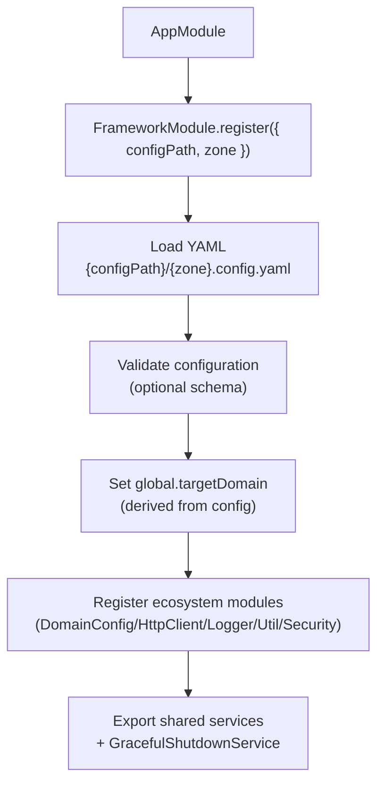

# Module 3: Framework Module Configuration

**Quick navigation:**

- Outline: `course-outline.md`
- Exercises: `exercise/module-03-exercises.md`
- Previous module: `module-02-getting-started.md`
- Next module: `module-04-health-monitoring.md`

## Before you start

- You should have a project that already boots with `FrameworkModule.register({ configPath, zone })`.
- Keep your config files open while reading this module (you’ll reference them often).

## 📚 Learning Objectives

By the end of this module, you will understand:

- FrameworkModule architecture and registration patterns
- Dynamic module configuration options
- Zone-based configuration management
- Global domain configuration and its uses
- Module integration patterns with EQXJS ecosystem
- Advanced configuration techniques

## 🧭 Visual Flow (Mermaid)



---

## 🏗️ 3.1 FrameworkModule Architecture

### Dynamic Module Pattern

The `FrameworkModule` uses NestJS's dynamic module pattern to provide configurable functionality:

```typescript
import { DynamicModule, Module } from "@nestjs/common";

@Module({})
export class FrameworkModule {
  static register(options: FrameworkOptions): DynamicModule {
    return {
      module: FrameworkModule,
      imports: [
        // Dynamic imports based on configuration
      ],
      providers: [
        // Dynamic providers
      ],
      exports: [
        // Exported services
      ],
    };
  }
}
```

### Module Structure Tree

```
FrameworkModule (Root)
├── DomainConfigModule (Global)
│   ├── YAML Configuration Loader
│   └── Global Domain Setter
├── HttpClientModule (Global)
│   ├── HTTP Transport Layer
│   └── Request/Response Interceptors
├── LoggerModule (Global)
│   ├── Structured Logging
│   └── Context-aware Logger
├── UtilModule (Global)
│   ├── Framework Utilities
│   └── Helper Services
├── SecurityModule (Global)
│   ├── Validation Utilities
│   └── Security Decorators
├── FrameworkUtilService (Provider)
└── GracefulShutdownService (Provider)
```

### Registration Process

```typescript
// 1. Configuration Loading Phase
const config = await loadYAMLConfig(configPath, zone);

// 2. Global Domain Setting Phase
global.targetDomain = config.targetDomain;

// 3. Module Registration Phase
const dynamicModules = [
  DomainConfigModule.register(config),
  HttpClientModule.register(config.http),
  LoggerModule.register(config.logging),
  // ... other modules
];

// 4. Service Provisioning Phase
const providers = [
  FrameworkUtilService,
  GracefulShutdownService,
  // ... other providers
];
```

---

## ⚙️ 3.2 Configuration Management

### Framework Options Interface

```typescript
interface FrameworkOptions {
  configPath: string; // Path to config directory
  zone: string; // Environment zone (dev/staging/prod)
  enableHealthCheck?: boolean; // Enable health endpoints
  enableGracefulShutdown?: boolean; // Enable shutdown hooks
  customProviders?: Provider[]; // Additional providers
}
```

### Zone-Based Configuration

The framework supports multiple environment zones:

```bash
config/
├── development.config.yaml    # Development environment
├── staging.config.yaml       # Staging environment
├── production.config.yaml    # Production environment
├── testing.config.yaml       # Testing environment
└── local.config.yaml         # Local overrides
```

### Configuration Loading Process

```typescript
class ConfigurationLoader {
  async loadConfig(configPath: string, zone: string): Promise<Config> {
    // 1. Load base configuration
    const baseConfig = await this.loadYAMLFile(
      `${configPath}/base.config.yaml`,
    );

    // 2. Load zone-specific configuration
    const zoneConfig = await this.loadYAMLFile(
      `${configPath}/${zone}.config.yaml`,
    );

    // 3. Load local overrides if exists
    const localConfig = await this.loadYAMLFile(
      `${configPath}/local.config.yaml`,
    );

    // 4. Merge configurations (zone overrides base, local overrides all)
    return this.mergeConfigurations(baseConfig, zoneConfig, localConfig);
  }
}
```

### YAML Configuration Structure

```yaml
# Complete configuration schema
app:
  name: string
  version: string
  description: string
  debug: boolean

server:
  port: number
  host: string
  timeout: number
  cors:
    enabled: boolean
    origins: string[]
    methods: string[]
    headers: string[]

logging:
  level: "error" | "warn" | "info" | "debug"
  format: "json" | "pretty"
  timestamp: boolean
  context: boolean

database:
  type: "mongodb" | "postgresql" | "mysql"
  host: string
  port: number
  database: string
  username?: string
  password?: string
  ssl?: boolean

security:
  jwt:
    secret: string
    expiresIn: string
  encryption:
    algorithm: string
    key: string

performance:
  cache:
    ttl: number
    max: number
  rateLimit:
    windowMs: number
    max: number

targetDomain: string
```

---

## 🌍 3.3 Global Domain Configuration

### Purpose of targetDomain

The `targetDomain` configuration serves multiple purposes:

1. **Service Discovery**: External service endpoint resolution
2. **Request Validation**: Validating incoming request origins
3. **Response Headers**: Setting appropriate CORS headers
4. **Logging Context**: Adding domain context to logs

### Global Domain Setting

```typescript
// During framework initialization
global.targetDomain = config.targetDomain;

// Usage throughout application
class ApiService {
  getExternalServiceUrl(service: string): string {
    const domain = global.targetDomain;
    return `https://${service}.${domain}`;
  }
}
```

### Domain-Based Configuration

```yaml
# development.config.yaml
targetDomain: "dev.example.com"
externalServices:
  userService: "users.dev.example.com"
  orderService: "orders.dev.example.com"

# production.config.yaml
targetDomain: "example.com"
externalServices:
  userService: "users.example.com"
  orderService: "orders.example.com"
```

---

## 🔧 3.4 Module Integration Patterns

### EQXJS Ecosystem Integration

```typescript
@Module({})
export class FrameworkModule {
  static register(options: FrameworkOptions): DynamicModule {
    const config = yaml.load(
      readFileSync(
        join(options.configPath, options.zone.concat(".config.yaml")),
        "utf8",
      ),
    ) as Record<string, any>;

    return {
      module: FrameworkModule,
      imports: [
        // Domain Config Module - Configuration management
        DomainConfigModule.register({
          configPath: options.configPath,
          zone: options.zone,
        }),

        // HTTP Client Module - HTTP communications
        HttpClientModule.register(),

        // Logger Module - Structured logging (register with full config)
        LoggerModule.register(config),

        // Util Module - Common utilities
        UtilModule.register(config),

        // Security Module - Validation and auth
        SecurityModule.register(config),
      ],
      providers: [
        FrameworkUtilService,
        GracefulShutdownService,
        ...(options.customProviders || []),
      ],
      exports: [
        FrameworkUtilService,
        DomainConfigModule,
        HttpClientModule,
        LoggerModule,
        UtilModule,
        SecurityModule,
        GracefulShutdownService,
      ],
    };
  }
}
```

### Service Provisioning

```typescript
// Framework utility service
@Injectable()
export class FrameworkUtilService {
  constructor(
    private readonly logger: Logger,
    private readonly commander: CommanderService,
  ) {}

  getFrameworkInfo(): FrameworkInfo {
    return {
      version: this.getVersion(),
      environment: this.commander.getEnvironment(),
      targetDomain: global.targetDomain,
      modules: this.getLoadedModules(),
    };
  }
}

// Graceful shutdown service
@Injectable()
export class GracefulShutdownService implements OnApplicationShutdown {
  async onApplicationShutdown(signal?: string) {
    this.logger.log(`Received shutdown signal: ${signal}`);

    // Cleanup resources
    await this.cleanupConnections();
    await this.flushLogs();
    await this.saveState();

    this.logger.log("Graceful shutdown completed");
  }
}
```

---

## 🔍 3.5 Advanced Configuration Options

### Configuration Validation

```typescript
import * as Joi from "joi";

const configSchema = Joi.object({
  app: Joi.object({
    name: Joi.string().required(),
    version: Joi.string()
      .pattern(/^\d+\.\d+\.\d+$/)
      .required(),
    description: Joi.string().required(),
    debug: Joi.boolean().default(false),
  }).required(),

  server: Joi.object({
    port: Joi.number().port().required(),
    host: Joi.string().required(),
    timeout: Joi.number().positive().default(30000),
  }).required(),

  logging: Joi.object({
    level: Joi.string().valid("error", "warn", "info", "debug").required(),
    format: Joi.string().valid("json", "pretty").required(),
  }).required(),

  targetDomain: Joi.string().domain().required(),
});

// Validate configuration during loading
const { error, value } = configSchema.validate(config);
if (error) {
  throw new ConfigurationError(`Invalid configuration: ${error.message}`);
}
```

### Dynamic Configuration Updates

```typescript
@Injectable()
export class ConfigurationService {
  private config: Config;
  private configSubject = new BehaviorSubject<Config>(null);

  async updateConfiguration(newConfig: Partial<Config>): Promise<void> {
    // Validate new configuration
    const mergedConfig = { ...this.config, ...newConfig };
    await this.validateConfiguration(mergedConfig);

    // Update configuration
    this.config = mergedConfig;
    this.configSubject.next(this.config);

    // Notify modules of configuration change
    await this.notifyConfigurationChange(newConfig);
  }

  getConfigurationObservable(): Observable<Config> {
    return this.configSubject.asObservable();
  }
}
```

### Custom Configuration Providers

```typescript
// Custom configuration provider
@Injectable()
export class DatabaseConfigProvider {
  async loadConfiguration(): Promise<Partial<Config>> {
    // Load configuration from database
    const dbConfig = await this.databaseService.getConfiguration();

    return {
      database: {
        type: dbConfig.type,
        host: dbConfig.host,
        port: dbConfig.port,
        // ... other properties
      },
    };
  }
}

// Register custom provider
FrameworkModule.register({
  configPath: "./config",
  zone: "production",
  customProviders: [
    DatabaseConfigProvider,
    // ... other custom providers
  ],
});
```

---

## 📊 3.6 Configuration Best Practices

### Environment-Specific Settings

```yaml
# Base configuration (shared across environments)
base.config.yaml:
  app:
    name: "My Application"
    version: "1.0.0"
  logging:
    timestamp: true
    context: true

# Development overrides
development.config.yaml:
  logging:
    level: "debug"
    format: "pretty"
  database:
    host: "localhost"

# Production overrides
production.config.yaml:
  logging:
    level: "warn"
    format: "json"
  database:
    host: "prod-db.example.com"
    ssl: true
```

### Security Considerations

```yaml
# Use environment variables for sensitive data
production.config.yaml:
  database:
    username: "${DB_USERNAME}"
    password: "${DB_PASSWORD}"
  security:
    jwt:
      secret: "${JWT_SECRET}"
    encryption:
      key: "${ENCRYPTION_KEY}"
```

### Configuration Organization

```bash
config/
├── base.config.yaml           # Shared configuration
├── development.config.yaml    # Development overrides
├── staging.config.yaml        # Staging overrides
├── production.config.yaml     # Production overrides
├── testing.config.yaml        # Test environment
├── local.config.yaml          # Local development overrides
└── schema/                    # Configuration schemas
    ├── app.schema.yaml
    ├── database.schema.yaml
    └── security.schema.yaml
```

---

## 🎯 Summary

In this module, we've covered:

✅ **FrameworkModule Architecture**: Dynamic module pattern and structure  
✅ **Configuration Management**: Zone-based YAML configuration loading  
✅ **Global Domain Setup**: targetDomain configuration and usage  
✅ **Module Integration**: EQXJS ecosystem module registration  
✅ **Advanced Options**: Validation, dynamic updates, custom providers  
✅ **Best Practices**: Environment organization and security considerations

### Key Takeaways

1. **Dynamic Module Pattern** enables flexible framework configuration
2. **Zone-based Configuration** simplifies environment management
3. **Global Domain Setting** provides consistent service discovery
4. **Module Integration** creates a cohesive ecosystem experience
5. **Configuration Validation** ensures reliable application startup
6. **Best Practices** promote maintainable and secure configurations

---

## 🎓 Knowledge Check

Before proceeding to Module 4, ensure you understand:

- [ ] How FrameworkModule uses dynamic module pattern
- [ ] Zone-based configuration loading process
- [ ] Purpose and usage of global.targetDomain
- [ ] Module integration patterns with EQXJS ecosystem
- [ ] Configuration validation techniques
- [ ] Best practices for environment-specific settings

---

## ➡️ Next Steps

Now that you understand framework configuration:

👉 **Continue to [Module 4: Health Checks & Monitoring](module-04-health-monitoring.md)**

📝 **Complete the exercises**: [Module 3 Exercises](exercise/module-03-exercises.md)

---

## 📚 Additional Resources

- [NestJS Dynamic Modules](https://docs.nestjs.com/fundamentals/dynamic-modules)
- [YAML Configuration Best Practices](https://yaml.org/spec/1.2/spec.html)
- [Configuration Validation with Joi](https://joi.dev/api/)
- [Environment Variable Management](https://nodejs.org/api/process.html#process_process_env)
