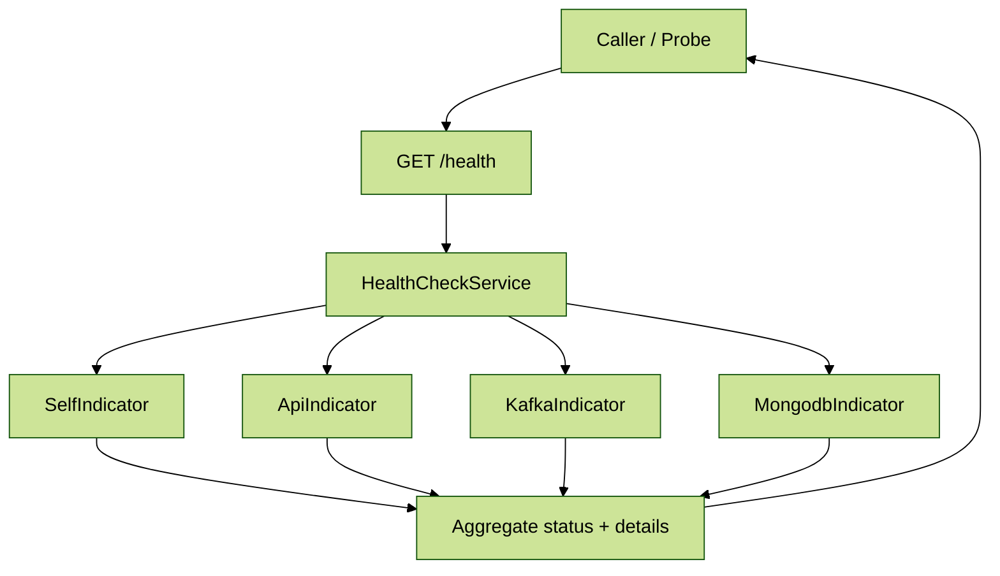

# Module 4: Health Checks & Monitoring

## 📚 Learning Objectives

By the end of this module, you will understand:

- EQXJS Health Check system architecture
- Built-in health indicators and their purposes
- Creating custom health indicators
- Health check endpoints and response formats
- Monitoring integration patterns
- Production health monitoring strategies

## 🧭 Visual Flow (Mermaid)



---

## 🏥 4.1 Health Check System Architecture

### Overview

The EQXJS Framework includes a comprehensive health check system built on top of NestJS's `@nestjs/terminus` package, providing:

- **Built-in Indicators**: Self, API, Kafka, MongoDB health checks
- **Custom Indicators**: Extensible health indicator framework
- **Aggregated Responses**: Centralized health status reporting
- **Monitoring Integration**: Easy integration with monitoring systems

### Health Module Structure

```
HealthModule
├── HealthController
│   ├── /health (GET) - Overall health status
│   ├── /health/live (GET) - Liveness probe
│   └── /health/ready (GET) - Readiness probe
├── HealthUtility
├── Built-in Indicators
│   ├── SelfIndicator
│   ├── ApiIndicator
│   ├── KafkaIndicator
│   └── MongodbIndicator
└── Custom Indicators (User-defined)
```

### Health Response Format

```typescript
interface HealthResponse {
  status: "ok" | "error" | "shutting_down";
  info: Record<string, HealthIndicatorResult>;
  error: Record<string, HealthIndicatorResult>;
  details: Record<string, HealthIndicatorResult>;
}

interface HealthIndicatorResult {
  status: "up" | "down";
  message?: string;
  [key: string]: any;
}
```

---

## 🔍 4.2 Built-in Health Indicators

### Self Health Indicator

The most basic indicator that checks if the application is running:

```typescript
import { Injectable } from "@nestjs/common";
import {
  HealthCheckError,
  HealthIndicator,
  HealthIndicatorResult,
} from "@nestjs/terminus";

@Injectable()
export class SelfIndicator extends HealthIndicator {
  check(key: string): HealthIndicatorResult {
    const isHealthy = true; // Application is running

    const result = this.getStatus(key, isHealthy, {
      uptime: process.uptime(),
      memory: process.memoryUsage(),
      pid: process.pid,
      platform: process.platform,
      nodeVersion: process.version,
    });

    if (isHealthy) {
      return result;
    }

    throw new HealthCheckError("Self check failed", result);
  }
}
```

### API Health Indicator

Checks external API connectivity:

```typescript
@Injectable()
export class ApiIndicator extends HealthIndicator {
  constructor(private readonly httpService: HttpService) {
    super();
  }

  async check(
    key: string,
    url: string,
    timeout = 5000,
  ): Promise<HealthIndicatorResult> {
    try {
      const startTime = Date.now();

      await this.httpService
        .get(url, {
          timeout,
          headers: { "User-Agent": "EQXJS-Health-Check" },
        })
        .toPromise();

      const responseTime = Date.now() - startTime;

      return this.getStatus(key, true, {
        url,
        responseTime,
        message: "API is reachable",
      });
    } catch (error) {
      const result = this.getStatus(key, false, {
        url,
        error: error.message,
        message: "API is unreachable",
      });

      throw new HealthCheckError("API Health Check failed", result);
    }
  }
}
```

### Kafka Health Indicator

Monitors Kafka broker connectivity:

```typescript
@Injectable()
export class KafkaIndicator extends HealthIndicator {
  constructor(private readonly kafkaClient: KafkaClient) {
    super();
  }

  async check(key: string): Promise<HealthIndicatorResult> {
    try {
      const admin = this.kafkaClient.admin();
      await admin.connect();

      const metadata = await admin.fetchTopicMetadata();
      await admin.disconnect();

      return this.getStatus(key, true, {
        brokers: metadata.brokers.length,
        topics: metadata.topics.length,
        message: "Kafka is healthy",
      });
    } catch (error) {
      const result = this.getStatus(key, false, {
        error: error.message,
        message: "Kafka connection failed",
      });

      throw new HealthCheckError("Kafka Health Check failed", result);
    }
  }
}
```

### MongoDB Health Indicator

Verifies MongoDB database connection:

```typescript
@Injectable()
export class MongodbIndicator extends HealthIndicator {
  constructor(@InjectConnection() private readonly connection: Connection) {
    super();
  }

  async check(key: string): Promise<HealthIndicatorResult> {
    try {
      const startTime = Date.now();

      // Execute a simple ping command
      const result = await this.connection.db.admin().ping();
      const responseTime = Date.now() - startTime;

      if (result.ok === 1) {
        return this.getStatus(key, true, {
          database: this.connection.name,
          host: this.connection.host,
          port: this.connection.port,
          responseTime,
          message: "MongoDB is healthy",
        });
      } else {
        throw new Error("MongoDB ping failed");
      }
    } catch (error) {
      const result = this.getStatus(key, false, {
        database: this.connection.name,
        error: error.message,
        message: "MongoDB connection failed",
      });

      throw new HealthCheckError("MongoDB Health Check failed", result);
    }
  }
}
```

---

## 🏗️ 4.3 Health Controller & Endpoints

### Health Controller Implementation

```typescript
import { Controller, Get } from "@nestjs/common";
import { HealthCheck, HealthCheckService } from "@nestjs/terminus";
import { SelfIndicator } from "./indicators/self.indicator";
import { ApiIndicator } from "./indicators/api.indicator";
import { KafkaIndicator } from "./indicators/kafka.indicator";
import { MongodbIndicator } from "./indicators/mongodb.indicator";

@Controller("health")
export class HealthController {
  constructor(
    private readonly healthCheckService: HealthCheckService,
    private readonly selfIndicator: SelfIndicator,
    private readonly apiIndicator: ApiIndicator,
    private readonly kafkaIndicator: KafkaIndicator,
    private readonly mongodbIndicator: MongodbIndicator,
  ) {}

  @Get()
  @HealthCheck()
  check() {
    return this.healthCheckService.check([
      () => this.selfIndicator.check("self"),
      // Add other indicators based on configuration
    ]);
  }

  @Get("live")
  @HealthCheck()
  checkLiveness() {
    // Lightweight check for Kubernetes liveness probe
    return this.healthCheckService.check([
      () => this.selfIndicator.check("self"),
    ]);
  }

  @Get("ready")
  @HealthCheck()
  checkReadiness() {
    // Comprehensive check for Kubernetes readiness probe
    return this.healthCheckService.check([
      () => this.selfIndicator.check("self"),
      () => this.mongodbIndicator.check("mongodb"),
      () => this.kafkaIndicator.check("kafka"),
    ]);
  }

  @Get("detailed")
  @HealthCheck()
  checkDetailed() {
    // Detailed health check with all indicators
    return this.healthCheckService.check([
      () => this.selfIndicator.check("self"),
      () => this.mongodbIndicator.check("mongodb"),
      () => this.kafkaIndicator.check("kafka"),
      () =>
        this.apiIndicator.check(
          "external-api",
          "https://api.example.com/health",
        ),
    ]);
  }
}
```

### Health Utility Service

```typescript
import { Injectable, Logger } from "@nestjs/common";
import { HealthCheckResult } from "@nestjs/terminus";

@Injectable()
export class HealthUtilService {
  private readonly logger = new Logger(HealthUtilService.name);

  formatHealthResponse(result: HealthCheckResult): any {
    const { status, info, error, details } = result;

    // Add timestamp and environment info
    const response = {
      status,
      timestamp: new Date().toISOString(),
      environment: process.env.NODE_ENV || "development",
      version: process.env.npm_package_version || "1.0.0",
      info,
      error,
      details,
    };

    // Log health check results
    if (status === "ok") {
      this.logger.debug("Health check passed", { checks: Object.keys(info) });
    } else {
      this.logger.warn("Health check failed", {
        errors: Object.keys(error),
        working: Object.keys(info),
      });
    }

    return response;
  }

  isHealthy(result: HealthCheckResult): boolean {
    return result.status === "ok";
  }

  getFailedChecks(result: HealthCheckResult): string[] {
    return Object.keys(result.error || {});
  }

  getSuccessfulChecks(result: HealthCheckResult): string[] {
    return Object.keys(result.info || {});
  }
}
```

---

## 🛠️ 4.4 Creating Custom Health Indicators

### Custom Redis Indicator

```typescript
import { Injectable } from "@nestjs/common";
import {
  HealthCheckError,
  HealthIndicator,
  HealthIndicatorResult,
} from "@nestjs/terminus";
import { RedisService } from "../services/redis.service";

@Injectable()
export class RedisIndicator extends HealthIndicator {
  constructor(private readonly redisService: RedisService) {
    super();
  }

  async check(key: string): Promise<HealthIndicatorResult> {
    try {
      const startTime = Date.now();

      // Test Redis connection with a simple ping
      const pongResult = await this.redisService.ping();
      const responseTime = Date.now() - startTime;

      if (pongResult === "PONG") {
        // Get additional Redis info
        const info = await this.redisService.info();

        return this.getStatus(key, true, {
          responseTime,
          version: this.parseRedisVersion(info),
          connectedClients: this.parseConnectedClients(info),
          usedMemory: this.parseUsedMemory(info),
          message: "Redis is healthy",
        });
      } else {
        throw new Error("Invalid ping response");
      }
    } catch (error) {
      const result = this.getStatus(key, false, {
        error: error.message,
        message: "Redis connection failed",
      });

      throw new HealthCheckError("Redis Health Check failed", result);
    }
  }

  private parseRedisVersion(info: string): string {
    const match = info.match(/redis_version:([^\r\n]+)/);
    return match ? match[1] : "unknown";
  }

  private parseConnectedClients(info: string): number {
    const match = info.match(/connected_clients:(\d+)/);
    return match ? parseInt(match[1], 10) : 0;
  }

  private parseUsedMemory(info: string): string {
    const match = info.match(/used_memory_human:([^\r\n]+)/);
    return match ? match[1] : "unknown";
  }
}
```

### Custom Business Logic Indicator

```typescript
import { Injectable } from "@nestjs/common";
import {
  HealthCheckError,
  HealthIndicator,
  HealthIndicatorResult,
} from "@nestjs/terminus";
import { OrderService } from "../services/order.service";

@Injectable()
export class OrderServiceIndicator extends HealthIndicator {
  constructor(private readonly orderService: OrderService) {
    super();
  }

  async check(key: string): Promise<HealthIndicatorResult> {
    try {
      // Check if order service can process orders
      const canProcessOrders = await this.orderService.canProcessOrders();
      const queueLength = await this.orderService.getQueueLength();
      const processingCapacity =
        await this.orderService.getProcessingCapacity();

      const isHealthy = canProcessOrders && queueLength < 1000;

      const status = this.getStatus(key, isHealthy, {
        canProcessOrders,
        queueLength,
        processingCapacity,
        queueHealth:
          queueLength < 500
            ? "good"
            : queueLength < 1000
              ? "warning"
              : "critical",
        message: isHealthy
          ? "Order service is healthy"
          : "Order service is unhealthy",
      });

      if (isHealthy) {
        return status;
      } else {
        throw new HealthCheckError("Order service is not ready", status);
      }
    } catch (error) {
      const result = this.getStatus(key, false, {
        error: error.message,
        message: "Order service health check failed",
      });

      throw new HealthCheckError("Order Service Health Check failed", result);
    }
  }
}
```

---

## 📊 4.5 Monitoring Integration

### Prometheus Metrics Integration

```typescript
import { Injectable } from "@nestjs/common";
import { HealthCheckResult } from "@nestjs/terminus";
import { register, Gauge, Counter } from "prom-client";

@Injectable()
export class HealthMetricsService {
  private readonly healthStatusGauge = new Gauge({
    name: "health_check_status",
    help: "Health check status (1 = healthy, 0 = unhealthy)",
    labelNames: ["check_name"],
  });

  private readonly healthCheckDuration = new Gauge({
    name: "health_check_duration_seconds",
    help: "Duration of health checks in seconds",
    labelNames: ["check_name"],
  });

  private readonly healthCheckTotal = new Counter({
    name: "health_check_total",
    help: "Total number of health checks performed",
    labelNames: ["check_name", "status"],
  });

  constructor() {
    register.registerMetric(this.healthStatusGauge);
    register.registerMetric(this.healthCheckDuration);
    register.registerMetric(this.healthCheckTotal);
  }

  recordHealthCheck(
    checkName: string,
    isHealthy: boolean,
    duration: number,
  ): void {
    this.healthStatusGauge.set({ check_name: checkName }, isHealthy ? 1 : 0);
    this.healthCheckDuration.set({ check_name: checkName }, duration / 1000);
    this.healthCheckTotal.inc({
      check_name: checkName,
      status: isHealthy ? "success" : "failure",
    });
  }

  recordHealthCheckResult(result: HealthCheckResult): void {
    const timestamp = Date.now();

    // Record successful checks
    Object.keys(result.info || {}).forEach((checkName) => {
      this.recordHealthCheck(checkName, true, 0); // Duration not available from result
    });

    // Record failed checks
    Object.keys(result.error || {}).forEach((checkName) => {
      this.recordHealthCheck(checkName, false, 0);
    });
  }
}
```

### Structured Logging for Health Checks

```typescript
import { Injectable, Logger } from "@nestjs/common";
import { HealthCheckResult } from "@nestjs/terminus";

@Injectable()
export class HealthLoggingService {
  private readonly logger = new Logger(HealthLoggingService.name);

  logHealthCheckResult(result: HealthCheckResult, endpoint: string): void {
    const logContext = {
      timestamp: new Date().toISOString(),
      endpoint,
      status: result.status,
      successfulChecks: Object.keys(result.info || {}),
      failedChecks: Object.keys(result.error || {}),
      details: this.sanitizeDetails(result.details),
    };

    if (result.status === "ok") {
      this.logger.log("Health check passed", logContext);
    } else {
      this.logger.error("Health check failed", logContext);
    }
  }

  private sanitizeDetails(details: any): any {
    // Remove sensitive information from logs
    const sanitized = { ...details };

    Object.keys(sanitized).forEach((key) => {
      if (sanitized[key] && typeof sanitized[key] === "object") {
        // Remove potentially sensitive fields
        delete sanitized[key].password;
        delete sanitized[key].secret;
        delete sanitized[key].token;
      }
    });

    return sanitized;
  }
}
```

---

## 🎯 Summary

In this module, we've covered:

✅ **Health Check Architecture**: EQXJS health system structure and components  
✅ **Built-in Indicators**: Self, API, Kafka, MongoDB health indicators  
✅ **Custom Indicators**: Creating business-specific health checks  
✅ **Health Endpoints**: Multiple endpoint types for different use cases  
✅ **Monitoring Integration**: Prometheus metrics and structured logging

### Key Takeaways

1. **Comprehensive Health Monitoring** provides visibility into application state
2. **Multiple Health Endpoints** serve different monitoring needs (liveness, readiness)
3. **Custom Health Indicators** enable business-specific health validation
4. **Monitoring Integration** facilitates proactive issue detection
5. **Structured Health Responses** support automated monitoring systems

---

## 🎓 Knowledge Check

Before proceeding to Module 5, ensure you understand:

- [ ] EQXJS health check system architecture
- [ ] Built-in health indicators and their purposes
- [ ] How to create custom health indicators
- [ ] Different health endpoint types and their uses
- [ ] Integration with monitoring and alerting systems

---

## ➡️ Next Steps

👉 **Continue to [Module 5: Interceptors & HTTP Handling](module-05-interceptors-http.md)**

📝 **Complete the exercises**: [Module 4 Exercises](exercise/module-04-exercises.md)

---

## 📚 Additional Resources

- [NestJS Terminus Documentation](https://docs.nestjs.com/recipes/terminus)
- [Kubernetes Health Checks](https://kubernetes.io/docs/tasks/configure-pod-container/configure-liveness-readiness-startup-probes/)
- [Prometheus Monitoring](https://prometheus.io/docs/introduction/overview/)
- [Health Check Patterns](https://microservices.io/patterns/observability/health-check-api.html)
