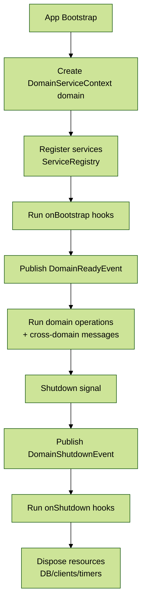

# Module 6: Context Management & Domain Services

## 📚 Learning Objectives

By the end of this module, you will understand:

- Domain Service Context architecture and patterns
- Context module organization and service isolation
- Domain-specific module design strategies
- Cross-domain communication patterns
- Service lifecycle management within contexts
- Advanced context patterns for enterprise applications

## 🧭 Visual Flow (Mermaid)



---

## 🏗️ 6.1 Domain Service Context Architecture

### Context Concept Overview

Domain Service Context in EQXJS Framework provides a way to organize services and their dependencies around specific business domains, enabling:

- **Service Isolation**: Domain-specific services grouped logically
- **Dependency Management**: Clear dependency relationships within domains
- **Resource Management**: Controlled access to shared resources
- **Lifecycle Control**: Domain-specific startup and shutdown procedures

### Context Architecture Pattern

```typescript
// Domain Context Structure
DomainServiceContext
├── ServiceRegistry
│   ├── Domain Services
│   ├── Infrastructure Services
│   └── External Service Clients
├── ConfigurationProvider
│   ├── Domain-specific Configuration
│   └── Service Configuration
├── LifecycleManager
│   ├── Initialization Hooks
│   ├── Shutdown Hooks
│   └── Health Management
└── CommunicationBridge
    ├── Inter-domain Messaging
    └── Event Publishing/Subscription
```

### Core Context Interface

```typescript
import { ModuleMetadata, Type } from "@nestjs/common";

export interface DomainServiceContextOptions {
  domain: string;
  services: Type<any>[];
  configuration?: any;
  dependencies?: string[];
  exports?: Type<any>[];
  lifecycleHooks?: LifecycleHooks;
}

export interface LifecycleHooks {
  onBootstrap?: () => Promise<void>;
  onReady?: () => Promise<void>;
  onShutdown?: () => Promise<void>;
}

export interface DomainServiceContext {
  getDomain(): string;
  getService<T>(serviceType: Type<T>): T;
  getConfiguration<T>(key: string): T;
  publish(event: DomainEvent): Promise<void>;
  subscribe(eventType: string, handler: EventHandler): void;
}
```

---

## 📦 6.2 Context Module Pattern

### Domain Service Module Implementation

```typescript
import { Module, DynamicModule, Global } from "@nestjs/common";
import { DomainServiceContext } from "./domain-service.context";
import { DomainConfigurationProvider } from "./domain-configuration.provider";
import { DomainEventBus } from "./domain-event-bus.service";

@Global()
@Module({})
export class DomainServiceModule {
  static forDomain(options: DomainServiceContextOptions): DynamicModule {
    const contextProvider = {
      provide: `DOMAIN_CONTEXT_${options.domain.toUpperCase()}`,
      useFactory: (configProvider, eventBus) => {
        return new DomainServiceContext(
          options.domain,
          options.services,
          configProvider,
          eventBus,
          options.lifecycleHooks,
        );
      },
      inject: [DomainConfigurationProvider, DomainEventBus],
    };

    return {
      module: DomainServiceModule,
      providers: [
        contextProvider,
        DomainConfigurationProvider,
        DomainEventBus,
        ...options.services,
      ],
      exports: [contextProvider, ...(options.exports || [])],
    };
  }
}
```

### Domain Service Context Implementation

```typescript
import {
  Injectable,
  Logger,
  OnModuleInit,
  OnModuleDestroy,
} from "@nestjs/common";
import { ModuleRef } from "@nestjs/core";

@Injectable()
export class DomainServiceContext implements OnModuleInit, OnModuleDestroy {
  private readonly logger = new Logger(`DomainContext:${this.domain}`);
  private readonly serviceRegistry = new Map<string, any>();
  private isInitialized = false;

  constructor(
    private readonly domain: string,
    private readonly services: Type<any>[],
    private readonly configProvider: DomainConfigurationProvider,
    private readonly eventBus: DomainEventBus,
    private readonly lifecycleHooks?: LifecycleHooks,
    private readonly moduleRef?: ModuleRef,
  ) {}

  async onModuleInit() {
    await this.initializeContext();
  }

  async onModuleDestroy() {
    await this.destroyContext();
  }

  private async initializeContext(): Promise<void> {
    try {
      this.logger.log(`Initializing domain context: ${this.domain}`);

      // Execute bootstrap hook
      if (this.lifecycleHooks?.onBootstrap) {
        await this.lifecycleHooks.onBootstrap();
      }

      // Register services
      await this.registerServices();

      // Load domain configuration
      await this.loadDomainConfiguration();

      // Execute ready hook
      if (this.lifecycleHooks?.onReady) {
        await this.lifecycleHooks.onReady();
      }

      this.isInitialized = true;
      this.logger.log(`Domain context initialized: ${this.domain}`);

      // Publish domain ready event
      await this.eventBus.publish(new DomainReadyEvent(this.domain));
    } catch (error) {
      this.logger.error(
        `Failed to initialize domain context: ${this.domain}`,
        error,
      );
      throw error;
    }
  }

  private async registerServices(): Promise<void> {
    for (const serviceType of this.services) {
      try {
        const service = this.moduleRef?.get(serviceType, { strict: false });
        if (service) {
          const serviceName = serviceType.name;
          this.serviceRegistry.set(serviceName, service);
          this.logger.debug(
            `Registered service: ${serviceName} in domain: ${this.domain}`,
          );
        }
      } catch (error) {
        this.logger.warn(
          `Failed to register service: ${serviceType.name}`,
          error,
        );
      }
    }
  }

  private async loadDomainConfiguration(): Promise<void> {
    const config = await this.configProvider.getConfiguration(this.domain);
    this.logger.debug(
      `Loaded configuration for domain: ${this.domain}`,
      config,
    );
  }

  private async destroyContext(): Promise<void> {
    try {
      this.logger.log(`Destroying domain context: ${this.domain}`);

      // Execute shutdown hook
      if (this.lifecycleHooks?.onShutdown) {
        await this.lifecycleHooks.onShutdown();
      }

      // Clear service registry
      this.serviceRegistry.clear();

      // Publish domain shutdown event
      await this.eventBus.publish(new DomainShutdownEvent(this.domain));

      this.isInitialized = false;
      this.logger.log(`Domain context destroyed: ${this.domain}`);
    } catch (error) {
      this.logger.error(
        `Error destroying domain context: ${this.domain}`,
        error,
      );
    }
  }

  getDomain(): string {
    return this.domain;
  }

  getService<T>(serviceType: Type<T>): T {
    if (!this.isInitialized) {
      throw new Error(`Domain context ${this.domain} is not initialized`);
    }

    const serviceName = serviceType.name;
    const service = this.serviceRegistry.get(serviceName);

    if (!service) {
      throw new Error(
        `Service ${serviceName} not found in domain: ${this.domain}`,
      );
    }

    return service as T;
  }

  getConfiguration<T>(key: string): T {
    return this.configProvider.get<T>(`${this.domain}.${key}`);
  }

  async publish(event: DomainEvent): Promise<void> {
    event.domain = this.domain;
    await this.eventBus.publish(event);
  }

  subscribe(eventType: string, handler: EventHandler): void {
    this.eventBus.subscribe(`${this.domain}.${eventType}`, handler);
  }

  isReady(): boolean {
    return this.isInitialized;
  }

  getServiceRegistry(): ReadonlyMap<string, any> {
    return this.serviceRegistry;
  }
}
```

---

## 🌐 6.3 Cross-Domain Communication

### Domain Event System

```typescript
import { Injectable, Logger } from "@nestjs/common";
import { EventEmitter2 } from "@nestjs/event-emitter";

export abstract class DomainEvent {
  public readonly id: string;
  public readonly timestamp: Date;
  public domain?: string;

  constructor(
    public readonly type: string,
    public readonly payload: any = {},
  ) {
    this.id = `event_${Date.now()}_${Math.random().toString(36).substr(2, 9)}`;
    this.timestamp = new Date();
  }
}

export class DomainReadyEvent extends DomainEvent {
  constructor(domain: string) {
    super("domain.ready", { domain });
  }
}

export class DomainShutdownEvent extends DomainEvent {
  constructor(domain: string) {
    super("domain.shutdown", { domain });
  }
}

export interface EventHandler {
  handle(event: DomainEvent): Promise<void> | void;
}

@Injectable()
export class DomainEventBus {
  private readonly logger = new Logger(DomainEventBus.name);

  constructor(private readonly eventEmitter: EventEmitter2) {}

  async publish(event: DomainEvent): Promise<void> {
    try {
      this.logger.debug(
        `Publishing event: ${event.type} from domain: ${event.domain}`,
      );
      await this.eventEmitter.emitAsync(event.type, event);
    } catch (error) {
      this.logger.error(`Failed to publish event: ${event.type}`, error);
      throw error;
    }
  }

  subscribe(eventType: string, handler: EventHandler): void {
    this.eventEmitter.on(eventType, async (event: DomainEvent) => {
      try {
        await handler.handle(event);
      } catch (error) {
        this.logger.error(`Event handler failed for: ${eventType}`, error);
      }
    });
  }

  subscribeToPattern(pattern: string, handler: EventHandler): void {
    this.eventEmitter.onAny(async (event: string, payload: DomainEvent) => {
      if (this.matchesPattern(event, pattern)) {
        try {
          await handler.handle(payload);
        } catch (error) {
          this.logger.error(`Pattern handler failed for: ${pattern}`, error);
        }
      }
    });
  }

  private matchesPattern(eventType: string, pattern: string): boolean {
    // Simple pattern matching (could be extended with regex)
    return eventType.includes(pattern) || pattern === "*";
  }
}
```

### Inter-Domain Communication Bridge

```typescript
import { Injectable, Logger } from "@nestjs/common";

export interface CrossDomainMessage {
  id: string;
  fromDomain: string;
  toDomain: string;
  messageType: string;
  payload: any;
  timestamp: Date;
  correlationId?: string;
}

export interface CrossDomainMessageHandler {
  canHandle(message: CrossDomainMessage): boolean;
  handle(message: CrossDomainMessage): Promise<any>;
}

@Injectable()
export class CrossDomainCommunicationBridge {
  private readonly logger = new Logger(CrossDomainCommunicationBridge.name);
  private readonly handlers = new Map<string, CrossDomainMessageHandler[]>();
  private readonly contexts = new Map<string, DomainServiceContext>();

  registerContext(context: DomainServiceContext): void {
    this.contexts.set(context.getDomain(), context);
    this.logger.debug(`Registered domain context: ${context.getDomain()}`);
  }

  registerHandler(domain: string, handler: CrossDomainMessageHandler): void {
    if (!this.handlers.has(domain)) {
      this.handlers.set(domain, []);
    }
    this.handlers.get(domain)!.push(handler);
    this.logger.debug(`Registered message handler for domain: ${domain}`);
  }

  async sendMessage(message: CrossDomainMessage): Promise<any> {
    try {
      this.logger.debug(
        `Sending cross-domain message from ${message.fromDomain} to ${message.toDomain}`,
      );

      // Validate target domain exists
      if (!this.contexts.has(message.toDomain)) {
        throw new Error(`Target domain not found: ${message.toDomain}`);
      }

      // Find appropriate handler
      const handlers = this.handlers.get(message.toDomain) || [];
      const handler = handlers.find((h) => h.canHandle(message));

      if (!handler) {
        throw new Error(
          `No handler found for message type: ${message.messageType} in domain: ${message.toDomain}`,
        );
      }

      // Handle message
      const result = await handler.handle(message);

      this.logger.debug(
        `Cross-domain message handled successfully: ${message.id}`,
      );
      return result;
    } catch (error) {
      this.logger.error(
        `Failed to send cross-domain message: ${message.id}`,
        error,
      );
      throw error;
    }
  }

  async broadcast(
    fromDomain: string,
    messageType: string,
    payload: any,
  ): Promise<void> {
    const message: CrossDomainMessage = {
      id: `msg_${Date.now()}_${Math.random().toString(36).substr(2, 9)}`,
      fromDomain,
      toDomain: "*",
      messageType,
      payload,
      timestamp: new Date(),
    };

    const promises = Array.from(this.contexts.keys())
      .filter((domain) => domain !== fromDomain)
      .map((domain) => this.sendMessage({ ...message, toDomain: domain }));

    await Promise.allSettled(promises);
  }
}
```

---

## 🔧 6.4 Advanced Context Patterns

### Multi-Tenant Context Pattern

```typescript
import { Injectable, Scope } from "@nestjs/common";

export interface TenantContext {
  tenantId: string;
  domain: string;
  configuration: any;
  services: Map<string, any>;
}

@Injectable({ scope: Scope.REQUEST })
export class MultiTenantContextProvider {
  private readonly logger = new Logger(MultiTenantContextProvider.name);
  private tenantContexts = new Map<string, TenantContext>();

  async createTenantContext(
    tenantId: string,
    domain: string,
    services: Type<any>[],
  ): Promise<TenantContext> {
    const contextKey = `${tenantId}:${domain}`;

    if (this.tenantContexts.has(contextKey)) {
      return this.tenantContexts.get(contextKey)!;
    }

    // Load tenant-specific configuration
    const configuration = await this.loadTenantConfiguration(tenantId, domain);

    // Create tenant-specific service instances
    const serviceMap = new Map<string, any>();
    for (const serviceType of services) {
      const service = await this.createTenantService(
        serviceType,
        tenantId,
        configuration,
      );
      serviceMap.set(serviceType.name, service);
    }

    const context: TenantContext = {
      tenantId,
      domain,
      configuration,
      services: serviceMap,
    };

    this.tenantContexts.set(contextKey, context);
    this.logger.debug(`Created tenant context: ${contextKey}`);

    return context;
  }

  getTenantContext(
    tenantId: string,
    domain: string,
  ): TenantContext | undefined {
    const contextKey = `${tenantId}:${domain}`;
    return this.tenantContexts.get(contextKey);
  }

  async destroyTenantContext(tenantId: string, domain: string): Promise<void> {
    const contextKey = `${tenantId}:${domain}`;
    const context = this.tenantContexts.get(contextKey);

    if (context) {
      // Cleanup tenant-specific resources
      for (const [serviceName, service] of context.services) {
        if (service.destroy && typeof service.destroy === "function") {
          await service.destroy();
        }
      }

      this.tenantContexts.delete(contextKey);
      this.logger.debug(`Destroyed tenant context: ${contextKey}`);
    }
  }

  private async loadTenantConfiguration(
    tenantId: string,
    domain: string,
  ): Promise<any> {
    // Load tenant-specific configuration from database or config service
    return {
      tenantId,
      domain,
      // ... tenant-specific settings
    };
  }

  private async createTenantService(
    serviceType: Type<any>,
    tenantId: string,
    configuration: any,
  ): Promise<any> {
    // Create service instance with tenant-specific configuration
    // This would typically involve dependency injection container
    return new serviceType(tenantId, configuration);
  }
}
```

### Context Inheritance Pattern

```typescript
export interface ContextHierarchy {
  parent?: DomainServiceContext;
  children: DomainServiceContext[];
}

@Injectable()
export class HierarchicalContextManager {
  private readonly logger = new Logger(HierarchicalContextManager.name);
  private readonly hierarchy = new Map<string, ContextHierarchy>();

  establishParentChildRelationship(
    parentContext: DomainServiceContext,
    childContext: DomainServiceContext,
  ): void {
    const parentDomain = parentContext.getDomain();
    const childDomain = childContext.getDomain();

    // Set up parent hierarchy
    if (!this.hierarchy.has(parentDomain)) {
      this.hierarchy.set(parentDomain, { children: [] });
    }

    const parentHierarchy = this.hierarchy.get(parentDomain)!;
    parentHierarchy.children.push(childContext);

    // Set up child hierarchy
    if (!this.hierarchy.has(childDomain)) {
      this.hierarchy.set(childDomain, { children: [] });
    }

    const childHierarchy = this.hierarchy.get(childDomain)!;
    childHierarchy.parent = parentContext;

    this.logger.debug(
      `Established parent-child relationship: ${parentDomain} -> ${childDomain}`,
    );
  }

  propagateConfigurationChange(
    domain: string,
    configKey: string,
    value: any,
  ): void {
    const hierarchy = this.hierarchy.get(domain);
    if (hierarchy) {
      // Propagate to children
      const propagationPromises = hierarchy.children.map(async (child) => {
        try {
          // Update child configuration
          await this.updateChildConfiguration(child, configKey, value);
        } catch (error) {
          this.logger.warn(
            `Failed to propagate config to ${child.getDomain()}`,
            error,
          );
        }
      });

      Promise.allSettled(propagationPromises);
    }
  }

  private async updateChildConfiguration(
    childContext: DomainServiceContext,
    configKey: string,
    value: any,
  ): Promise<void> {
    // Implement configuration inheritance logic
    const currentConfig = childContext.getConfiguration(configKey);

    // Only update if child doesn't have its own override
    if (currentConfig === undefined) {
      // Update child configuration
      // This would typically involve updating the configuration provider
      this.logger.debug(
        `Inherited config ${configKey} in ${childContext.getDomain()}`,
      );
    }
  }

  getContextHierarchy(domain: string): ContextHierarchy | undefined {
    return this.hierarchy.get(domain);
  }

  findRootContext(domain: string): DomainServiceContext | undefined {
    let current = this.hierarchy.get(domain);

    while (current?.parent) {
      current = this.hierarchy.get(current.parent.getDomain());
    }

    return current?.parent;
  }

  getDescendants(domain: string): DomainServiceContext[] {
    const hierarchy = this.hierarchy.get(domain);
    if (!hierarchy) return [];

    const descendants: DomainServiceContext[] = [];

    const collectDescendants = (children: DomainServiceContext[]) => {
      for (const child of children) {
        descendants.push(child);
        const childHierarchy = this.hierarchy.get(child.getDomain());
        if (childHierarchy) {
          collectDescendants(childHierarchy.children);
        }
      }
    };

    collectDescendants(hierarchy.children);
    return descendants;
  }
}
```

---

## 🎯 Summary

In this module, we've covered:

✅ **Context Architecture**: Domain service context patterns and organization  
✅ **Service Isolation**: Domain-specific service grouping and management  
✅ **Cross-Domain Communication**: Event-driven communication between domains  
✅ **Lifecycle Management**: Context initialization, ready, and shutdown phases  
✅ **Advanced Patterns**: Multi-tenant contexts and hierarchical relationships

### Key Takeaways

1. **Domain Context Pattern** provides logical service organization around business domains
2. **Service Isolation** enables independent domain evolution and testing
3. **Event-Driven Communication** facilitates loose coupling between domains
4. **Lifecycle Management** ensures proper resource initialization and cleanup
5. **Advanced Patterns** support complex enterprise architecture requirements

---

## 🎓 Knowledge Check

Before proceeding to Module 7, ensure you understand:

- [ ] Domain service context architecture and benefits
- [ ] Context module pattern and service registration
- [ ] Cross-domain communication using events
- [ ] Context lifecycle management and hooks
- [ ] Multi-tenant and hierarchical context patterns

---

## ➡️ Next Steps

👉 **Continue to [Module 7: Decorators & Validation](module-07-decorators-validation.md)**

📝 **Complete the exercises**: [Module 6 Exercises](exercise/module-06-exercises.md)

---

## 📚 Additional Resources

- [Domain-Driven Design](https://martinfowler.com/bliki/DomainDrivenDesign.html)
- [Context Patterns](https://www.enterpriseintegrationpatterns.com/patterns/messaging/MessageContext.html)
- [Event-Driven Architecture](https://microservices.io/patterns/data/event-driven-architecture.html)
- [Multi-Tenancy Patterns](https://docs.microsoft.com/en-us/azure/architecture/guide/multitenant/)
