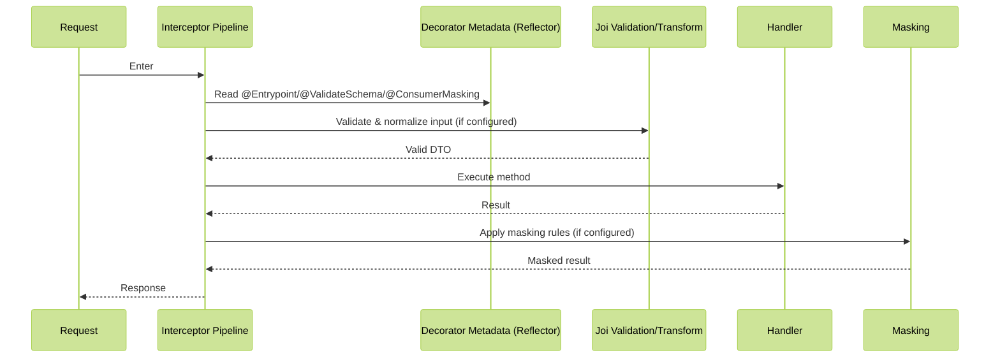

# Module 7: Decorators & Validation

## 📚 Learning Objectives

By the end of this module, you will understand:

- EQXJS custom decorator patterns and implementation
- Built-in decorators for common enterprise concerns
- Validation framework integration with Joi schemas
- DTO patterns and data transformation strategies
- Advanced decorator composition techniques
- Metadata management and runtime reflection

## 🧭 Visual Flow (Mermaid)



---

## 🎨 7.1 Custom Decorators Overview

### EQXJS Decorator Ecosystem

The EQXJS Framework provides a comprehensive set of decorators that handle cross-cutting concerns:

```typescript
// Enterprise Concerns Decorators
@Entrypoint()           // Service entry point marking
@ConsumerMasking()      // Data privacy and masking
@SetMessageMode()       // Message processing mode configuration
@DisableConsumerLogging() // Logging control

// Validation Decorators
@ValidateDto()          // DTO validation
@ValidateSchema()       // Schema-based validation
@TransformData()        // Data transformation

// Security Decorators
@RequireAuth()          // Authentication requirement
@RequireRole()          // Role-based authorization
@RateLimit()           // Request rate limiting
```

### Decorator Foundation Architecture

```typescript
import { SetMetadata, applyDecorators } from "@nestjs/common";
import "reflect-metadata";

// Metadata keys for EQXJS decorators
export const EQXJS_METADATA_KEYS = {
  ENTRYPOINT: "eqxjs:entrypoint",
  CONSUMER_MASKING: "eqxjs:consumer-masking",
  MESSAGE_MODE: "eqxjs:message-mode",
  VALIDATION_SCHEMA: "eqxjs:validation-schema",
  LOGGING_CONFIG: "eqxjs:logging-config",
} as const;

// Base decorator utility
export function createEqxjsDecorator(
  metadataKey: string,
  defaultOptions?: any,
) {
  return function (options?: any) {
    const finalOptions = { ...defaultOptions, ...options };

    return applyDecorators(SetMetadata(metadataKey, finalOptions));
  };
}
```

---

## 🚪 7.2 Entrypoint Decorator

### Entrypoint Implementation

```typescript
import { applyDecorators, SetMetadata } from "@nestjs/common";
import { EQXJS_METADATA_KEYS } from "../constants";

export interface EntrypointOptions {
  name: string;
  description?: string;
  version?: string;
  deprecated?: boolean;
  tags?: string[];
  rateLimit?: {
    windowMs: number;
    max: number;
  };
  authentication?: {
    required: boolean;
    roles?: string[];
  };
  monitoring?: {
    enabled: boolean;
    includePayload: boolean;
  };
}

export function Entrypoint(options: EntrypointOptions) {
  return applyDecorators(
    SetMetadata(EQXJS_METADATA_KEYS.ENTRYPOINT, {
      name: options.name,
      description: options.description || "",
      version: options.version || "1.0.0",
      deprecated: options.deprecated || false,
      tags: options.tags || [],
      rateLimit: options.rateLimit,
      authentication: options.authentication || { required: false },
      monitoring: options.monitoring || {
        enabled: true,
        includePayload: false,
      },
      registeredAt: new Date().toISOString(),
    }),
  );
}

// Usage example
@Controller("users")
export class UsersController {
  @Post()
  @Entrypoint({
    name: "create-user",
    description: "Creates a new user account",
    version: "2.0.0",
    tags: ["user-management", "registration"],
    rateLimit: {
      windowMs: 60000, // 1 minute
      max: 10, // 10 requests per minute
    },
    authentication: {
      required: true,
      roles: ["admin", "user-manager"],
    },
    monitoring: {
      enabled: true,
      includePayload: true,
    },
  })
  async createUser(@Body() createUserDto: CreateUserDto) {
    return this.usersService.create(createUserDto);
  }
}
```

### Entrypoint Interceptor

```typescript
import {
  Injectable,
  NestInterceptor,
  ExecutionContext,
  CallHandler,
} from "@nestjs/common";
import { Reflector } from "@nestjs/core";
import { Observable } from "rxjs";
import { tap, map } from "rxjs/operators";
import { EQXJS_METADATA_KEYS } from "../constants";

@Injectable()
export class EntrypointInterceptor implements NestInterceptor {
  constructor(
    private readonly reflector: Reflector,
    private readonly entrypointRegistry: EntrypointRegistry,
    private readonly monitoringService: MonitoringService,
  ) {}

  intercept(context: ExecutionContext, next: CallHandler): Observable<any> {
    const entrypointOptions = this.reflector.get(
      EQXJS_METADATA_KEYS.ENTRYPOINT,
      context.getHandler(),
    );

    if (!entrypointOptions) {
      return next.handle();
    }

    const request = context.switchToHttp().getRequest();
    const startTime = Date.now();

    // Register entrypoint usage
    this.entrypointRegistry.recordAccess(entrypointOptions.name, {
      timestamp: new Date(),
      userId: request.user?.id,
      ip: request.ip,
      userAgent: request.headers["user-agent"],
    });

    return next.handle().pipe(
      tap(() => {
        const duration = Date.now() - startTime;

        if (entrypointOptions.monitoring.enabled) {
          this.monitoringService.recordEntrypoint({
            name: entrypointOptions.name,
            duration,
            success: true,
            payload: entrypointOptions.monitoring.includePayload
              ? request.body
              : undefined,
          });
        }
      }),
      map((response) => {
        // Add entrypoint metadata to response
        return {
          ...response,
          _metadata: {
            entrypoint: entrypointOptions.name,
            version: entrypointOptions.version,
            timestamp: new Date().toISOString(),
          },
        };
      }),
    );
  }
}
```

---

## 🎭 7.3 Consumer Masking Decorator

### Data Masking Implementation

```typescript
export interface MaskingRule {
  field: string;
  strategy: "partial" | "hash" | "remove" | "replace";
  options?: {
    visibleChars?: number;
    replacement?: string;
    hashAlgorithm?: "md5" | "sha256";
  };
}

export interface ConsumerMaskingOptions {
  rules: MaskingRule[];
  enabled: boolean;
  logMasking: boolean;
  consumerTypes: string[];
}

export function ConsumerMasking(options: ConsumerMaskingOptions) {
  return applyDecorators(
    SetMetadata(EQXJS_METADATA_KEYS.CONSUMER_MASKING, {
      rules: options.rules,
      enabled: options.enabled,
      logMasking: options.logMasking || true,
      consumerTypes: options.consumerTypes || ["*"],
      appliedAt: new Date().toISOString(),
    }),
  );
}

// Usage example
@Controller("profiles")
export class ProfilesController {
  @Get(":id")
  @ConsumerMasking({
    enabled: true,
    logMasking: true,
    consumerTypes: ["mobile-app", "web-app"],
    rules: [
      {
        field: "email",
        strategy: "partial",
        options: { visibleChars: 3 },
      },
      {
        field: "phoneNumber",
        strategy: "partial",
        options: { visibleChars: 4 },
      },
      {
        field: "socialSecurityNumber",
        strategy: "hash",
        options: { hashAlgorithm: "sha256" },
      },
      {
        field: "creditCardNumber",
        strategy: "remove",
      },
    ],
  })
  async getProfile(@Param("id") id: string) {
    return this.profilesService.findOne(id);
  }
}
```

### Consumer Masking Interceptor

```typescript
import * as crypto from "crypto";

@Injectable()
export class ConsumerMaskingInterceptor implements NestInterceptor {
  private readonly logger = new Logger(ConsumerMaskingInterceptor.name);

  constructor(private readonly reflector: Reflector) {}

  intercept(context: ExecutionContext, next: CallHandler): Observable<any> {
    const maskingOptions = this.reflector.get(
      EQXJS_METADATA_KEYS.CONSUMER_MASKING,
      context.getHandler(),
    );

    if (!maskingOptions || !maskingOptions.enabled) {
      return next.handle();
    }

    const request = context.switchToHttp().getRequest();
    const consumerType = this.getConsumerType(request);

    // Check if masking applies to this consumer type
    if (!this.shouldApplyMasking(consumerType, maskingOptions.consumerTypes)) {
      return next.handle();
    }

    return next
      .handle()
      .pipe(
        map((response) =>
          this.applyMasking(response, maskingOptions.rules, consumerType),
        ),
      );
  }

  private getConsumerType(request: any): string {
    // Determine consumer type from headers, user agent, or authentication context
    return request.headers["x-consumer-type"] ||
      request.headers["user-agent"]?.includes("Mobile")
      ? "mobile-app"
      : "web-app";
  }

  private shouldApplyMasking(
    consumerType: string,
    allowedTypes: string[],
  ): boolean {
    return allowedTypes.includes("*") || allowedTypes.includes(consumerType);
  }

  private applyMasking(
    data: any,
    rules: MaskingRule[],
    consumerType: string,
  ): any {
    if (!data || typeof data !== "object") {
      return data;
    }

    const masked = this.deepClone(data);

    for (const rule of rules) {
      this.applyMaskingRule(masked, rule, consumerType);
    }

    return masked;
  }

  private applyMaskingRule(
    obj: any,
    rule: MaskingRule,
    consumerType: string,
  ): void {
    const fieldPath = rule.field.split(".");
    const target = this.getNestedValue(obj, fieldPath.slice(0, -1));
    const fieldName = fieldPath[fieldPath.length - 1];

    if (target && target[fieldName] !== undefined) {
      const originalValue = target[fieldName];
      target[fieldName] = this.maskValue(originalValue, rule);

      this.logger.debug(
        `Masked field ${rule.field} for consumer ${consumerType}`,
        {
          field: rule.field,
          strategy: rule.strategy,
          consumerType,
        },
      );
    }
  }

  private maskValue(value: any, rule: MaskingRule): any {
    if (value === null || value === undefined) {
      return value;
    }

    const stringValue = String(value);

    switch (rule.strategy) {
      case "partial":
        return this.partialMask(stringValue, rule.options?.visibleChars || 3);
      case "hash":
        return this.hashValue(
          stringValue,
          rule.options?.hashAlgorithm || "sha256",
        );
      case "remove":
        return undefined;
      case "replace":
        return rule.options?.replacement || "***";
      default:
        return value;
    }
  }

  private partialMask(value: string, visibleChars: number): string {
    if (value.length <= visibleChars + 2) {
      return "*".repeat(value.length);
    }

    const visible = value.substring(0, visibleChars);
    const masked = "*".repeat(value.length - visibleChars - 2);
    const suffix = value.substring(value.length - 2);

    return `${visible}${masked}${suffix}`;
  }

  private hashValue(value: string, algorithm: string): string {
    return crypto.createHash(algorithm).update(value).digest("hex");
  }

  private deepClone(obj: any): any {
    if (obj === null || typeof obj !== "object") {
      return obj;
    }

    if (obj instanceof Date) {
      return new Date(obj);
    }

    if (Array.isArray(obj)) {
      return obj.map((item) => this.deepClone(item));
    }

    const cloned: any = {};
    for (const key in obj) {
      if (obj.hasOwnProperty(key)) {
        cloned[key] = this.deepClone(obj[key]);
      }
    }

    return cloned;
  }

  private getNestedValue(obj: any, path: string[]): any {
    return path.reduce((current, key) => current && current[key], obj);
  }
}
```

---

## 📝 7.4 Validation Framework

### Joi Schema Integration

```typescript
import * as Joi from "joi";
import { BadRequestException } from "@nestjs/common";

export interface ValidationSchemaOptions {
  schema: Joi.ObjectSchema;
  transform?: boolean;
  abortEarly?: boolean;
  allowUnknown?: boolean;
  stripUnknown?: boolean;
}

export function ValidateSchema(options: ValidationSchemaOptions) {
  return applyDecorators(
    SetMetadata(EQXJS_METADATA_KEYS.VALIDATION_SCHEMA, {
      schema: options.schema,
      transform: options.transform || false,
      abortEarly: options.abortEarly || false,
      allowUnknown: options.allowUnknown || false,
      stripUnknown: options.stripUnknown || true,
    }),
  );
}

// DTO with schema validation
export class CreateUserDto {
  name: string;
  email: string;
  age: number;
  roles: string[];
}

export const CreateUserSchema = Joi.object({
  name: Joi.string().min(2).max(50).required(),
  email: Joi.string().email().required(),
  age: Joi.number().integer().min(18).max(120).required(),
  roles: Joi.array()
    .items(Joi.string().valid("admin", "user", "moderator"))
    .min(1)
    .required(),
});

@Controller("users")
export class UsersController {
  @Post()
  @ValidateSchema({
    schema: CreateUserSchema,
    transform: true,
    abortEarly: false,
  })
  async createUser(@Body() createUserDto: CreateUserDto) {
    return this.usersService.create(createUserDto);
  }
}
```

### Schema Validation Interceptor

```typescript
@Injectable()
export class SchemaValidationInterceptor implements NestInterceptor {
  private readonly logger = new Logger(SchemaValidationInterceptor.name);

  constructor(private readonly reflector: Reflector) {}

  intercept(context: ExecutionContext, next: CallHandler): Observable<any> {
    const validationOptions = this.reflector.get(
      EQXJS_METADATA_KEYS.VALIDATION_SCHEMA,
      context.getHandler(),
    );

    if (!validationOptions) {
      return next.handle();
    }

    const request = context.switchToHttp().getRequest();
    const validationResult = this.validateRequest(request, validationOptions);

    if (validationResult.error) {
      throw new BadRequestException({
        message: "Validation failed",
        errors: validationResult.errors,
        statusCode: 400,
      });
    }

    // Transform request body if validation passed and transform is enabled
    if (validationOptions.transform && validationResult.value) {
      request.body = validationResult.value;
    }

    return next.handle();
  }

  private validateRequest(request: any, options: any): ValidationResult {
    try {
      const { error, value } = options.schema.validate(request.body, {
        abortEarly: options.abortEarly,
        allowUnknown: options.allowUnknown,
        stripUnknown: options.stripUnknown,
        convert: options.transform,
      });

      if (error) {
        const errors = error.details.map((detail) => ({
          field: detail.path.join("."),
          message: detail.message,
          value: detail.context?.value,
        }));

        this.logger.warn("Validation failed", {
          errors,
          requestBody: request.body,
        });

        return {
          error: true,
          errors,
          value: null,
        };
      }

      this.logger.debug("Validation passed", {
        originalBody: request.body,
        transformedBody: value,
      });

      return {
        error: false,
        errors: [],
        value,
      };
    } catch (validationError) {
      this.logger.error("Schema validation error", validationError);
      return {
        error: true,
        errors: [
          { field: "schema", message: "Schema validation failed", value: null },
        ],
        value: null,
      };
    }
  }
}

interface ValidationResult {
  error: boolean;
  errors: ValidationError[];
  value: any;
}

interface ValidationError {
  field: string;
  message: string;
  value: any;
}
```

---

## 🔄 7.5 Data Transformation Decorators

### Transform Data Decorator

```typescript
export interface TransformationRule {
  field: string;
  transformers: DataTransformer[];
  condition?: (value: any, context: any) => boolean;
}

export interface DataTransformer {
  name: string;
  transform: (value: any, context?: any) => any;
  options?: any;
}

export interface TransformDataOptions {
  rules: TransformationRule[];
  direction: "input" | "output" | "both";
  preserveOriginal?: boolean;
}

export function TransformData(options: TransformDataOptions) {
  return applyDecorators(
    SetMetadata("transform-data", {
      rules: options.rules,
      direction: options.direction,
      preserveOriginal: options.preserveOriginal || false,
    }),
  );
}

// Built-in transformers
export const BuiltInTransformers = {
  toLowerCase: {
    name: "toLowerCase",
    transform: (value: string) =>
      typeof value === "string" ? value.toLowerCase() : value,
  },

  toUpperCase: {
    name: "toUpperCase",
    transform: (value: string) =>
      typeof value === "string" ? value.toUpperCase() : value,
  },

  trim: {
    name: "trim",
    transform: (value: string) =>
      typeof value === "string" ? value.trim() : value,
  },

  toNumber: {
    name: "toNumber",
    transform: (value: any) => {
      const num = Number(value);
      return isNaN(num) ? value : num;
    },
  },

  toDate: {
    name: "toDate",
    transform: (value: any) => {
      if (value instanceof Date) return value;
      const date = new Date(value);
      return isNaN(date.getTime()) ? value : date;
    },
  },

  encrypt: {
    name: "encrypt",
    transform: (value: string, context: { key: string }) => {
      // Simple encryption implementation
      return crypto
        .createHash("sha256")
        .update(value + context.key)
        .digest("hex");
    },
  },

  sanitizeHtml: {
    name: "sanitizeHtml",
    transform: (value: string) => {
      if (typeof value !== "string") return value;
      return value.replace(/<[^>]*>/g, "");
    },
  },
};

// Usage example
@Controller("products")
export class ProductsController {
  @Post()
  @TransformData({
    direction: "input",
    rules: [
      {
        field: "name",
        transformers: [
          BuiltInTransformers.trim,
          BuiltInTransformers.toUpperCase,
        ],
      },
      {
        field: "price",
        transformers: [BuiltInTransformers.toNumber],
      },
      {
        field: "description",
        transformers: [
          BuiltInTransformers.sanitizeHtml,
          BuiltInTransformers.trim,
        ],
      },
      {
        field: "tags",
        transformers: [
          {
            name: "normalizeArray",
            transform: (value) =>
              Array.isArray(value) ? value.map((v) => v.toLowerCase()) : [],
          },
        ],
      },
    ],
  })
  async createProduct(@Body() createProductDto: CreateProductDto) {
    return this.productsService.create(createProductDto);
  }
}
```

---

## 🔧 7.6 Advanced Decorator Composition

### Decorator Composition Utilities

```typescript
export function ComposeEqxjsDecorators(
  ...decorators: Array<ClassDecorator | MethodDecorator | PropertyDecorator>
) {
  return (
    target: any,
    propertyKey?: string | symbol,
    descriptor?: PropertyDescriptor,
  ) => {
    decorators.forEach((decorator) => {
      if (descriptor !== undefined) {
        // Method decorator
        (decorator as MethodDecorator)(target, propertyKey!, descriptor);
      } else if (propertyKey !== undefined) {
        // Property decorator
        (decorator as PropertyDecorator)(target, propertyKey);
      } else {
        // Class decorator
        (decorator as ClassDecorator)(target);
      }
    });
  };
}

// Preset decorator combinations
export const ApiEndpoint = (options: {
  entrypoint: EntrypointOptions;
  validation?: ValidationSchemaOptions;
  masking?: ConsumerMaskingOptions;
  rateLimit?: RateLimitOptions;
}) =>
  ComposeEqxjsDecorators(
    Entrypoint(options.entrypoint),
    options.validation ? ValidateSchema(options.validation) : () => {},
    options.masking ? ConsumerMasking(options.masking) : () => {},
    options.rateLimit ? RateLimit(options.rateLimit) : () => {},
  );

// Usage
@Controller("api/v1/users")
export class UsersController {
  @Post()
  @ApiEndpoint({
    entrypoint: {
      name: "create-user",
      description: "Create a new user",
      version: "1.0.0",
      authentication: { required: true, roles: ["admin"] },
    },
    validation: {
      schema: CreateUserSchema,
      transform: true,
    },
    masking: {
      enabled: true,
      rules: [
        /* masking rules */
      ],
      consumerTypes: ["mobile"],
    },
    rateLimit: {
      windowMs: 60000,
      max: 10,
    },
  })
  async createUser(@Body() dto: CreateUserDto) {
    return this.usersService.create(dto);
  }
}
```

---

## 🎯 Summary

In this module, we've covered:

✅ **Custom Decorators**: EQXJS decorator patterns and implementation  
✅ **Enterprise Concerns**: Entrypoint marking, consumer masking, message modes  
✅ **Validation Framework**: Joi schema integration and validation interceptors  
✅ **Data Transformation**: Input/output transformation with built-in transformers  
✅ **Decorator Composition**: Advanced decorator combination techniques

### Key Takeaways

1. **Decorators provide clean separation** of cross-cutting concerns from business logic
2. **Consumer masking enables data privacy** based on consumer types and contexts
3. **Schema validation ensures data integrity** with comprehensive error reporting
4. **Data transformation enables format standardization** across application layers
5. **Decorator composition promotes reusability** and consistent patterns

---

## 🎓 Knowledge Check

Before proceeding to Module 8, ensure you understand:

- [ ] EQXJS decorator architecture and metadata management
- [ ] Entrypoint decorator configuration and interceptor implementation
- [ ] Consumer masking strategies and privacy protection
- [ ] Joi schema validation integration patterns
- [ ] Data transformation techniques and built-in transformers
- [ ] Decorator composition and preset creation

---

## ➡️ Next Steps

👉 **Continue to [Module 8: Graceful Shutdown & Production Best Practices](module-08-shutdown-production.md)**

📝 **Complete the exercises**: [Module 7 Exercises](exercise/module-07-exercises.md)

---

## 📚 Additional Resources

- [NestJS Custom Decorators](https://docs.nestjs.com/custom-decorators)
- [Joi Validation Library](https://joi.dev/api/)
- [TypeScript Decorators](https://www.typescriptlang.org/docs/handbook/decorators.html)
- [Data Privacy Patterns](https://owasp.org/www-project-top-ten/2017/A3_2017-Sensitive_Data_Exposure)
