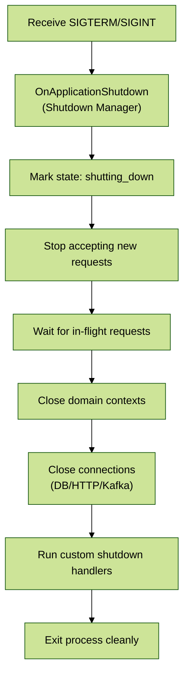

# Module 8: Graceful Shutdown & Production Best Practices

## 📚 Learning Objectives

By the end of this module, you will understand:

- EQXJS graceful shutdown patterns and lifecycle management
- Production deployment strategies and environment configuration
- Performance optimization techniques and resource management
- Monitoring, logging, and observability best practices
- Error handling and recovery patterns in production
- Security hardening and compliance considerations

## 🧭 Visual Flow (Mermaid)



---

## 🛑 8.1 Graceful Shutdown Architecture

### EQXJS Shutdown Lifecycle

The EQXJS Framework provides comprehensive shutdown management that ensures all resources are properly cleaned up:

```typescript
import { Injectable, OnApplicationShutdown } from "@nestjs/common";
import { ModuleRef } from "@nestjs/core";

@Injectable()
export class EqxjsShutdownManager implements OnApplicationShutdown {
  private readonly shutdownHandlers: Map<string, ShutdownHandler> = new Map();
  private shutdownInProgress = false;
  private shutdownPromise: Promise<void> | null = null;

  constructor(private readonly moduleRef: ModuleRef) {}

  async onApplicationShutdown(signal: string) {
    if (this.shutdownInProgress) {
      return this.shutdownPromise;
    }

    this.shutdownInProgress = true;
    console.log(`Received shutdown signal: ${signal}`);

    this.shutdownPromise = this.performGracefulShutdown(signal);
    return this.shutdownPromise;
  }

  private async performGracefulShutdown(signal: string): Promise<void> {
    const shutdownSteps = [
      { name: "Health Check", handler: () => this.disableHealthCheck() },
      {
        name: "Stop Accepting Requests",
        handler: () => this.stopAcceptingRequests(),
      },
      {
        name: "Complete Active Requests",
        handler: () => this.waitForActiveRequests(),
      },
      { name: "Context Cleanup", handler: () => this.cleanupContexts() },
      { name: "Close Connections", handler: () => this.closeConnections() },
      { name: "Custom Handlers", handler: () => this.executeCustomHandlers() },
      { name: "Final Cleanup", handler: () => this.performFinalCleanup() },
    ];

    for (const step of shutdownSteps) {
      try {
        console.log(`Shutdown step: ${step.name}`);
        await Promise.race([
          step.handler(),
          this.createTimeoutPromise(30000, `${step.name} timeout`),
        ]);
        console.log(`✓ ${step.name} completed`);
      } catch (error) {
        console.error(`✗ ${step.name} failed:`, error);
      }
    }

    console.log("Graceful shutdown completed");
  }

  registerShutdownHandler(name: string, handler: ShutdownHandler): void {
    this.shutdownHandlers.set(name, handler);
  }

  private async disableHealthCheck(): Promise<void> {
    const healthService = this.moduleRef.get("HealthCheckService", {
      strict: false,
    });
    if (healthService && healthService.disable) {
      await healthService.disable();
    }
  }

  private async stopAcceptingRequests(): Promise<void> {
    // Implementation to stop accepting new HTTP requests
    const httpAdapter = this.moduleRef.get("HttpAdapterHost", {
      strict: false,
    });
    if (httpAdapter) {
      // Stop accepting new connections
    }
  }

  private async waitForActiveRequests(): Promise<void> {
    // Wait for active requests to complete
    let attempts = 0;
    const maxAttempts = 150; // 15 seconds with 100ms intervals

    while (attempts < maxAttempts) {
      const activeRequests = this.getActiveRequestCount();
      if (activeRequests === 0) {
        return;
      }

      console.log(
        `Waiting for ${activeRequests} active requests to complete...`,
      );
      await new Promise((resolve) => setTimeout(resolve, 100));
      attempts++;
    }

    console.warn(
      "Shutdown timeout reached, proceeding with active requests still pending",
    );
  }

  private async cleanupContexts(): Promise<void> {
    const contextService = this.moduleRef.get("ContextService", {
      strict: false,
    });
    if (contextService && contextService.cleanup) {
      await contextService.cleanup();
    }
  }

  private async closeConnections(): Promise<void> {
    // Close database connections, message queues, etc.
    const promises: Promise<void>[] = [];

    // Database connections
    const dbConnection = this.moduleRef.get("DatabaseConnection", {
      strict: false,
    });
    if (dbConnection && dbConnection.close) {
      promises.push(dbConnection.close());
    }

    // Redis connections
    const redisConnection = this.moduleRef.get("RedisConnection", {
      strict: false,
    });
    if (redisConnection && redisConnection.disconnect) {
      promises.push(redisConnection.disconnect());
    }

    await Promise.allSettled(promises);
  }

  private async executeCustomHandlers(): Promise<void> {
    const promises: Promise<void>[] = [];

    for (const [name, handler] of this.shutdownHandlers.entries()) {
      promises.push(
        handler
          .shutdown()
          .then(() => console.log(`✓ Custom handler ${name} completed`))
          .catch((error) =>
            console.error(`✗ Custom handler ${name} failed:`, error),
          ),
      );
    }

    await Promise.allSettled(promises);
  }

  private async performFinalCleanup(): Promise<void> {
    // Final cleanup tasks
    process.removeAllListeners();
  }

  private getActiveRequestCount(): number {
    // Implementation to get active request count
    return 0; // Placeholder
  }

  private createTimeoutPromise(ms: number, message: string): Promise<never> {
    return new Promise((_, reject) => {
      setTimeout(() => reject(new Error(message)), ms);
    });
  }
}

export interface ShutdownHandler {
  shutdown(): Promise<void>;
}
```

### Shutdown Hook Registration

```typescript
@Injectable()
export class DatabaseService implements ShutdownHandler {
  private connections: Connection[] = [];

  constructor(private shutdownManager: EqxjsShutdownManager) {
    this.shutdownManager.registerShutdownHandler("database", this);
  }

  async shutdown(): Promise<void> {
    console.log("Closing database connections...");

    const closePromises = this.connections.map(async (connection) => {
      try {
        await connection.close();
        console.log("Database connection closed");
      } catch (error) {
        console.error("Error closing database connection:", error);
      }
    });

    await Promise.allSettled(closePromises);
  }
}

@Injectable()
export class QueueService implements ShutdownHandler {
  private queues: Queue[] = [];

  constructor(private shutdownManager: EqxjsShutdownManager) {
    this.shutdownManager.registerShutdownHandler("queues", this);
  }

  async shutdown(): Promise<void> {
    console.log("Closing message queues...");

    // Pause all queues to prevent new jobs
    await Promise.all(this.queues.map((queue) => queue.pause()));

    // Wait for current jobs to complete
    const jobPromises = this.queues.map((queue) =>
      queue.whenCurrentJobsFinished(),
    );
    await Promise.allSettled(jobPromises);

    // Close queue connections
    await Promise.all(this.queues.map((queue) => queue.close()));
  }
}
```

---

## 🏭 8.2 Production Configuration Management

### Environment-Specific Configuration

```typescript
// production.yaml
app:
  name: "enterprise-service"
  version: "1.0.0"
  environment: "production"
  port: 3000

# Performance settings
performance:
  clustering:
    enabled: true
    workers: 0 # Use all CPU cores
  compression:
    enabled: true
    algorithm: "gzip"
    level: 6
  caching:
    enabled: true
    ttl: 3600
    maxSize: "100mb"

# Security settings
security:
  helmet:
    enabled: true
    contentSecurityPolicy: true
    hsts: true
  cors:
    origin: ["https://app.company.com", "https://api.company.com"]
    credentials: true
  rateLimit:
    windowMs: 900000 # 15 minutes
    max: 1000 # requests per window

# Monitoring and observability
monitoring:
  metrics:
    enabled: true
    endpoint: "/metrics"
    interval: 30000
  tracing:
    enabled: true
    serviceName: "enterprise-service"
    jaegerEndpoint: "http://jaeger:14268/api/traces"

# Logging configuration
logging:
  level: "info"
  format: "json"
  destination: "stdout"
  includeStack: false
  maskSensitiveData: true
  fields:
    - timestamp
    - level
    - context
    - message
    - requestId
    - userId

# Health check configuration
health:
  endpoint: "/health"
  checks:
    - name: "database"
      type: "database"
      timeout: 5000
    - name: "redis"
      type: "redis"
      timeout: 3000
    - name: "api-dependencies"
      type: "http"
      url: "https://api.dependency.com/health"
      timeout: 10000

# Resource limits
resources:
  memory:
    heapSize: "2048m"
    maxOldSpace: "2048"
  connections:
    maxHttp: 1000
    maxDatabase: 50
    timeout: 30000
```

### Production Module Configuration

```typescript
@Module({
  imports: [
    ConfigModule.forRoot({
      envFilePath: [
        `.env.${process.env.NODE_ENV}.local`,
        `.env.${process.env.NODE_ENV}`,
        ".env.local",
        ".env",
      ],
      validationSchema: Joi.object({
        NODE_ENV: Joi.string()
          .valid("development", "staging", "production")
          .required(),
        PORT: Joi.number().port().default(3000),
        DATABASE_URL: Joi.string().required(),
        REDIS_URL: Joi.string().required(),
        JWT_SECRET: Joi.string().min(32).required(),
        ENCRYPTION_KEY: Joi.string().length(32).required(),
        MONITORING_ENDPOINT: Joi.string().uri(),
        LOG_LEVEL: Joi.string()
          .valid("error", "warn", "info", "debug")
          .default("info"),
      }),
      validationOptions: {
        allowUnknown: true,
        abortEarly: false,
      },
    }),

    // Production-specific imports
    ThrottlerModule.forRootAsync({
      imports: [ConfigModule],
      inject: [ConfigService],
      useFactory: (config: ConfigService) => ({
        ttl: config.get("security.rateLimit.windowMs"),
        limit: config.get("security.rateLimit.max"),
      }),
    }),

    PrometheusModule.register({
      endpoint: "/metrics",
      defaultMetrics: {
        enabled: true,
        config: {
          prefix: "eqxjs_",
        },
      },
    }),
  ],
  providers: [
    EqxjsShutdownManager,
    ProductionConfigValidator,
    {
      provide: APP_GUARD,
      useClass: ThrottlerGuard,
    },
    {
      provide: APP_INTERCEPTOR,
      useClass: TimeoutInterceptor,
    },
    {
      provide: APP_INTERCEPTOR,
      useClass: LoggingInterceptor,
    },
  ],
})
export class ProductionModule {}
```

---

## ⚡ 8.3 Performance Optimization

### Clustering and Load Balancing

```typescript
// main.ts for production
import cluster from "cluster";
import os from "os";

async function bootstrap() {
  if (cluster.isPrimary && process.env.NODE_ENV === "production") {
    console.log(`Master process ${process.pid} starting`);

    const numWorkers = process.env.CLUSTER_WORKERS
      ? parseInt(process.env.CLUSTER_WORKERS, 10)
      : os.cpus().length;

    console.log(`Starting ${numWorkers} workers`);

    // Start workers
    for (let i = 0; i < numWorkers; i++) {
      cluster.fork();
    }

    // Handle worker events
    cluster.on("exit", (worker, code, signal) => {
      console.log(
        `Worker ${worker.process.pid} died with code ${code} and signal ${signal}`,
      );
      console.log("Starting new worker");
      cluster.fork();
    });

    // Graceful shutdown for cluster
    const shutdown = (signal: string) => {
      console.log(`Received ${signal}, shutting down gracefully`);

      for (const id in cluster.workers) {
        cluster.workers[id]?.kill();
      }

      setTimeout(() => {
        console.log("Force shutting down");
        process.exit(1);
      }, 30000);
    };

    process.on("SIGTERM", () => shutdown("SIGTERM"));
    process.on("SIGINT", () => shutdown("SIGINT"));
  } else {
    // Worker process
    const app = await NestFactory.create(AppModule);

    // Production optimizations
    await configureProductionApp(app);

    const port = process.env.PORT || 3000;
    await app.listen(port);
    console.log(`Worker ${process.pid} listening on port ${port}`);
  }
}

async function configureProductionApp(app: INestApplication) {
  // Enable compression
  app.use(
    compression({
      algorithm: "gzip",
      level: 6,
      threshold: 1024,
    }),
  );

  // Security headers
  app.use(
    helmet({
      contentSecurityPolicy: {
        directives: {
          defaultSrc: ["'self'"],
          styleSrc: ["'self'", "'unsafe-inline'"],
          scriptSrc: ["'self'"],
          imgSrc: ["'self'", "data:", "https:"],
        },
      },
    }),
  );

  // Request size limits
  app.use(express.json({ limit: "10mb" }));
  app.use(express.urlencoded({ limit: "10mb", extended: true }));

  // Timeout middleware
  app.use(timeout("30s"));

  // Global validation pipe with optimization
  app.useGlobalPipes(
    new ValidationPipe({
      transform: true,
      whitelist: true,
      forbidNonWhitelisted: true,
      forbidUnknownValues: true,
      disableErrorMessages: false,
      validationError: {
        target: false,
        value: false,
      },
    }),
  );

  // Enable shutdown hooks
  app.enableShutdownHooks();
}

bootstrap().catch((error) => {
  console.error("Application startup failed:", error);
  process.exit(1);
});
```

### Memory Management and Optimization

```typescript
@Injectable()
export class MemoryOptimizationService {
  private readonly logger = new Logger(MemoryOptimizationService.name);
  private memoryMonitoring: NodeJS.Timer | null = null;

  onModuleInit() {
    if (process.env.NODE_ENV === "production") {
      this.startMemoryMonitoring();
      this.configureGarbageCollection();
    }
  }

  onModuleDestroy() {
    if (this.memoryMonitoring) {
      clearInterval(this.memoryMonitoring);
    }
  }

  private startMemoryMonitoring(): void {
    this.memoryMonitoring = setInterval(() => {
      const usage = process.memoryUsage();
      const heapUsedMB = Math.round(usage.heapUsed / 1024 / 1024);
      const heapTotalMB = Math.round(usage.heapTotal / 1024 / 1024);
      const externalMB = Math.round(usage.external / 1024 / 1024);

      this.logger.log(
        `Memory usage - Heap: ${heapUsedMB}/${heapTotalMB} MB, External: ${externalMB} MB`,
      );

      // Alert if memory usage is high
      const heapUsagePercent = (usage.heapUsed / usage.heapTotal) * 100;
      if (heapUsagePercent > 90) {
        this.logger.warn(
          `High memory usage detected: ${heapUsagePercent.toFixed(2)}%`,
        );
        this.triggerGarbageCollection();
      }
    }, 30000); // Check every 30 seconds
  }

  private configureGarbageCollection(): void {
    // Configure V8 flags for better garbage collection
    if (process.env.NODE_OPTIONS) {
      const existingFlags = process.env.NODE_OPTIONS;
      if (!existingFlags.includes("--max-old-space-size")) {
        process.env.NODE_OPTIONS = `${existingFlags} --max-old-space-size=2048`;
      }
    }
  }

  private triggerGarbageCollection(): void {
    if (global.gc) {
      global.gc();
      this.logger.log("Garbage collection triggered");
    } else {
      this.logger.warn(
        "Garbage collection not available. Start with --expose-gc flag",
      );
    }
  }

  getMemoryStats(): MemoryStats {
    const usage = process.memoryUsage();
    return {
      heapUsed: Math.round(usage.heapUsed / 1024 / 1024),
      heapTotal: Math.round(usage.heapTotal / 1024 / 1024),
      external: Math.round(usage.external / 1024 / 1024),
      rss: Math.round(usage.rss / 1024 / 1024),
      heapUsagePercent: (usage.heapUsed / usage.heapTotal) * 100,
    };
  }
}

interface MemoryStats {
  heapUsed: number;
  heapTotal: number;
  external: number;
  rss: number;
  heapUsagePercent: number;
}
```

---

## 📊 8.4 Monitoring and Observability

### Metrics Collection

```typescript
@Injectable()
export class MetricsService {
  private readonly requestDuration = new prometheus.Histogram({
    name: "eqxjs_http_request_duration_seconds",
    help: "HTTP request duration in seconds",
    labelNames: ["method", "route", "status_code"],
    buckets: [
      0.001, 0.005, 0.015, 0.05, 0.1, 0.2, 0.3, 0.4, 0.5, 1.0, 5.0, 10.0,
    ],
  });

  private readonly requestCount = new prometheus.Counter({
    name: "eqxjs_http_requests_total",
    help: "Total number of HTTP requests",
    labelNames: ["method", "route", "status_code"],
  });

  private readonly activeConnections = new prometheus.Gauge({
    name: "eqxjs_active_connections",
    help: "Number of active connections",
  });

  private readonly businessMetrics = new prometheus.Counter({
    name: "eqxjs_business_events_total",
    help: "Total business events",
    labelNames: ["event_type", "outcome"],
  });

  recordRequest(
    method: string,
    route: string,
    statusCode: number,
    duration: number,
  ): void {
    this.requestCount.labels(method, route, statusCode.toString()).inc();
    this.requestDuration
      .labels(method, route, statusCode.toString())
      .observe(duration);
  }

  recordBusinessEvent(eventType: string, outcome: "success" | "failure"): void {
    this.businessMetrics.labels(eventType, outcome).inc();
  }

  setActiveConnections(count: number): void {
    this.activeConnections.set(count);
  }

  async getMetrics(): Promise<string> {
    return prometheus.register.metrics();
  }
}

@Injectable()
export class MetricsInterceptor implements NestInterceptor {
  constructor(private readonly metricsService: MetricsService) {}

  intercept(context: ExecutionContext, next: CallHandler): Observable<any> {
    const request = context.switchToHttp().getRequest();
    const startTime = Date.now();

    const method = request.method;
    const route = request.route?.path || request.url;

    return next.handle().pipe(
      tap((response) => {
        const duration = (Date.now() - startTime) / 1000;
        const statusCode = context.switchToHttp().getResponse().statusCode;

        this.metricsService.recordRequest(method, route, statusCode, duration);
      }),
      catchError((error) => {
        const duration = (Date.now() - startTime) / 1000;
        const statusCode = error.status || 500;

        this.metricsService.recordRequest(method, route, statusCode, duration);
        throw error;
      }),
    );
  }
}
```

### Distributed Tracing

```typescript
@Injectable()
export class TracingService {
  private tracer: Tracer;

  constructor() {
    this.tracer = trace.getTracer("eqxjs-framework", "1.0.0");
  }

  createSpan(name: string, options?: SpanOptions): Span {
    return this.tracer.startSpan(name, options);
  }

  async withSpan<T>(
    name: string,
    operation: (span: Span) => Promise<T>,
    options?: SpanOptions,
  ): Promise<T> {
    const span = this.createSpan(name, options);

    try {
      const result = await operation(span);
      span.setStatus({ code: SpanStatusCode.OK });
      return result;
    } catch (error) {
      span.setStatus({
        code: SpanStatusCode.ERROR,
        message: error.message,
      });
      span.recordException(error);
      throw error;
    } finally {
      span.end();
    }
  }

  addSpanAttributes(span: Span, attributes: Record<string, any>): void {
    Object.entries(attributes).forEach(([key, value]) => {
      span.setAttribute(key, value);
    });
  }
}

@Injectable()
export class TracingInterceptor implements NestInterceptor {
  constructor(private readonly tracingService: TracingService) {}

  intercept(context: ExecutionContext, next: CallHandler): Observable<any> {
    const request = context.switchToHttp().getRequest();
    const method = request.method;
    const url = request.url;
    const spanName = `${method} ${url}`;

    return new Observable((observer) => {
      this.tracingService
        .withSpan(spanName, async (span) => {
          // Add span attributes
          this.tracingService.addSpanAttributes(span, {
            "http.method": method,
            "http.url": url,
            "http.user_agent": request.headers["user-agent"],
            "user.id": request.user?.id,
            "trace.id": span.spanContext().traceId,
          });

          // Execute the handler
          const result = await next.handle().toPromise();

          span.setAttribute(
            "http.status_code",
            context.switchToHttp().getResponse().statusCode,
          );
          observer.next(result);
          observer.complete();

          return result;
        })
        .catch((error) => {
          observer.error(error);
        });
    });
  }
}
```

---

## 🔒 8.5 Security Hardening

### Production Security Configuration

```typescript
@Injectable()
export class SecurityService {
  private readonly logger = new Logger(SecurityService.name);

  configureSecurityHeaders(app: INestApplication): void {
    app.use(
      helmet({
        // Content Security Policy
        contentSecurityPolicy: {
          directives: {
            defaultSrc: ["'self'"],
            scriptSrc: ["'self'"],
            styleSrc: ["'self'", "'unsafe-inline'"],
            imgSrc: ["'self'", "data:", "https:"],
            fontSrc: ["'self'", "https:", "data:"],
            objectSrc: ["'none'"],
            mediaSrc: ["'self'"],
            frameSrc: ["'none'"],
          },
        },

        // HTTP Strict Transport Security
        hsts: {
          maxAge: 31536000, // 1 year
          includeSubDomains: true,
          preload: true,
        },

        // X-Frame-Options
        frameguard: { action: "deny" },

        // X-Content-Type-Options
        noSniff: true,

        // Referrer Policy
        referrerPolicy: { policy: "same-origin" },
      }),
    );
  }

  configureCors(app: INestApplication, allowedOrigins: string[]): void {
    app.enableCors({
      origin: (origin, callback) => {
        if (!origin || allowedOrigins.includes(origin)) {
          callback(null, true);
        } else {
          this.logger.warn(`CORS blocked origin: ${origin}`);
          callback(new Error("Not allowed by CORS"));
        }
      },
      methods: ["GET", "POST", "PUT", "DELETE", "PATCH", "OPTIONS"],
      allowedHeaders: [
        "Content-Type",
        "Authorization",
        "X-Correlation-ID",
        "X-Request-ID",
      ],
      credentials: true,
      maxAge: 86400, // 24 hours
    });
  }

  configureRateLimiting(app: INestApplication): void {
    const limiter = rateLimit({
      windowMs: 15 * 60 * 1000, // 15 minutes
      max: 1000, // limit each IP to 1000 requests per windowMs
      message: {
        error: "Too many requests",
        statusCode: 429,
        timestamp: new Date().toISOString(),
      },
      standardHeaders: true,
      legacyHeaders: false,
      skip: (req) => {
        // Skip rate limiting for health checks
        return req.url === "/health" || req.url === "/metrics";
      },
    });

    app.use(limiter);
  }

  validateEnvironmentVariables(): void {
    const requiredSecurityVars = [
      "JWT_SECRET",
      "ENCRYPTION_KEY",
      "DATABASE_PASSWORD",
      "REDIS_PASSWORD",
    ];

    const missingVars = requiredSecurityVars.filter(
      (varName) => !process.env[varName] || process.env[varName].length < 20,
    );

    if (missingVars.length > 0) {
      throw new Error(
        `Missing or weak security environment variables: ${missingVars.join(", ")}`,
      );
    }
  }

  enableSecurityLogging(): void {
    // Log security events
    process.on("warning", (warning) => {
      this.logger.warn("Security warning", {
        name: warning.name,
        message: warning.message,
        stack: warning.stack,
      });
    });
  }
}
```

---

## 🚨 8.6 Error Handling and Recovery

### Production Error Handling

```typescript
@Injectable()
export class ProductionErrorHandler implements ExceptionFilter {
  private readonly logger = new Logger(ProductionErrorHandler.name);

  catch(exception: any, host: ArgumentsHost): void {
    const ctx = host.switchToHttp();
    const response = ctx.getResponse();
    const request = ctx.getRequest();

    const errorInfo = this.buildErrorInfo(exception, request);

    // Log error with appropriate level
    if (errorInfo.status >= 500) {
      this.logger.error("Server error", {
        ...errorInfo,
        stack: exception.stack,
        user: request.user?.id,
        correlationId: request.headers["x-correlation-id"],
      });
    } else {
      this.logger.warn("Client error", errorInfo);
    }

    // Send sanitized response
    response.status(errorInfo.status).json({
      statusCode: errorInfo.status,
      message: this.getSafeErrorMessage(errorInfo),
      timestamp: new Date().toISOString(),
      path: request.url,
      correlationId: request.headers["x-correlation-id"] || "unknown",
    });
  }

  private buildErrorInfo(exception: any, request: any): ErrorInfo {
    if (exception instanceof HttpException) {
      return {
        status: exception.getStatus(),
        message: exception.message,
        type: "HttpException",
      };
    }

    if (exception.code === "ECONNREFUSED") {
      return {
        status: 503,
        message: "Service temporarily unavailable",
        type: "ConnectionError",
      };
    }

    if (exception.name === "ValidationError") {
      return {
        status: 400,
        message: "Validation failed",
        type: "ValidationError",
      };
    }

    // Default to 500 for unknown errors
    return {
      status: 500,
      message: "Internal server error",
      type: exception.constructor.name || "UnknownError",
    };
  }

  private getSafeErrorMessage(errorInfo: ErrorInfo): string {
    // Don't expose internal error details in production
    if (process.env.NODE_ENV === "production" && errorInfo.status >= 500) {
      return "An internal error occurred. Please try again later.";
    }

    return errorInfo.message;
  }
}

interface ErrorInfo {
  status: number;
  message: string;
  type: string;
}

// Circuit breaker for external dependencies
@Injectable()
export class CircuitBreakerService {
  private circuits: Map<string, CircuitBreaker> = new Map();

  getCircuitBreaker(serviceName: string): CircuitBreaker {
    if (!this.circuits.has(serviceName)) {
      const circuit = new CircuitBreaker(
        async (...args) => {
          // This will be overridden by the actual service call
          throw new Error("Circuit breaker not properly configured");
        },
        {
          timeout: 10000,
          errorThresholdPercentage: 50,
          resetTimeout: 30000,
          minimumNumberOfCalls: 10,
          maxConcurrentCalls: 100,
        },
      );

      circuit.on("open", () => {
        console.warn(`Circuit breaker opened for service: ${serviceName}`);
      });

      circuit.on("halfOpen", () => {
        console.info(`Circuit breaker half-open for service: ${serviceName}`);
      });

      circuit.on("close", () => {
        console.info(`Circuit breaker closed for service: ${serviceName}`);
      });

      this.circuits.set(serviceName, circuit);
    }

    return this.circuits.get(serviceName)!;
  }
}
```

---

## 🎯 Summary

In this module, we've covered:

✅ **Graceful Shutdown**: Comprehensive shutdown lifecycle management  
✅ **Production Configuration**: Environment-specific settings and validation  
✅ **Performance Optimization**: Clustering, memory management, and resource optimization  
✅ **Monitoring & Observability**: Metrics collection, distributed tracing, and alerting  
✅ **Security Hardening**: Production security configurations and best practices  
✅ **Error Handling**: Production-grade error handling and recovery patterns

### Key Takeaways

1. **Graceful shutdown ensures data integrity** and prevents resource leaks
2. **Environment-specific configuration** enables secure and optimized deployments
3. **Performance monitoring** provides insights for optimization and capacity planning
4. **Security hardening protects** against common web vulnerabilities
5. **Robust error handling** improves user experience and system reliability

---

## 🎓 Knowledge Check

Before proceeding to Module 9, ensure you understand:

- [ ] Graceful shutdown patterns and lifecycle management
- [ ] Production configuration strategies and validation
- [ ] Performance optimization techniques for Node.js applications
- [ ] Monitoring and observability implementation
- [ ] Security hardening practices and considerations
- [ ] Error handling and circuit breaker patterns

---

## ➡️ Next Steps

👉 **Continue to [Module 9: Practical Implementation](module-09-practical-implementation.md)**

📝 **Complete the exercises**: [Module 8 Exercises](exercise/module-08-exercises.md)

---

## 📚 Additional Resources

- [Node.js Production Best Practices](https://nodejs.org/en/docs/guides/simple-profiling/)
- [NestJS Production Documentation](https://docs.nestjs.com/techniques/performance)
- [OpenTelemetry Documentation](https://opentelemetry.io/docs/)
- [Helmet.js Security Headers](https://helmetjs.github.io/)
- [PM2 Process Manager](https://pm2.keymetrics.io/)
