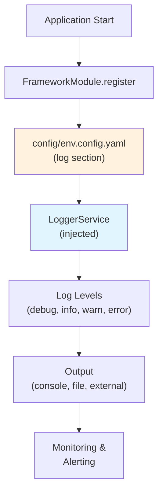

# Module 11: Logging System & Best Practices

## 🔗 Ecosystem Component: `@eqxjs-logger`

**Part of EQXJS Ecosystem**

- Comprehensive structured logging service
- Configuration-driven log management
- Production-ready logging infrastructure

**Quick navigation:**

- Course outline: `course-outline.md`
- EQXJS Ecosystem: See `course-outline.md` section 1.2
- Exercises: `exercise/module-11-exercises.md`
- Previous module: `module-10-advanced-patterns.md`

## Before you start

- Complete Module 2 (Getting Started) to have a working EQXJS application
- Understand basic NestJS providers and dependency injection
- Familiarity with configuration from Module 3 is helpful
- Review the EQXJS Ecosystem Components in course outline

## 📚 Learning Objectives

By the end of this module, you will understand:

- EQXJS Logger architecture and features
- Configuring log levels for different environments
- Injecting and using LoggerService in components
- Structured logging formats
- Log filtering and custom formatters
- Production logging best practices
- Integration with external logging services

## 🧭 Visual Flow (Mermaid)



---

## 🔍 11.1 Logger Architecture (@eqxjs-logger)

### Overview

The `@eqxjs-logger` ecosystem component provides:

- **Structured Logging**: JSON-formatted logs with metadata
- **Log Levels**: debug, info, warn, error, and custom levels
- **Configuration-Driven**: Customize logging through YAML/JSON configuration
- **Context-Aware**: Automatically captures request context, correlation IDs
- **Performance Optimized**: Minimal overhead in production
- **External Integration**: Compatible with popular logging platforms

### Logger Module Structure

```
LoggerModule
├── LoggerService (injectable)
│   ├── debug()
│   ├── info()
│   ├── warn()
│   ├── error()
│   └── custom formatters
├── Configuration
│   ├── log.level
│   ├── log.format
│   └── log.outputs
├── Built-in Features
│   ├── Timestamp
│   ├── Context
│   ├── Correlation ID
│   └── Stack traces
└── Integration
    ├── File output
    ├── Console output
    └── External services
```

### Logger Lifecycle

```
Application Bootstrap
    ↓
FrameworkModule reads config
    ↓
LoggerService initialized
    ↓
Components inject LoggerService
    ↓
Logging during runtime
    ↓
Application shutdown
```

---

## 📝 11.2 Configuration & Setup

### YAML Configuration

Add logger configuration to `config/development.config.yaml`:

```yaml
app:
  component-name: "my-app"

log:
  level: "debug" # debug, info, warn, error
  format: "json" # json, text, pretty
  include-timestamp: true
  include-context: true
  correlation-id-header: "x-correlation-id"

# Optional: File output
log-output:
  file:
    enabled: false
    path: "./logs"
    max-size: "10m"
    max-files: 10

# Optional: External service
log-service:
  external:
    enabled: false
    provider: "datadog" # datadog, cloudwatch, splunk, etc.
    api-key: "${LOG_API_KEY}"
```

### Environment-Specific Configuration

Create `config/production.config.yaml`:

```yaml
app:
  component-name: "my-app"

log:
  level: "info" # Less verbose in production
  format: "json"
  include-timestamp: true
  include-context: true

log-output:
  file:
    enabled: true
    path: "./logs"
    max-size: "100m"
    max-files: 30

log-service:
  external:
    enabled: true
    provider: "datadog"
    api-key: "${LOG_API_KEY}"
```

---

## 💡 11.3 Using LoggerService

### Injecting LoggerService

```typescript
import { Injectable } from "@nestjs/common";
import { LoggerService } from "@eqxjs-logger";

@Injectable()
export class UserService {
  constructor(private readonly logger: LoggerService) {}

  async getUser(id: string) {
    this.logger.debug("Fetching user", { userId: id });

    try {
      const user = await this.userRepository.findById(id);

      this.logger.info("User retrieved successfully", {
        userId: id,
        email: user.email,
      });

      return user;
    } catch (error) {
      this.logger.error("Failed to fetch user", {
        userId: id,
        errorMessage: error.message,
      });

      throw error;
    }
  }
}
```

### Log Level Usage

#### Debug Logs

Used for detailed diagnostic information during development:

```typescript
// Very detailed flow information
this.logger.debug("Processing payment request", {
  orderId,
  paymentMethod,
  amount,
  timestamp: new Date(),
});
```

#### Info Logs

Important business events and state changes:

```typescript
// Significant events
this.logger.info("Order created successfully", {
  orderId,
  customerId,
  totalAmount,
  status: "pending",
});
```

#### Warn Logs

Potential issues that don't prevent operation:

```typescript
// Potential problems
this.logger.warn("Retry attempt for API call", {
  service: "external-payment-api",
  attempt: 2,
  maxRetries: 3,
});
```

#### Error Logs

Failures and exceptions:

```typescript
// Error conditions
this.logger.error("Database connection failed", {
  attempts: 3,
  errorCode: "ECONNREFUSED",
  host: process.env.DB_HOST,
});
```

---

## 🎯 11.4 Structured Logging Patterns

### Adding Context

```typescript
@Injectable()
export class PaymentService {
  constructor(
    private readonly logger: LoggerService,
    private readonly configService: ConfigService,
  ) {}

  processPayment(orderId: string, amount: number) {
    const context = {
      orderId,
      amount,
      currency: "USD",
      timestamp: new Date().toISOString(),
      service: "payment",
    };

    this.logger.info("Payment processing started", context);

    try {
      // Process payment...
      this.logger.info("Payment completed", {
        ...context,
        status: "success",
      });
    } catch (error) {
      this.logger.error("Payment failed", {
        ...context,
        errorCode: error.code,
        errorMessage: error.message,
      });
    }
  }
}
```

### Logging with Correlation IDs

The LoggerService automatically includes correlation IDs when available:

```typescript
@Controller("orders")
export class OrderController {
  constructor(private readonly logger: LoggerService) {}

  @Post()
  async create(@Body() createOrderDto: CreateOrderDto) {
    // LoggerService will automatically add correlation ID
    // from x-correlation-id header if present

    this.logger.info("Creating order", {
      items: createOrderDto.items.length,
      total: createOrderDto.total,
    });

    // Correlation ID is automatically included in logs
    // for tracing across microservices
  }
}
```

### Error Logging with Stack Traces

```typescript
async deleteUser(id: string) {
  try {
    this.logger.debug("Attempting to delete user", { userId: id });
    await this.userRepository.delete(id);
    this.logger.info("User deleted", { userId: id });
  } catch (error) {
    // Stack trace is automatically included
    this.logger.error("User deletion failed", {
      userId: id,
      error: error,
      stack: error.stack,
    });

    throw new BadRequestException("Could not delete user");
  }
}
```

---

## 🚀 11.5 Production Logging Practices

### Performance Considerations

Avoid logging large objects:

```typescript
// ❌ Bad - logs entire user object
this.logger.info("User saved", { user });

// ✅ Good - logs only necessary fields
this.logger.info("User saved", {
  userId: user.id,
  email: user.email,
  role: user.role,
});
```

### Sensitive Data Masking

```typescript
function maskEmail(email: string): string {
  const [local, domain] = email.split("@");
  return `${local.substring(0, 2)}***@${domain}`;
}

this.logger.info("User logged in", {
  userId,
  email: maskEmail(user.email), // Never log full email
  loginTime: new Date(),
});
```

### Log Rotation and Cleanup

Configure in `config/production.config.yaml`:

```yaml
log-output:
  file:
    enabled: true
    path: "./logs"
    max-size: "100m" # Rotate when file reaches 100MB
    max-files: 30 # Keep last 30 files
    retention-days: 30 # Delete logs older than 30 days
```

### Monitoring and Alerting

Set up alerts for error logs:

```typescript
// Errors are automatically sent to monitoring services
// configured in log-service section
this.logger.error("Critical system error", {
  errorType: "DATABASE_CONNECTION",
  severity: "critical",
  service: process.env.SERVICE_NAME,
});

// Monitoring system can trigger alerts based on:
// - Error frequency
// - Specific error codes
// - Service name
// - Severity level
```

---

## 🔧 11.6 Advanced Topics

### Custom Log Formatting

```typescript
@Module({
  imports: [FrameworkModule],
})
export class AppModule {
  constructor(private readonly logger: LoggerService) {
    // Custom formatter can be configured
    this.logger.setFormatter((log) => {
      return {
        ...log,
        // Add custom fields
        service: process.env.SERVICE_NAME,
        environment: process.env.NODE_ENV,
        version: process.env.APP_VERSION,
      };
    });
  }
}
```

### Dynamic Log Level Changes

```typescript
@Controller("admin")
export class AdminController {
  constructor(private readonly logger: LoggerService) {}

  @Post("log-level/:level")
  setLogLevel(@Param("level") level: string) {
    this.logger.setLevel(level);
    this.logger.info("Log level changed", { newLevel: level });
    return { message: "Log level updated" };
  }
}
```

### Structured Log Sampling

For high-volume logs, sample debug logs in production:

```typescript
const shouldLog = (level: string) => {
  if (level === "debug") {
    return Math.random() < 0.1; // Log 10% of debug messages
  }
  return true;
};

if (shouldLog("debug")) {
  this.logger.debug("Detailed operation info", data);
}
```

---

## � Related Ecosystem Components

This module works with and relates to these EQXJS ecosystem components:

| Component               | Relationship  | Purpose                                  |
| ----------------------- | ------------- | ---------------------------------------- |
| **@eqxjs-logger**       | Primary       | Comprehensive structured logging service |
| @eqxjs-exception        | Integration   | Log exception details and errors         |
| @eqxjs-utils            | Supporting    | Utility functions for logging operations |
| @eqxjs-transporter-http | Integration   | HTTP request/response logging            |
| @eqxjs-commander        | Configuration | Configuration-driven log setup           |

---

## 📋 Summary

| Item                     | Description                            |
| ------------------------ | -------------------------------------- |
| **Component**            | `@eqxjs-logger`                        |
| **Service**              | `LoggerService` (injectable)           |
| **Config Section**       | `log` in YAML config                   |
| **Log Levels**           | debug, info, warn, error               |
| **Structured Format**    | JSON with metadata                     |
| **Key Features**         | Context, Correlation IDs, Stack traces |
| **File Output**          | Configurable rotation and retention    |
| **External Integration** | Datadog, CloudWatch, Splunk, etc.      |

---

## ✅ Next Steps

1. **Complete the exercises** in `exercise/module-11-exercises.md`
2. **Implement logging** in your application components
3. **Configure log levels** for your environment
4. **Set up file output** for production logging
5. **Integrate external logging** service if needed
6. **Review Module 10** for advanced patterns that combine with logging
