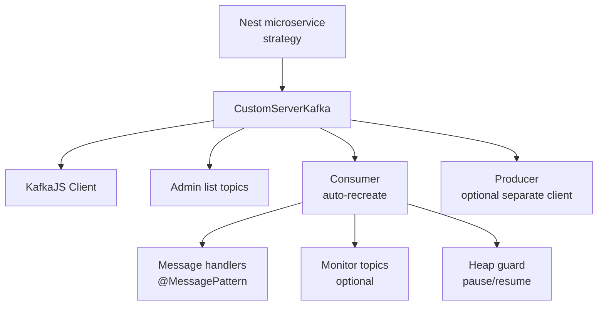

# EQXJS Custom Kafka Server Course

This course teaches how to use `@eqxjs/custom-kafka-server` (a custom NestJS microservices Kafka server strategy built on KafkaJS) to build resilient Kafka consumers/producers with topic monitoring and memory guardrails.

## 📑 Table of Contents

- [🎯 Course Overview](#-course-overview)
- [👥 Target Audience](#-target-audience)
- [📋 Prerequisites](#-prerequisites)
- [🚀 Quick Start](#-quick-start)
- [📚 Course Modules](#-course-modules)
- [💡 All Exercises](exercise/README.md)
- [📋 Course Outline](course-outline.md)

---

## 🎯 Course Overview

`CustomServerKafka` extends Nest’s `ServerKafka` and adds:

- Consumer auto-recovery (`consumer.crash` + `restartOnFailure`)
- Optional separate producer client/options
- Topic existence validation + monitoring (optional)
- Heap usage guardrails (pause/resume consumer when memory is high)
- Simple global accessors for the underlying KafkaJS consumer/producer

---

## 👥 Target Audience

- Backend developers using NestJS microservices with Kafka
- Platform engineers who want standardized Kafka runtime behavior
- Developers migrating from Nest `Transport.KAFKA` to a custom strategy

---

## 📋 Prerequisites

- Node.js 18+
- NestJS fundamentals (modules, DI, microservices)
- Kafka basics (topics, partitions, consumer groups)
- A Kafka cluster available (local Docker is fine)

---

## 🚀 Quick Start

This library is typically used as a custom microservice strategy.

```ts
import { NestFactory } from "@nestjs/core";
import { AppModule } from "./app.module";
import { CustomServerKafka } from "@eqxjs/custom-kafka-server";

async function bootstrap() {
  const consumerOptions = {
    client: {
      clientId: "demo-service",
      brokers: ["localhost:9092"],
    },
    consumer: {
      groupId: "demo-service-group",
    },
    subscribe: {
      fromBeginning: true,
    },
  };

  const app = await NestFactory.createMicroservice(AppModule, {
    strategy: new CustomServerKafka(consumerOptions),
  });

  await app.listen();
}

bootstrap();
```

---

## 📚 Course Modules

| Module | Topic                                 | Content                                      | Exercises                                    | Duration |
| ------ | ------------------------------------- | -------------------------------------------- | -------------------------------------------- | -------- |
| 1      | Introduction & Features               | [Module 1](module-01-introduction.md)        | [Exercises](exercise/module-01-exercises.md) | 45–60m   |
| 2      | Setup & NestJS Integration            | [Module 2](module-02-setup-integration.md)   | [Exercises](exercise/module-02-exercises.md) | 60–90m   |
| 3      | CustomServerKafka Architecture        | [Module 3](module-03-architecture.md)        | [Exercises](exercise/module-03-exercises.md) | 60–90m   |
| 4      | Resilience & Recovery                 | [Module 4](module-04-resilience-recovery.md) | [Exercises](exercise/module-04-exercises.md) | 60–90m   |
| 5      | Topic Monitoring & Subscription       | [Module 5](module-05-topic-monitoring.md)    | [Exercises](exercise/module-05-exercises.md) | 45–75m   |
| 6      | Memory Guardrails & Production Tuning | [Module 6](module-06-memory-production.md)   | [Exercises](exercise/module-06-exercises.md) | 60–90m   |

---

## 🧭 Visual Flow (Mermaid)



---

## 🔗 Source Project

This course is based on the implementation in:

- `cronus-extra-library-eqxjs-custom-server-kafka/kafka.server.ts`
