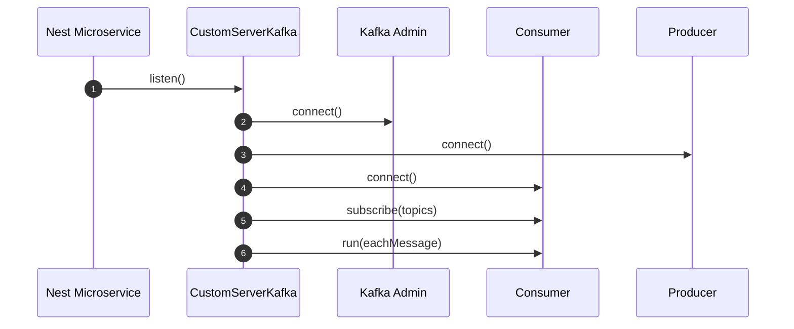

# Module 2: Setup & NestJS Integration

## 📚 Learning Objectives

By the end of this module, you will be able to:

- Install and wire `CustomServerKafka` into a Nest microservice
- Provide correct Kafka options (`client`, `consumer`, `producer`)
- Understand where topic subscriptions come from

---

## 2.1 Install

In a NestJS service project:

```bash
npm install @eqxjs/custom-kafka-server kafkajs @nestjs/microservices
```

---

## 2.2 Create a microservice with a custom strategy

```ts
import { NestFactory } from "@nestjs/core";
import { AppModule } from "./app.module";
import { CustomServerKafka } from "@eqxjs/custom-kafka-server";

async function bootstrap() {
  const consumerOptions = {
    client: {
      clientId: "demo-service",
      brokers: ["localhost:9092"],
    },
    consumer: {
      groupId: "demo-service-group",
    },
    subscribe: {
      fromBeginning: true,
    },
  };

  const app = await NestFactory.createMicroservice(AppModule, {
    strategy: new CustomServerKafka(consumerOptions),
  });

  await app.listen();
}

bootstrap();
```

---

## 2.3 Register message handlers (topics)

`CustomServerKafka` uses the patterns you register in your Nest microservice.

Example:

```ts
import { Controller } from "@nestjs/common";
import { MessagePattern, Payload } from "@nestjs/microservices";

@Controller()
export class OrdersConsumerController {
  @MessagePattern("orders.created")
  async onCreated(@Payload() message: any) {
    // business logic
  }
}
```

---

## 2.4 Producer usage

Because the strategy creates and connects a producer, you can access the underlying producer instance.

```ts
import { CustomServerKafka } from "@eqxjs/custom-kafka-server";

const producer = CustomServerKafka.getProducer();
await producer.send({
  topic: "orders.created",
  messages: [{ key: "orderId", value: JSON.stringify({ id: "1" }) }],
});
```

Note: This is a convenience. In larger systems, you may still prefer a dedicated producer service wrapper.

---

## 🧭 Visual Flow (Mermaid)



---

## ✅ Summary

- Use `strategy: new CustomServerKafka(consumerOptions, producerOptions?)`.
- Topics come from Nest message patterns.

Next: [Module 3: CustomServerKafka Architecture](module-03-architecture.md)
