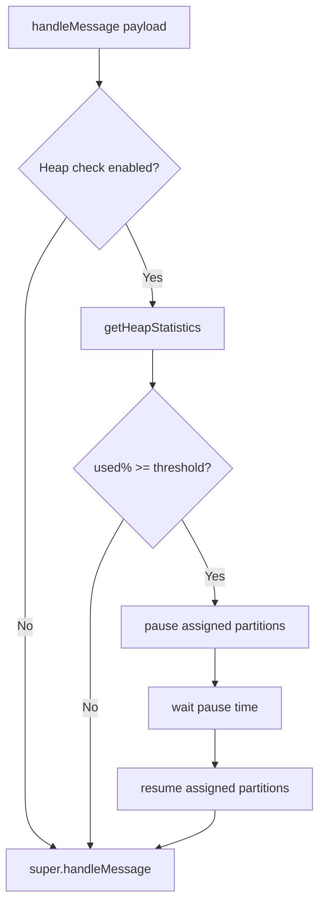

# Module 6: Memory Guardrails & Production Tuning

## 📚 Learning Objectives

By the end of this module, you will be able to:

- Enable heap usage checks safely
- Understand how pause/resume works with member assignment
- Pick production defaults for monitoring and guardrails

---

## 6.1 Heap usage guardrail

When enabled (`KAFKA_HEAP_USED_SIZE_CHECK_ENABLED=true`), `handleMessage()`:

- reads heap stats from Node/V8
- computes used percent
- pauses partitions if above threshold
- resumes after a configured delay

Key env vars:

- `KAFKA_HEAP_USED_SIZE_PERCENT` (default 80)
- `KAFKA_CONSUMER_PAUSE_TIME_MS` (default 10000)

---

## 6.2 Pause/resume scope

Pause targets the current member’s assignment:

- derived from `consumer.group_join` member assignment

This helps prevent pausing unrelated partitions.

---

## 6.3 Production recommendations

- Start with monitoring enabled in non-prod to catch missing topics early
- Use heap guardrails only when you have observed memory pressure issues
- Keep pause time short; long pauses can increase consumer lag

---

## 🧭 Visual Flow (Mermaid)

---

## ✅ Summary

- Heap guardrails are a stability tool: use deliberately.
- Combine with monitoring/logging to reduce mystery failures.

Next: complete [all exercises](exercise/README.md)
