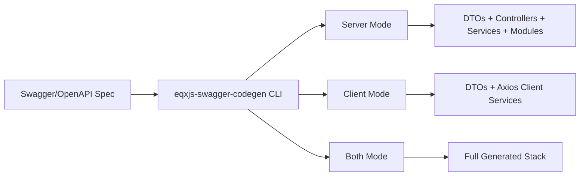

# Module 1: Introduction to Swagger Code Generation

## 📚 Learning Objectives

By the end of this module, you will be able to:

- Explain what `@eqxjs/swagger-codegen` does
- Describe contract-first development using Swagger/OpenAPI
- Choose between `server`, `client`, and `both` generation modes

---

## 1.1 What is `@eqxjs/swagger-codegen`?

`@eqxjs/swagger-codegen` is a TypeScript CLI tool that reads Swagger/OpenAPI specs and generates:

- NestJS server-side artifacts (DTOs, services, controllers, modules)
- TypeScript client services using Axios
- Shared data contracts for strongly typed integration

This reduces repetitive scaffolding and keeps implementation aligned with API contracts.

---

## 1.2 Why contract-first generation matters

In contract-first workflows, the API specification becomes the source of truth.

Benefits:

- consistent API surface between teams
- faster onboarding for new services
- fewer integration mismatches
- easier regeneration when contracts evolve

---

## 1.3 Generation modes overview

The tool supports three modes:

- `server` (default): NestJS controllers/services/modules + DTOs
- `client`: Axios-based client services + DTOs
- `both`: server and client outputs together

Use mode selection to fit your architecture (backend-only, frontend-only, or full-stack).

---

## 1.4 Supported formats and versions

- Swagger 2.0 and OpenAPI 3.0
- JSON and YAML input files
- Schema-based type inference for generated DTOs

---

## 🧭 Visual Flow (Mermaid)

---

## ✅ Summary

- `@eqxjs/swagger-codegen` accelerates API development from contract files.
- Generation modes let you target server, client, or both.

Next: [Module 2: Installation and CLI Setup](module-02-installation-cli-setup.md)
