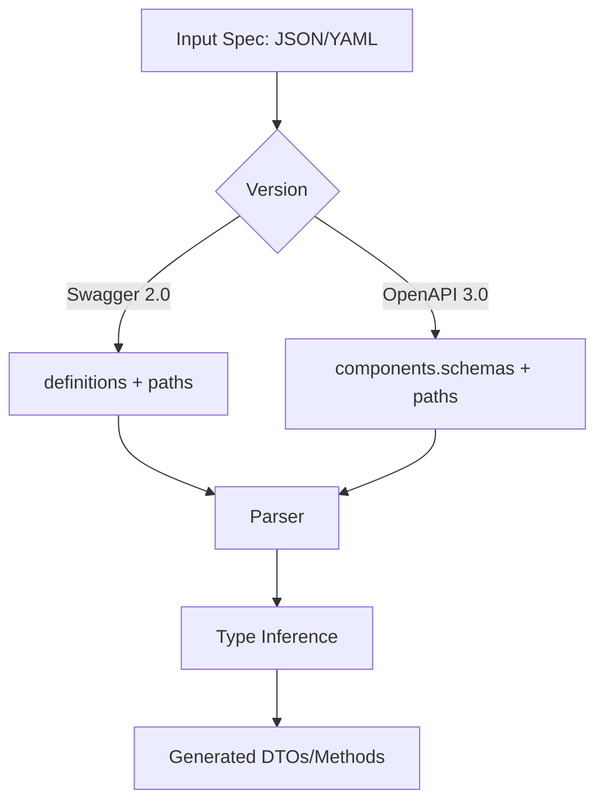

# Module 3: Working with Swagger 2.0 and OpenAPI 3.0

## 📚 Learning Objectives

By the end of this module, you will be able to:

- Distinguish Swagger 2.0 and OpenAPI 3.0 input structures
- Generate code from JSON and YAML files reliably
- Prepare schemas that map cleanly to TypeScript DTOs

---

## 3.1 Swagger 2.0 vs OpenAPI 3.0

Common differences:

- Swagger 2.0 typically uses `definitions`
- OpenAPI 3.0 uses `components.schemas`
- Request body modeling differs between versions

The generator supports both, but clean schemas improve generated output quality.

---

## 3.2 JSON and YAML input

All examples below are valid inputs:

```bash
eqxjs-swagger-codegen generate -i ./example-swagger.json -o ./generated
eqxjs-swagger-codegen generate -i ./example-swagger.yaml -o ./generated
eqxjs-swagger-codegen generate -i ./openapi3-example.json -o ./generated
eqxjs-swagger-codegen generate -i ./openapi3-example.yaml -o ./generated
```

---

## 3.3 Schema design for better generation

Use explicit schema metadata when possible:

- field types
- required arrays
- enum values
- format hints (`email`, `uuid`, `date-time`, etc.)

Benefits:

- cleaner DTO classes
- stronger inferred types
- better compatibility with validation decorators

---

## 3.4 Parameter and response mapping

The generator maps:

- path parameters
- query parameters
- request body schemas
- array/object responses

Keep operation IDs, tags, and schema names consistent to get stable generated names.

---

## 🧭 Visual Flow (Mermaid)



---

## ✅ Summary

- Both Swagger 2.0 and OpenAPI 3.0 are supported.
- Better schema design leads to better generated code.

Next: [Module 4: Server Code Generation (NestJS)](module-04-server-code-generation.md)
