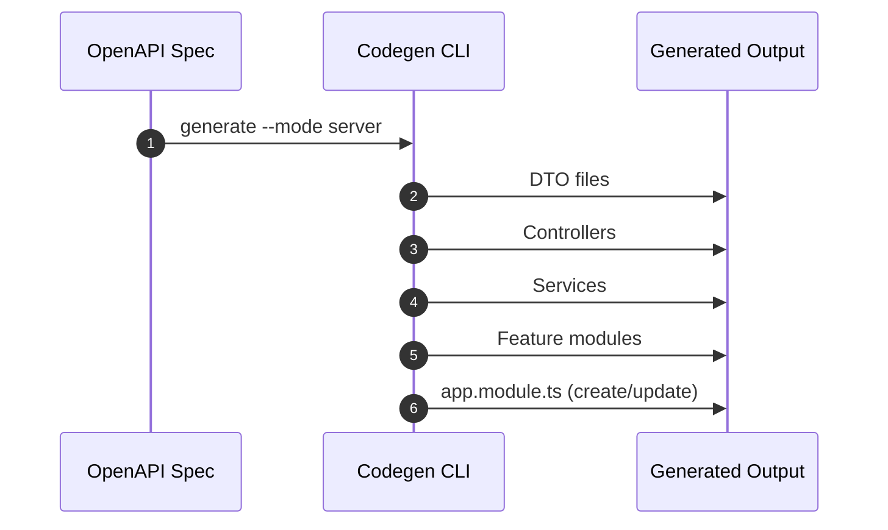

# Module 4: Server Code Generation (NestJS)

## 📚 Learning Objectives

By the end of this module, you will be able to:

- Generate NestJS server artifacts from API specs
- Understand output structure by resource/tag
- Integrate generated modules into application bootstrap

---

## 4.1 Generate server code

Use default mode (`server`):

```bash
eqxjs-swagger-codegen generate -i ./swagger.json -o ./generated
```

Explicit mode:

```bash
eqxjs-swagger-codegen generate -i ./swagger.json -o ./generated --mode server
```

---

## 4.2 Typical generated structure

```text
generated/
├── dtos/
├── users/
│   ├── users.service.ts
│   ├── users.controller.ts
│   └── users.module.ts
└── posts/
    ├── posts.service.ts
    ├── posts.controller.ts
    └── posts.module.ts
```

Artifacts are grouped by resource/tag for easier navigation.

---

## 4.3 DTO, controller, and service behavior

- DTOs are generated from schemas with `@ApiProperty` metadata
- Controllers include route decorators and operation summaries
- Services include typed method signatures and placeholders for business logic

---

## 4.4 `app.module.ts` auto-generation

In `server` (and `both`) mode, generator can create or update `app.module.ts`:

- adds generated feature modules into `imports`
- preserves custom third-party imports when present

This helps boot generated modules quickly in a clean NestJS app.

---

## 🧭 Visual Flow (Mermaid)



---

## ✅ Summary

- Server mode scaffolds a runnable NestJS API structure.
- Generated code is intended to be extended with business logic.

Next: [Module 5: Client SDK Generation (TypeScript + Axios)](module-05-client-sdk-generation.md)
