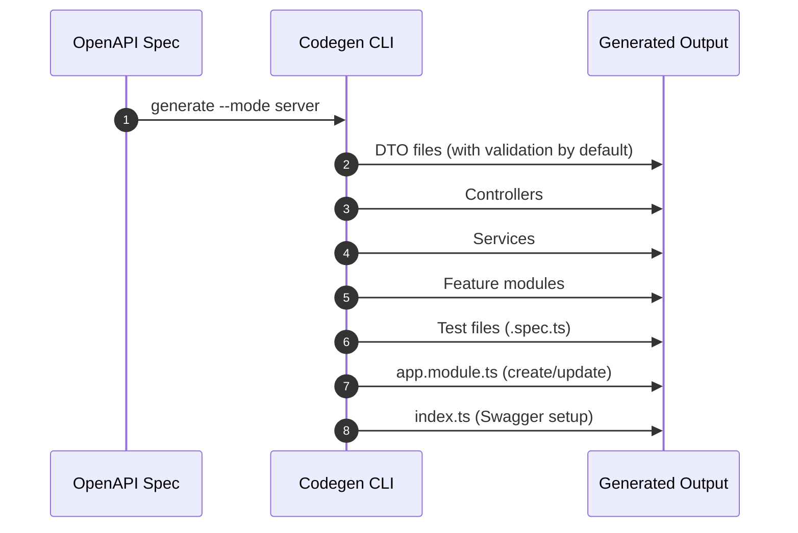

# Module 4: Server Code Generation (NestJS)

## 📚 Learning Objectives

By the end of this module, you will be able to:

- Generate NestJS server artifacts from API specs
- Understand output structure by resource/tag
- Integrate generated modules into application bootstrap

---

## 4.1 Generate server code

Use default mode (`server`):

```bash
eqxjs-swagger-codegen generate -i ./swagger.json -o ./generated
```

Explicit mode:

```bash
eqxjs-swagger-codegen generate -i ./swagger.json -o ./generated --mode server
```

---

## 4.2 Typical generated structure

```text
generated/
├── dtos/
├── users/
│   ├── users.service.ts
│   ├── users.controller.ts
│   └── users.module.ts
└── posts/
    ├── posts.service.ts
    ├── posts.controller.ts
    └── posts.module.ts
```

Artifacts are grouped by resource/tag for easier navigation.

---

## 4.3 DTO, controller, and service behavior

- DTOs are generated from schemas with `@ApiProperty` metadata
- Controllers include route decorators and operation summaries
- Services include typed method signatures and placeholders for business logic

---

## 4.4 `app.module.ts` auto-generation

In `server` (and `both`) mode, generator can create or update `app.module.ts`:

- adds generated feature modules into `imports`
- preserves custom third-party imports when present

This helps boot generated modules quickly in a clean NestJS app.

---

## 4.5 `index.ts` Swagger setup helper

In `server` and `both` modes, the generator creates an `index.ts` file with a ready-to-use Swagger configuration function:

**Generated `index.ts`:**

```typescript
import { INestApplication } from '@nestjs/common';
import { DocumentBuilder, SwaggerModule } from '@nestjs/swagger';

/**
 * Setup Swagger documentation for the NestJS application
 * @param app - The NestJS application instance
 * @param path - The path where Swagger UI will be available (default: 'api')
 */
export function setupSwagger(app: INestApplication, path: string = 'api') {
  const config = new DocumentBuilder()
    .setTitle('Example API')
    .setDescription('Example API for testing the code generator')
    .setVersion('1.0.0')
    .build();
  
  const document = SwaggerModule.createDocument(app, config);
  SwaggerModule.setup(path, app, document);
}
```

**Usage in `main.ts`:**

```typescript
import { NestFactory } from '@nestjs/core';
import { AppModule } from './app.module';
import { setupSwagger } from './generated';

async function bootstrap() {
  const app = await NestFactory.create(AppModule);
  
  // Setup Swagger documentation at /api
  setupSwagger(app);
  // Or custom path: setupSwagger(app, 'docs');
  
  await app.listen(3000);
  console.log('Swagger docs available at http://localhost:3000/api');
}
bootstrap();
```

**Benefits:**

- No manual DocumentBuilder configuration needed
- Metadata automatically extracted from your OpenAPI spec
- One-line Swagger setup in your application
- Easy to customize or extend

---

## 🧭 Visual Flow (Mermaid)



---

## ✅ Summary

- Server mode scaffolds a runnable NestJS API structure.
- Generated code is intended to be extended with business logic.

Next: [Module 5: Client SDK Generation (TypeScript + Axios)](module-05-client-sdk-generation.md)
