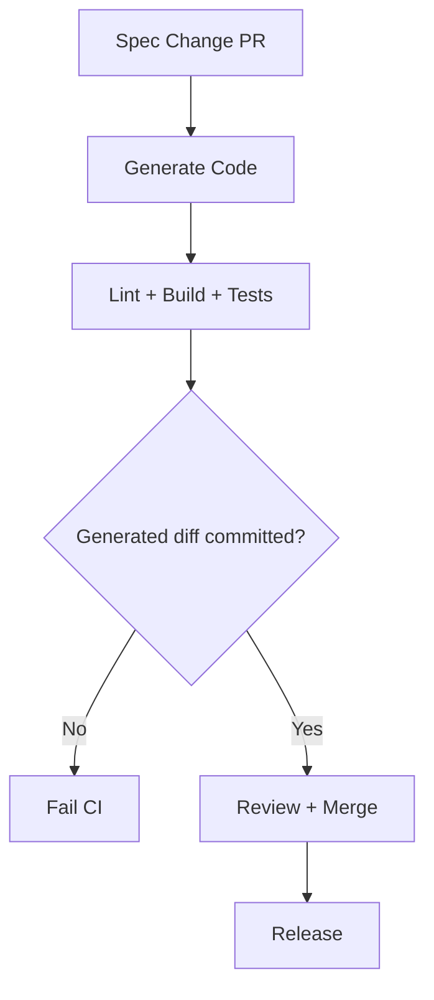

# Module 8: Production Workflow and CI/CD Integration

## 📚 Learning Objectives

By the end of this module, you will be able to:

- Integrate code generation into CI/CD reliably
- Keep generated code deterministic and review-friendly
- Establish team conventions for generated artifacts

---

## 8.1 Regeneration strategy

Use one source of truth for input specs and regenerate predictably:

- run generation on pull requests that modify specs
- fail CI if generated output is outdated
- keep generation command centralized in scripts

**Example generation script (package.json):**

```json
{
  "scripts": {
    "generate": "eqxjs-swagger-codegen generate -i ./api/openapi.yaml -o ./src/generated --mode both",
    "generate:dtos": "eqxjs-swagger-codegen generate -i ./api/openapi.yaml -o ./src/contracts --mode dtos",
    "generate:no-tests": "eqxjs-swagger-codegen generate -i ./api/openapi.yaml -o ./src/generated --mode server --no-test"
  }
}
```

**Example CI check script:**

```bash
#!/bin/bash
# scripts/check-generated.sh

echo "Regenerating code from spec..."
npm run generate

echo "Checking for uncommitted changes..."
git diff --exit-code ./src/generated || {
  echo "Error: Generated code is out of sync with spec!"
  echo "Run: npm run generate"
  exit 1
}

echo "✅ Generated code is up to date"
```

---

## 8.2 Deterministic output practices

- lock generator version in `package.json`
- avoid manual edits in generated files
- place custom logic in wrapper/adapter layers
- review generated diffs separately from business code

---

## 8.3 CI pipeline checklist

After generation, run:

- formatting/lint checks
- TypeScript build
- unit/integration tests

This catches contract regressions early.

---

## 8.4 Team governance

Define and document:

- who owns API spec changes
- review rules for generated code
- release process for contract package updates

These agreements reduce friction as service count grows.

---

## 🧭 Visual Flow (Mermaid)



---

## ✅ Summary

- Production workflows need repeatable generation and strong CI checks.
- Governance rules are as important as tooling.

Continue with practical labs from the course outline: [course-outline.md](course-outline.md)
