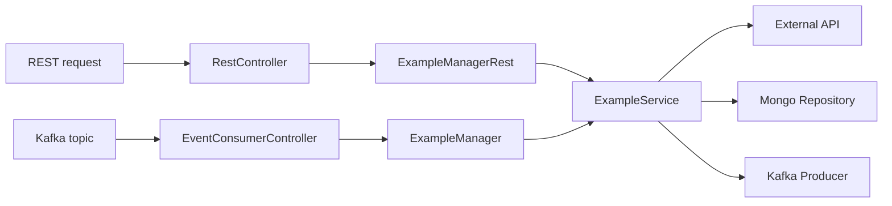
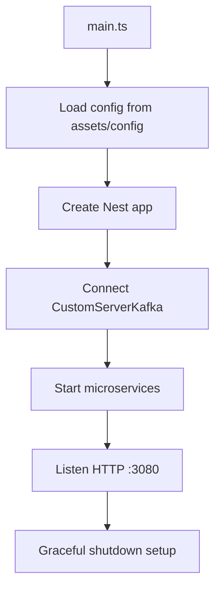

# Module 1: Introduction and Architecture

> Understand the purpose of the template and how its pieces fit together.

---

## Learning Goals

- Explain the main runtime flows (REST and Kafka)
- Identify core modules and their responsibilities
- Know where configuration and infrastructure live

---

## 1.1 What This Template Is

The `esb-dos-template-message-restapi` project is a NestJS domain service template that:

- Serves REST endpoints
- Consumes Kafka topics
- Produces Kafka events
- Stores and reads data from MongoDB
- Uses EQXJS utilities for logging, context, and conventions

---

## 1.2 Project Layout (Key Areas)

- `src/main.ts` boots the Nest app and connects the Kafka microservice strategy
- `src/app.module.ts` wires the framework module and feature modules
- `src/example/` contains controllers, managers, services, DTOs, and repositories
- `src/database/` provides the MongoDB connection provider
- `assets/config/` contains YAML configuration per environment

---

## 1.3 High-Level Flow

---

## 1.3.1 Bootstrap Flow

---

## 1.4 Core Building Blocks

- **EQXJS Stub** for `MessageContextService`, structured logging, and interceptors
- **Custom Kafka Server** for resilient Kafka client management
- **Database Module** that injects a MongoDB connection and database handle

---

## Knowledge Check

- Which file selects the configuration folder and `ZONE`?
- Which class produces Kafka events?
- Which class maps Kafka message payloads into DTOs?

---

## Next Module

Continue to [Module 2: Setup and Configuration](module-02-setup-configuration.md).
