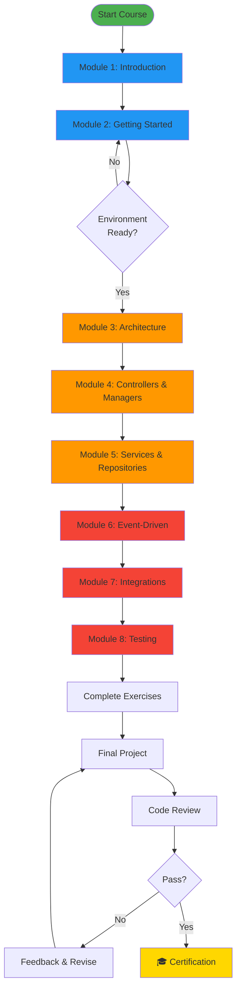

# EQXJS Template Developer Training Course

> **Comprehensive training for building enterprise microservices with EQXJS Framework**

---

## 📖 About This Course

This comprehensive training course teaches developers how to build production-ready, enterprise-grade microservices using the **EQXJS Template** - a powerful NestJS-based template that combines REST API and Event-Driven Architecture with Kafka messaging.

### 🎯 What You'll Learn

- ✅ Enterprise microservices architecture patterns
- ✅ Event-driven development with Apache Kafka
- ✅ EQXJS framework library usage and best practices
- ✅ MongoDB integration and optimization
- ✅ REST API and event consumer/producer implementation
- ✅ Testing strategies for microservices
- ✅ Production deployment and monitoring
- ✅ Code quality and best practices

### 👥 Who This Course Is For

- **Backend Developers** looking to master enterprise microservices
- **Node.js Developers** wanting to learn NestJS and event-driven architecture
- **Teams** adopting the EQXJS Template for their projects
- **Architects** designing scalable microservices solutions

### ⏱️ Course Duration

**Total:** ~23 hours of content

- **Lectures:** 15 hours
- **Hands-on Exercises:** 6 hours
- **Final Project:** 2 hours

---

## 📚 Course Structure

### [📋 Course Outline](course-outline.md)

View the complete course structure, module descriptions, and learning paths.

### 📖 Course Modules

| Module                                              | Topic                                    | Duration | Difficulty   |
| --------------------------------------------------- | ---------------------------------------- | -------- | ------------ |
| **[Module 1](module-01-introduction.md)**           | Introduction to EQXJS Framework          | 2 hours  | Beginner     |
| **[Module 2](module-02-getting-started.md)**        | Getting Started with EQXJS Template      | 2 hours  | Beginner     |
| **[Module 3](module-03-architecture.md)**           | Template Architecture Deep Dive          | 3 hours  | Intermediate |
| **[Module 4](module-04-controllers-managers.md)**   | Controllers and Managers                 | 3 hours  | Intermediate |
| **[Module 5](module-05-services-repositories.md)**  | Services and Repositories                | 3 hours  | Intermediate |
| **[Module 6](module-06-kafka-events.md)**           | Event-Driven Architecture with Kafka     | 4 hours  | Advanced     |
| **[Module 7](module-07-integrations.md)**           | External Services & Database Integration | 3 hours  | Advanced     |
| **[Module 8](module-08-testing-best-practices.md)** | Testing and Best Practices               | 3 hours  | Advanced     |

### 💪 [Hands-On Exercises](exercise/README.md)

Comprehensive practical exercises for all modules with detailed instructions and solutions.

---

## 🚀 Quick Start

### Step 1: Prerequisites

Ensure you have the following installed:

- Node.js >= 18.x
- npm >= 9.x
- Docker & Docker Compose
- Git
- VS Code (recommended)

### Step 2: Start Learning

Begin with the [Course Outline](course-outline.md) to understand the structure, then proceed to [Module 1](module-01-introduction.md).

### Step 3: Set Up Environment

Follow the instructions in [Module 2](module-02-getting-started.md) to set up your development environment.

### Step 4: Complete Exercises

Work through the [exercises](exercise/README.md) for each module to reinforce your learning.

---

## 📊 Course Flow Diagram

---

## 🎓 Learning Path

### Beginner Path (Modules 1-2)

**Focus:** Understanding the framework and basic setup

1. Read Module 1: Introduction
2. Set up environment (Module 2)
3. Run the template locally
4. Complete beginner exercises
5. Create your first endpoint

**Time:** 1-2 days

### Intermediate Path (Modules 3-5)

**Focus:** Architecture and implementation patterns

1. Study layered architecture (Module 3)
2. Implement controllers (Module 4)
3. Build services and repositories (Module 5)
4. Complete intermediate exercises
5. Build a small feature

**Time:** 1 week

### Advanced Path (Modules 6-8)

**Focus:** Event-driven patterns and production readiness

1. Master Kafka integration (Module 6)
2. Implement external integrations (Module 7)
3. Write comprehensive tests (Module 8)
4. Complete advanced exercises
5. Complete final project

**Time:** 2 weeks

---

## 🛠️ What You'll Build

Throughout this course, you'll build several projects:

### Practice Projects

1. **User Management Service** (Modules 1-4)
   - REST API with database integration
   - CRUD operations
   - Validation and error handling

2. **Order Processing Service** (Modules 5-6)
   - Event-driven order processing
   - Kafka integration
   - State management

3. **Notification Service** (Module 6)
   - Multi-channel notifications
   - Event consumers
   - External API integration

### Final Project

**Order Management Microservice**

- Complete REST API
- Event-driven processing
- Database integration
- External service calls
- Comprehensive testing
- Production-ready deployment

---

## 📖 Key Concepts Covered

### Architecture Patterns

- Layered Architecture
- Manager Pattern
- Repository Pattern
- Service Pattern
- DTO Pattern
- Event Sourcing

### Technologies

- **Framework:** NestJS 10.x
- **Language:** TypeScript 4.x
- **Messaging:** Apache Kafka
- **Database:** MongoDB 6.x
- **Testing:** Jest
- **Containerization:** Docker
- **CI/CD:** GitHub Actions

### EQXJS Features

- Message Context Management
- Advanced Logging with Masking
- Graceful Shutdown
- Custom Decorators
- Event Producer/Consumer
- Error Handling Framework

---

## 📚 Additional Resources

### Documentation

- [EQXJS Framework Documentation](../eqxjs-framework/README.md)
- [NestJS Official Documentation](https://docs.nestjs.com)
- [Kafka Documentation](https://kafka.apache.org/documentation/)
- [MongoDB Documentation](https://docs.mongodb.com/)
- [TypeScript Handbook](https://www.typescriptlang.org/docs/)

### Sample Code

All modules include:

- ✅ Complete code examples
- ✅ Best practice demonstrations
- ✅ Common pitfalls and solutions
- ✅ Performance optimization tips

### Community

- 💬 GitHub Discussions for Q&A
- 🐛 GitHub Issues for bug reports
- 📧 Direct support from training team
- 👥 Slack channel for participants

---

## ✅ Prerequisites

### Required Knowledge

- ✅ JavaScript/TypeScript fundamentals
- ✅ Node.js basics
- ✅ REST API concepts
- ✅ Basic understanding of databases
- ✅ Git version control

### Recommended Knowledge

- 🔸 NestJS experience (helpful but not required)
- 🔸 Basic Kafka concepts
- 🔸 MongoDB experience
- 🔸 Docker basics
- 🔸 Microservices patterns

---

## 🎯 Learning Outcomes

Upon completing this course, you will be able to:

1. **Design** enterprise microservices using EQXJS Template
2. **Implement** REST APIs with proper validation and error handling
3. **Build** event-driven systems with Kafka
4. **Integrate** external services and databases
5. **Write** comprehensive tests for microservices
6. **Deploy** services to production environments
7. **Monitor** and maintain microservices in production
8. **Apply** best practices for code quality and performance

---

## 📊 Course Statistics

- **8 Modules** covering all aspects of EQXJS Template
- **50+ Code Examples** with detailed explanations
- **30+ Exercises** for hands-on practice
- **10+ Mermaid Diagrams** for visual learning
- **1 Final Project** to demonstrate mastery
- **100+ Pages** of comprehensive documentation

---

## 🎓 Certification

### Requirements

To earn the **EQXJS Framework Developer Certificate**, you must:

1. ✅ Complete all 8 modules
2. ✅ Finish all exercises with >80% accuracy
3. ✅ Complete the final project
4. ✅ Pass code review by senior developers
5. ✅ Demonstrate understanding in Q&A session

### Benefits

- 🏆 Official certification from EQXJS Team
- 📜 Digital certificate and badge
- 💼 Portfolio project showcase
- 🎯 Recognition as EQXJS Developer
- 🔗 Listed in certified developers directory

---

## 🗓️ Course Schedule

### Self-Paced Learning

Complete the course at your own pace:

- **Fast Track:** 2-3 weeks (full-time)
- **Standard:** 4-6 weeks (part-time)
- **Extended:** 8-12 weeks (flexible)

### Instructor-Led Training

Available as:

- 5-day intensive bootcamp
- 8-week evening course
- Custom corporate training

Contact training team for schedules.

---

## 💡 Tips for Success

1. **Follow the Order:** Complete modules sequentially
2. **Practice Daily:** Code every day, even for 30 minutes
3. **Do Exercises:** Hands-on practice is crucial
4. **Ask Questions:** Use community resources
5. **Build Projects:** Apply concepts to real scenarios
6. **Review Code:** Study example implementations
7. **Test Everything:** Write tests as you learn
8. **Read Docs:** Supplement with official documentation

---

## 🤝 Contributing

We welcome contributions to improve this course!

### How to Contribute

1. Fork the repository
2. Create a feature branch
3. Make your improvements
4. Submit a pull request

### Contribution Areas

- 📝 Fix typos or improve explanations
- 💡 Add additional examples
- 🐛 Report issues or errors
- 📚 Suggest additional resources
- ✨ Propose new exercises

---

## 📞 Support

### Get Help

- 💬 **GitHub Discussions:** Ask questions and share knowledge
- 🐛 **GitHub Issues:** Report bugs or problems
- 📧 **Email Support:** training@eqxjs.com
- 💼 **Corporate Training:** enterprise@eqxjs.com

### Office Hours

- **Weekly Q&A Sessions:** Every Friday, 3-4 PM
- **Code Review Sessions:** By appointment
- **1-on-1 Mentoring:** Available for premium students

---

## 📜 License

This course material is licensed under the MIT License.

---

## 🙏 Acknowledgments

- EQXJS Team for framework development
- Course contributors and reviewers
- Beta testers and early adopters
- Open source community

---

## 🚀 Ready to Start?

**Begin your journey to becoming an EQXJS expert!**

👉 **[Start with Course Outline](course-outline.md)**

👉 **[Jump to Module 1: Introduction](module-01-introduction.md)**

---

**Version:** 1.0.0  
**Last Updated:** February 2026  
**Maintained by:** EQXJS Training Team

---

**Happy Learning! 🎓**
