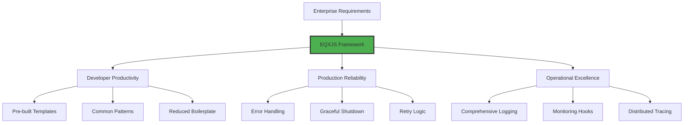
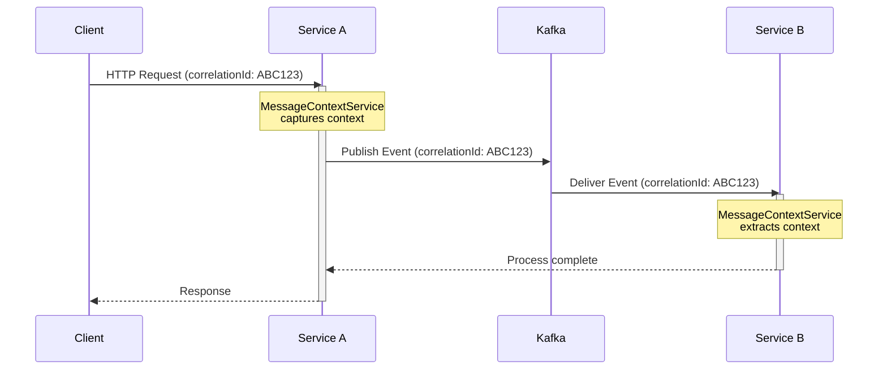
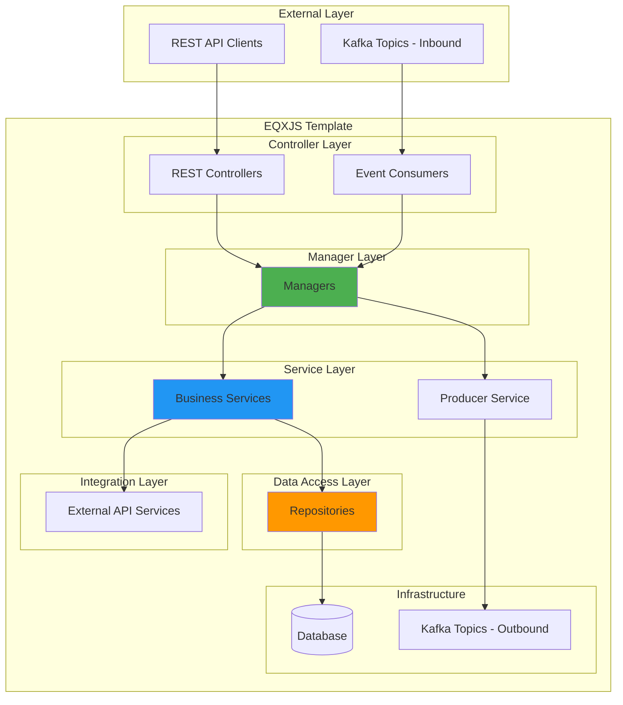
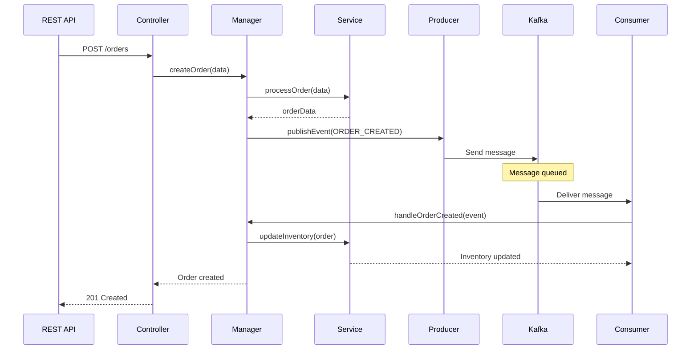

# Module 1: Introduction to EQXJS Framework

## 📚 Learning Objectives

By the end of this module, you will:

- Understand what EQXJS Framework is and its purpose
- Know the core components of the EQXJS ecosystem
- Recognize when to use EQXJS Template
- Understand the framework's architecture philosophy
- Be familiar with the key features and capabilities

---

## 1.1 What is EQXJS Framework?

### Overview

**EQXJS** (Equinox JavaScript) is an enterprise-grade framework built on top of NestJS, designed specifically for building scalable, event-driven microservices with comprehensive logging, monitoring, and message context management.

### Key Characteristics

- **Template-Based Development**: Pre-configured project templates for rapid development
- **Event-Driven First**: Native support for Kafka-based messaging
- **Enterprise-Ready**: Built-in features for logging, monitoring, and graceful shutdown
- **Message Context**: Automatic correlation and tracing across services
- **Type-Safe**: Full TypeScript support with strong typing

### Framework Philosophy



---

## 1.2 EQXJS Components

### Core Libraries

#### 1. `@eqxjs/stub` - Framework Core

The main framework module that serves as the entry point for EQXJS applications.

**Key Features:**

- Framework module registration and bootstrapping
- Application interceptors (HTTP and REST)
- Graceful shutdown service
- Health check utilities
- Message context management
- Custom decorators and validators

**Example:**

```typescript
import { FrameworkModule } from "@eqxjs/stub";

@Module({
  imports: [
    FrameworkModule.register({
      configPath: "./config",
      zone: "development",
    }),
  ],
})
export class AppModule {}
```

#### 2. `@eqxjs/custom-kafka-server` - Kafka Integration

Custom Kafka server strategy for NestJS microservices with enhanced features.

**Key Features:**

- Custom Kafka client wrapper
- Producer/consumer management
- Connection pooling
- Automatic retry logic
- Error handling

**Example:**

```typescript
import { CustomServerKafka } from "@eqxjs/custom-kafka-server";

app.connectMicroservice<MicroserviceOptions>({
  strategy: new CustomServerKafka({
    client: {
      brokers: ["localhost:9092"],
      clientId: "my-service",
    },
    consumer: {
      groupId: "my-consumer-group",
    },
  }),
});
```

#### 3. `@eqxjs/azure-manage-identity` - Azure Integration

Azure Managed Identity support for secure authentication.

**Features:**

- Managed identity authentication
- Azure resource access
- Token management
- Secure credential handling

### Re-exported EQXJS Modules

The `@eqxjs/stub` module consolidates these ecosystem modules:

| Module                    | Purpose                                       |
| ------------------------- | --------------------------------------------- |
| `@eqxjs-commander`        | Command handling and configuration management |
| `@eqxjs-decorator`        | Custom decorators for enhanced functionality  |
| `@eqxjs-transporter-http` | HTTP transport layer                          |
| `@eqxjs-logger`           | Advanced logging with context                 |
| `@eqxjs-pipes`            | Data transformation pipes                     |
| `@eqxjs-utils`            | Utility functions and services                |
| `@eqxjs-exception`        | Exception handling framework                  |
| `@eqxjs-security`         | Security utilities and validation             |

---

## 1.3 Framework Features

### 1.3.1 Message Context Management

Automatic correlation ID propagation across services for distributed tracing.



**Key Benefits:**

- End-to-end request tracing
- Debugging across services
- Performance monitoring
- Audit trail creation

### 1.3.2 Advanced Logging

Structured logging with automatic context injection.

```typescript
import { CustomLoggerService, LoggerAction } from "@eqxjs/stub";

@Injectable()
export class MyService {
  constructor(private logger: CustomLoggerService) {}

  async processData(data: any) {
    // Log with automatic context
    this.logger.info(LoggerAction.PROCESSING("Processing user data"), {
      userId: data.userId,
      action: "create",
    });

    // Log with masking for sensitive data
    this.logger.info(LoggerAction.PROCESSING("Payment processing"), data, [
      { maskingField: "creditCard.cvv", maskingType: MaskingType.full },
    ]);
  }
}
```

**Features:**

- Automatic log correlation
- Sensitive data masking
- Performance metrics
- Structured log format
- Multiple log transports

### 1.3.3 Graceful Shutdown

Ensures clean shutdown of all connections and processes.

```typescript
import { setupGracefulShutdown } from "@eqxjs/stub";

async function bootstrap() {
  const app = await NestFactory.create(AppModule);

  await app.startAllMicroservices();
  await app.listen(3000);

  // Setup graceful shutdown
  setupGracefulShutdown({ app });
}
```

**Handles:**

- Kafka consumer/producer cleanup
- Database connection closure
- In-flight request completion
- Health check shutdown
- SIGTERM/SIGINT signals

### 1.3.4 Custom Decorators

Pre-built decorators for common patterns.

```typescript
import {
  EntryPoint,
  DisableConsumerLogging,
  ConsumerMasking,
  SetMessageMode,
} from "@eqxjs/stub";

@Controller("users")
export class UserController {
  @EntryPoint("USER_CREATE")
  @ConsumerMasking(["password", "ssn"])
  @Post()
  async createUser(@Body() data: CreateUserDto) {
    return this.userService.create(data);
  }

  @EntryPoint("USER_QUERY")
  @DisableConsumerLogging()
  @Get()
  async getUsers() {
    return this.userService.findAll();
  }
}
```

### 1.3.5 Interceptors

Built-in interceptors for common cross-cutting concerns.

```typescript
import { AppInterceptor } from "@eqxjs/stub";

@Controller()
@UseInterceptors(AppInterceptor)
export class MyController {
  // Automatic logging, error handling, and performance tracking
}
```

**Interceptor Features:**

- Request/response logging
- Performance monitoring
- Error transformation
- Context management

---

## 1.4 When to Use EQXJS Template

### ✅ Ideal Use Cases

1. **Enterprise Microservices**
   - Need standardized patterns
   - Require comprehensive logging
   - Multiple teams working on services

2. **Event-Driven Applications**
   - Kafka-based messaging
   - Asynchronous processing
   - Event sourcing patterns

3. **Hybrid Architecture**
   - REST API + Event consumers
   - Synchronous and asynchronous operations
   - Request-response + fire-and-forget

4. **Regulated Industries**
   - Banking and finance
   - Healthcare
   - Government systems
   - Need audit trails

5. **High-Scale Systems**
   - Distributed tracing required
   - Performance monitoring critical
   - Resilience patterns needed

### ❌ When NOT to Use

1. **Simple REST APIs**
   - No event-driven requirements
   - Minimal logging needs
   - Standard NestJS sufficient

2. **Serverless Functions**
   - Short-lived executions
   - Framework overhead too heavy
   - Cold start concerns

3. **Prototype/MVP Projects**
   - Need rapid iteration
   - Architecture not defined
   - Minimal infrastructure

4. **Non-Node.js Projects**
   - Different tech stack
   - Language-specific requirements

---

## 1.5 Architecture Overview

### EQXJS Template Architecture



### Layer Responsibilities

| Layer              | Purpose                         | Example Components                            |
| ------------------ | ------------------------------- | --------------------------------------------- |
| **Controllers**    | Handle incoming requests/events | REST endpoints, Kafka consumers               |
| **Managers**       | Orchestrate business operations | Transaction coordination, multi-service calls |
| **Services**       | Implement business logic        | User service, Order service                   |
| **Repositories**   | Data access abstraction         | MongoDB repositories, API clients             |
| **Infrastructure** | External system integration     | Databases, message queues, APIs               |

---

## 1.6 Comparison with Standard NestJS

| Feature               | Standard NestJS       | EQXJS Template                  |
| --------------------- | --------------------- | ------------------------------- |
| **Setup Time**        | Custom setup required | Pre-configured template         |
| **Kafka Integration** | Manual configuration  | Built-in with CustomServerKafka |
| **Logging**           | Basic logger          | Advanced with context & masking |
| **Message Context**   | Manual implementation | Automatic correlation           |
| **Graceful Shutdown** | Manual setup          | Built-in service                |
| **Error Handling**    | Custom implementation | Framework-level handling        |
| **Monitoring**        | Add-on libraries      | Integrated hooks                |
| **Best Practices**    | Developer choice      | Enforced patterns               |

---

## 1.7 Key Concepts

### Message Context

Every request/event carries a context that includes:

- **Correlation ID**: Unique identifier for tracking
- **Session ID**: User session information
- **Timestamp**: Request initiation time
- **Source**: Origin service
- **Metadata**: Custom contextual data

```typescript
interface MessageContextDto {
  header: {
    identity: {
      correlationId: string;
      session: string;
      device?: string;
    };
    timestamp: string;
    source: string;
  };
  body: any;
}
```

### Event-Driven Flow



---

## 📝 Summary

In this module, you learned:

- ✅ EQXJS Framework is an enterprise NestJS framework for event-driven microservices
- ✅ Core components include `@eqxjs/stub`, `@eqxjs/custom-kafka-server`, and companion libraries
- ✅ Key features: message context, advanced logging, graceful shutdown, custom decorators
- ✅ Best suited for enterprise microservices with event-driven requirements
- ✅ Provides standardized patterns and best practices

---

## 🎯 Next Steps

In [Module 2: Getting Started](module-02-getting-started.md), you will:

- Set up your development environment
- Install and configure the EQXJS Template
- Run your first application
- Understand the project structure

---

## 📚 Additional Reading

- [EQXJS Framework GitHub Repository](#)
- [NestJS Documentation](https://docs.nestjs.com)
- [Microservices Patterns](https://microservices.io/patterns)
- [Event-Driven Architecture](https://martinfowler.com/articles/201701-event-driven.html)

---

**[Back to Course Outline](course-outline.md)** | **[Next: Module 2 →](module-02-getting-started.md)**
