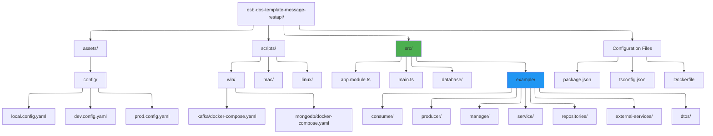
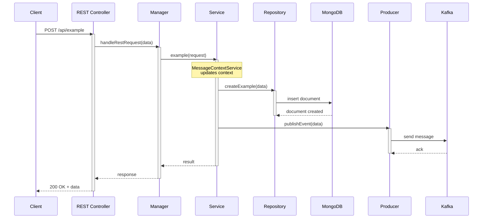
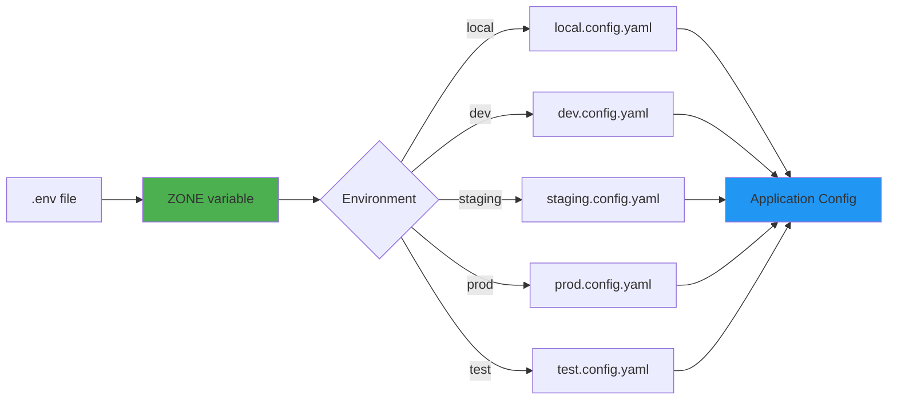

# Module 2: Getting Started with EQXJS Template

## 📚 Learning Objectives

By the end of this module, you will:

- Set up your development environment
- Install and configure the EQXJS Template
- Understand the project structure
- Run the application locally with Kafka and MongoDB
- Make your first code changes
- Understand configuration management

---

## 2.1 Environment Setup

### Prerequisites

Before starting, ensure you have the following installed:

#### Required Software

| Software           | Version | Purpose              | Download                                               |
| ------------------ | ------- | -------------------- | ------------------------------------------------------ |
| **Node.js**        | >= 18.x | Runtime environment  | [nodejs.org](https://nodejs.org)                       |
| **npm**            | >= 9.x  | Package manager      | Included with Node.js                                  |
| **Git**            | Latest  | Version control      | [git-scm.com](https://git-scm.com)                     |
| **Docker**         | Latest  | Local infrastructure | [docker.com](https://docker.com)                       |
| **Docker Compose** | Latest  | Multi-container apps | Included with Docker Desktop                           |
| **VS Code**        | Latest  | IDE (recommended)    | [code.visualstudio.com](https://code.visualstudio.com) |

#### Verify Installation

```bash
# Check Node.js version
node --version
# Output: v18.x.x or higher

# Check npm version
npm --version
# Output: 9.x.x or higher

# Check Docker version
docker --version
# Output: Docker version 24.x.x or higher

# Check Docker Compose
docker compose version
# Output: Docker Compose version v2.x.x or higher
```

### Recommended VS Code Extensions

Install these extensions for the best development experience:

```bash
# Essential extensions
- ESLint
- Prettier - Code formatter
- TypeScript and JavaScript Language Features
- Docker
- YAML
- GitLens

# Optional but helpful
- MongoDB for VS Code
- Kafka
- Thunder Client (API testing)
- Error Lens
```

---

## 2.2 Template Installation

### Step 1: Clone the Template

```bash
# Clone the repository
git clone <repository-url> my-service
cd my-service

# Or copy from template repository
cp -r esb-dos-template-message-restapi my-service
cd my-service
```

### Step 2: Install Dependencies

```bash
# Install npm packages
npm install

# This will install:
# - @eqxjs/stub (framework core)
# - @eqxjs/custom-kafka-server (Kafka integration)
# - NestJS dependencies
# - TypeScript and build tools
# - Testing libraries
```

### Step 3: Initial Configuration

1. **Set up environment variables**

Create a `.env` file in the root directory:

```bash
# .env
ZONE=local
BROKERS=localhost:9092
API_KEY=your-api-key
API_SECRET=your-api-secret
```

2. **Update configuration files**

Navigate to `assets/config/` and review the configuration files:

```bash
assets/config/
├── local.config.yaml     # Local development
├── dev.config.yaml       # Development environment
├── staging.config.yaml   # Staging environment
├── prod.config.yaml      # Production environment
└── test.config.yaml      # Testing environment
```

**Example: local.config.yaml**

```yaml
app:
  component-name: "my-service"
  port: 3080

kafka:
  client:
    client-id: "my-service-client"
    ssl: false
    request-timeout: 30000
    enforce-request-timeout: true
    initial-retry-time: 300
    retries: 8
    connection-timeout: 30000

  consumer:
    group-id: "my-service-consumer-group"
    allow-auto-topic-creation: false

topics:
  consume:
    topic-example: "example.topic.v1"

  produce:
    topic-example: "output.topic.v1"

mongodb:
  uri: "mongodb://localhost:27017"
  database: "my-service-db"
```

---

## 2.3 Project Structure Deep Dive

### Directory Layout

### Key Files and Directories

#### Root Level Configuration

**package.json**

```json
{
  "name": "user-domain-service",
  "version": "0.0.1",
  "scripts": {
    "start:local": "env-cmd nest start --watch",
    "build": "nest build",
    "test": "export ZONE=test && jest",
    "test:cov": "export ZONE=test && jest --coverage"
  },
  "dependencies": {
    "@eqxjs/stub": "2.4.0",
    "@eqxjs/custom-kafka-server": "^1.2.3",
    "@nestjs/common": "^10.3.10",
    "@nestjs/core": "^10.3.10",
    "mongodb": "^6.2.0",
    "kafkajs": "^2.2.3"
  }
}
```

**tsconfig.json** - TypeScript configuration
**nest-cli.json** - NestJS CLI configuration
**Dockerfile** - Container image definition

#### Source Directory (`src/`)

**main.ts** - Application bootstrap

```typescript
import { NestFactory } from "@nestjs/core";
import { AppModule } from "./app.module";
import { CustomServerKafka } from "@eqxjs/custom-kafka-server";
import { setupGracefulShutdown } from "@eqxjs/stub";

async function bootstrap() {
  // Create NestJS application
  const app = await NestFactory.create(AppModule);

  // Connect Kafka microservice
  app.connectMicroservice<MicroserviceOptions>({
    strategy: new CustomServerKafka({
      client: {
        /* config */
      },
      consumer: {
        /* config */
      },
    }),
  });

  // Start services
  await app.startAllMicroservices();
  await app.listen(3080);

  // Setup graceful shutdown
  setupGracefulShutdown({ app });
}

bootstrap();
```

**app.module.ts** - Root module

```typescript
import { Module } from "@nestjs/common";
import { FrameworkModule } from "@eqxjs/stub";
import { ExamplesModule } from "./example/examples.module";

@Module({
  imports: [
    ExamplesModule,
    FrameworkModule.register({
      configPath: join(process.cwd(), "assets", "config"),
      zone: process.env.ZONE,
    }),
  ],
})
export class AppModule {}
```

#### Example Module Structure

```
example/
├── examples.module.ts          # Module definition
├── consumer/                   # Event consumers
│   ├── event.consumer.controller.ts
│   └── rest.controller.ts
├── producer/                   # Event producers
│   └── event.producer.service.ts
├── manager/                    # Business orchestration
│   ├── example-manager.ts
│   └── example-manager-rest.ts
├── service/                    # Business logic
│   ├── example.service.ts
│   ├── example.service.spec.ts
│   └── example.service.spec.helper.ts
├── repositories/               # Data access
│   ├── implements/
│   │   ├── example.mongo.repository.ts
│   │   └── example.mongo.repository.spec.ts
│   └── interfaces/
│       └── example.mongo.repository.interface.ts
├── external-services/          # External API clients
│   ├── example-api.service.ts
│   └── example-api.service.spec.ts
├── dtos/                       # Data Transfer Objects
│   ├── consumer/
│   ├── producer/
│   └── multiple-producer/
└── utils/                      # Utility functions
    └── utils-consume-produce.ts
```

---

## 2.4 Running the Application

### Step 1: Start Infrastructure Services

#### Option A: Using Docker Compose (Recommended)

**For Windows:**

```bash
# Start Kafka
cd scripts/win/docker-compose/kafka
docker compose up -d

# Start MongoDB
cd ../mongodb
docker compose up -d

# Verify services are running
docker ps
```

**For Mac:**

```bash
# Start Kafka
cd scripts/mac/kafka
docker compose up -d

# Start MongoDB
cd ../mongodb
docker compose up -d

# Verify services are running
docker ps
```

#### Option B: Using Existing Infrastructure

Update `.env` file with your infrastructure endpoints:

```bash
ZONE=dev
BROKERS=your-kafka-broker:9092
MONGODB_URI=mongodb://your-mongodb:27017
```

### Step 2: Start the Application

```bash
# Development mode with hot-reload
npm run start:local

# You should see:
# [Nest] 12345  - 02/13/2026, 10:00:00 AM     LOG [NestFactory] Starting Nest application...
# [Nest] 12345  - 02/13/2026, 10:00:00 AM     LOG [InstanceLoader] AppModule dependencies initialized
# [Nest] 12345  - 02/13/2026, 10:00:00 AM     LOG [InstanceLoader] FrameworkModule dependencies initialized
# [Nest] 12345  - 02/13/2026, 10:00:00 AM     LOG [KafkaServer] Kafka client connected
# [Nest] 12345  - 02/13/2026, 10:00:00 AM     LOG [NestApplication] Nest application successfully started
# Application is running on: http://localhost:3080
```

### Step 3: Test the Application

#### Test REST Endpoint

```bash
# Using curl
curl -X POST http://localhost:3080/api/example \
  -H "Content-Type: application/json" \
  -d '{"name": "Test", "value": "Hello World"}'

# Using Thunder Client (VS Code) or Postman
POST http://localhost:3080/api/example
Content-Type: application/json

{
  "name": "Test",
  "value": "Hello World"
}
```

#### Expected Response

```json
{
  "header": {
    "identity": {
      "correlationId": "abc123-def456-ghi789",
      "session": "session-xyz",
      "device": null
    },
    "timestamp": "2026-02-13T10:00:00.000Z",
    "source": "my-service"
  },
  "body": {
    "name": "Test",
    "value": "Hello World",
    "id": "507f1f77bcf86cd799439011"
  }
}
```

### Application Flow Diagram



---

## 2.5 Configuration Management

### Configuration Hierarchy

EQXJS Template uses environment-based configuration with YAML files.



### Configuration Structure

**Example: local.config.yaml**

```yaml
# Application Configuration
app:
  component-name: "user-service"
  port: 3080
  version: "1.0.0"

# Kafka Configuration
kafka:
  client:
    client-id: "user-service-client"
    ssl: false
    request-timeout: 30000
    enforce-request-timeout: true
    initial-retry-time: 300
    retries: 8
    connection-timeout: 30000

  consumer:
    group-id: "user-service-consumer-group"
    allow-auto-topic-creation: false
    session-timeout: 30000
    heartbeat-interval: 3000

# Topics Configuration
topics:
  consume:
    user-created: "user.created.v1"
    user-updated: "user.updated.v1"

  produce:
    user-processed: "user.processed.v1"
    notification-trigger: "notification.trigger.v1"

# MongoDB Configuration
mongodb:
  uri: "mongodb://localhost:27017"
  database: "user-service-db"
  options:
    maxPoolSize: 10
    minPoolSize: 2
    connectTimeoutMS: 10000
    socketTimeoutMS: 45000

# External Services
external-services:
  auth-service:
    base-url: "http://localhost:3001"
    timeout: 5000

  notification-service:
    base-url: "http://localhost:3002"
    timeout: 3000

# Logging
logging:
  level: "debug"
  format: "json"

# Feature Flags
features:
  enable-cache: true
  enable-retry: true
  max-retry-attempts: 3
```

### Accessing Configuration in Code

```typescript
import { ConfigService } from "@eqxjs/stub";

@Injectable()
export class MyService {
  private appName: string;
  private kafkaTopics: any;

  constructor(private configService: ConfigService) {
    // Get simple value
    this.appName = this.configService.get<string>("app.component-name");

    // Get nested object
    this.kafkaTopics = this.configService.get("topics.produce");

    // Get with default value
    const port = this.configService.get<number>("app.port", 3000);
  }
}
```

### Environment-Specific Settings

| Environment | Purpose            | Configuration                           |
| ----------- | ------------------ | --------------------------------------- |
| **local**   | Developer machine  | Local Kafka/MongoDB, debug logging      |
| **dev**     | Development server | Shared dev infrastructure, verbose logs |
| **staging** | Pre-production     | Production-like, synthetic data         |
| **prod**    | Production         | Optimized, minimal logging, real data   |
| **test**    | Automated testing  | In-memory/mock services                 |

---

## 2.6 Making Your First Code Change

Let's create a simple endpoint to understand the template structure.

### Exercise: Create a "Hello World" Endpoint

#### Step 1: Create a New Controller Method

Edit `src/example/consumer/rest.controller.ts`:

```typescript
import { Controller, Get, UseInterceptors } from "@nestjs/common";
import { AppInterceptor } from "@eqxjs/stub";
import { ExampleManagerRest } from "../manager/example-manager-rest";

@Controller("api")
@UseInterceptors(AppInterceptor)
export class RestController {
  constructor(private manager: ExampleManagerRest) {}

  // ADD THIS NEW METHOD
  @Get("hello")
  async getHello() {
    return {
      message: "Hello from EQXJS Template!",
      timestamp: new Date().toISOString(),
      service: "my-service",
    };
  }

  // Existing methods...
}
```

#### Step 2: Restart the Application

```bash
# The app should auto-reload if using start:local
# If not, restart manually:
npm run start:local
```

#### Step 3: Test Your New Endpoint

```bash
curl http://localhost:3080/api/hello

# Expected response:
{
  "message": "Hello from EQXJS Template!",
  "timestamp": "2026-02-13T10:00:00.000Z",
  "service": "my-service"
}
```

### Exercise: Add Logging

Add logging to your endpoint:

```typescript
import { Controller, Get, UseInterceptors } from "@nestjs/common";
import { AppInterceptor, CustomLoggerService, LoggerAction } from "@eqxjs/stub";
import { ExampleManagerRest } from "../manager/example-manager-rest";

@Controller("api")
@UseInterceptors(AppInterceptor)
export class RestController {
  constructor(
    private manager: ExampleManagerRest,
    private logger: CustomLoggerService, // Inject logger
  ) {}

  @Get("hello")
  async getHello() {
    // Log the request
    this.logger.info(LoggerAction.PROCESSING("Processing hello request"), {
      endpoint: "/api/hello",
    });

    const response = {
      message: "Hello from EQXJS Template!",
      timestamp: new Date().toISOString(),
      service: "my-service",
    };

    // Log the response
    this.logger.info(
      LoggerAction.PROCESSED("Hello request processed successfully"),
      response,
    );

    return response;
  }
}
```

Check your console for structured logs:

```json
{
  "level": "info",
  "action": "PROCESSING",
  "message": "Processing hello request",
  "context": {
    "endpoint": "/api/hello"
  },
  "correlationId": "abc-123",
  "timestamp": "2026-02-13T10:00:00.000Z"
}
```

---

## 2.7 Common Development Commands

```bash
# Development
npm run start:local          # Start with hot-reload
npm run build                # Build for production
npm run start                # Start production build

# Testing
npm run test                 # Run unit tests
npm run test:watch           # Run tests in watch mode
npm run test:cov             # Run tests with coverage
npm run test:e2e             # Run end-to-end tests

# Code Quality
npm run lint                 # Lint TypeScript files
npm run format               # Format code with Prettier

# Docker
docker compose up -d         # Start infrastructure
docker compose down          # Stop infrastructure
docker compose logs -f       # View logs
```

---

## 2.8 Troubleshooting

### Common Issues

#### 1. Kafka Connection Error

**Error:**

```
KafkaJSConnectionError: Failed to connect to broker
```

**Solution:**

```bash
# Check if Kafka is running
docker ps | grep kafka

# If not running, start Kafka
cd scripts/win/docker-compose/kafka  # or mac/linux
docker compose up -d

# Check Kafka logs
docker compose logs -f
```

#### 2. MongoDB Connection Error

**Error:**

```
MongoNetworkError: failed to connect to server
```

**Solution:**

```bash
# Check if MongoDB is running
docker ps | grep mongo

# Start MongoDB
cd scripts/win/docker-compose/mongodb
docker compose up -d

# Verify connection
docker exec -it <mongo-container-name> mongosh
```

#### 3. Port Already in Use

**Error:**

```
Error: listen EADDRINUSE: address already in use :::3080
```

**Solution:**

```bash
# Find process using port 3080
# Windows:
netstat -ano | findstr :3080

# Mac/Linux:
lsof -i :3080

# Kill the process or change port in config
```

#### 4. Module Not Found

**Error:**

```
Error: Cannot find module '@eqxjs/stub'
```

**Solution:**

```bash
# Reinstall dependencies
rm -rf node_modules package-lock.json
npm install
```

---

## 📝 Summary

In this module, you learned:

- ✅ How to set up the development environment
- ✅ How to install and configure the EQXJS Template
- ✅ Understanding of the project structure
- ✅ How to run the application with Kafka and MongoDB
- ✅ Configuration management with YAML files
- ✅ Making basic code changes
- ✅ Common development commands and troubleshooting

---

## 🎯 Next Steps

In [Module 3: Template Architecture Deep Dive](module-03-architecture.md), you will:

- Understand the layered architecture
- Learn about request/response flow
- Explore the Manager, Service, and Repository patterns
- Understand dependency injection in EQXJS

---

## 🏋️ Practice Exercises

See [Module 2 Exercises](exercise/module-02-exercises.md) for hands-on practice:

1. Create a new REST endpoint
2. Add custom configuration
3. Implement basic logging
4. Connect to MongoDB
5. Send a Kafka message

---

**[← Previous: Module 1](module-01-introduction.md)** | **[Back to Course Outline](course-outline.md)** | **[Next: Module 3 →](module-03-architecture.md)**
