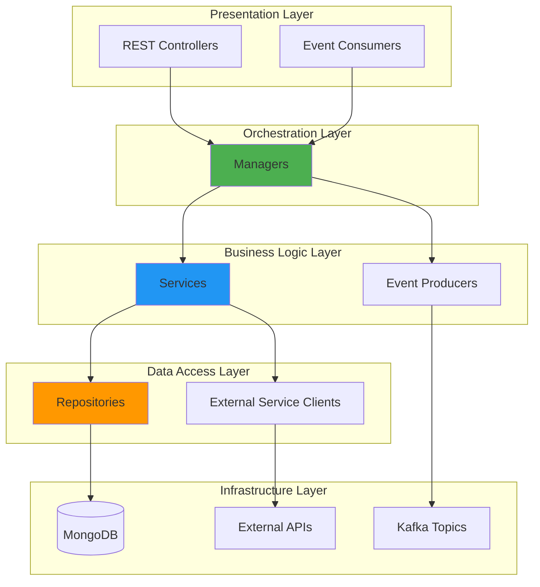
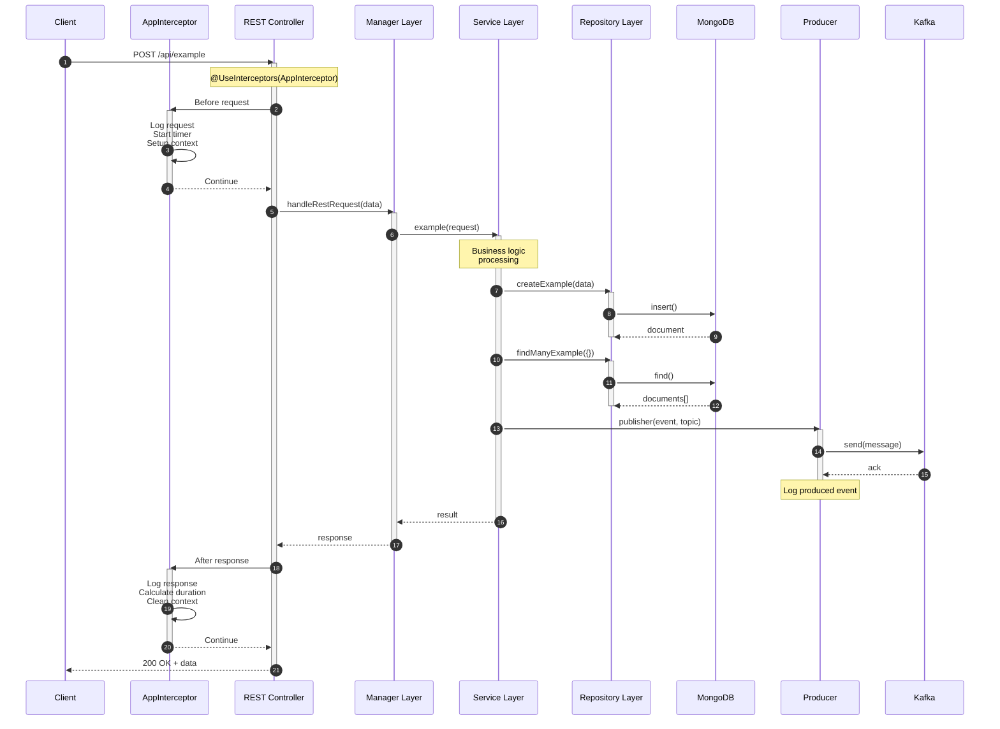
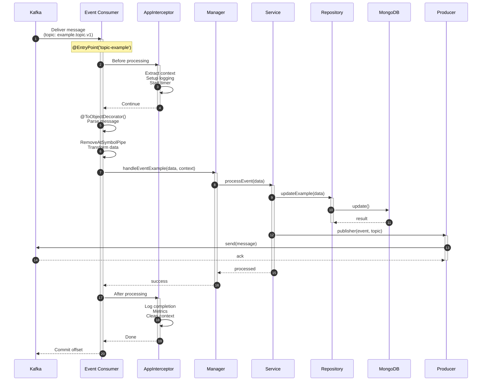
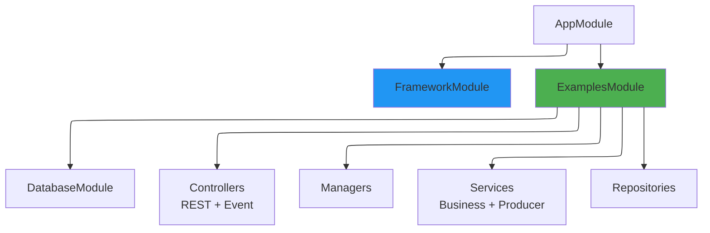
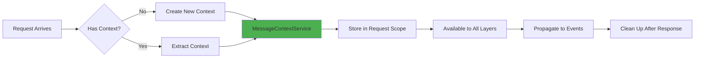
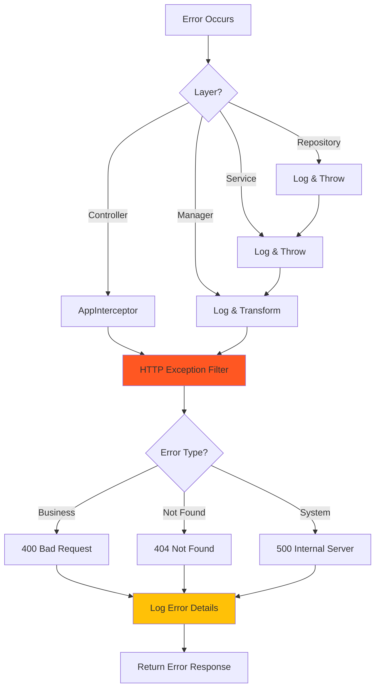

# Module 3: Template Architecture Deep Dive

## 📚 Learning Objectives

By the end of this module, you will:

- Understand the layered architecture pattern used in EQXJS Template
- Master the request/response flow for both REST and events
- Learn the Manager, Service, and Repository patterns
- Understand dependency injection and module organization
- Know when to use each layer appropriately

---

## 3.1 Architecture Overview

### Layered Architecture Pattern

The EQXJS Template follows a **layered architecture** that promotes separation of concerns, testability, and maintainability.



### Layer Responsibilities

| Layer              | Purpose                         | Examples                                      |
| ------------------ | ------------------------------- | --------------------------------------------- |
| **Presentation**   | Handle incoming requests/events | `RestController`, `EventConsumerController`   |
| **Orchestration**  | Coordinate business operations  | `ExampleManager`, `ExampleManagerRest`        |
| **Business Logic** | Implement business rules        | `ExampleService`, `EventProducerService`      |
| **Data Access**    | Abstract data operations        | `ExampleMongoRepository`, `ExampleApiService` |
| **Infrastructure** | External systems                | MongoDB, Kafka, External APIs                 |

---

## 3.2 Request Flow Diagrams

### REST API Request Flow



### Kafka Event Consumption Flow



---

## 3.3 Core Architectural Patterns

### 3.3.1 Manager Pattern

**Purpose:** Orchestrate complex business operations that involve multiple services or transactions.

**When to Use:**

- Multiple service calls needed
- Transaction coordination required
- Complex business workflows
- Need to aggregate data from multiple sources

**Example:**

```typescript
import { Injectable } from "@nestjs/common";
import { ExampleService } from "../service/example.service";
import { EventProducerService } from "../producer/event.producer.service";
import { CustomLoggerService, MessageContextService } from "@eqxjs/stub";

@Injectable()
export class ExampleManager {
  constructor(
    private exampleService: ExampleService,
    private producerService: EventProducerService,
    private messageContext: MessageContextService,
    private logger: CustomLoggerService,
  ) {}

  async handleEventExample(data: any, context: any) {
    try {
      // 1. Update message context
      this.messageContext.updateMessageProperties();

      // 2. Coordinate multiple operations
      const result = await this.exampleService.processData(data);

      // 3. Trigger follow-up events if needed
      if (result.shouldNotify) {
        await this.producerService.publisher(
          this.messageContext.cloneContextMessage(result),
          "notification.topic",
        );
      }

      // 4. Return orchestrated result
      return result;
    } catch (error) {
      this.logger.error("Error in handleEventExample", error);
      throw error;
    }
  }
}
```

### 3.3.2 Service Pattern

**Purpose:** Implement business logic and rules.

**When to Use:**

- Business logic implementation
- Data validation and transformation
- Coordinating repository calls
- Implementing domain rules

**Example:**

```typescript
import { Injectable } from "@nestjs/common";
import { ExampleMongoRepository } from "../repositories/implements/example.mongo.repository";
import { ConfigService, CustomLoggerService } from "@eqxjs/stub";

@Injectable()
export class ExampleService {
  constructor(
    private repository: ExampleMongoRepository,
    private logger: CustomLoggerService,
    private configService: ConfigService,
  ) {}

  async processData(data: any): Promise<any> {
    // 1. Validate business rules
    if (!this.validateBusinessRules(data)) {
      throw new Error("Business rule violation");
    }

    // 2. Transform data
    const transformed = this.transformData(data);

    // 3. Persist data
    const saved = await this.repository.createExample(transformed);

    // 4. Apply business logic
    const result = this.applyBusinessLogic(saved);

    return result;
  }

  private validateBusinessRules(data: any): boolean {
    // Business validation logic
    return true;
  }

  private transformData(data: any): any {
    // Data transformation logic
    return data;
  }

  private applyBusinessLogic(data: any): any {
    // Business logic
    return data;
  }
}
```

### 3.3.3 Repository Pattern

**Purpose:** Abstract data access operations.

**When to Use:**

- Database operations
- External service calls
- Data source abstraction
- Query building

**Example:**

```typescript
// Interface
export interface ExampleMongoRepositoryInterface {
  createExample(data: any): Promise<any>;
  findManyExample(filter: any): Promise<any[]>;
  findOneExample(id: string): Promise<any>;
  updateExample(id: string, data: any): Promise<any>;
  deleteExample(id: string): Promise<boolean>;
}

// Implementation
import { Injectable, Scope } from "@nestjs/common";
import { Db } from "mongodb";
import { InjectConnection } from "../../../database/database.module";

@Injectable({ scope: Scope.REQUEST })
export class ExampleMongoRepository implements ExampleMongoRepositoryInterface {
  private collection: any;

  constructor(@InjectConnection() private db: Db) {
    this.collection = this.db.collection("examples");
  }

  async createExample(data: any): Promise<any> {
    const result = await this.collection.insertOne({
      ...data,
      createdAt: new Date(),
      updatedAt: new Date(),
    });

    return {
      id: result.insertedId,
      ...data,
    };
  }

  async findManyExample(filter: any): Promise<any[]> {
    return await this.collection.find(filter).toArray();
  }

  async findOneExample(id: string): Promise<any> {
    return await this.collection.findOne({ _id: id });
  }

  async updateExample(id: string, data: any): Promise<any> {
    const result = await this.collection.findOneAndUpdate(
      { _id: id },
      { $set: { ...data, updatedAt: new Date() } },
      { returnDocument: "after" },
    );

    return result.value;
  }

  async deleteExample(id: string): Promise<boolean> {
    const result = await this.collection.deleteOne({ _id: id });
    return result.deletedCount > 0;
  }
}
```

### 3.3.4 DTO (Data Transfer Object) Pattern

**Purpose:** Define the shape of data transferred between layers.

**When to Use:**

- API request/response validation
- Kafka message structure
- Type safety across layers
- Documentation

**Example:**

```typescript
import { IsString, IsNotEmpty, IsOptional, IsNumber } from "class-validator";

export class TopicConsumerEvent {
  @IsNotEmpty()
  header: EventHeader;

  @IsNotEmpty()
  body: EventBody;
}

export class EventHeader {
  @IsNotEmpty()
  identity: Identity;

  @IsString()
  @IsNotEmpty()
  timestamp: string;

  @IsString()
  @IsNotEmpty()
  source: string;
}

export class Identity {
  @IsString()
  @IsNotEmpty()
  correlationId: string;

  @IsString()
  @IsNotEmpty()
  session: string;

  @IsString()
  @IsOptional()
  device?: string;
}

export class EventBody {
  @IsString()
  @IsNotEmpty()
  name: string;

  @IsString()
  @IsNotEmpty()
  value: string;

  @IsNumber()
  @IsOptional()
  quantity?: number;
}
```

---

## 3.4 Dependency Injection Strategy

### Module Organization



### examples.module.ts

```typescript
import { Module, Scope } from "@nestjs/common";
import { ConfigService } from "@nestjs/config";

// Controllers
import { EventConsumerController } from "./consumer/event.consumer.controller";
import { RestController } from "./consumer/rest.controller";

// Managers
import { ExampleManager } from "./manager/example-manager";
import { ExampleManagerRest } from "./manager/example-manager-rest";

// Services
import { EventProducerService } from "./producer/event.producer.service";
import { ExampleService } from "./service/example.service";

// External Services
import { ExampleApiService } from "./external-services/example-api.service";

// Repositories
import { ExampleMogoRepository } from "./repositories/implements/example.mongo.repository";

// Modules
import { DatabaseModule } from "src/database/database.module";

@Module({
  imports: [
    DatabaseModule, // Import database connectivity
  ],
  controllers: [EventConsumerController, RestController],
  providers: [
    // Managers
    ExampleManager,
    ExampleManagerRest,

    // Services
    EventProducerService,
    ExampleService,
    ExampleApiService,

    // Repositories (Request-scoped for context isolation)
    {
      provide: ExampleMogoRepository,
      scope: Scope.REQUEST,
      useClass: ExampleMogoRepository,
    },
  ],
})
export class ExamplesModule {}
```

### Dependency Injection Best Practices

#### 1. Constructor Injection (Recommended)

```typescript
@Injectable()
export class ExampleService {
  constructor(
    private repository: ExampleMongoRepository,
    private logger: CustomLoggerService,
    private messageContext: MessageContextService,
  ) {
    // Dependencies automatically injected
  }
}
```

#### 2. Request-Scoped Providers

Use for providers that need request-specific context:

```typescript
@Injectable({ scope: Scope.REQUEST })
export class ExampleMongoRepository {
  // New instance created for each request
  // Maintains request-specific state
}
```

#### 3. Circular Dependency Resolution

Use `@Inject(forwardRef())` when needed:

```typescript
import { Inject, forwardRef } from "@nestjs/common";

@Injectable()
export class ServiceA {
  constructor(
    @Inject(forwardRef(() => ServiceB))
    private serviceB: ServiceB,
  ) {}
}
```

---

## 3.5 Framework Integration Points

### 3.5.1 FrameworkModule Registration

The FrameworkModule provides core functionality:

```typescript
import { Module } from "@nestjs/common";
import { FrameworkModule } from "@eqxjs/stub";
import { join } from "path";

@Module({
  imports: [
    FrameworkModule.register({
      configPath: join(process.cwd(), "assets", "config"),
      zone: process.env.ZONE || "local",
    }),
  ],
})
export class AppModule {}
```

**What FrameworkModule Provides:**

- `ConfigService` - Configuration management
- `CustomLoggerService` - Advanced logging
- `MessageContextService` - Request correlation
- `AppInterceptor` - Request/response interceptor
- Custom decorators and pipes

### 3.5.2 Message Context Flow



**Usage:**

```typescript
@Injectable()
export class ExampleService {
  constructor(private messageContext: MessageContextService) {}

  async processData(data: any) {
    // Update context with additional metadata
    this.messageContext.updateMessageProperties();

    // Clone context for event publishing
    const event = this.messageContext.cloneContextMessage(data);

    // Delete context after processing
    this.messageContext.deleteContextMessage();

    return event;
  }
}
```

### 3.5.3 Logging Infrastructure

```typescript
import { CustomLoggerService, LoggerAction } from "@eqxjs/stub";

@Injectable()
export class ExampleService {
  constructor(private logger: CustomLoggerService) {}

  async processData(data: any) {
    // Log with action context
    this.logger.info(LoggerAction.PROCESSING("Processing user data"), {
      userId: data.id,
    });

    try {
      const result = await this.doWork(data);

      this.logger.info(
        LoggerAction.PROCESSED("Data processed successfully"),
        result,
      );

      return result;
    } catch (error) {
      this.logger.error(LoggerAction.FAILED("Processing failed"), error);
      throw error;
    }
  }
}
```

---

## 3.6 Error Handling Strategy

### Error Flow Architecture



### Implementation

```typescript
// In Service Layer
@Injectable()
export class ExampleService {
  async processData(data: any) {
    try {
      return await this.repository.save(data);
    } catch (error) {
      this.logger.error("Failed to process data", error);
      throw error; // Let upper layers handle
    }
  }
}

// In Manager Layer
@Injectable()
export class ExampleManager {
  async handleRequest(data: any) {
    try {
      return await this.service.processData(data);
    } catch (error) {
      // Transform error if needed
      throw new BadRequestException("Invalid data provided");
    }
  }
}

// AppInterceptor handles at Controller level
@UseInterceptors(AppInterceptor)
@Controller()
export class MyController {
  // Errors are automatically logged and transformed
}
```

---

## 📝 Summary

In this module, you learned:

- ✅ Layered architecture pattern with clear separation of concerns
- ✅ Request flow for REST APIs and Kafka events
- ✅ Manager, Service, and Repository patterns
- ✅ Dependency injection strategy and module organization
- ✅ Framework integration points
- ✅ Error handling architecture

---

## 🎯 Next Steps

In [Module 4: Controllers and Managers](module-04-controllers-managers.md), you will:

- Implement REST controllers
- Create Kafka event consumers
- Build manager orchestration logic
- Use decorators and pipes effectively

---

**[← Previous: Module 2](module-02-getting-started.md)** | **[Back to Course Outline](course-outline.md)** | **[Next: Module 4 →](module-04-controllers-managers.md)**
