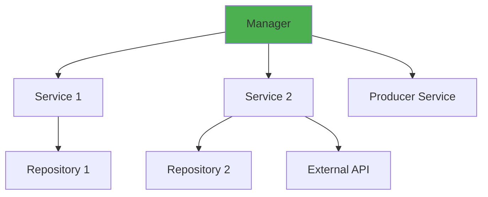

# Module 4: Controllers and Managers

## 📚 Learning Objectives

By the end of this module, you will:

- Implement REST API controllers with best practices
- Create Kafka event consumer controllers
- Build manager classes for business orchestration
- Use EQXJS decorators effectively
- Handle validation and transformation with pipes
- Understand interceptor usage

---

## 4.1 Event Consumer Controllers

### 4.1.1 Basic Event Consumer

Event consumers listen to Kafka topics and process incoming messages.

```typescript
import { Controller, UseInterceptors, UsePipes } from "@nestjs/common";
import { Ctx, KafkaContext } from "@nestjs/microservices";
import {
  AppInterceptor,
  EntryPoint,
  RemoveAtSymbolPipe,
  ToObjectDecorator,
} from "@eqxjs/stub";
import { ExampleManager } from "../manager/example-manager";
import { TopicConsumerEvent } from "../dtos/consumer/consumer.event";

@Controller()
@UseInterceptors(AppInterceptor) // Enable logging and context management
export class EventConsumerController {
  constructor(private manager: ExampleManager) {}

  @EntryPoint("topic-example") // Topic name from config
  @UsePipes(new RemoveAtSymbolPipe()) // Remove @ symbols from data
  async handleEventExample(
    @ToObjectDecorator() data: TopicConsumerEvent, // Parse and validate
    @Ctx() context: KafkaContext, // Kafka context
  ) {
    return await this.manager.handleEventExample(data, context);
  }
}
```

### 4.1.2 Understanding Event Consumer Decorators

#### `@EntryPoint(topicKey)`

Marks method as Kafka message handler and provides automatic logging.

```typescript
// Config file (local.config.yaml)
topics:
  consume:
    topic-example: "user.created.v1"
    topic-notification: "notification.send.v1"

// Usage in code
import { topicConsume } from '../utils/utils-consume-produce';

@EntryPoint(topicConsume.exampleTopic)  // References config key
async handleUserCreated(@ToObjectDecorator() data: UserCreatedEvent) {
  // Process event
}
```

#### `@ToObjectDecorator()`

Converts Kafka message buffer to JavaScript object.

```typescript
// Without decorator
async handleEvent(@Payload() payload: any) {
  const data = JSON.parse(payload.toString());  // Manual parsing
}

// With decorator
async handleEvent(@ToObjectDecorator() data: UserEvent) {
  // Automatically parsed and type-safe
}
```

#### `@UsePipes(new RemoveAtSymbolPipe())`

Removes `@` symbols that Kafka uses internally.

```typescript
// Kafka message might have:
{
  "@type": "UserCreated",
  "@timestamp": "2024-01-01",
  "userId": "123"
}

// After pipe:
{
  "userId": "123"  // @ fields removed
}
```

### 4.1.3 Multiple Event Consumers

Handle multiple topics in one controller:

```typescript
@Controller()
@UseInterceptors(AppInterceptor)
export class EventConsumerController {
  constructor(
    private userManager: UserManager,
    private orderManager: OrderManager,
  ) {}

  @EntryPoint(topicConsume.userCreated)
  @UsePipes(new RemoveAtSymbolPipe())
  async handleUserCreated(
    @ToObjectDecorator() data: UserCreatedEvent,
    @Ctx() context: KafkaContext,
  ) {
    return await this.userManager.handleUserCreated(data);
  }

  @EntryPoint(topicConsume.orderPlaced)
  @UsePipes(new RemoveAtSymbolPipe())
  async handleOrderPlaced(
    @ToObjectDecorator() data: OrderPlacedEvent,
    @Ctx() context: KafkaContext,
  ) {
    return await this.orderManager.handleOrderPlaced(data);
  }

  @EntryPoint(topicConsume.paymentProcessed)
  @UsePipes(new RemoveAtSymbolPipe())
  async handlePaymentProcessed(
    @ToObjectDecorator() data: PaymentProcessedEvent,
    @Ctx() context: KafkaContext,
  ) {
    return await this.orderManager.handlePaymentProcessed(data);
  }
}
```

### 4.1.4 Event Consumer with Error Handling

```typescript
import { CustomLoggerService, LoggerAction } from "@eqxjs/stub";

@Controller()
@UseInterceptors(AppInterceptor)
export class EventConsumerController {
  constructor(
    private manager: ExampleManager,
    private logger: CustomLoggerService,
  ) {}

  @EntryPoint(topicConsume.exampleTopic)
  @UsePipes(new RemoveAtSymbolPipe())
  async handleEventExample(
    @ToObjectDecorator() data: TopicConsumerEvent,
    @Ctx() context: KafkaContext,
  ) {
    try {
      const result = await this.manager.handleEventExample(data, context);

      this.logger.info(LoggerAction.PROCESSED("Event processed successfully"), {
        correlationId: data.header.identity.correlationId,
      });

      return result;
    } catch (error) {
      this.logger.error(LoggerAction.FAILED("Event processing failed"), {
        error: error.message,
        correlationId: data.header?.identity?.correlationId,
        topic: context.getTopic(),
        partition: context.getPartition(),
      });

      // Decide: throw to retry or handle gracefully
      throw error;
    }
  }
}
```

---

## 4.2 REST Controllers

### 4.2.1 Basic REST Controller

```typescript
import {
  Controller,
  Get,
  Post,
  Put,
  Delete,
  Body,
  Param,
  Query,
  UseInterceptors,
} from "@nestjs/common";
import { AppInterceptor } from "@eqxjs/stub";
import { ExampleManagerRest } from "../manager/example-manager-rest";
import { CreateExampleDto } from "../dtos/create-example.dto";

@Controller("api/examples")
@UseInterceptors(AppInterceptor)
export class RestController {
  constructor(private manager: ExampleManagerRest) {}

  @Get()
  async findAll(@Query() query: any) {
    return await this.manager.findAll(query);
  }

  @Get(":id")
  async findOne(@Param("id") id: string) {
    return await this.manager.findOne(id);
  }

  @Post()
  async create(@Body() data: CreateExampleDto) {
    return await this.manager.create(data);
  }

  @Put(":id")
  async update(@Param("id") id: string, @Body() data: CreateExampleDto) {
    return await this.manager.update(id, data);
  }

  @Delete(":id")
  async delete(@Param("id") id: string) {
    return await this.manager.delete(id);
  }
}
```

### 4.2.2 REST Controller with Validation

```typescript
import {
  Controller,
  Post,
  Body,
  UseInterceptors,
  UsePipes,
  ValidationPipe,
  HttpCode,
  HttpStatus,
} from "@nestjs/common";
import { AppInterceptor } from "@eqxjs/stub";

@Controller("api/users")
@UseInterceptors(AppInterceptor)
export class UserController {
  constructor(private manager: UserManager) {}

  @Post()
  @HttpCode(HttpStatus.CREATED)
  @UsePipes(
    new ValidationPipe({
      whitelist: true, // Strip unknown properties
      forbidNonWhitelisted: true, // Throw error on unknown props
      transform: true, // Transform to DTO instance
    }),
  )
  async createUser(@Body() data: CreateUserDto) {
    return await this.manager.createUser(data);
  }
}
```

### 4.2.3 REST Controller with Complex Request Handling

```typescript
import {
  Controller,
  Post,
  Body,
  Headers,
  Req,
  UseInterceptors,
} from "@nestjs/common";
import { Request } from "express";
import { AppInterceptor, CustomLoggerService, LoggerAction } from "@eqxjs/stub";

@Controller("api")
@UseInterceptors(AppInterceptor)
export class RestController {
  constructor(
    private manager: ExampleManagerRest,
    private logger: CustomLoggerService,
  ) {}

  @Post("process")
  async processRequest(
    @Body() body: any,
    @Headers() headers: any,
    @Req() request: Request,
  ) {
    // Log incoming request
    this.logger.info(LoggerAction.PROCESSING("Processing REST request"), {
      path: request.path,
      method: request.method,
      userAgent: headers["user-agent"],
      contentLength: headers["content-length"],
    });

    // Extract useful information
    const context = {
      ip: request.ip,
      headers: {
        correlationId: headers["x-correlation-id"],
        sessionId: headers["x-session-id"],
        authorization: headers["authorization"],
      },
      body,
    };

    // Delegate to manager
    const result = await this.manager.handleRestRequest(context);

    // Log response
    this.logger.info(LoggerAction.PROCESSED("Request processed successfully"), {
      resultId: result.id,
    });

    return result;
  }
}
```

### 4.2.4 Async Operations with Background Processing

```typescript
@Controller("api/orders")
@UseInterceptors(AppInterceptor)
export class OrderController {
  constructor(
    private orderManager: OrderManager,
    private logger: CustomLoggerService,
  ) {}

  @Post()
  @HttpCode(HttpStatus.ACCEPTED) // 202 Accepted
  async createOrder(@Body() orderData: CreateOrderDto) {
    // Validate immediately
    const validationResult = await this.orderManager.validateOrder(orderData);

    if (!validationResult.isValid) {
      throw new BadRequestException(validationResult.errors);
    }

    // Create order record
    const order = await this.orderManager.createOrderRecord(orderData);

    // Trigger async processing (fire and forget)
    this.orderManager.processOrderAsync(order).catch((error) => {
      this.logger.error(LoggerAction.FAILED("Async order processing failed"), {
        orderId: order.id,
        error: error.message,
      });
    });

    // Return immediately
    return {
      orderId: order.id,
      status: "processing",
      message: "Order is being processed",
    };
  }
}
```

---

## 4.3 Manager Layer

### 4.3.1 Manager Responsibilities

Managers orchestrate complex operations involving multiple services.



### 4.3.2 Example Manager for Events

```typescript
import { Injectable } from "@nestjs/common";
import { KafkaContext } from "@nestjs/microservices";
import {
  CustomLoggerService,
  MessageContextService,
  LoggerAction,
} from "@eqxjs/stub";
import { ExampleService } from "../service/example.service";
import { EventProducerService } from "../producer/event.producer.service";
import { TopicConsumerEvent } from "../dtos/consumer/consumer.event";

@Injectable()
export class ExampleManager {
  constructor(
    private exampleService: ExampleService,
    private producerService: EventProducerService,
    private messageContext: MessageContextService,
    private logger: CustomLoggerService,
  ) {}

  async handleEventExample(
    data: TopicConsumerEvent,
    context: KafkaContext,
  ): Promise<void> {
    // 1. Update message context
    this.messageContext.updateMessageProperties();

    // 2. Log event received
    this.logger.info(LoggerAction.PROCESSING("Processing example event"), {
      topic: context.getTopic(),
      partition: context.getPartition(),
      offset: context.getMessage().offset,
      correlationId: data.header.identity.correlationId,
    });

    // 3. Process business logic
    const result = await this.exampleService.processEvent(data);

    // 4. Trigger follow-up actions
    if (result.shouldNotify) {
      const event = this.messageContext.cloneContextMessage(result);
      await this.producerService.publisher(event, "notification.topic");
    }

    // 5. Clean up context
    this.messageContext.deleteContextMessage();

    this.logger.info(LoggerAction.PROCESSED("Event processed successfully"), {
      resultId: result.id,
    });
  }
}
```

### 4.3.3 Example Manager for REST

```typescript
import { Injectable, NotFoundException } from "@nestjs/common";
import { Request } from "express";
import {
  CustomLoggerService,
  MessageContextService,
  LoggerAction,
} from "@eqxjs/stub";
import { ExampleService } from "../service/example.service";

@Injectable()
export class ExampleManagerRest {
  constructor(
    private exampleService: ExampleService,
    private messageContext: MessageContextService,
    private logger: CustomLoggerService,
  ) {}

  async handleRestRequest(request: Request): Promise<any> {
    // 1. Update context
    this.messageContext.updateMessageProperties();

    // 2. Delegate to service
    const result = await this.exampleService.example(request);

    return result;
  }

  async findAll(query: any): Promise<any[]> {
    this.logger.info(LoggerAction.PROCESSING("Fetching all examples"), {
      query,
    });

    const results = await this.exampleService.findAll(query);

    this.logger.info(LoggerAction.PROCESSED("Examples fetched"), {
      count: results.length,
    });

    return results;
  }

  async findOne(id: string): Promise<any> {
    const result = await this.exampleService.findOne(id);

    if (!result) {
      throw new NotFoundException(`Example with id ${id} not found`);
    }

    return result;
  }

  async create(data: any): Promise<any> {
    this.messageContext.updateMessageProperties();

    const result = await this.exampleService.create(data);

    this.logger.info(LoggerAction.PROCESSED("Example created"), {
      id: result.id,
    });

    return result;
  }

  async update(id: string, data: any): Promise<any> {
    const existing = await this.findOne(id); // Throws if not found

    const result = await this.exampleService.update(id, data);

    this.logger.info(LoggerAction.PROCESSED("Example updated"), {
      id: result.id,
    });

    return result;
  }

  async delete(id: string): Promise<void> {
    const existing = await this.findOne(id); // Throws if not found

    await this.exampleService.delete(id);

    this.logger.info(LoggerAction.PROCESSED("Example deleted"), { id });
  }
}
```

### 4.3.4 Complex Manager with Transaction Coordination

```typescript
@Injectable()
export class OrderManager {
  constructor(
    private orderService: OrderService,
    private inventoryService: InventoryService,
    private paymentService: PaymentService,
    private producerService: EventProducerService,
    private messageContext: MessageContextService,
    private logger: CustomLoggerService,
  ) {}

  async createOrder(orderData: CreateOrderDto): Promise<Order> {
    this.messageContext.updateMessageProperties();

    try {
      // 1. Reserve inventory
      this.logger.info(LoggerAction.PROCESSING("Reserving inventory"), {
        items: orderData.items,
      });

      const reservation = await this.inventoryService.reserve(orderData.items);

      // 2. Process payment
      this.logger.info(LoggerAction.PROCESSING("Processing payment"), {
        amount: orderData.totalAmount,
      });

      const payment = await this.paymentService.processPayment({
        amount: orderData.totalAmount,
        paymentMethod: orderData.paymentMethod,
      });

      // 3. Create order
      const order = await this.orderService.createOrder({
        ...orderData,
        reservationId: reservation.id,
        paymentId: payment.id,
        status: "confirmed",
      });

      // 4. Publish order created event
      const event = this.messageContext.cloneContextMessage({
        orderId: order.id,
        customerId: orderData.customerId,
        items: orderData.items,
        totalAmount: orderData.totalAmount,
      });

      await this.producerService.publisher(event, "order.created.v1");

      this.logger.info(LoggerAction.PROCESSED("Order created successfully"), {
        orderId: order.id,
      });

      return order;
    } catch (error) {
      // Rollback on error
      this.logger.error(LoggerAction.FAILED("Order creation failed"), {
        error: error.message,
      });

      // Compensating transactions
      // (release inventory, refund payment, etc.)

      throw error;
    } finally {
      this.messageContext.deleteContextMessage();
    }
  }
}
```

---

## 4.4 Decorators and Pipes

### 4.4.1 Common EQXJS Decorators

#### `@EntryPoint(key: string)`

```typescript
@EntryPoint('USER_CREATE')
async createUser(@Body() data: CreateUserDto) {
  // Automatic logging with entry point name
  // LOG: [CONSUMING] Entry point: USER_CREATE
}
```

#### `@DisableConsumerLogging()`

Disable automatic logging for sensitive operations:

```typescript
@EntryPoint('PAYMENT_PROCESS')
@DisableConsumerLogging()  // Don't log payment details
async processPayment(@Body() data: PaymentDto) {
  // Manual selective logging
}
```

#### `@ConsumerMasking(fields: string[])`

Mask sensitive fields in logs:

```typescript
@EntryPoint('USER_CREATE')
@ConsumerMasking(['password', 'ssn', 'creditCard'])
async createUser(@Body() data: CreateUserDto) {
  // password, ssn, creditCard are masked in logs
}
```

#### `@SetMessageMode(mode: 'sync' | 'async')`

```typescript
@EntryPoint('ORDER_CREATE')
@SetMessageMode('sync')  // Wait for response
async createOrder(@Body() data: CreateOrderDto) {
  // Synchronous processing
}

@EntryPoint('NOTIFICATION_SEND')
@SetMessageMode('async')  // Fire and forget
async sendNotification(@Body() data: NotificationDto) {
  // Asynchronous processing
}
```

### 4.4.2 Standard NestJS Decorators

```typescript
import {
  Controller,
  Get,
  Post,
  Put,
  Delete,
  Patch,
  Body,
  Param,
  Query,
  Headers,
  Req,
  Res,
  HttpCode,
  HttpStatus,
  UseGuards,
  UseInterceptors,
  UsePipes,
} from "@nestjs/common";

@Controller("api/users")
export class UserController {
  @Get() // GET /api/users
  @HttpCode(HttpStatus.OK)
  async findAll(@Query("page") page: number) {}

  @Get(":id") // GET /api/users/:id
  async findOne(@Param("id") id: string) {}

  @Post() // POST /api/users
  @HttpCode(HttpStatus.CREATED)
  async create(@Body() data: CreateUserDto) {}

  @Put(":id") // PUT /api/users/:id
  async update(@Param("id") id: string, @Body() data: UpdateUserDto) {}

  @Delete(":id") // DELETE /api/users/:id
  @HttpCode(HttpStatus.NO_CONTENT)
  async delete(@Param("id") id: string) {}
}
```

### 4.4.3 Custom Decorator Example

Create your own decorators:

```typescript
// custom-decorators.ts
import { createParamDecorator, ExecutionContext } from '@nestjs/common';

export const CurrentUser = createParamDecorator(
  (data: unknown, ctx: ExecutionContext) => {
    const request = ctx.switchToHttp().getRequest();
    return request.user;
  },
);

export const CorrelationId = createParamDecorator(
  (data: unknown, ctx: ExecutionContext) => {
    const request = ctx.switchToHttp().getRequest();
    return request.headers['x-correlation-id'];
  },
);

// Usage
@Get('profile')
async getProfile(
  @CurrentUser() user: User,
  @CorrelationId() correlationId: string
) {
  return this.userService.getProfile(user.id, correlationId);
}
```

---

## 4.5 Validation and Transformation

### 4.5.1 DTO Validation

```typescript
import {
  IsString,
  IsNotEmpty,
  IsEmail,
  IsOptional,
  MinLength,
  MaxLength,
  IsNumber,
  Min,
  Max,
  Matches,
} from "class-validator";

export class CreateUserDto {
  @IsString()
  @IsNotEmpty()
  @MinLength(2)
  @MaxLength(50)
  firstName: string;

  @IsString()
  @IsNotEmpty()
  @MinLength(2)
  @MaxLength(50)
  lastName: string;

  @IsEmail()
  @IsNotEmpty()
  email: string;

  @IsString()
  @IsNotEmpty()
  @MinLength(8)
  @Matches(/^(?=.*[a-z])(?=.*[A-Z])(?=.*\d)/, {
    message: "Password must contain uppercase, lowercase, and number",
  })
  password: string;

  @IsNumber()
  @Min(18)
  @Max(120)
  @IsOptional()
  age?: number;
}
```

### 4.5.2 Custom Validation

```typescript
import {
  registerDecorator,
  ValidationOptions,
  ValidationArguments,
} from "class-validator";

export function IsValidPhoneNumber(validationOptions?: ValidationOptions) {
  return function (object: Object, propertyName: string) {
    registerDecorator({
      name: "isValidPhoneNumber",
      target: object.constructor,
      propertyName: propertyName,
      options: validationOptions,
      validator: {
        validate(value: any, args: ValidationArguments) {
          const phoneRegex = /^\+?[1-9]\d{1,14}$/;
          return typeof value === "string" && phoneRegex.test(value);
        },
        defaultMessage(args: ValidationArguments) {
          return `${args.property} must be a valid phone number`;
        },
      },
    });
  };
}

// Usage
export class CreateUserDto {
  @IsValidPhoneNumber()
  phoneNumber: string;
}
```

---

## 📝 Summary

In this module, you learned:

- ✅ How to create event consumer controllers for Kafka
- ✅ How to implement REST API controllers
- ✅ Manager pattern for orchestrating business operations
- ✅ Using EQXJS decorators (@EntryPoint, @ToObjectDecorator, etc.)
- ✅ Validation and transformation with DTOs and pipes
- ✅ Error handling in controllers and managers

---

## 🎯 Next Steps

In [Module 5: Services and Repositories](module-05-services-repositories.md), you will:

- Implement business logic in services
- Create repository abstractions
- Work with MongoDB
- Build external service clients

---

**[← Previous: Module 3](module-03-architecture.md)** | **[Back to Course Outline](course-outline.md)** | **[Next: Module 5 →](module-05-services-repositories.md)**
