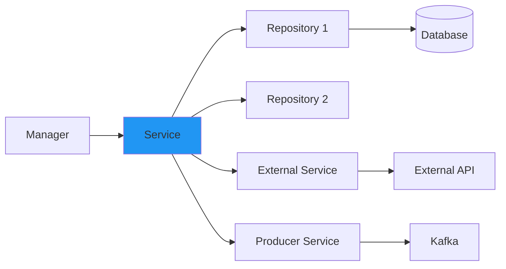

# Module 5: Services and Repositories

## 📚 Learning Objectives

By the end of this module, you will:

- Implement business logic in service classes
- Create repository abstractions with interfaces
- Work with MongoDB collections
- Build external API service clients
- Apply best practices for data access
- Understand dependency injection in repositories

---

## 5.1 Service Layer Design

### 5.1.1 Service Responsibilities

Services contain business logic and coordinate repository operations.



### 5.1.2 Basic Service Implementation

```typescript
import { Injectable } from "@nestjs/common";
import {
  ConfigService,
  CustomLoggerService,
  MessageContextService,
  LoggerAction,
} from "@eqxjs/stub";
import { ExampleMongoRepository } from "../repositories/implements/example.mongo.repository";
import { EventProducerService } from "../producer/event.producer.service";
import { ExampleApiService } from "../external-services/example-api.service";

@Injectable()
export class ExampleService {
  private produceTopic: string;

  constructor(
    private messageContextService: MessageContextService,
    private logger: CustomLoggerService,
    private exampleMongo: ExampleMongoRepository,
    private apiService: ExampleApiService,
    private eventProducerService: EventProducerService,
    private configService: ConfigService,
  ) {
    this.produceTopic = this.configService.get<string>(
      "topics.produce.topic-example",
    );
  }

  async example(request: any): Promise<any> {
    // 1. Update message context
    this.messageContextService.updateMessageProperties();

    // 2. Log operation start
    this.logger.info(LoggerAction.PROCESSING("Processing example request"), {
      requestId: request.id,
    });

    // 3. Call external API
    const dataApi = await this.apiService.getExample({});
    this.logger.info("External API response received", {
      count: dataApi?.length,
    });

    // 4. Query database
    const dataDb = await this.exampleMongo.findManyExample({});
    this.logger.info("Database query completed", {
      count: dataDb.length,
    });

    // 5. Create new record
    const dataInsert = await this.exampleMongo.createExample(request);

    // 6. Publish event
    const event = this.messageContextService.cloneContextMessage(dataDb);
    await this.eventProducerService.publisher(event, this.produceTopic);

    // 7. Return result
    return event;
  }
}
```

### 5.1.3 Service with Business Logic

```typescript
@Injectable()
export class UserService {
  constructor(
    private userRepository: UserMongoRepository,
    private logger: CustomLoggerService,
    private messageContext: MessageContextService,
  ) {}

  async createUser(userData: CreateUserDto): Promise<User> {
    // 1. Validate business rules
    await this.validateUserCreation(userData);

    // 2. Check if user exists
    const existingUser = await this.userRepository.findByEmail(userData.email);

    if (existingUser) {
      throw new ConflictException("User with this email already exists");
    }

    // 3. Hash password
    const hashedPassword = await this.hashPassword(userData.password);

    // 4. Create user
    const user = await this.userRepository.createUser({
      ...userData,
      password: hashedPassword,
      status: "active",
      createdAt: new Date(),
      updatedAt: new Date(),
    });

    // 5. Log user creation
    this.logger.info(LoggerAction.PROCESSED("User created successfully"), {
      userId: user.id,
      email: user.email,
    });

    // 6. Return user (without password)
    return this.sanitizeUser(user);
  }

  async updateUser(userId: string, updateData: UpdateUserDto): Promise<User> {
    // 1. Check if user exists
    const user = await this.userRepository.findById(userId);

    if (!user) {
      throw new NotFoundException(`User ${userId} not found`);
    }

    // 2. Validate update
    await this.validateUserUpdate(user, updateData);

    // 3. Apply business rules
    const dataToUpdate = this.applyUpdateRules(user, updateData);

    // 4. Update user
    const updatedUser = await this.userRepository.updateUser(
      userId,
      dataToUpdate,
    );

    // 5. Log update
    this.logger.info(LoggerAction.PROCESSED("User updated"), {
      userId: updatedUser.id,
    });

    return this.sanitizeUser(updatedUser);
  }

  private async validateUserCreation(userData: CreateUserDto): Promise<void> {
    // Business validation logic
    if (userData.age < 18) {
      throw new BadRequestException("User must be at least 18 years old");
    }

    // Additional validations...
  }

  private async validateUserUpdate(
    user: User,
    updateData: UpdateUserDto,
  ): Promise<void> {
    // Validation logic
    if (updateData.email && updateData.email !== user.email) {
      const emailTaken = await this.userRepository.findByEmail(
        updateData.email,
      );

      if (emailTaken) {
        throw new ConflictException("Email already in use");
      }
    }
  }

  private applyUpdateRules(
    user: User,
    updateData: UpdateUserDto,
  ): Partial<User> {
    return {
      ...updateData,
      updatedAt: new Date(),
      // Add business logic rules here
    };
  }

  private async hashPassword(password: string): Promise<string> {
    // Password hashing logic
    return password; // Implement actual hashing
  }

  private sanitizeUser(user: User): User {
    const { password, ...sanitized } = user;
    return sanitized as User;
  }
}
```

### 5.1.4 Service with Complex Business Operations

```typescript
@Injectable()
export class OrderService {
  constructor(
    private orderRepository: OrderRepository,
    private inventoryRepository: InventoryRepository,
    private logger: CustomLoggerService,
    private configService: ConfigService,
  ) {}

  async processOrder(orderData: CreateOrderDto): Promise<Order> {
    // 1. Validate order
    this.validateOrder(orderData);

    // 2. Check inventory availability
    const inventoryCheck = await this.checkInventory(orderData.items);

    if (!inventoryCheck.available) {
      throw new BadRequestException(
        `Insufficient inventory for items: ${inventoryCheck.unavailableItems.join(", ")}`,
      );
    }

    // 3. Calculate totals
    const totals = this.calculateOrderTotals(orderData.items);

    // 4. Apply discounts
    const finalAmount = this.applyDiscounts(
      totals.subtotal,
      orderData.discountCode,
    );

    // 5. Create order
    const order = await this.orderRepository.createOrder({
      ...orderData,
      subtotal: totals.subtotal,
      tax: totals.tax,
      shipping: totals.shipping,
      total: finalAmount,
      status: "pending",
      createdAt: new Date(),
    });

    // 6. Reserve inventory
    await this.reserveInventory(order.id, orderData.items);

    this.logger.info(LoggerAction.PROCESSED("Order processed"), {
      orderId: order.id,
      total: finalAmount,
    });

    return order;
  }

  private validateOrder(orderData: CreateOrderDto): void {
    if (!orderData.items || orderData.items.length === 0) {
      throw new BadRequestException("Order must contain at least one item");
    }

    const maxItems = this.configService.get<number>("order.maxItems", 50);

    if (orderData.items.length > maxItems) {
      throw new BadRequestException(`Order cannot exceed ${maxItems} items`);
    }
  }

  private async checkInventory(
    items: OrderItem[],
  ): Promise<InventoryCheckResult> {
    const unavailableItems: string[] = [];

    for (const item of items) {
      const inventory = await this.inventoryRepository.findByProductId(
        item.productId,
      );

      if (!inventory || inventory.quantity < item.quantity) {
        unavailableItems.push(item.productId);
      }
    }

    return {
      available: unavailableItems.length === 0,
      unavailableItems,
    };
  }

  private calculateOrderTotals(items: OrderItem[]): OrderTotals {
    const subtotal = items.reduce(
      (sum, item) => sum + item.price * item.quantity,
      0,
    );

    const taxRate = this.configService.get<number>("order.taxRate", 0.08);
    const tax = subtotal * taxRate;

    const shipping = this.calculateShipping(subtotal);

    return { subtotal, tax, shipping };
  }

  private calculateShipping(subtotal: number): number {
    const freeShippingThreshold = this.configService.get<number>(
      "order.freeShippingThreshold",
      100,
    );

    if (subtotal >= freeShippingThreshold) {
      return 0;
    }

    return this.configService.get<number>("order.shippingCost", 10);
  }

  private applyDiscounts(amount: number, discountCode?: string): number {
    if (!discountCode) {
      return amount;
    }

    // Apply discount logic
    // This would typically query a discounts table
    const discountRate = 0.1; // 10% discount

    return amount * (1 - discountRate);
  }

  private async reserveInventory(
    orderId: string,
    items: OrderItem[],
  ): Promise<void> {
    for (const item of items) {
      await this.inventoryRepository.reserve(
        item.productId,
        item.quantity,
        orderId,
      );
    }
  }
}
```

---

## 5.2 Repository Pattern

### 5.2.1 Repository Interface

Define interfaces for data access abstraction:

```typescript
// interfaces/example.mongo.repository.interface.ts
export interface ExampleMongoRepositoryInterface {
  createExample(data: any): Promise<any>;
  findManyExample(filter: any): Promise<any[]>;
  findOneExample(id: string): Promise<any | null>;
  updateExample(id: string, data: any): Promise<any>;
  deleteExample(id: string): Promise<boolean>;
}
```

### 5.2.2 MongoDB Repository Implementation

```typescript
// implements/example.mongo.repository.ts
import { Injectable, Scope } from "@nestjs/common";
import { Db, ObjectId } from "mongodb";
import { InjectConnection } from "../../../database/database.module";
import { ExampleMongoRepositoryInterface } from "../interfaces/example.mongo.repository.interface";
import { CustomLoggerService, LoggerAction } from "@eqxjs/stub";

@Injectable({ scope: Scope.REQUEST })
export class ExampleMongoRepository implements ExampleMongoRepositoryInterface {
  private collection: any;
  private readonly collectionName = "examples";

  constructor(
    @InjectConnection() private db: Db,
    private logger: CustomLoggerService,
  ) {
    this.collection = this.db.collection(this.collectionName);
  }

  async createExample(data: any): Promise<any> {
    try {
      const document = {
        ...data,
        createdAt: new Date(),
        updatedAt: new Date(),
      };

      const result = await this.collection.insertOne(document);

      this.logger.info(LoggerAction.PROCESSED("Document created"), {
        id: result.insertedId,
        collection: this.collectionName,
      });

      return {
        id: result.insertedId.toString(),
        ...document,
      };
    } catch (error) {
      this.logger.error("Failed to create document", error);
      throw error;
    }
  }

  async findManyExample(filter: any): Promise<any[]> {
    try {
      const documents = await this.collection
        .find(filter)
        .sort({ createdAt: -1 })
        .toArray();

      this.logger.info(LoggerAction.PROCESSED("Documents found"), {
        count: documents.length,
        filter,
      });

      return documents.map((doc) => ({
        ...doc,
        id: doc._id.toString(),
      }));
    } catch (error) {
      this.logger.error("Failed to find documents", error);
      throw error;
    }
  }

  async findOneExample(id: string): Promise<any | null> {
    try {
      const document = await this.collection.findOne({
        _id: new ObjectId(id),
      });

      if (!document) {
        return null;
      }

      return {
        ...document,
        id: document._id.toString(),
      };
    } catch (error) {
      this.logger.error("Failed to find document", error);
      throw error;
    }
  }

  async updateExample(id: string, data: any): Promise<any> {
    try {
      const result = await this.collection.findOneAndUpdate(
        { _id: new ObjectId(id) },
        {
          $set: {
            ...data,
            updatedAt: new Date(),
          },
        },
        { returnDocument: "after" },
      );

      if (!result.value) {
        throw new Error(`Document with id ${id} not found`);
      }

      this.logger.info(LoggerAction.PROCESSED("Document updated"), { id });

      return {
        ...result.value,
        id: result.value._id.toString(),
      };
    } catch (error) {
      this.logger.error("Failed to update document", error);
      throw error;
    }
  }

  async deleteExample(id: string): Promise<boolean> {
    try {
      const result = await this.collection.deleteOne({
        _id: new ObjectId(id),
      });

      this.logger.info(LoggerAction.PROCESSED("Document deleted"), {
        id,
        deleted: result.deletedCount > 0,
      });

      return result.deletedCount > 0;
    } catch (error) {
      this.logger.error("Failed to delete document", error);
      throw error;
    }
  }
}
```

### 5.2.3 Advanced Repository Operations

```typescript
@Injectable({ scope: Scope.REQUEST })
export class UserMongoRepository implements UserRepositoryInterface {
  private collection: any;

  constructor(
    @InjectConnection() private db: Db,
    private logger: CustomLoggerService,
  ) {
    this.collection = this.db.collection("users");
  }

  // Pagination
  async findAllPaginated(
    page: number = 1,
    limit: number = 10,
    filter: any = {},
  ): Promise<PaginatedResult<User>> {
    const skip = (page - 1) * limit;

    const [documents, total] = await Promise.all([
      this.collection
        .find(filter)
        .skip(skip)
        .limit(limit)
        .sort({ createdAt: -1 })
        .toArray(),
      this.collection.countDocuments(filter),
    ]);

    return {
      data: documents.map(this.mapDocument),
      page,
      limit,
      total,
      totalPages: Math.ceil(total / limit),
    };
  }

  // Full-text search
  async searchUsers(searchTerm: string): Promise<User[]> {
    const documents = await this.collection
      .find({
        $text: { $search: searchTerm },
      })
      .project({ score: { $meta: "textScore" } })
      .sort({ score: { $meta: "textScore" } })
      .toArray();

    return documents.map(this.mapDocument);
  }

  // Aggregation
  async getUserStats(): Promise<UserStats> {
    const stats = await this.collection
      .aggregate([
        {
          $group: {
            _id: "$status",
            count: { $sum: 1 },
            avgAge: { $avg: "$age" },
          },
        },
        {
          $project: {
            status: "$_id",
            count: 1,
            avgAge: { $round: ["$avgAge", 2] },
          },
        },
      ])
      .toArray();

    return stats;
  }

  // Bulk operations
  async bulkUpdateUsers(
    updates: Array<{ id: string; data: Partial<User> }>,
  ): Promise<number> {
    const operations = updates.map(({ id, data }) => ({
      updateOne: {
        filter: { _id: new ObjectId(id) },
        update: { $set: { ...data, updatedAt: new Date() } },
      },
    }));

    const result = await this.collection.bulkWrite(operations);

    this.logger.info(LoggerAction.PROCESSED("Bulk update completed"), {
      modified: result.modifiedCount,
    });

    return result.modifiedCount;
  }

  // Transaction support
  async transferOwnership(
    fromUserId: string,
    toUserId: string,
    resourceId: string,
  ): Promise<void> {
    const session = this.db.client.startSession();

    try {
      await session.withTransaction(async () => {
        // Update from user
        await this.collection.updateOne(
          { _id: new ObjectId(fromUserId) },
          { $pull: { resources: resourceId } },
          { session },
        );

        // Update to user
        await this.collection.updateOne(
          { _id: new ObjectId(toUserId) },
          { $push: { resources: resourceId } },
          { session },
        );
      });

      this.logger.info(LoggerAction.PROCESSED("Ownership transferred"), {
        fromUserId,
        toUserId,
        resourceId,
      });
    } finally {
      await session.endSession();
    }
  }

  private mapDocument(doc: any): User {
    return {
      ...doc,
      id: doc._id.toString(),
      _id: undefined,
    };
  }
}
```

---

## 5.3 External Service Integration

### 5.3.1 HTTP Client Service

```typescript
import { Injectable } from "@nestjs/common";
import { HttpService } from "@nestjs/axios";
import { ConfigService, CustomLoggerService, LoggerAction } from "@eqxjs/stub";
import { firstValueFrom, timeout, retry } from "rxjs";

@Injectable()
export class ExampleApiService {
  private baseUrl: string;
  private timeoutMs: number;

  constructor(
    private httpService: HttpService,
    private logger: CustomLoggerService,
    private configService: ConfigService,
  ) {
    this.baseUrl = this.configService.get<string>(
      "external-services.example-api.base-url",
    );
    this.timeoutMs = this.configService.get<number>(
      "external-services.example-api.timeout",
      5000,
    );
  }

  async getExample(params: any): Promise<any> {
    const startTime = performance.now();

    try {
      this.logger.info(LoggerAction.PROCESSING("Calling external API"), {
        url: `${this.baseUrl}/examples`,
        params,
      });

      const response = await firstValueFrom(
        this.httpService
          .get(`${this.baseUrl}/examples`, { params })
          .pipe(timeout(this.timeoutMs), retry(3)),
      );

      const duration = performance.now() - startTime;

      this.logger.info(LoggerAction.PROCESSED("External API call successful"), {
        url: `${this.baseUrl}/examples`,
        statusCode: response.status,
        duration: `${duration.toFixed(2)}ms`,
      });

      return response.data;
    } catch (error) {
      const duration = performance.now() - startTime;

      this.logger.error(LoggerAction.FAILED("External API call failed"), {
        url: `${this.baseUrl}/examples`,
        error: error.message,
        duration: `${duration.toFixed(2)}ms`,
      });

      throw error;
    }
  }

  async createExample(data: any): Promise<any> {
    try {
      const response = await firstValueFrom(
        this.httpService
          .post(`${this.baseUrl}/examples`, data)
          .pipe(timeout(this.timeoutMs), retry(2)),
      );

      this.logger.info(
        LoggerAction.PROCESSED("Resource created via external API"),
        { id: response.data.id },
      );

      return response.data;
    } catch (error) {
      this.logger.error(LoggerAction.FAILED("Failed to create resource"), {
        error: error.message,
      });

      throw error;
    }
  }
}
```

### 5.3.2 Service with Authentication

```typescript
@Injectable()
export class AuthenticatedApiService {
  private accessToken: string;
  private tokenExpiry: Date;

  constructor(
    private httpService: HttpService,
    private logger: CustomLoggerService,
    private configService: ConfigService,
  ) {}

  private async getAccessToken(): Promise<string> {
    // Check if token is still valid
    if (this.accessToken && this.tokenExpiry > new Date()) {
      return this.accessToken;
    }

    // Get new token
    try {
      const response = await firstValueFrom(
        this.httpService.post(`${this.baseUrl}/auth/token`, {
          clientId: this.configService.get("api.clientId"),
          clientSecret: this.configService.get("api.clientSecret"),
        }),
      );

      this.accessToken = response.data.access_token;
      this.tokenExpiry = new Date(Date.now() + response.data.expires_in * 1000);

      return this.accessToken;
    } catch (error) {
      this.logger.error("Failed to get access token", error);
      throw error;
    }
  }

  async makeAuthenticatedRequest(
    method: string,
    endpoint: string,
    data?: any,
  ): Promise<any> {
    const token = await this.getAccessToken();

    const config = {
      headers: {
        Authorization: `Bearer ${token}`,
        "Content-Type": "application/json",
      },
    };

    try {
      const response = await firstValueFrom(
        this.httpService.request({
          method,
          url: `${this.baseUrl}${endpoint}`,
          data,
          ...config,
        }),
      );

      return response.data;
    } catch (error) {
      if (error.response?.status === 401) {
        // Token expired, retry with new token
        this.accessToken = null;
        return this.makeAuthenticatedRequest(method, endpoint, data);
      }

      throw error;
    }
  }
}
```

---

## 📝 Summary

In this module, you learned:

- ✅ Service layer design and responsibilities
- ✅ Implementing business logic in services
- ✅ Repository pattern with interfaces
- ✅ MongoDB repository implementation
- ✅ Advanced database operations (pagination, search, aggregation)
- ✅ External service integration with HTTP clients
- ✅ Authentication and error handling in service clients

---

## 🎯 Next Steps

In [Module 6: Event-Driven Architecture with Kafka](module-06-kafka-events.md), you will:

- Deep dive into Kafka integration
- Implement event producers
- Handle event consumers
- Manage message context
- Implement retry and error handling strategies

---

**[← Previous: Module 4](module-04-controllers-managers.md)** | **[Back to Course Outline](course-outline.md)** | **[Next: Module 6 →](module-06-kafka-events.md)**
