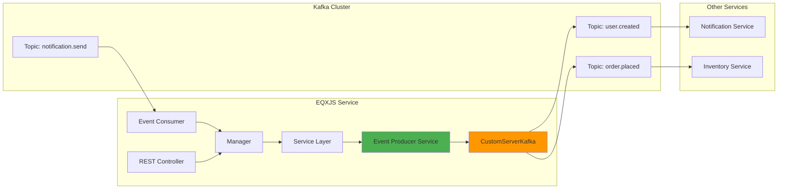
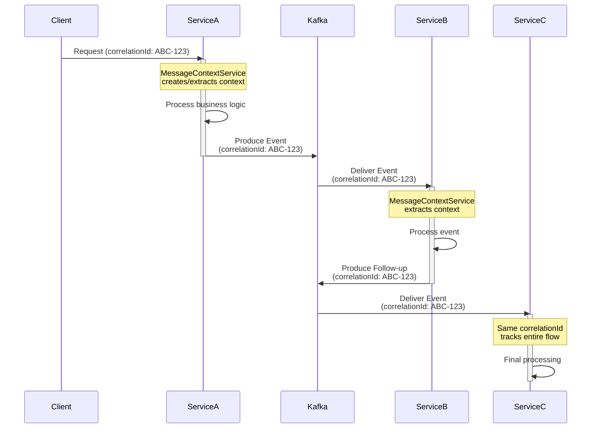

# Module 6: Event-Driven Architecture with Kafka

## 📚 Learning Objectives

By the end of this module, you will:

- Understand Kafka integration in EQXJS Template
- Implement event producers with best practices
- Handle event consumption with error handling
- Manage message context and correlation
- Implement retry and dead letter queue patterns
- Work with multiple producers
- Handle event versioning

---

## 6.1 Kafka Integration Overview

### 6.1.1 Architecture



### 6.1.2 CustomServerKafka Setup

The template uses `@eqxjs/custom-kafka-server` for enhanced Kafka integration.

```typescript
// src/main.ts
import { CustomServerKafka } from "@eqxjs/custom-kafka-server";
import { MicroserviceOptions } from "@nestjs/microservices";

async function bootstrap() {
  const app = await NestFactory.create(AppModule);

  // Connect Kafka microservice
  app.connectMicroservice<MicroserviceOptions>({
    strategy: new CustomServerKafka({
      client: {
        brokers: [process.env.BROKERS],
        clientId: config.kafka.client["client-id"],
        ssl: config.kafka.client["ssl"],
        sasl: process.env.ZONE !== "local" && {
          mechanism: "plain",
          username: process.env.API_KEY,
          password: process.env.API_SECRET,
        },
        requestTimeout: config.kafka.client["request-timeout"],
        enforceRequestTimeout: config.kafka.client["enforce-request-timeout"],
        retry: {
          initialRetryTime: config.kafka.client["initial-retry-time"],
          retries: config.kafka.client["retries"],
        },
        connectionTimeout: config.kafka.client["connection-timeout"],
      },
      consumer: {
        groupId: config.kafka.consumer["group-id"],
        allowAutoTopicCreation:
          config.kafka.consumer["allow-auto-topic-creation"],
        sessionTimeout: 30000,
        heartbeatInterval: 3000,
      },
    }),
  });

  await app.startAllMicroservices();
  await app.listen(3080);
}
```

---

## 6.2 Event Producers

### 6.2.1 Basic Event Producer Service

```typescript
import { Injectable } from "@nestjs/common";
import {
  ConfigService,
  CustomLoggerService,
  LoggerAction,
  MessageContextDto,
  MessageContextService,
  MaskingType,
} from "@eqxjs/stub";
import { CustomServerKafka } from "@eqxjs/custom-kafka-server";

@Injectable()
export class EventProducerService {
  private appName: string;

  constructor(
    private messageContextService: MessageContextService,
    private logger: CustomLoggerService,
    private configService: ConfigService,
  ) {
    this.appName = this.configService.get<string>("app.component-name");
  }

  /**
   * Publish event to Kafka topic
   */
  async publisher(data: MessageContextDto, topic: string): Promise<void> {
    // Log producing event
    this.logger.info(
      LoggerAction.PRODUCING(`producing event: (${this.appName}) -> ${topic}`),
      data,
    );

    // Publish with retry
    await this.produceWithRetry(topic, { value: data }, performance.now(), 0);
  }

  /**
   * Publish event with sensitive data masking
   */
  async publisherWithMasking(
    data: MessageContextDto,
    topic: string,
    maskingRules: Array<{ maskingField: string; maskingType: MaskingType }>,
  ): Promise<void> {
    // Log with masking
    this.logger.info(
      LoggerAction.PRODUCING(`producing event: (${this.appName}) -> ${topic}`),
      data,
      maskingRules,
    );

    await this.produceWithRetry(topic, { value: data }, performance.now(), 0);
  }

  /**
   * Send message to Kafka
   */
  private async emitMessage(topic: string, data: any): Promise<any> {
    return await new Promise(async (resolve, reject) => {
      const produceMessage = {
        topic,
        messages: [
          {
            key: data.key ? JSON.stringify(data.key) : undefined,
            value: JSON.stringify(data.value),
          },
        ],
      };

      try {
        const record =
          await CustomServerKafka.getProducer().send(produceMessage);
        resolve(record);
      } catch (error) {
        reject(error);
      }
    });
  }

  /**
   * Produce with automatic retry
   */
  private async produceWithRetry(
    topic: string,
    data: any,
    startTime: number,
    currentReProducceAttempts: number,
  ): Promise<void> {
    try {
      const emitResult = await this.emitMessage(topic, data);

      // Set dependency metadata
      this.logger.setDependencyMetadata({
        responseTime: performance.now() - startTime,
      });

      // Log success
      this.logger.info(
        LoggerAction.PRODUCED(`event response from kafka : ${topic}`),
        emitResult[0],
      );

      // Clean up context
      this.messageContextService.deleteContextMessage();
    } catch (error) {
      const maxRetries = +process.env.RETRYKAFKACOUNTMAX || 3;

      if (currentReProducceAttempts < maxRetries) {
        this.logger.warn(
          `Retry producing to ${topic}, attempt ${currentReProducceAttempts + 1}`,
          { error: error.message },
        );

        // Exponential backoff
        await this.delay(Math.pow(2, currentReProducceAttempts) * 1000);

        // Retry
        return this.produceWithRetry(
          topic,
          data,
          startTime,
          currentReProducceAttempts + 1,
        );
      }

      // Max retries reached
      this.logger.error(
        LoggerAction.FAILED(
          `Failed to produce to ${topic} after ${maxRetries} attempts`,
        ),
        { error: error.message, data },
      );

      // Clean up context
      this.messageContextService.deleteContextMessage();

      throw error;
    }
  }

  private delay(ms: number): Promise<void> {
    return new Promise((resolve) => setTimeout(resolve, ms));
  }
}
```

### 6.2.2 Multiple Producers Pattern

```typescript
import { Injectable } from '@nestjs/common';
import { MultipleProducer } from '../dtos/multiple-producer/multiple-producer.event';

@Injectable()
export class EventProducerService {
  // ... constructor and other methods

  /**
   * Publish to multiple topics in sequence
   */
  async multiplePublisher(data: MultipleProducer): Promise<void> {
    for (let i = 0; i < data.producersData.length; i++) {
      const producer = data.producersData[i];

      // Check if masking needed
      if (producer.topicName === 'payment.processed') {
        this.logger.info(
          LoggerAction.PRODUCING(
            `producing event: (${this.appName}) -> ${producer.topicName}`
          ),
          producer.data,
          [
            {
              maskingField: 'body.paymentMethod.cvv',
              maskingType: MaskingType.full
            },
            {
              maskingField: 'body.paymentMethod.cardNumber',
              maskingType: MaskingType.partial
            }
          ]
        );
      } else {
        this.logger.info(
          LoggerAction.PRODUCING(
            `producing event: (${this.appName}) -> ${producer.topicName}`
          ),
          producer.data
        );
      }

      // Publish to topic
      await this.produceWithRetry(
        producer.topicName,
        {
          key: producer.data.header.identity.device ||
               producer.data.header.session,
          value: producer.data
        },
        performance.now(),
        0
      );
    }
  }
}

// Usage in service
async processOrder(orderData: any) {
  const multipleProducerData: MultipleProducer = {
    producersData: [
      {
        topicName: 'order.created.v1',
        data: this.messageContext.cloneContextMessage({
          orderId: orderData.id,
          customerId: orderData.customerId
        })
      },
      {
        topicName: 'inventory.reserve.v1',
        data: this.messageContext.cloneContextMessage({
          orderId: orderData.id,
          items: orderData.items
        })
      },
      {
        topicName: 'notification.send.v1',
        data: this.messageContext.cloneContextMessage({
          userId: orderData.customerId,
          type: 'order_confirmation',
          orderId: orderData.id
        })
      }
    ]
  };

  await this.producerService.multiplePublisher(multipleProducerData);
}
```

---

## 6.3 Event Consumers

### 6.3.1 Basic Event Consumer

```typescript
import { Controller, UseInterceptors, UsePipes } from "@nestjs/common";
import { Ctx, KafkaContext } from "@nestjs/microservices";
import {
  AppInterceptor,
  EntryPoint,
  RemoveAtSymbolPipe,
  ToObjectDecorator,
} from "@eqxjs/stub";
import { ExampleManager } from "../manager/example-manager";
import { TopicConsumerEvent } from "../dtos/consumer/consumer.event";

@Controller()
@UseInterceptors(AppInterceptor)
export class EventConsumerController {
  constructor(private manager: ExampleManager) {}

  @EntryPoint("topic-example")
  @UsePipes(new RemoveAtSymbolPipe())
  async handleEventExample(
    @ToObjectDecorator() data: TopicConsumerEvent,
    @Ctx() context: KafkaContext,
  ) {
    return await this.manager.handleEventExample(data, context);
  }
}
```

### 6.3.2 Event Consumer with Error Handling

```typescript
@Controller()
@UseInterceptors(AppInterceptor)
export class EventConsumerController {
  constructor(
    private manager: ExampleManager,
    private logger: CustomLoggerService,
  ) {}

  @EntryPoint(topicConsume.orderPlaced)
  @UsePipes(new RemoveAtSymbolPipe())
  async handleOrderPlaced(
    @ToObjectDecorator() data: OrderPlacedEvent,
    @Ctx() context: KafkaContext,
  ) {
    const topic = context.getTopic();
    const partition = context.getPartition();
    const offset = context.getMessage().offset;

    try {
      this.logger.info(
        LoggerAction.CONSUMING("Processing order placed event"),
        {
          topic,
          partition,
          offset,
          orderId: data.body.orderId,
          correlationId: data.header.identity.correlationId,
        },
      );

      const result = await this.manager.handleOrderPlaced(data, context);

      this.logger.info(LoggerAction.CONSUMED("Order placed event processed"), {
        topic,
        offset,
        orderId: data.body.orderId,
        result: result,
      });

      return result;
    } catch (error) {
      this.logger.error(
        LoggerAction.FAILED("Failed to process order placed event"),
        {
          topic,
          partition,
          offset,
          orderId: data.body?.orderId,
          correlationId: data.header?.identity?.correlationId,
          error: error.message,
          stack: error.stack,
        },
      );

      // Decide: throw to retry or handle gracefully
      if (this.isRetryableError(error)) {
        throw error; // Kafka will retry
      } else {
        // Send to dead letter queue
        await this.sendToDeadLetterQueue(data, error, context);
      }
    }
  }

  private isRetryableError(error: any): boolean {
    // Define which errors should be retried
    const retryableErrors = ["ECONNREFUSED", "ETIMEDOUT", "ENOTFOUND"];

    return retryableErrors.some(
      (code) => error.message?.includes(code) || error.code === code,
    );
  }

  private async sendToDeadLetterQueue(
    data: any,
    error: any,
    context: KafkaContext,
  ): Promise<void> {
    // Implementation for DLQ
    this.logger.warn("Sending message to dead letter queue", {
      topic: context.getTopic(),
      offset: context.getMessage().offset,
      error: error.message,
    });

    // Send to DLQ topic
    // await this.producerService.publisher(data, 'dlq.topic');
  }
}
```

---

## 6.4 Message Context Management

### 6.4.1 Context Propagation



### 6.4.2 Using MessageContextService

```typescript
import { Injectable } from "@nestjs/common";
import { MessageContextService } from "@eqxjs/stub";

@Injectable()
export class ExampleService {
  constructor(
    private messageContext: MessageContextService,
    private producerService: EventProducerService,
  ) {}

  async processData(data: any): Promise<any> {
    // 1. Update message context (adds timestamps, etc.)
    this.messageContext.updateMessageProperties();

    // 2. Do business logic
    const result = await this.repository.save(data);

    // 3. Clone context for event
    const event = this.messageContext.cloneContextMessage({
      action: "data_processed",
      resourceId: result.id,
      data: result,
    });

    // Context structure:
    // {
    //   header: {
    //     identity: {
    //       correlationId: "abc-123",
    //       session: "session-xyz",
    //       device: null
    //     },
    //     timestamp: "2026-02-13T10:00:00.000Z",
    //     source: "my-service"
    //   },
    //   body: {
    //     action: "data_processed",
    //     resourceId: "123",
    //     data: { ... }
    //   }
    // }

    // 4. Publish event with context
    await this.producerService.publisher(event, "data.processed.v1");

    // 5. Clean up context
    this.messageContext.deleteContextMessage();

    return result;
  }
}
```

### 6.4.3 Custom Context Data

```typescript
@Injectable()
export class OrderService {
  constructor(
    private messageContext: MessageContextService,
    private producerService: EventProducerService,
  ) {}

  async createOrder(orderData: CreateOrderDto): Promise<Order> {
    // Update context with custom metadata
    this.messageContext.updateMessageProperties({
      userId: orderData.userId,
      orderType: orderData.type,
      priority: "high",
    });

    const order = await this.processOrder(orderData);

    // Clone with additional context
    const event = this.messageContext.cloneContextMessage({
      eventType: "ORDER_CREATED",
      orderId: order.id,
      customerId: order.customerId,
      totalAmount: order.totalAmount,
      items: order.items,
      metadata: {
        source: "web",
        campaign: orderData.campaignCode,
      },
    });

    await this.producerService.publisher(event, "order.created.v1");

    return order;
  }
}
```

---

## 6.5 Advanced Patterns

### 6.5.1 Event Versioning

Handle multiple versions of events:

```typescript
// DTOs
export class UserCreatedEventV1 {
  @IsNotEmpty()
  userId: string;

  @IsNotEmpty()
  email: string;

  @IsNotEmpty()
  createdAt: string;
}

export class UserCreatedEventV2 {
  @IsNotEmpty()
  userId: string;

  @IsNotEmpty()
  email: string;

  @IsNotEmpty()
  profile: {
    firstName: string;
    lastName: string;
    phoneNumber?: string;
  };

  @IsNotEmpty()
  createdAt: string;

  @IsNotEmpty()
  version: string;
}

// Consumer handling both versions
@Controller()
@UseInterceptors(AppInterceptor)
export class UserEventConsumer {
  @EntryPoint(topicConsume.userCreatedV1)
  @UsePipes(new RemoveAtSymbolPipe())
  async handleUserCreatedV1(
    @ToObjectDecorator() data: MessageContextDto<UserCreatedEventV1>,
  ) {
    const userData = this.transformV1ToLatest(data.body);
    return await this.manager.handleUserCreated(userData);
  }

  @EntryPoint(topicConsume.userCreatedV2)
  @UsePipes(new RemoveAtSymbolPipe())
  async handleUserCreatedV2(
    @ToObjectDecorator() data: MessageContextDto<UserCreatedEventV2>,
  ) {
    return await this.manager.handleUserCreated(data.body);
  }

  private transformV1ToLatest(v1Data: UserCreatedEventV1): UserCreatedEventV2 {
    return {
      userId: v1Data.userId,
      email: v1Data.email,
      profile: {
        firstName: "",
        lastName: "",
        phoneNumber: null,
      },
      createdAt: v1Data.createdAt,
      version: "2.0",
    };
  }
}
```

### 6.5.2 Dead Letter Queue Pattern

```typescript
@Injectable()
export class EventProducerService {
  // ... existing code

  /**
   * Send failed message to Dead Letter Queue
   */
  async sendToDeadLetterQueue(
    originalTopic: string,
    originalData: any,
    error: Error,
    metadata: any,
  ): Promise<void> {
    const dlqTopic = `${originalTopic}.dlq`;

    const dlqMessage = {
      header: {
        identity: originalData.header?.identity || {},
        timestamp: new Date().toISOString(),
        source: this.appName,
      },
      body: {
        originalTopic,
        originalData,
        error: {
          message: error.message,
          stack: error.stack,
          name: error.name,
        },
        metadata,
        failedAt: new Date().toISOString(),
      },
    };

    this.logger.warn(
      LoggerAction.PRODUCING(`Sending to DLQ: ${dlqTopic}`),
      dlqMessage,
    );

    await this.produceWithRetry(
      dlqTopic,
      { value: dlqMessage },
      performance.now(),
      0,
    );
  }
}
```

### 6.5.3 Batch Processing

```typescript
@Injectable()
export class BatchEventConsumer {
  private batchSize = 100;
  private batchTimeout = 5000; // 5 seconds
  private batch: any[] = [];
  private batchTimer: NodeJS.Timeout;

  constructor(
    private manager: BatchProcessingManager,
    private logger: CustomLoggerService,
  ) {}

  @EntryPoint(topicConsume.batchProcessing)
  @UsePipes(new RemoveAtSymbolPipe())
  async handleBatchEvent(
    @ToObjectDecorator() data: any,
    @Ctx() context: KafkaContext,
  ) {
    this.batch.push(data);

    if (this.batch.length >= this.batchSize) {
      await this.processBatch();
    } else {
      this.resetBatchTimer();
    }
  }

  private resetBatchTimer(): void {
    if (this.batchTimer) {
      clearTimeout(this.batchTimer);
    }

    this.batchTimer = setTimeout(async () => {
      if (this.batch.length > 0) {
        await this.processBatch();
      }
    }, this.batchTimeout);
  }

  private async processBatch(): Promise<void> {
    const currentBatch = [...this.batch];
    this.batch = [];

    if (this.batchTimer) {
      clearTimeout(this.batchTimer);
    }

    this.logger.info(LoggerAction.PROCESSING("Processing batch"), {
      batchSize: currentBatch.length,
    });

    try {
      await this.manager.processBatch(currentBatch);

      this.logger.info(LoggerAction.PROCESSED("Batch processed successfully"), {
        batchSize: currentBatch.length,
      });
    } catch (error) {
      this.logger.error(LoggerAction.FAILED("Batch processing failed"), {
        error: error.message,
        batchSize: currentBatch.length,
      });
    }
  }
}
```

---

## 📝 Summary

In this module, you learned:

- ✅ Kafka integration with CustomServerKafka
- ✅ Implementing event producers with retry logic
- ✅ Multiple producer patterns
- ✅ Event consumer implementation with error handling
- ✅ Message context management and propagation
- ✅ Advanced patterns: versioning, DLQ, batch processing

---

## 🎯 Next Steps

In [Module 7: External Services & Database Integration](module-07-integrations.md), you will:

- Deep dive into MongoDB integration
- Implement external API clients
- Handle authentication and security
- Implement caching strategies

---

**[← Previous: Module 5](module-05-services-repositories.md)** | **[Back to Course Outline](course-outline.md)** | **[Next: Module 7 →](module-07-integrations.md)**
