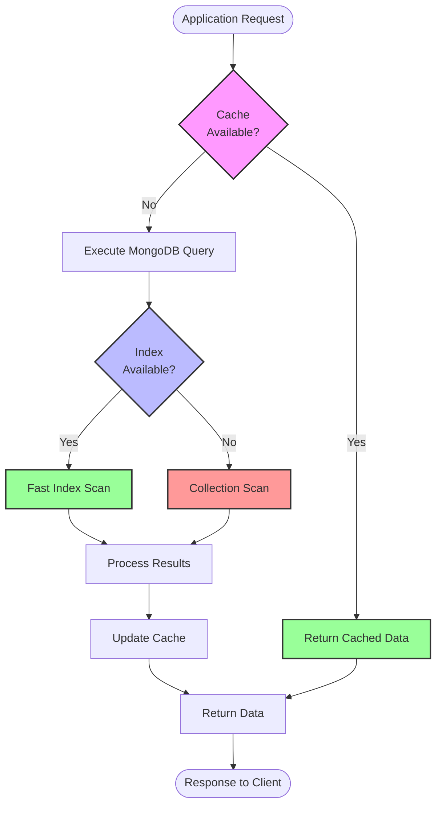
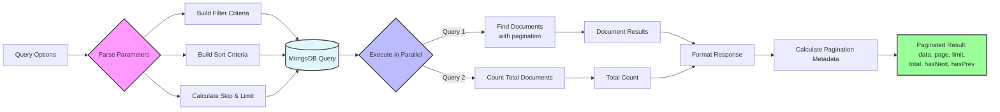
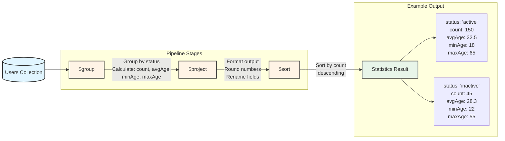
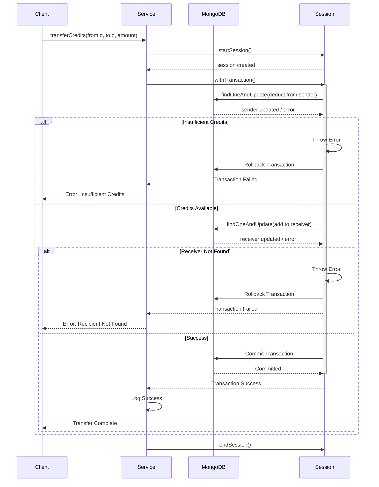
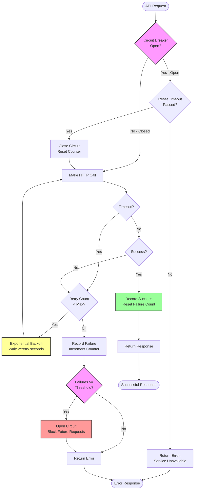
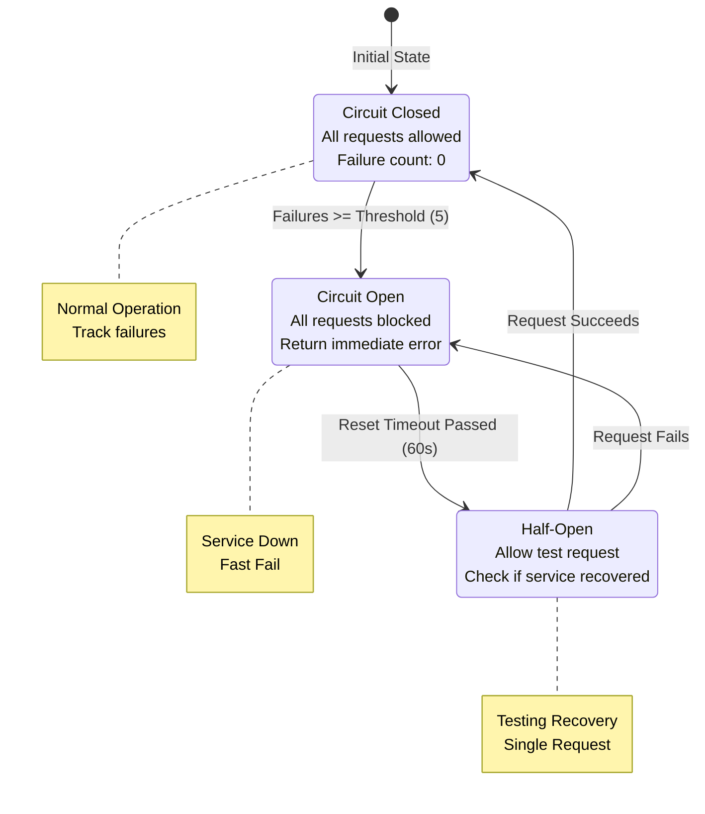
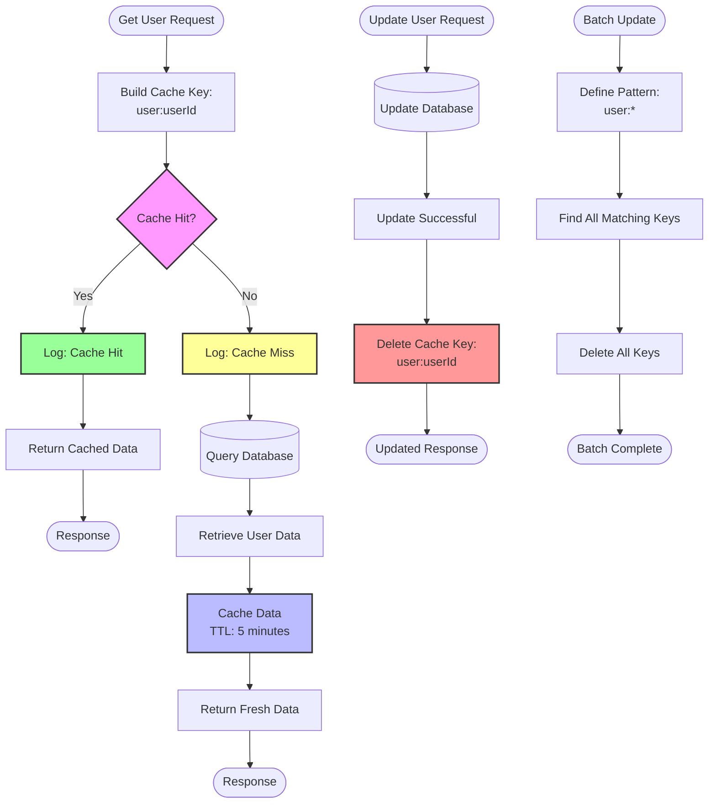
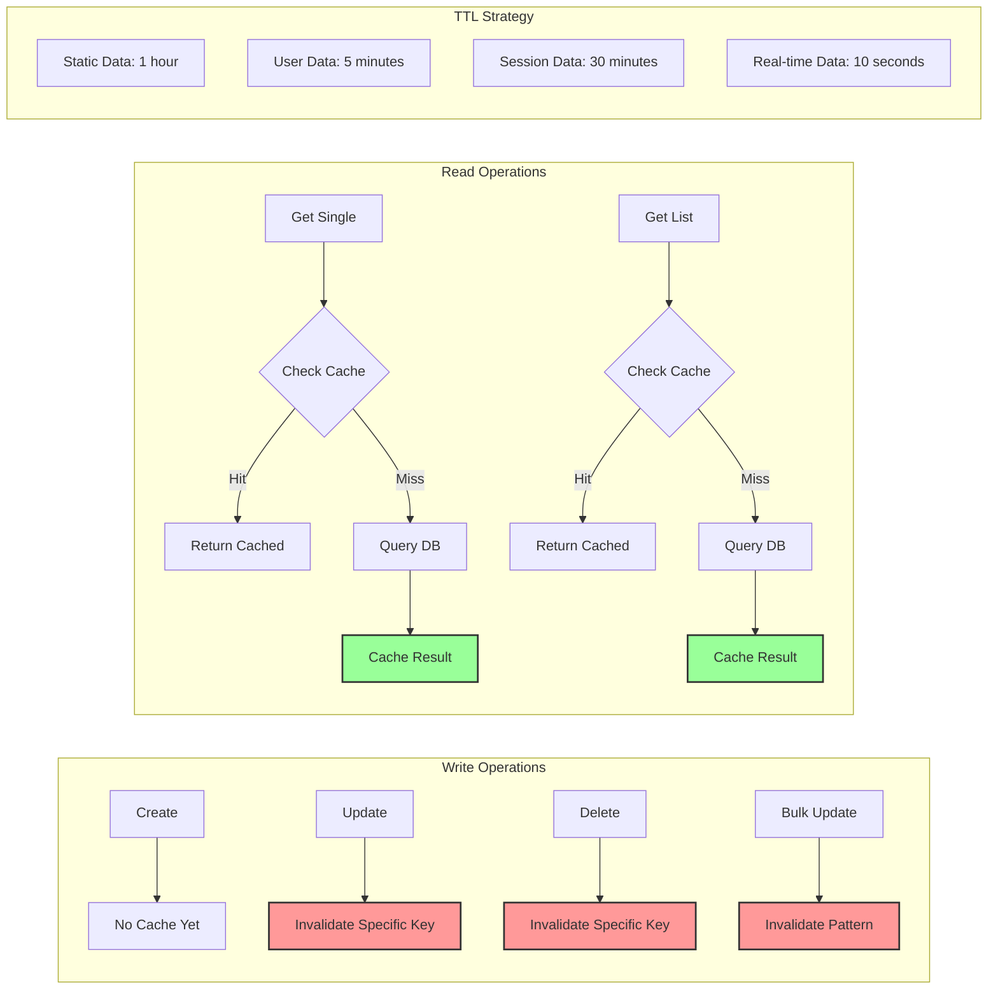
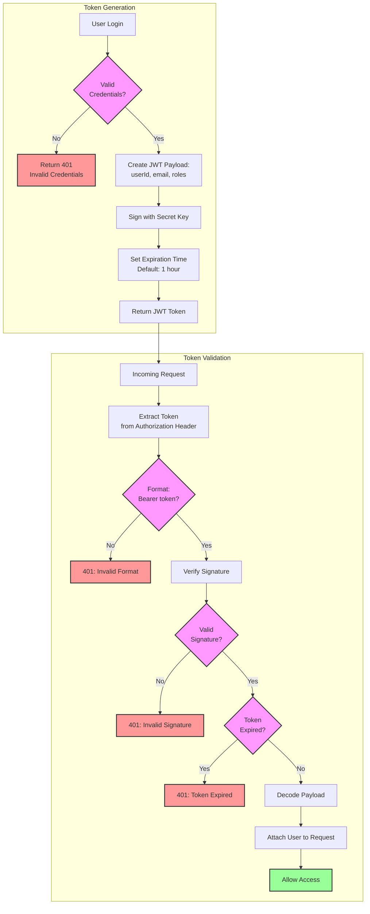
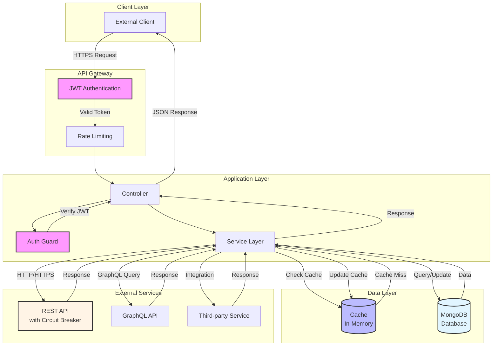

# Module 7: External Services & Database Integration

## 📚 Learning Objectives

By the end of this module, you will:

- Master MongoDB operations in EQXJS Template
- Implement external API integrations
- Handle authentication and authorization
- Implement caching strategies
- Manage database transactions
- Monitor and optimize database performance

---

## 7.1 MongoDB Integration

### Database Operations Flow



### 7.1.1 Database Module Setup

```typescript
// database/database.module.ts
import { Module, Global } from "@nestjs/common";
import { MongoClient, Db } from "mongodb";
import { ConfigService } from "@eqxjs/stub";

export const DATABASE_CONNECTION = "DATABASE_CONNECTION";

@Global()
@Module({
  providers: [
    {
      provide: DATABASE_CONNECTION,
      useFactory: async (configService: ConfigService): Promise<Db> => {
        const uri = configService.get<string>("mongodb.uri");
        const dbName = configService.get<string>("mongodb.database");
        const options = configService.get<any>("mongodb.options", {});

        const client = new MongoClient(uri, {
          maxPoolSize: options.maxPoolSize || 10,
          minPoolSize: options.minPoolSize || 2,
          connectTimeoutMS: options.connectTimeoutMS || 10000,
          socketTimeoutMS: options.socketTimeoutMS || 45000,
        });

        await client.connect();
        console.log(`Connected to MongoDB database: ${dbName}`);

        return client.db(dbName);
      },
      inject: [ConfigService],
    },
  ],
  exports: [DATABASE_CONNECTION],
})
export class DatabaseModule {}

// Custom decorator for injecting DB connection
export const InjectConnection = () => Inject(DATABASE_CONNECTION);
```

### 7.1.2 Advanced Repository Operations

```typescript
import { Injectable, Scope } from "@nestjs/common";
import { Db, ObjectId, Filter, UpdateFilter } from "mongodb";
import { InjectConnection } from "../../database/database.module";
import { CustomLoggerService, LoggerAction } from "@eqxjs/stub";

@Injectable({ scope: Scope.REQUEST })
export class UserMongoRepository {
  private collection: any;
  private readonly collectionName = "users";

  constructor(
    @InjectConnection() private db: Db,
    private logger: CustomLoggerService,
  ) {
    this.collection = this.db.collection(this.collectionName);
  }

  /**
   * Create indexes for performance
   */
  async createIndexes(): Promise<void> {
    await this.collection.createIndexes([
      { key: { email: 1 }, unique: true, name: "email_unique" },
      { key: { status: 1 }, name: "status_index" },
      { key: { createdAt: -1 }, name: "created_date_desc" },
      {
        key: { firstName: "text", lastName: "text", email: "text" },
        name: "text_search_index",
      },
    ]);

    this.logger.info("Database indexes created", {
      collection: this.collectionName,
    });
  }

  /**
   * Query with Pagination Flow
   */
}
```

### Advanced Query and Pagination Flow



```typescript
// Continuing UserMongoRepository class

  /**
   * Advanced query with filtering, sorting, and pagination
   */
  async findWithFilters(options: QueryOptions): Promise<PaginatedResult> {
    const {
      filter = {},
      page = 1,
      limit = 10,
      sort = { createdAt: -1 },
      projection = {},
    } = options;

    const skip = (page - 1) * limit;

    const [data, total] = await Promise.all([
      this.collection
        .find(filter)
        .project(projection)
        .sort(sort)
        .skip(skip)
        .limit(limit)
        .toArray(),
      this.collection.countDocuments(filter),
    ]);

    return {
      data: data.map(this.mapDocument),
      pagination: {
        page,
        limit,
        total,
        totalPages: Math.ceil(total / limit),
        hasNext: page * limit < total,
        hasPrev: page > 1,
      },
    };
  }

  /**
   * MongoDB Aggregation Pipeline
   */
}
```

### Aggregation Pipeline Flow



```typescript
// Continuing UserMongoRepository class

  /**
   * Complex aggregation pipeline
   */
  async getUserStatistics(groupBy: string = "status"): Promise<any[]> {
    return await this.collection
      .aggregate([
        // Group by field
        {
          $group: {
            _id: `$${groupBy}`,
            count: { $sum: 1 },
            avgAge: { $avg: "$age" },
            minAge: { $min: "$age" },
            maxAge: { $max: "$age" },
          },
        },
        // Format output
        {
          $project: {
            [groupBy]: "$_id",
            count: 1,
            avgAge: { $round: ["$avgAge", 2] },
            minAge: 1,
            maxAge: 1,
            _id: 0,
          },
        },
        // Sort by count
        {
          $sort: { count: -1 },
        },
      ])
      .toArray();
  }

  /**
   * MongoDB Transaction Flow
   */
}
```

### Transaction Processing Flow



```typescript
// Continuing UserMongoRepository class

  /**
   * Transaction example
   */
  async transferCredits(
    fromUserId: string,
    toUserId: string,
    amount: number,
  ): Promise<void> {
    const session = this.db.client.startSession();

    try {
      await session.withTransaction(async () => {
        // Deduct from sender
        const fromResult = await this.collection.findOneAndUpdate(
          {
            _id: new ObjectId(fromUserId),
            credits: { $gte: amount },
          },
          { $inc: { credits: -amount } },
          { session, returnDocument: "after" },
        );

        if (!fromResult.value) {
          throw new Error("Insufficient credits or user not found");
        }

        // Add to receiver
        const toResult = await this.collection.findOneAndUpdate(
          { _id: new ObjectId(toUserId) },
          { $inc: { credits: amount } },
          { session, returnDocument: "after" },
        );

        if (!toResult.value) {
          throw new Error("Recipient user not found");
        }

        this.logger.info(LoggerAction.PROCESSED("Credits transferred"), {
          fromUserId,
          toUserId,
          amount,
        });
      });
    } finally {
      await session.endSession();
    }
  }

  /**
   * Geospatial query
   */
  async findNearby(
    longitude: number,
    latitude: number,
    maxDistanceMeters: number = 5000,
  ): Promise<any[]> {
    return await this.collection
      .find({
        location: {
          $near: {
            $geometry: {
              type: "Point",
              coordinates: [longitude, latitude],
            },
            $maxDistance: maxDistanceMeters,
          },
        },
      })
      .toArray();
  }

  /**
   * Bulk write operations
   */
  async bulkUpdate(
    operations: Array<{
      filter: Filter<any>;
      update: UpdateFilter<any>;
    }>,
  ): Promise<number> {
    const bulkOps = operations.map(({ filter, update }) => ({
      updateOne: {
        filter,
        update: {
          $set: {
            ...update,
            updatedAt: new Date(),
          },
        },
      },
    }));

    const result = await this.collection.bulkWrite(bulkOps);

    this.logger.info(LoggerAction.PROCESSED("Bulk update completed"), {
      matched: result.matchedCount,
      modified: result.modifiedCount,
    });

    return result.modifiedCount;
  }

  private mapDocument(doc: any): any {
    return {
      ...doc,
      id: doc._id.toString(),
      _id: undefined,
    };
  }
}
```

### 7.1.3 Database Utilities

```typescript
// database/utils/db.util.ts
import { ObjectId } from "mongodb";

export class DbUtil {
  /**
   * Check if string is valid ObjectId
   */
  static isValidObjectId(id: string): boolean {
    return ObjectId.isValid(id);
  }

  /**
   * Convert string to ObjectId
   */
  static toObjectId(id: string): ObjectId {
    if (!this.isValidObjectId(id)) {
      throw new Error(`Invalid ObjectId: ${id}`);
    }
    return new ObjectId(id);
  }

  /**
   * Build filter from query parameters
   */
  static buildFilter(query: any): any {
    const filter: any = {};

    // Handle exact match fields
    if (query.status) {
      filter.status = query.status;
    }

    if (query.category) {
      filter.category = query.category;
    }

    // Handle search
    if (query.search) {
      filter.$text = { $search: query.search };
    }

    // Handle date ranges
    if (query.startDate || query.endDate) {
      filter.createdAt = {};

      if (query.startDate) {
        filter.createdAt.$gte = new Date(query.startDate);
      }

      if (query.endDate) {
        filter.createdAt.$lte = new Date(query.endDate);
      }
    }

    // Handle numeric ranges
    if (query.minAge || query.maxAge) {
      filter.age = {};

      if (query.minAge) {
        filter.age.$gte = parseInt(query.minAge);
      }

      if (query.maxAge) {
        filter.age.$lte = parseInt(query.maxAge);
      }
    }

    return filter;
  }

  /**
   * Build sort criteria
   */
  static buildSort(sortBy?: string, sortOrder?: string): any {
    if (!sortBy) {
      return { createdAt: -1 };
    }

    const order = sortOrder === "asc" ? 1 : -1;
    return { [sortBy]: order };
  }
}
```

---

## 7.2 External API Integration

### External API Call Flow with Circuit Breaker



### Circuit Breaker States



### 7.2.1 HTTP Service with Retry and Circuit Breaker

```typescript
import { Injectable } from "@nestjs/common";
import { HttpService } from "@nestjs/axios";
import { ConfigService, CustomLoggerService, LoggerAction } from "@eqxjs/stub";
import { firstValueFrom, timeout, retry, catchError, throwError } from "rxjs";

@Injectable()
export class ExampleApiService {
  private baseUrl: string;
  private timeoutMs: number;
  private maxRetries: number;

  // Circuit breaker state
  private failureCount = 0;
  private lastFailureTime: Date;
  private circuitOpen = false;
  private readonly failureThreshold = 5;
  private readonly resetTimeout = 60000; // 1 minute

  constructor(
    private httpService: HttpService,
    private logger: CustomLoggerService,
    private configService: ConfigService,
  ) {
    this.baseUrl = this.configService.get<string>(
      "external-services.example-api.base-url",
    );
    this.timeoutMs = this.configService.get<number>(
      "external-services.example-api.timeout",
      5000,
    );
    this.maxRetries = this.configService.get<number>(
      "external-services.example-api.retries",
      3,
    );
  }

  async getExample(params: any): Promise<any> {
    // Check circuit breaker
    if (this.isCircuitOpen()) {
      throw new Error("Circuit breaker is open. Service unavailable.");
    }

    const startTime = performance.now();
    const url = `${this.baseUrl}/examples`;

    try {
      this.logger.info(LoggerAction.PROCESSING("Calling external API"), {
        url,
        params,
      });

      const response = await firstValueFrom(
        this.httpService.get(url, { params }).pipe(
          timeout(this.timeoutMs),
          retry({
            count: this.maxRetries,
            delay: (error, retryCount) => {
              this.logger.warn(`Retry attempt ${retryCount} for ${url}`, {
                error: error.message,
              });

              // Exponential backoff
              return new Promise((resolve) =>
                setTimeout(resolve, Math.pow(2, retryCount) * 1000),
              );
            },
          }),
          catchError((error) => {
            this.recordFailure();
            return throwError(() => error);
          }),
        ),
      );

      this.recordSuccess();

      const duration = performance.now() - startTime;

      this.logger.info(LoggerAction.PROCESSED("External API call successful"), {
        url,
        statusCode: response.status,
        duration: `${duration.toFixed(2)}ms`,
      });

      return response.data;
    } catch (error) {
      const duration = performance.now() - startTime;

      this.logger.error(LoggerAction.FAILED("External API call failed"), {
        url,
        error: error.message,
        duration: `${duration.toFixed(2)}ms`,
        circuitOpen: this.circuitOpen,
      });

      throw error;
    }
  }

  private isCircuitOpen(): boolean {
    if (!this.circuitOpen) {
      return false;
    }

    // Check if reset timeout has passed
    const timeSinceLastFailure = Date.now() - this.lastFailureTime.getTime();

    if (timeSinceLastFailure >= this.resetTimeout) {
      this.logger.info("Circuit breaker: Attempting to close circuit");
      this.circuitOpen = false;
      this.failureCount = 0;
      return false;
    }

    return true;
  }

  private recordFailure(): void {
    this.failureCount++;
    this.lastFailureTime = new Date();

    if (this.failureCount >= this.failureThreshold) {
      this.circuitOpen = true;

      this.logger.error("Circuit breaker: Circuit opened due to failures", {
        failureCount: this.failureCount,
        threshold: this.failureThreshold,
      });
    }
  }

  private recordSuccess(): void {
    if (this.circuitOpen) {
      this.logger.info("Circuit breaker: Circuit closed after success");
    }

    this.failureCount = 0;
    this.circuitOpen = false;
  }
}
```

### 7.2.2 GraphQL Client Integration

```typescript
import { Injectable } from "@nestjs/common";
import { HttpService } from "@nestjs/axios";
import { firstValueFrom } from "rxjs";

@Injectable()
export class GraphQLClientService {
  private graphqlEndpoint: string;

  constructor(
    private httpService: HttpService,
    private configService: ConfigService,
    private logger: CustomLoggerService,
  ) {
    this.graphqlEndpoint = this.configService.get<string>(
      "external-services.graphql-api.endpoint",
    );
  }

  async query<T>(query: string, variables?: any): Promise<T> {
    try {
      const response = await firstValueFrom(
        this.httpService.post(this.graphqlEndpoint, {
          query,
          variables,
        }),
      );

      if (response.data.errors) {
        throw new Error(
          `GraphQL errors: ${JSON.stringify(response.data.errors)}`,
        );
      }

      return response.data.data;
    } catch (error) {
      this.logger.error("GraphQL query failed", error);
      throw error;
    }
  }

  async mutate<T>(mutation: string, variables?: any): Promise<T> {
    try {
      const response = await firstValueFrom(
        this.httpService.post(this.graphqlEndpoint, {
          query: mutation,
          variables,
        }),
      );

      if (response.data.errors) {
        throw new Error(
          `GraphQL errors: ${JSON.stringify(response.data.errors)}`,
        );
      }

      return response.data.data;
    } catch (error) {
      this.logger.error("GraphQL mutation failed", error);
      throw error;
    }
  }
}

// Usage
const query = `
  query GetUser($id: ID!) {
    user(id: $id) {
      id
      name
      email
      posts {
        id
        title
      }
    }
  }
`;

const user = await this.graphqlClient.query(query, { id: "123" });
```

---

## 7.3 Caching Strategies

### Caching Strategy Flow



### Cache Invalidation Strategies



### 7.3.1 In-Memory Cache Implementation

```typescript
import { Injectable } from "@nestjs/common";
import { Cache } from "cache-manager";
import { CACHE_MANAGER, Inject } from "@nestjs/common";
import { CustomLoggerService } from "@eqxjs/stub";

@Injectable()
export class CacheService {
  constructor(
    @Inject(CACHE_MANAGER) private cacheManager: Cache,
    private logger: CustomLoggerService,
  ) {}

  async get<T>(key: string): Promise<T | null> {
    try {
      const value = await this.cacheManager.get<T>(key);

      if (value) {
        this.logger.info("Cache hit", { key });
      } else {
        this.logger.info("Cache miss", { key });
      }

      return value;
    } catch (error) {
      this.logger.error("Cache get error", { key, error: error.message });
      return null;
    }
  }

  async set(key: string, value: any, ttl?: number): Promise<void> {
    try {
      await this.cacheManager.set(key, value, ttl);
      this.logger.info("Cache set", { key, ttl });
    } catch (error) {
      this.logger.error("Cache set error", { key, error: error.message });
    }
  }

  async delete(key: string): Promise<void> {
    try {
      await this.cacheManager.del(key);
      this.logger.info("Cache deleted", { key });
    } catch (error) {
      this.logger.error("Cache delete error", {
        key,
        error: error.message,
      });
    }
  }

  async deletePattern(pattern: string): Promise<void> {
    try {
      const keys = await this.cacheManager.store.keys(pattern);
      await Promise.all(keys.map((key) => this.cacheManager.del(key)));
      this.logger.info("Cache pattern deleted", {
        pattern,
        count: keys.length,
      });
    } catch (error) {
      this.logger.error("Cache pattern delete error", {
        pattern,
        error: error.message,
      });
    }
  }
}

// Usage in Service
@Injectable()
export class UserService {
  constructor(
    private userRepository: UserRepository,
    private cacheService: CacheService,
  ) {}

  async getUser(userId: string): Promise<User> {
    const cacheKey = `user:${userId}`;

    // Try cache first
    const cached = await this.cacheService.get<User>(cacheKey);
    if (cached) {
      return cached;
    }

    // Fetch from database
    const user = await this.userRepository.findById(userId);

    // Cache for 5 minutes
    await this.cacheService.set(cacheKey, user, 300);

    return user;
  }

  async updateUser(userId: string, data: any): Promise<User> {
    const user = await this.userRepository.update(userId, data);

    // Invalidate cache
    await this.cacheService.delete(`user:${userId}`);

    return user;
  }
}
```

---

## 7.4 Authentication & Security

### JWT Authentication Flow

```mermaid
sequenceDiagram
    participant Client
    participant Controller
    participant AuthGuard
    participant AuthService
    participant JwtService
    participant BusinessLogic

    Client->>Controller: GET /api/users/profile<br/>Authorization: Bearer <token>
    Controller->>AuthGuard: canActivate()
    activate AuthGuard

    AuthGuard->>AuthGuard: extractToken()<br/>Parse Bearer token

    alt No Token
        AuthGuard-->>Client: 401 Unauthorized<br/>No token provided
    else Token Present
        AuthGuard->>AuthService: verifyToken(token)
        activate AuthService

        AuthService->>JwtService: verify(token, secret)
        activate JwtService

        alt Invalid/Expired Token
            JwtService-->>AuthService: Error
            AuthService-->>AuthGuard: UnauthorizedException
            deactivate JwtService
            deactivate AuthService
            AuthGuard-->>Client: 401 Unauthorized<br/>Invalid token
        else Valid Token
            JwtService-->>AuthService: Decoded Payload
            deactivate JwtService
            AuthService-->>AuthGuard: User Payload
            deactivate AuthService

            AuthGuard->>AuthGuard: Attach user to request
            AuthGuard->>Controller: true (authorized)
            deactivate AuthGuard

            Controller->>BusinessLogic: Execute with request.user
            BusinessLogic-->>Controller: Profile Data
            Controller-->>Client: 200 OK<br/>User Profile
        end
    end
```

### Token Generation and Validation Flow



### 7.4.1 JWT Authentication

```typescript
import { Injectable } from "@nestjs/common";
import { JwtService } from "@nestjs/jwt";
import { ConfigService } from "@eqxjs/stub";

@Injectable()
export class AuthService {
  constructor(
    private jwtService: JwtService,
    private configService: ConfigService,
  ) {}

  async generateToken(payload: any): Promise<string> {
    return this.jwtService.sign(payload, {
      secret: this.configService.get("auth.jwt.secret"),
      expiresIn: this.configService.get("auth.jwt.expiresIn", "1h"),
    });
  }

  async verifyToken(token: string): Promise<any> {
    try {
      return this.jwtService.verify(token, {
        secret: this.configService.get("auth.jwt.secret"),
      });
    } catch (error) {
      throw new UnauthorizedException("Invalid token");
    }
  }
}

// Auth Guard
import { Injectable, CanActivate, ExecutionContext } from "@nestjs/common";

@Injectable()
export class JwtAuthGuard implements CanActivate {
  constructor(private authService: AuthService) {}

  async canActivate(context: ExecutionContext): Promise<boolean> {
    const request = context.switchToHttp().getRequest();
    const token = this.extractToken(request);

    if (!token) {
      throw new UnauthorizedException("No token provided");
    }

    try {
      const payload = await this.authService.verifyToken(token);
      request.user = payload;
      return true;
    } catch (error) {
      throw new UnauthorizedException("Invalid token");
    }
  }

  private extractToken(request: any): string | null {
    const authHeader = request.headers.authorization;

    if (!authHeader) {
      return null;
    }

    const [type, token] = authHeader.split(" ");

    return type === "Bearer" ? token : null;
  }
}

// Usage in Controller
@Controller("api/users")
@UseGuards(JwtAuthGuard)
export class UserController {
  @Get("profile")
  getProfile(@Req() request: any) {
    return request.user;
  }
}
```

---

## Complete Integration Architecture



---

## 📝 Summary

In this module, you learned:

- ✅ Advanced MongoDB operations and optimization
- ✅ External API integration with retry and circuit breaker
- ✅ GraphQL client implementation
- ✅ Caching strategies for performance
- ✅ Authentication and security best practices
- ✅ Database transactions and aggregations

---

## 🎯 Next Steps

In [Module 8: Testing and Best Practices](module-08-testing-best-practices.md), you will:

- Write unit tests with Jest
- Implement integration tests
- Follow code quality standards
- Learn deployment strategies
- Implement monitoring and logging

---

**[← Previous: Module 6](module-06-kafka-events.md)** | **[Back to Course Outline](course-outline.md)** | **[Next: Module 8 →](module-08-testing-best-practices.md)**
