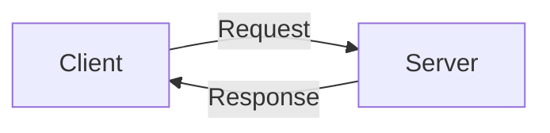
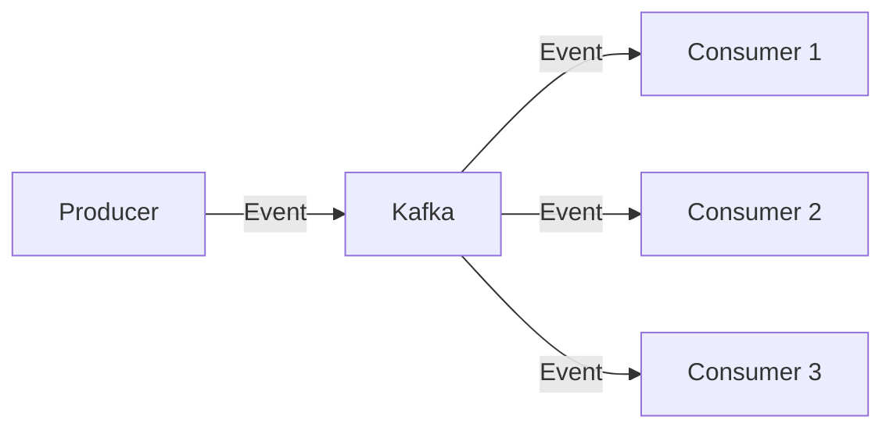
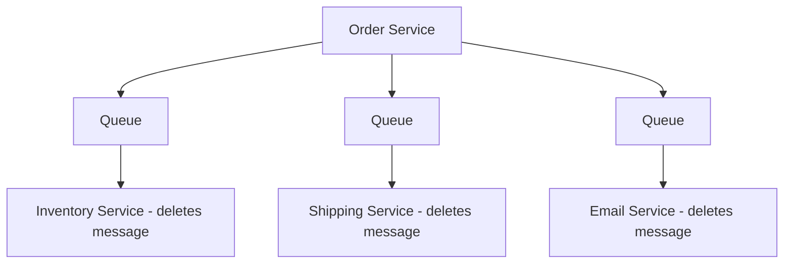
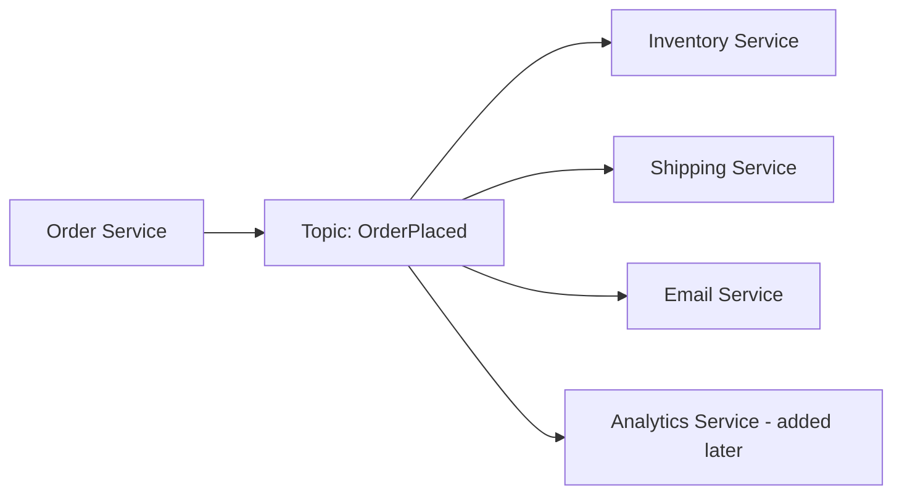
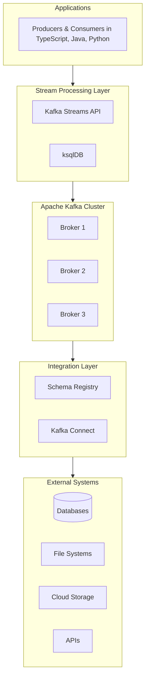

# Module 1: Introduction to Apache Kafka

## Overview
This module introduces Apache Kafka and event streaming concepts. You'll learn what Kafka is, why it's important, and when to use it in your architecture. We'll explore real-world use cases and compare Kafka with traditional messaging systems.

**Duration:** 2 hours

## Learning Objectives
By the end of this module, you will be able to:
- Understand the fundamentals of event streaming
- Explain what Apache Kafka is and its core purpose
- Identify scenarios where Kafka is the right solution
- Compare Kafka with traditional messaging systems
- Recognize the components of the Kafka ecosystem

## Table of Contents
1. [What is Apache Kafka?](#what-is-apache-kafka)
2. [Event Streaming and Event-Driven Architecture](#event-streaming-and-event-driven-architecture)
3. [Kafka Use Cases](#kafka-use-cases)
4. [Kafka vs Traditional Messaging Systems](#kafka-vs-traditional-messaging-systems)
5. [The Kafka Ecosystem](#the-kafka-ecosystem)
6. [Summary](#summary)
7. [Key Takeaways](#key-takeaways)

---

## What is Apache Kafka?

### Definition

**Apache Kafka** is an open-source distributed event streaming platform developed originally by LinkedIn and later donated to the Apache Software Foundation. It's designed to handle real-time data feeds with high throughput, fault tolerance, and scalability.

### Core Capabilities

Kafka provides three key capabilities:

1. **Publish and Subscribe** - Read and write streams of events
2. **Store** - Store streams of events durably and reliably
3. **Process** - Process streams of events as they occur or retrospectively

### Key Characteristics

- **Distributed**: Runs as a cluster across multiple servers
- **Fault-Tolerant**: Data is replicated across multiple brokers
- **High Throughput**: Can handle millions of events per second
- **Low Latency**: Sub-millisecond message delivery
- **Persistent**: Events are stored on disk and can be replayed
- **Scalable**: Can scale horizontally by adding more brokers

### Brief History

- **2011**: Created at LinkedIn to handle activity stream data
- **2011**: Open-sourced and donated to Apache Software Foundation
- **2012**: Became Apache top-level project
- **2014**: Jay Kreps, Neha Narkhede, and Jun Rao founded Confluent
- **2017**: Kafka Streams API introduced
- **2020**: KRaft (Kafka Raft) introduced to replace ZooKeeper
- **Present**: Used by over 80% of Fortune 100 companies

---

## Event Streaming and Event-Driven Architecture

### What is an Event?

An **event** is a record of something that happened. Events are facts, immutable records of state changes or actions.

**Examples:**
- User placed an order
- Temperature sensor reading: 72.5°F
- Payment processed successfully
- User logged in
- Stock price changed

### Event Structure

```typescript
interface OrderItem {
  productId: string;
  quantity: number;
  price: number;
}

interface OrderPlacedEvent {
  eventId: string;
  eventType: 'OrderPlaced';
  timestamp: string;
  userId: string;
  data: {
    orderId: string;
    items: OrderItem[];
    totalAmount: number;
  };
}

// Example event
const event: OrderPlacedEvent = {
  eventId: 'evt_12345',
  eventType: 'OrderPlaced',
  timestamp: '2026-02-10T10:30:00Z',
  userId: 'user_789',
  data: {
    orderId: 'ord_456',
    items: [
      {
        productId: 'prod_123',
        quantity: 2,
        price: 29.99
      }
    ],
    totalAmount: 59.98
  }
};
```

### Event Streaming

**Event Streaming** is the continuous flow and processing of events. It involves:

1. **Capturing** events in real-time from sources
2. **Storing** event streams durably for later retrieval
3. **Processing** events as they flow or retrospectively
4. **Reacting** to events by triggering actions

### Event-Driven Architecture (EDA)

An architectural pattern where:
- Services communicate through events
- Services are loosely coupled
- Events are the source of truth
- Systems react to events asynchronously

**Benefits:**
- **Decoupling**: Services don't need to know about each other
- **Scalability**: Services can scale independently
- **Flexibility**: Easy to add new consumers without affecting producers
- **Resilience**: Failures are isolated
- **Real-time**: Immediate reaction to events

### Traditional Request-Response vs Event-Driven

**Request-Response (Synchronous):**


**Event-Driven (Asynchronous):**


---

## Kafka Use Cases

### 1. **Messaging System**

Replace traditional message brokers for service-to-service communication.

**Example:**
- Order service publishes "OrderPlaced" event
- Inventory service consumes event to update stock
- Shipping service consumes event to prepare shipment
- Email service consumes event to send confirmation

### 2. **Website Activity Tracking**

Track user interactions on websites and applications.

**Example:**
- Page views
- Clicks
- Searches
- Form submissions
- User sessions

**Use:** Real-time analytics, personalization, A/B testing

### 3. **Metrics and Log Aggregation**

Collect operational data from distributed systems.

**Example:**
- Application logs from microservices
- Infrastructure metrics (CPU, memory, disk)
- Application metrics (request counts, latency)

**Use:** Monitoring, alerting, debugging, compliance

### 4. **Stream Processing**

Process data in real-time as it flows through the system.

**Example:**
- Fraud detection in financial transactions
- Real-time recommendations
- IoT sensor data processing
- Real-time analytics dashboards

### 5. **Event Sourcing**

Store all changes to application state as a sequence of events.

**Example:**
- Banking transactions
- Order fulfillment workflows
- Audit trails
- Time-travel queries

**Benefits:**
- Complete audit trail
- Can reconstruct any past state
- Temporal queries
- Easy debugging and testing

### 6. **Data Integration (ETL/ELT)**

Move data between systems in real-time.

**Example:**
- Database changes → Kafka → Data warehouse
- CRM system → Kafka → Analytics platform
- Legacy system → Kafka → Modern microservices

### 7. **CQRS (Command Query Responsibility Segregation)**

Separate read and write models for better scalability.

**Example:**
- Write model: Handle commands, publish events
- Read model: Subscribe to events, build optimized views
- Multiple read models for different query patterns

### 8. **Microservices Communication**

Enable asynchronous communication between microservices.

**Benefits:**
- Services remain independent
- Can handle bursts of traffic
- Failed services can catch up later
- No cascading failures

### 9. **Real-Time Analytics**

Process and analyze data as it arrives.

**Example:**
- Real-time dashboards
- Click-stream analysis
- Social media sentiment analysis
- IoT sensor monitoring

### 10. **Commit Log**

Use Kafka as a distributed commit log for databases or applications.

**Example:**
- Change Data Capture (CDC)
- Database replication
- Distributed system coordination

---

## Kafka vs Traditional Messaging Systems

### Traditional Message Brokers

**Examples:** RabbitMQ, ActiveMQ, IBM MQ, Amazon SQS

**Characteristics:**
- Message deletion after consumption
- Lower throughput (thousands of messages/sec)
- Complex routing logic
- No built-in replay capability
- Limited scalability

### Apache Kafka

**Characteristics:**
- Persistent storage (configurable retention)
- Very high throughput (millions of messages/sec)
- Simple topic-based routing
- Built-in replay capability
- Horizontal scalability

### Detailed Comparison

| Feature | RabbitMQ | ActiveMQ | Apache Kafka |
|---------|----------|----------|--------------|
| **Architecture** | Message broker | Message broker | Distributed log |
| **Message Model** | Push-based | Push/Pull | Pull-based |
| **Persistence** | Optional | Optional | Always |
| **Message Order** | Per queue | Per queue | Per partition |
| **Message Retention** | Until consumed | Until consumed | Time/size-based |
| **Replay** | No | No | Yes |
| **Throughput** | Moderate | Moderate | Very High |
| **Latency** | Low | Low | Low |
| **Scalability** | Vertical | Vertical | Horizontal |
| **Use Cases** | Task queues | Enterprise messaging | Event streaming |

### When to Use Kafka

✅ **Choose Kafka when:**
- High throughput is required (millions of events/sec)
- Need to replay historical data
- Multiple consumers need the same data
- Building event-driven architectures
- Need durable storage of events
- Horizontal scalability is important
- Stream processing is required

❌ **Consider alternatives when:**
- Complex routing logic is needed (use RabbitMQ)
- Message order across topics doesn't matter
- Very low latency is critical (< 1ms)
- Simple task queue is sufficient
- Small-scale operations (< 1000 messages/sec)

### Example Scenario: E-commerce Order Processing

**With RabbitMQ:**

- Messages deleted after processing
- Can't replay if service was down
- Need separate queue for each consumer

**With Kafka:**

- Events retained for configured period
- Can replay if service was down
- Easy to add new consumers
- Can process historical data

---

## The Kafka Ecosystem

### Core Components

#### 1. **Apache Kafka (Core)**
The distributed streaming platform itself.

**Components:**
- Brokers
- Topics
- Partitions
- Producer API
- Consumer API

#### 2. **Kafka Connect**
Framework for integrating Kafka with external systems.

**Connectors:**
- **Source Connectors**: Import data into Kafka (Database, File, HTTP)
- **Sink Connectors**: Export data from Kafka (Database, S3, Elasticsearch)

**Popular Connectors:**
- JDBC (databases)
- Elasticsearch
- Amazon S3
- MongoDB
- Salesforce

#### 3. **Kafka Streams**
Client library for building stream processing applications.

**Features:**
- Exactly-once processing
- Stateful operations
- Windowing and aggregations
- Joins
- Interactive queries

#### 4. **Schema Registry**
Centralized schema management for Kafka.

**Purpose:**
- Store schemas for messages
- Enforce schema compatibility
- Support Avro, JSON Schema, Protobuf
- Schema evolution

#### 5. **ksqlDB**
SQL-based stream processing engine.

**Features:**
- SQL syntax for stream processing
- No code required
- Built-in connectors
- Materialized views

#### 6. **Kafka REST Proxy**
RESTful interface to Kafka cluster.

**Use Cases:**
- Produce/consume messages via HTTP
- Non-JVM language integration
- Browser-based clients

#### 7. **Control Center (Confluent)**
Web-based UI for managing and monitoring Kafka.

**Features:**
- Cluster health monitoring
- Topic management
- Consumer lag monitoring
- Stream processing monitoring

### Kafka Ecosystem Diagram



### Commercial Offerings

1. **Confluent Cloud** - Managed Kafka as a service
2. **Amazon MSK** - AWS managed Kafka
3. **Azure Event Hubs** - Azure Kafka-compatible service
4. **Aiven** - Multi-cloud managed Kafka
5. **Instaclustr** - Managed open-source data platform

---

## Summary

In this module, you learned:

1. **Apache Kafka** is a distributed event streaming platform designed for high-throughput, fault-tolerant, and scalable real-time data processing.

2. **Event Streaming** involves capturing, storing, processing, and reacting to continuous flows of events.

3. **Event-Driven Architecture** enables loosely coupled, scalable, and resilient systems by using events as the primary means of communication.

4. **Kafka Use Cases** include messaging, activity tracking, log aggregation, stream processing, event sourcing, data integration, CQRS, and real-time analytics.

5. **Kafka vs Message Brokers**: Kafka differs from traditional message brokers with its persistent storage, high throughput, replay capability, and horizontal scalability.

6. **Kafka Ecosystem** includes core Kafka, Kafka Connect, Kafka Streams, Schema Registry, ksqlDB, and various management tools.

---

## Key Takeaways

✅ **Kafka is not just a message broker** - it's a distributed event streaming platform

✅ **Events are immutable facts** - they represent things that happened

✅ **Kafka stores events persistently** - unlike traditional message brokers that delete after consumption

✅ **High throughput and scalability** - Kafka can handle millions of events per second

✅ **Replay capability** - Consumers can re-read historical events

✅ **Ecosystem matters** - Kafka Connect, Streams, Schema Registry extend Kafka's capabilities

✅ **Choose Kafka for event streaming** - Not just simple queuing

---

## What's Next?

Now that you understand what Kafka is and why it's important, the next module will dive deep into:

- Kafka's distributed architecture
- How brokers, topics, and partitions work together
- Producers and consumers in detail
- Replication and fault tolerance
- How data flows through Kafka

**Continue to [Module 2: Kafka Architecture and Core Concepts](module-02-architecture.md)**

---

## Additional Resources

- [Apache Kafka Documentation](https://kafka.apache.org/documentation/)
- [Kafka: The Definitive Guide (Book)](https://www.confluent.io/resources/kafka-the-definitive-guide/)
- [Why Kafka: Origins and Use Cases](https://www.confluent.io/blog/event-streaming-platform-1/)
- [Event Streaming 101](https://developer.confluent.io/learn-kafka/apache-kafka/events/)
- [Martin Kleppmann - "Turning the Database Inside Out"](https://www.confluent.io/blog/turning-the-database-inside-out-with-apache-samza/)

---

**[📝 Practice Exercises](exercise/module-01-exercises.md)** | **[📚 Back to Course Home](README.md)**
