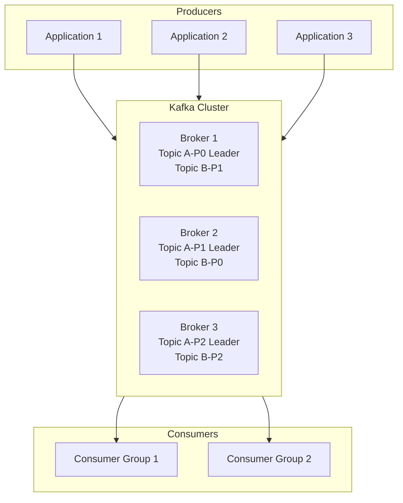
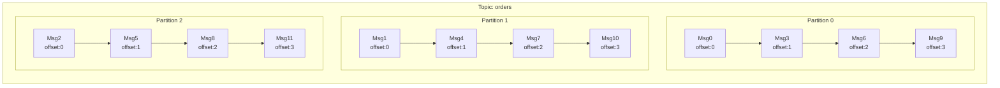
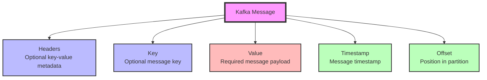
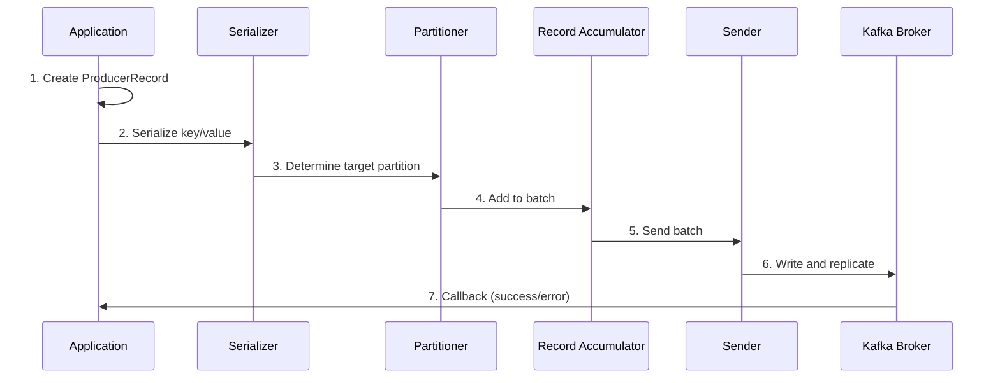
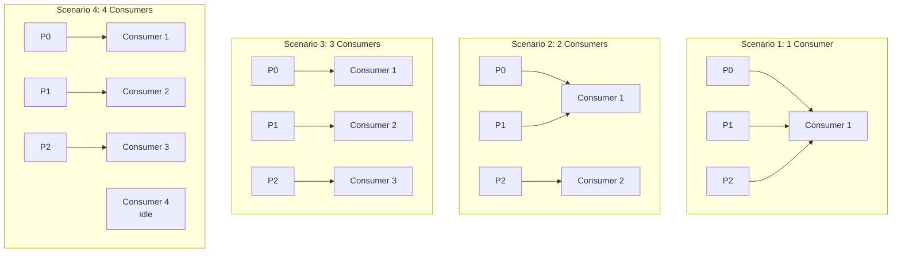
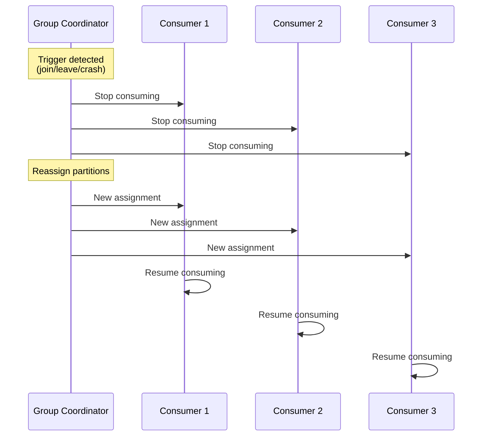
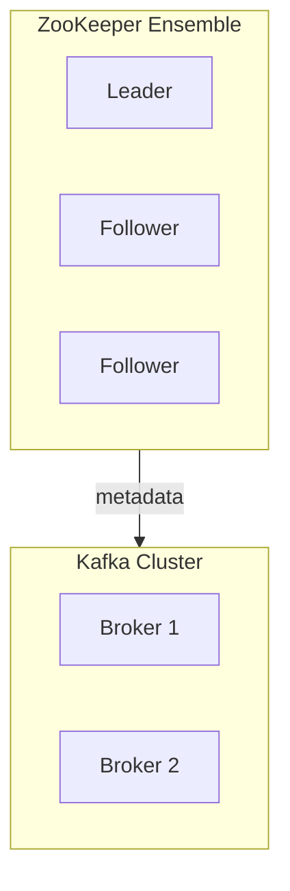
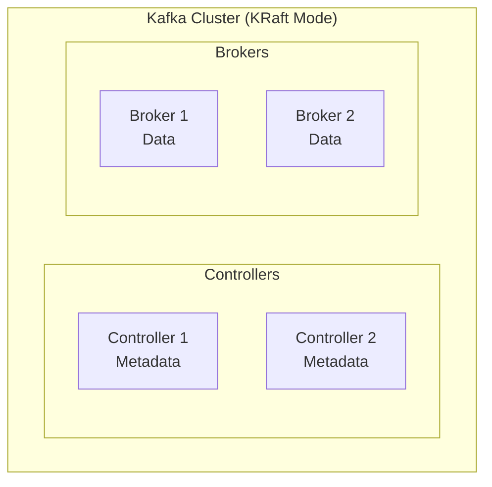

# Module 2: Kafka Architecture and Core Concepts

## Overview
This module provides a deep dive into Kafka's distributed architecture. You'll learn how Kafka brokers work together, how data is organized into topics and partitions, and how Kafka achieves fault tolerance through replication. Understanding these concepts is crucial for designing and operating Kafka effectively.

**Duration:** 3 hours

## Learning Objectives
By the end of this module, you will be able to:
- Understand Kafka's distributed architecture
- Explain how brokers, topics, and partitions work together
- Describe how producers write data and consumers read data
- Understand consumer groups and offset management
- Explain replication and fault tolerance mechanisms
- Understand ZooKeeper's role and the transition to KRaft

## Table of Contents
1. [Kafka Architecture Overview](#kafka-architecture-overview)
2. [Brokers](#brokers)
3. [Topics and Partitions](#topics-and-partitions)
4. [Messages, Keys, and Values](#messages-keys-and-values)
5. [Producers](#producers)
6. [Consumers and Consumer Groups](#consumers-and-consumer-groups)
7. [Offset Management](#offset-management)
8. [Replication and Fault Tolerance](#replication-and-fault-tolerance)
9. [ZooKeeper and KRaft](#zookeeper-and-kraft)
10. [Log Segments and Storage](#log-segments-and-storage)
11. [Summary](#summary)

---

## Kafka Architecture Overview

### High-Level Architecture



### Key Components

1. **Producers** - Applications that publish events to Kafka
2. **Kafka Cluster** - Multiple broker servers working together
3. **Brokers** - Individual Kafka servers that store data
4. **Topics** - Categories or streams of events
5. **Partitions** - Divisions of topics for parallelism
6. **Consumers** - Applications that read events from Kafka
7. **ZooKeeper/KRaft** - Coordination service for cluster metadata

---

## Brokers

### What is a Broker?

A **broker** is a single Kafka server that:
- Receives messages from producers
- Stores messages on disk
- Serves messages to consumers
- Replicates data to other brokers

### Kafka Cluster

A **cluster** is a group of brokers working together:
- Typically 3-100+ brokers
- Each broker has a unique ID
- Load is distributed across brokers
- Provides fault tolerance and scalability

### Broker Responsibilities

1. **Storage**: Persist messages to disk
2. **Replication**: Maintain copies of partitions
3. **Leader Election**: Coordinate partition leadership
4. **Client Requests**: Handle produce and fetch requests
5. **Log Management**: Manage log segments and cleanup

### Example: 3-Broker Cluster

```
Broker 1 (ID: 1)          Broker 2 (ID: 2)          Broker 3 (ID: 3)
├─ Topic A, Partition 0   ├─ Topic A, Partition 1   ├─ Topic A, Partition 2
│  (Leader)               │  (Leader)               │  (Leader)
├─ Topic A, Partition 1   ├─ Topic A, Partition 2   ├─ Topic A, Partition 0
│  (Follower)             │  (Follower)             │  (Follower)
└─ Topic A, Partition 2   └─ Topic A, Partition 0   └─ Topic A, Partition 1
   (Follower)               (Follower)               (Follower)
```

**Key Points:**
- Each partition has one leader and multiple followers
- Leaders handle all reads and writes
- Followers replicate data from leaders
- If a leader fails, a follower becomes the new leader

---

## Topics and Partitions

### Topics

A **topic** is a category or stream name to which events are published.

**Characteristics:**
- Logical grouping of events
- Can have multiple partitions
- Retains events based on configuration
- Can have multiple producers and consumers

**Example Topics:**
- `user-registrations`
- `order-events`
- `payment-transactions`
- `system-logs`

### Partitions

A **partition** is an ordered, immutable sequence of messages that is continually appended to.

**Why Partitions?**
1. **Scalability**: Distribute load across multiple brokers
2. **Parallelism**: Multiple consumers can read simultaneously
3. **Ordering**: Guarantees order within a partition
4. **Throughput**: More partitions = higher throughput

### Partition Structure



**Key Properties:**
- Messages are appended to the end (append-only log)
- Each message has an offset (unique ID within partition)
- Messages cannot be deleted individually
- Order is guaranteed only within a partition

### Choosing Partition Count

**Factors to consider:**
- Number of consumers (can't have more consumers than partitions per group)
- Desired throughput
- Broker resources
- Retention requirements

**Guidelines:**
- Start with number of brokers × 2
- Can increase later (but can't decrease easily)
- More partitions = more broker load

**Example:**
```bash
# 3 brokers → Start with 6-12 partitions
# 10 brokers → Start with 20-40 partitions
```

---

## Messages, Keys, and Values

### Message Structure

A Kafka message consists of:



### Message Components

#### 1. **Key** (Optional)
- Determines which partition the message goes to
- Used for message ordering and compaction
- Typically an identifier (user ID, order ID)

#### 2. **Value** (Required)
- The actual message payload
- Can be any format (JSON, Avro, Protobuf, binary)
- The data you want to transmit

#### 3. **Headers** (Optional)
- Key-value metadata
- Useful for routing, tracing, content type

#### 4. **Timestamp**
- When the message was created or appended
- Can be producer-set or broker-set

#### 5. **Offset**
- Unique ID for message within partition
- Sequential and immutable
- Used by consumers to track position

### Example Message

```typescript
interface MessageHeaders {
  'content-type': string;
  'correlation-id': string;
  source: string;
}

interface OrderPlacedValue {
  eventType: 'OrderPlaced';
  orderId: string;
  userId: string;
  amount: number;
  timestamp: string;
}

interface KafkaMessage<K, V> {
  headers: MessageHeaders;
  key: K;
  value: V;
  timestamp: number;
  offset: number;
  partition: number;
}

// Example message
const exampleMessage: KafkaMessage<string, OrderPlacedValue> = {
  headers: {
    'content-type': 'application/json',
    'correlation-id': 'abc-123',
    source: 'order-service'
  },
  key: 'user-789',
  value: {
    eventType: 'OrderPlaced',
    orderId: 'order-456',
    userId: 'user-789',
    amount: 99.99,
    timestamp: '2026-02-10T10:30:00Z'
  },
  timestamp: 1707562200000,
  offset: 12345,
  partition: 2
};
```

### Message Keys and Partitioning

**Without Key:**
```
Producer sends message → Round-robin to partitions
```

**With Key:**
```
Producer sends message with key "user-123"
→ hash(key) % num_partitions = partition number
→ Always goes to same partition
→ Guarantees order for that key
```

**Example:**
```
Key: "user-123" → hash → Partition 2
Key: "user-456" → hash → Partition 0
Key: "user-789" → hash → Partition 1
Key: "user-123" → hash → Partition 2 (same as before)
```

---

## Producers

### Producer Overview

Producers publish messages to Kafka topics.

**Producer Flow:**


### Producer Configuration

Key configurations:
- `bootstrap.servers`: Kafka broker addresses
- `key.serializer`: How to serialize keys
- `value.serializer`: How to serialize values
- `acks`: Acknowledgment level (0, 1, all)
- `retries`: Number of retry attempts
- `batch.size`: Batch size in bytes
- `linger.ms`: Time to wait before sending batch

### Message Delivery Semantics

#### 1. **At Most Once** (acks=0)
- Fire and forget
- No retries
- Possible message loss
- Highest throughput

#### 2. **At Least Once** (acks=1 or all, retries>0)
- Wait for acknowledgment
- Retry on failure
- Possible duplicates
- Moderate throughput

#### 3. **Exactly Once** (enable.idempotence=true, transactional)
- No loss, no duplicates
- Guaranteed delivery exactly once
- Lowest throughput
- Most complex

---

## Consumers and Consumer Groups

### Consumer Overview

Consumers read messages from Kafka topics.

**Consumer Flow:**
```
1. Consumer subscribes to topic(s)
2. Joins consumer group
3. Receives partition assignment
4. Fetches messages from assigned partitions
5. Processes messages
6. Commits offsets
```

### Consumer Groups

A **consumer group** is a set of consumers working together to consume a topic.

**Key Properties:**
- Each consumer in a group reads from exclusive partitions
- Enables parallel processing
- Automatic load balancing
- Fault tolerance

### Partition Assignment



**Rule:** You cannot have more active consumers than partitions in a group.

### Multiple Consumer Groups

Different groups can read the same topic independently:

```
Topic: "orders"

Group A (Analytics):       Group B (Processing):
Consumer A1: [P0, P1]     Consumer B1: [P0]
Consumer A2: [P2]         Consumer B2: [P1]
                          Consumer B3: [P2]
```

Each group maintains its own offsets, progressing independently.

### Rebalancing

**Rebalancing** occurs when:
- A consumer joins the group
- A consumer leaves the group
- A consumer crashes
- New partitions are added

**Rebalance Process:**


**Types of Rebalances:**
- **Eager Rebalance**: All consumers stop, full reassignment
- **Cooperative Rebalance**: Incremental, minimal disruption

---

## Offset Management

### What is an Offset?

An **offset** is a unique identifier for a message within a partition.

```
Partition 0:
Offset:   0      1      2      3      4      5
Message: [Msg0] [Msg1] [Msg2] [Msg3] [Msg4] [Msg5]
                                      ↑
                                Consumer position
```

### Committed Offset

The **committed offset** is the last offset that has been successfully processed.

**Why Commit?**
- Track consumer progress
- Resume from correct position after restart
- Prevent reprocessing
- Enable fault tolerance

### Commit Strategies

#### 1. **Auto-Commit** (enable.auto.commit=true)
```typescript
import { Kafka, Consumer, ConsumerConfig } from 'kafkajs';

const kafka = new Kafka({ brokers: ['localhost:9092'] });

const config: ConsumerConfig = {
  groupId: 'my-group',
  // Automatically commits every 5000ms
};

const consumer: Consumer = kafka.consumer(config);
```

**Pros:** Simple, no code needed
**Cons:** Possible message loss or duplicates

#### 2. **Manual Commit - Synchronous**
```typescript
import { Kafka, EachMessagePayload } from 'kafkajs';

const kafka = new Kafka({ brokers: ['localhost:9092'] });
const consumer = kafka.consumer({ groupId: 'my-group' });

await consumer.subscribe({ topic: 'my-topic', fromBeginning: true });

await consumer.run({
  autoCommit: false,
  eachBatch: async ({ batch, resolveOffset, heartbeat, commitOffsetsIfNecessary }) => {
    for (const message of batch.messages) {
      await processRecord(message);
      resolveOffset(message.offset);
    }
    // Commit synchronously after processing batch
    await commitOffsetsIfNecessary();
    await heartbeat();
  }
});
```

**Pros:** Guaranteed commit before continue
**Cons:** Blocks consumer, lower throughput

#### 3. **Manual Commit - Asynchronous**
```typescript
import { Kafka } from 'kafkajs';

const kafka = new Kafka({ brokers: ['localhost:9092'] });
const consumer = kafka.consumer({ groupId: 'my-group' });

await consumer.subscribe({ topic: 'my-topic', fromBeginning: true });

await consumer.run({
  autoCommit: false,
  eachBatch: async ({ batch, resolveOffset, heartbeat, commitOffsetsIfNecessary }) => {
    for (const message of batch.messages) {
      await processRecord(message);
      resolveOffset(message.offset);
    }
    // Commit asynchronously (non-blocking)
    commitOffsetsIfNecessary().catch(console.error);
    await heartbeat();
  }
});
```

**Pros:** Non-blocking, higher throughput
**Cons:** Possible out-of-order commits

#### 4. **Per-Record Commit**
```typescript
import { Kafka } from 'kafkajs';

const kafka = new Kafka({ brokers: ['localhost:9092'] });
const consumer = kafka.consumer({ groupId: 'my-group' });

await consumer.subscribe({ topic: 'my-topic', fromBeginning: true });

await consumer.run({
  autoCommit: false,
  eachMessage: async ({ topic, partition, message }) => {
    await processRecord(message);
    
    // Commit after each message
    await consumer.commitOffsets([{
      topic,
      partition,
      offset: (BigInt(message.offset) + 1n).toString()
    }]);
  }
});
```

**Pros:** Maximum reliability
**Cons:** Lowest performance

### Offset Storage

Offsets are stored in special internal topic:
- Topic: `__consumer_offsets`
- Compacted log
- 50 partitions by default
- Retained even after consumer stops

---

## Replication and Fault Tolerance

### Why Replication?

Replication provides:
- **Fault Tolerance**: Survive broker failures
- **High Availability**: Continue operation during failures
- **Data Durability**: Prevent data loss

### Replication Factor

**Replication Factor** is the number of copies of data.

```
Topic: "orders", Replication Factor: 3

Broker 1:  [P0-Leader] [P1-Follower] [P2-Follower]
Broker 2:  [P0-Follower] [P1-Leader] [P2-Follower]
Broker 3:  [P0-Follower] [P1-Follower] [P2-Leader]
```

**Common Replication Factors:**
- **1**: No redundancy (only for dev/testing)
- **2**: Can tolerate 1 broker failure
- **3**: Can tolerate 2 broker failures (recommended for production)
- **5**: Can tolerate 4 broker failures (high availability)

### Leader and Followers

**Leader:**
- Handles all reads and writes for partition
- One leader per partition
- Elected by controller broker

**Followers (Replicas):**
- Passively replicate data from leader
- Don't serve reads or writes
- Can become leader if current leader fails

### In-Sync Replicas (ISR)

**ISR** is the set of replicas that are fully caught up with the leader.

```
Partition 0:
Leader:      Broker 1 [Offset: 0-1000]
Follower 1:  Broker 2 [Offset: 0-1000] ← In-Sync
Follower 2:  Broker 3 [Offset: 0-950]  ← Out-of-Sync
```

**ISR Criteria:**
- Replica has fetched recent messages
- Within `replica.lag.time.max.ms` (default: 30s)

**Why ISR Matters:**
- Only ISR replicas can become leader
- `acks=all` waits for all ISR to acknowledge

### Handling Broker Failures

**Scenario: Leader Fails**

```
Before Failure:
Broker 1 (Leader):   [P0: Msg 0-100]
Broker 2 (Follower): [P0: Msg 0-100] ← In-Sync
Broker 3 (Follower): [P0: Msg 0-100] ← In-Sync

Broker 1 fails! ❌

After Failover:
Broker 2 (NEW Leader): [P0: Msg 0-100]
Broker 3 (Follower):   [P0: Msg 0-100]
```

**Process:**
1. Controller detects broker failure
2. New leader elected from ISR
3. Producers/consumers automatically connect to new leader
4. No data loss if using `acks=all`

### Acknowledgment Levels

#### acks=0 (Fire and Forget)
```
Producer → Broker (Leader)
         ← No acknowledgment
```
- Fastest
- No durability guarantee

#### acks=1 (Leader Acknowledgment)
```
Producer → Broker (Leader) → Write to log
         ← Acknowledgment
```
- Moderate speed
- Can lose data if leader fails before replication

#### acks=all (All ISR Acknowledgment)
```
Producer → Broker (Leader) → Write to log
                           → Replicate to Follower 1
                           → Replicate to Follower 2
         ← Acknowledgment (all ISR confirmed)
```
- Slowest
- Highest durability

---

## ZooKeeper and KRaft

### ZooKeeper (Legacy)

**ZooKeeper** is a centralized service for maintaining configuration, naming, and synchronization in distributed systems.

**Role in Kafka:**
- Store cluster metadata
- Controller election
- Track broker membership
- Store ACLs and quotas
- Topic configuration

**Architecture:**


**Limitations:**
- Separate system to manage
- Additional operational complexity
- Scaling limitations
- Single point of failure

### KRaft (Kafka Raft)

**KRaft** is Kafka's internal consensus protocol that replaces ZooKeeper.

**Benefits:**
- No external dependencies
- Simpler deployment
- Better scalability (can support more partitions)
- Faster metadata operations
- Faster recovery

**Architecture:**


**Controller Quorum:**
- 3 or 5 controllers recommended
- Raft consensus for metadata
- Metadata stored in internal `__cluster_metadata` topic

**Status:**
- GA in Kafka 3.3 (September 2022)
- Production-ready
- ZooKeeper deprecated (removal planned for Kafka 4.0)

**Migration:**
- New clusters should use KRaft
- Existing clusters can migrate (but challenging)

---

## Log Segments and Storage

### Log Structure

Kafka stores messages in log segments on disk.

```
Topic: "orders", Partition 0

/var/lib/kafka/data/orders-0/
├── 00000000000000000000.log    ← Segment 1 (offsets 0-999)
├── 00000000000000000000.index
├── 00000000000000000000.timeindex
├── 00000000000000001000.log    ← Segment 2 (offsets 1000-1999)
├── 00000000000000001000.index
├── 00000000000000001000.timeindex
├── 00000000000000002000.log    ← Active segment (offsets 2000+)
├── 00000000000000002000.index
└── 00000000000000002000.timeindex
```

### Segment Components

#### 1. **Log File (.log)**
- Contains actual messages
- Append-only
- Binary format

#### 2. **Index File (.index)**
- Maps offsets to physical positions in log
- Speeds up offset lookups

#### 3. **Time Index (.timeindex)**
- Maps timestamps to offsets
- Enables time-based searches

### Log Segments

**Why Segments?**
- Easier log management
- Efficient deletion (delete entire segment)
- Better performance (smaller files)

**Segment Lifecycle:**
```
1. New messages → Append to active segment
2. Segment reaches size limit (segment.bytes) or time limit (segment.ms)
3. Segment rolled (closed), new segment becomes active
4. Old segments eligible for deletion based on retention
```

### Message Format on Disk

```mermaid
graph TD
    Message["Kafka Message on Disk"]
    
    Message --> Offset["Offset: 8 bytes"]
    Message --> Size["Message Size: 4 bytes"]
    Message --> CRC["CRC: 4 bytes (checksum)"]
    Message --> Magic["Magic Byte: 1 byte (version)"]
    Message --> Attr["Attributes: 1 byte"]
    Message --> TS["Timestamp: 8 bytes"]
    Message --> KeyLen["Key Length: 4 bytes"]
    Message --> Key["Key: N bytes"]
    Message --> ValLen["Value Length: 4 bytes"]
    Message --> Val["Value: M bytes"]
    Message --> HdrCnt["Headers Count: varint"]
    Message --> Hdrs["Headers: variable"]
    
    style Message fill:#f9f,stroke:#333,stroke-width:4px
```


└─────────────────────────────────────────────┘
```

### Page Cache

Kafka relies heavily on OS page cache:
- Messages written to page cache
- OS flushes to disk asynchronously
- Reads served from page cache (very fast)
- No explicit caching in Kafka code

**Benefits:**
- High throughput
- Efficient memory usage
- Automatic cache management by OS

---

## Summary

In this module, you learned:

1. **Kafka Architecture**: Distributed system of brokers, topics, and partitions

2. **Brokers**: Individual Kafka servers that store and serve data

3. **Topics and Partitions**: Topics are divided into partitions for scalability and parallelism

4. **Messages**: Consist of key, value, headers, timestamp, and offset

5. **Producers**: Applications that publish messages to topics with configurable acknowledgments

6. **Consumers and Consumer Groups**: Consumers work together in groups to process messages in parallel

7. **Offset Management**: Tracking consumer position with auto or manual commit strategies

8. **Replication**: Fault tolerance through leader and follower replicas with ISR

9. **ZooKeeper → KRaft**: Transition from external ZooKeeper to internal KRaft consensus

10. **Log Segments**: Efficient storage using segments with indexes and time indexes

---

## Key Takeaways

✅ **Partitions enable parallelism** - More partitions = more consumers

✅ **Message order guaranteed within partition** - Not across partitions

✅ **Consumer groups enable scale-out** - Add consumers to process faster

✅ **Replication provides fault tolerance** - Typical RF=3 for production

✅ **Leaders handle all I/O** - Followers only replicate

✅ **ISR ensures durability** - acks=all waits for ISR acknowledgment

✅ **Offsets track consumer position** - Enables resuming after failure

✅ **KRaft removes ZooKeeper dependency** - Simpler, more scalable

---

## What's Next?

Now that you understand Kafka's architecture, you're ready to get hands-on!

The next module will cover:
- Installing Kafka locally
- Running Kafka with Docker
- Using CLI tools
- Creating topics
- Producing and consuming messages

**Continue to [Module 3: Setting Up Kafka](module-03-setup.md)**

---

## Additional Resources

- [Kafka Architecture Documentation](https://kafka.apache.org/documentation/#design)
- [KIP-500: Replace ZooKeeper with KRaft](https://cwiki.apache.org/confluence/display/KAFKA/KIP-500)
- [Kafka Replication Documentation](https://kafka.apache.org/documentation/#replication)
- [Understanding Kafka Partitions](https://developer.confluent.io/learn-kafka/apache-kafka/partitions/)
- [Consumer Groups Explained](https://developer.confluent.io/learn-kafka/apache-kafka/consumer-groups/)

---

**[📝 Practice Exercises](exercise/module-02-exercises.md)** | **[📚 Back to Course Home](README.md)**
