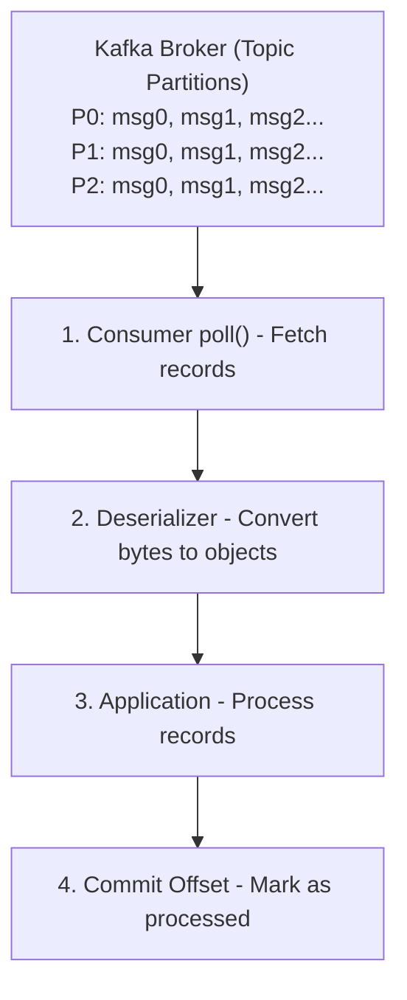
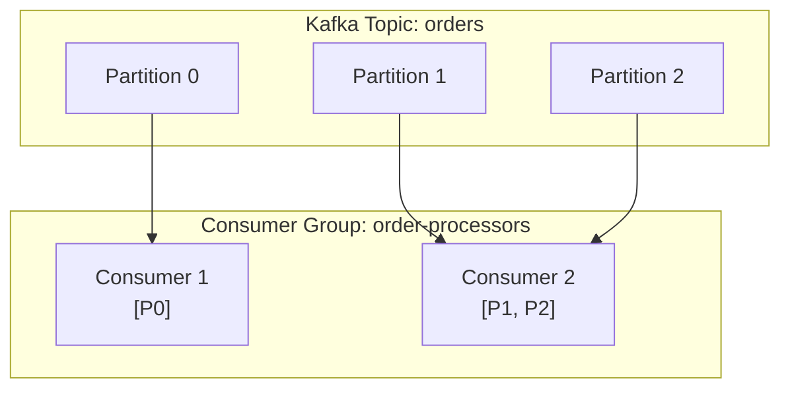

# Module 5: Kafka Consumers

## Overview
This module focuses on Kafka consumers - applications that read events from Kafka topics. You'll learn how to build robust consumers, manage offsets effectively, work with consumer groups, handle rebalancing, and monitor consumer lag.

**Duration:** 3 hours

## Learning Objectives
By the end of this module, you will be able to:
- Build consumers in Java, Python, and Node.js
- Implement consumer groups for parallelism
- Manage offsets with auto and manual commit strategies
- Handle consumer rebalancing gracefully
- Monitor consumer lag and performance
- Implement error handling and dead letter queues
- Understand and implement exactly-once semantics

## Table of Contents
1. [Consumer Architecture](#consumer-architecture)
2. [Creating Consumers](#creating-consumers)
3. [Consumer Configuration](#consumer-configuration)
4. [Message Deserialization](#message-deserialization)
5. [Subscribing to Topics](#subscribing-to-topics)
6. [Consumer Groups](#consumer-groups)
7. [Partition Assignment Strategies](#partition-assignment-strategies)
8. [Offset Management](#offset-management)
9. [Rebalancing](#rebalancing)
10. [Consumer Lag](#consumer-lag)
11. [Error Handling](#error-handling)
12. [Exactly-Once Semantics](#exactly-once-semantics)
13. [Best Practices](#best-practices)
14. [Summary](#summary)

---

## Consumer Architecture

### How Consumers Work



### Consumer Components

1. **Consumer**: Main API for consuming messages
2. **Deserializer**: Converts bytes to objects
3. **Coordinator**: Manages group membership and rebalancing
4. **Fetcher**: Fetches records from brokers
5. **Offset Manager**: Tracks and commits offsets

---

## Creating Consumers

### Java Consumer

**Simple Consumer:**
```typescript
import { Kafka, Consumer, EachMessagePayload } from 'kafkajs';

class SimpleConsumer {
  private kafka: Kafka;
  private consumer: Consumer;

  constructor() {
    // Configure consumer
    this.kafka = new Kafka({
      clientId: 'my-consumer',
      brokers: ['localhost:9092']
    });
    
    this.consumer = this.kafka.consumer({
      groupId: 'my-consumer-group'
    });
  }

  async consume(): Promise<void> {
    // Connect and subscribe
    await this.consumer.connect();
    await this.consumer.subscribe({ 
      topic: 'my-topic', 
      fromBeginning: true 
    });
    
    // Consume messages
    await this.consumer.run({
      eachMessage: async ({ topic, partition, message }: EachMessagePayload) => {
        console.log(
          `Received: key=${message.key?.toString()}, ` +
          `value=${message.value?.toString()}, ` +
          `partition=${partition}, ` +
          `offset=${message.offset}`
        );
      }
    });
  }

  async disconnect(): Promise<void> {
    await this.consumer.disconnect();
  }
}

// Usage
async function main() {
  const consumer = new SimpleConsumer();
  
  try {
    await consumer.consume();
  } catch (error) {
    console.error('Error:', error);
    await consumer.disconnect();
  }
}

main();
```

### Python Consumer

```typescript
import { Kafka, Consumer } from 'kafkajs';

interface MessageValue {
  [key: string]: any;
}

class PythonStyleConsumer {
  private consumer: Consumer;

  constructor(brokers: string[], groupId: string) {
    const kafka = new Kafka({ brokers });
    this.consumer = kafka.consumer({ groupId });
  }

  async consumeMessages(topic: string): Promise<void> {
    await this.consumer.connect();
    await this.consumer.subscribe({ topic, fromBeginning: true });
    
    await this.consumer.run({
      eachMessage: async ({ message }) => {
        const key = message.key?.toString();
        const value: MessageValue = JSON.parse(message.value?.toString() || '{}');
        
        console.log(
          `Received: key=${key}, value=${JSON.stringify(value)}, ` +
          `partition=${message.partition}, offset=${message.offset}`
        );
      }
    });
  }

  async close(): Promise<void> {
    await this.consumer.disconnect();
  }
}

// Usage
const consumer = new PythonStyleConsumer(
  ['localhost:9092'],
  'my-consumer-group'
);

await consumer.consumeMessages('my-topic');
```

### Node.js Consumer

```typescript
import { Kafka, Consumer, EachMessagePayload } from 'kafkajs';

const kafka = new Kafka({
  clientId: 'my-consumer',
  brokers: ['localhost:9092']
});

const consumer: Consumer = kafka.consumer({ 
  groupId: 'my-consumer-group' 
});

async function consume(): Promise<void> {
  await consumer.connect();
  await consumer.subscribe({ 
    topic: 'my-topic', 
    fromBeginning: true 
  });
  
  await consumer.run({
    eachMessage: async ({ topic, partition, message }: EachMessagePayload) => {
      console.log({
        topic,
        partition,
        offset: message.offset,
        key: message.key?.toString(),
        value: message.value?.toString()
      });
    }
  });
}

consume().catch(console.error);
```

---

## Consumer Configuration

### Essential Properties

| Property | Description | Default | Recommendation |
|----------|-------------|---------|----------------|
| `bootstrap.servers` | Broker addresses | None (required) | Multiple brokers |
| `group.id` | Consumer group ID | None (required) | Unique per group |
| `key.deserializer` | Key deserializer | None (required) | StringDeserializer |
| `value.deserializer` | Value deserializer | None (required) | StringDeserializer |
| `auto.offset.reset` | Offset to start when no offset | latest | earliest or latest |
| `enable.auto.commit` | Auto-commit offsets | true | false (manual control) |
| `max.poll.records` | Max records per poll | 500 | Tune based on processing time |
| `max.poll.interval.ms` | Max time between polls | 300000 | Increase for slow processing |
| `session.timeout.ms` | Max time without heartbeat | 45000 | 10000-45000 |
| `heartbeat.interval.ms` | Heartbeat frequency | 3000 | session.timeout.ms / 3 |

### Configuration Patterns

**Fast Processing:**
```java
props.put(ConsumerConfig.MAX_POLL_RECORDS_CONFIG, 1000);
props.put(ConsumerConfig.FETCH_MIN_BYTES_CONFIG, 50000);
props.put(ConsumerConfig.FETCH_MAX_WAIT_MS_CONFIG, 500);
```

**Slow Processing:**
```java
props.put(ConsumerConfig.MAX_POLL_RECORDS_CONFIG, 10);
props.put(ConsumerConfig.MAX_POLL_INTERVAL_MS_CONFIG, 600000); // 10 minutes
props.put(ConsumerConfig.ENABLE_AUTO_COMMIT_CONFIG, false); // Manual commit
```

**At-Most-Once (Fast, can lose data):**
```java
props.put(ConsumerConfig.ENABLE_AUTO_COMMIT_CONFIG, true);
props.put(ConsumerConfig.AUTO_COMMIT_INTERVAL_MS_CONFIG, 1000);
```

**At-Least-Once (Reliable, may duplicate):**
```java
props.put(ConsumerConfig.ENABLE_AUTO_COMMIT_CONFIG, false);
// Commit after processing
consumer.commitSync();
```

---

## Message Deserialization

### Custom Deserializer (Java)

```java
import com.fasterxml.jackson.databind.ObjectMapper;
import org.apache.kafka.common.serialization.Deserializer;

public class JsonDeserializer<T> implements Deserializer<T> {
    private final ObjectMapper objectMapper = new ObjectMapper();
    private Class<T> type;
    
    public JsonDeserializer(Class<T> type) {
        this.type = type;
    }
    
    @Override
    public T deserialize(String topic, byte[] data) {
        if (data == null) return null;
        try {
            return objectMapper.readValue(data, type);
        } catch (Exception e) {
            throw new RuntimeException("Error deserializing", e);
        }
    }
}
```

**Usage:**
```java
props.put(ConsumerConfig.VALUE_DESERIALIZER_CLASS_CONFIG, JsonDeserializer.class);

// Or use custom instance
KafkaConsumer<String, OrderEvent> consumer = new KafkaConsumer<>(
    props,
    new StringDeserializer(),
    new JsonDeserializer<>(OrderEvent.class)
);
```

### Error Handling in Deserialization

```java
props.put(ConsumerConfig.VALUE_DESERIALIZER_CLASS_CONFIG, SafeDeserializer.class);

public class SafeDeserializer implements Deserializer<String> {
    @Override
    public String deserialize(String topic, byte[] data) {
        try {
            return new String(data, StandardCharsets.UTF_8);
        } catch (Exception e) {
            // Log and return null or default value
            log.error("Deserialization error for topic {}", topic, e);
            return null;
        }
    }
}
```

---

## Subscribing to Topics

### Subscribe to Single Topic

```java
consumer.subscribe(Collections.singletonList("my-topic"));
```

### Subscribe to Multiple Topics

```java
consumer.subscribe(Arrays.asList("topic1", "topic2", "topic3"));
```

### Subscribe with Pattern

```java
// Subscribe to all topics starting with "user-"
consumer.subscribe(Pattern.compile("user-.*"));
```

### Assign Specific Partitions

```java
// Manual partition assignment (no consumer group)
TopicPartition partition0 = new TopicPartition("my-topic", 0);
TopicPartition partition1 = new TopicPartition("my-topic", 1);
consumer.assign(Arrays.asList(partition0, partition1));

// Seek to specific offset
consumer.seek(partition0, 100);
```

---

## Consumer Groups

### How Consumer Groups Work

```
Topic: "orders" (3 partitions)
Consumer Group: "order-processors"



**Key Properties:**
- Each partition assigned to exactly one consumer in group
- Each consumer can handle multiple partitions
- Adding consumers increases parallelism (up to partition count)
- Removing consumers triggers rebalance

### Multiple Consumer Groups

```
Topic: "events"

Group A (Real-time):     Group B (Analytics):
Consumer A1: [P0, P1]    Consumer B1: [P0]
Consumer A2: [P2]        Consumer B2: [P1]
                         Consumer B3: [P2]
```

Each group maintains independent offsets!

---

## Partition Assignment Strategies

### 1. RangeAssignor (Default)

Assigns contiguous partitions to each consumer.

```
Topic with 6 partitions, 3 consumers:
Consumer 1: [P0, P1]
Consumer 2: [P2, P3]
Consumer 3: [P4, P5]
```

**Pro:** Simple, intuitive
**Con:** Uneven distribution with multiple topics

### 2. RoundRobinAssignor

Distributes partitions evenly in round-robin fashion.

```
Topics: T1 (3 partitions), T2 (3 partitions)
3 consumers:
Consumer 1: [T1-P0, T2-P1]
Consumer 2: [T1-P1, T2-P2]
Consumer 3: [T1-P2, T2-P0]
```

**Pro:** Even distribution
**Con:** May not respect co-partitioning

### 3. StickyAssignor

Minimizes partition movement during rebalance.

**Pro:** Reduces rebalance overhead
**Pro:** Maintains as many assignments as possible

### 4. CooperativeStickyAssignor

Like StickyAssignor but with cooperative rebalancing.

**Pro:** No stop-the-world rebalancing
**Pro:** Incremental rebalancing

**Configuration:**
```java
props.put(ConsumerConfig.PARTITION_ASSIGNMENT_STRATEGY_CONFIG, 
    CooperativeStickyAssignor.class.getName());
```

---

## Offset Management

### Offset Commit Strategies

#### 1. **Auto-Commit (Simplest)**

```java
props.put(ConsumerConfig.ENABLE_AUTO_COMMIT_CONFIG, true);
props.put(ConsumerConfig.AUTO_COMMIT_INTERVAL_MS_CONFIG, 5000);

while (true) {
    ConsumerRecords<String, String> records = consumer.poll(Duration.ofMillis(100));
    for (ConsumerRecord<String, String> record : records) {
        processRecord(record);
    }
    // Offsets committed automatically every 5 seconds
}
```

**Risk:** Message loss or duplicates if crash between commit and processing

#### 2. **Manual Commit - Synchronous**

```java
props.put(ConsumerConfig.ENABLE_AUTO_COMMIT_CONFIG, false);

while (true) {
    ConsumerRecords<String, String> records = consumer.poll(Duration.ofMillis(100));
    for (ConsumerRecord<String, String> record : records) {
        processRecord(record);
    }
    consumer.commitSync(); // Block until commit succeeds
}
```

**Pro:** Simple, reliable
**Con:** Blocks, lower throughput

#### 3. **Manual Commit - Asynchronous**

```java
while (true) {
    ConsumerRecords<String, String> records = consumer.poll(Duration.ofMillis(100));
    for (ConsumerRecord<String, String> record : records) {
        processRecord(record);
    }
    consumer.commitAsync((offsets, exception) -> {
        if (exception != null) {
            log.error("Commit failed", exception);
        }
    });
}
```

**Pro:** Non-blocking, higher throughput
**Con:** May commit out of order

#### 4. **Per-Record Commit**

```java
for (ConsumerRecord<String, String> record : records) {
    processRecord(record);
    
    // Commit this specific offset
    Map<TopicPartition, OffsetAndMetadata> offsets = new HashMap<>();
    offsets.put(
        new TopicPartition(record.topic(), record.partition()),
        new OffsetAndMetadata(record.offset() + 1)
    );
    consumer.commitSync(offsets);
}
```

**Pro:** Maximum reliability
**Con:** Very slow

#### 5. **Batch Commit**

```java
int count = 0;
while (true) {
    ConsumerRecords<String, String> records = consumer.poll(Duration.ofMillis(100));
    for (ConsumerRecord<String, String> record : records) {
        processRecord(record);
        count++;
        
        if (count % 100 == 0) {
            consumer.commitSync();
        }
    }
}
```

**Pro:** Balance of reliability and performance
**Con:** May reprocess up to batch size on crash

### Seeking to Specific Offsets

```java
// Seek to beginning
consumer.seekToBeginning(consumer.assignment());

// Seek to end
consumer.seekToEnd(consumer.assignment());

// Seek to specific offset
TopicPartition partition = new TopicPartition("my-topic", 0);
consumer.seek(partition, 100);

// Seek to timestamp
Map<TopicPartition, Long> timestamps = new HashMap<>();
timestamps.put(partition, System.currentTimeMillis() - 3600000); // 1 hour ago
Map<TopicPartition, OffsetAndTimestamp> offsets = consumer.offsetsForTimes(timestamps);
offsets.forEach((tp, offsetAndTimestamp) -> {
    consumer.seek(tp, offsetAndTimestamp.offset());
});
```

---

## Rebalancing

### What Triggers Rebalancing?

1. Consumer joins the group
2. Consumer leaves the group (graceful shutdown)
3. Consumer crashes (no heartbeat)
4. New partitions added to subscribed topics
5. Pattern subscription matches new topics

### Rebalancing Process

**Eager Rebalancing (Old):**
```
1. All consumers stop consuming
2. Revoke all partitions
3. Reassign all partitions
4. Resume consuming
```

**Cooperative Rebalancing (New):**
```
1. Identify partitions to move
2. Revoke only those partitions
3. Reassign them incrementally
4. Other consumers keep running
```

### Rebalance Listeners

```java
consumer.subscribe(Collections.singletonList("my-topic"), new ConsumerRebalanceListener() {
    @Override
    public void onPartitionsRevoked(Collection<TopicPartition> partitions) {
        // Called before rebalancing starts
        System.out.println("Partitions revoked: " + partitions);
        
        // Commit offsets for revoked partitions
        consumer.commitSync();
        
        // Clean up resources
        closeConnections();
    }
    
    @Override
    public void onPartitionsAssigned(Collection<TopicPartition> partitions) {
        // Called after rebalancing completes
        System.out.println("Partitions assigned: " + partitions);
        
        // Initialize resources for new partitions
        initializeConnections();
    }
});
```

### Avoiding Rebalances

**Problem:** Processing takes too long
```java
// ❌ This will cause rebalances
while (true) {
    ConsumerRecords<String, String> records = consumer.poll(Duration.ofMillis(100));
    for (ConsumerRecord<String, String> record : records) {
        slowProcessing(record); // Takes 10 minutes!
    }
}
```

**Solution 1:** Increase `max.poll.interval.ms`
```java
props.put(ConsumerConfig.MAX_POLL_INTERVAL_MS_CONFIG, 1800000); // 30 minutes
```

**Solution 2:** Reduce `max.poll.records`
```java
props.put(ConsumerConfig.MAX_POLL_RECORDS_CONFIG, 10); // Fewer records per poll
```

**Solution 3:** Process asynchronously
```java
ExecutorService executor = Executors.newFixedThreadPool(10);

while (true) {
    ConsumerRecords<String, String> records = consumer.poll(Duration.ofMillis(100));
    for (ConsumerRecord<String, String> record : records) {
        executor.submit(() -> slowProcessing(record));
    }
    consumer.commitAsync(); // Commit after submitting to threads
}
```

---

## Consumer Lag

### What is Consumer Lag?

```
Partition 0:
Producer:  [0][1][2][3][4][5][6][7][8][9]  ← Latest offset: 10
Consumer:               ↑                   ← Consumer offset: 5
                        Lag: 5 messages
```

**Consumer Lag** = Latest Offset - Consumer Offset

### Checking Lag

**CLI:**
```bash
kafka-consumer-groups.sh --describe \
  --group my-consumer-group \
  --bootstrap-server localhost:9092
```

**Output:**
```
GROUP    TOPIC      PARTITION  CURRENT-OFFSET  LOG-END-OFFSET  LAG
my-group my-topic   0          100             150             50
my-group my-topic   1          200             200             0
my-group my-topic   2          150             180             30
```

**Programmatically (Java):**
```java
Map<TopicPartition, Long> endOffsets = consumer.endOffsets(consumer.assignment());
Map<TopicPartition, Long> currentOffsets = new HashMap<>();

for (TopicPartition partition : consumer.assignment()) {
    long currentOffset = consumer.position(partition);
    long endOffset = endOffsets.get(partition);
    long lag = endOffset - currentOffset;
    System.out.println("Partition " + partition + " lag: " + lag);
}
```

### Reducing Lag

**1. Add more consumers (up to partition count):**
```bash
# Scale from 1 to 3 consumers
java -jar consumer.jar & # Consumer 1
java -jar consumer.jar & # Consumer 2
java -jar consumer.jar & # Consumer 3
```

**2. Optimize processing:**
```java
// Batch database inserts
List<Record> batch = new ArrayList<>();
for (ConsumerRecord<String, String> record : records) {
    batch.add(parseRecord(record));
    if (batch.size() >= 100) {
        database.batchInsert(batch);
        batch.clear();
    }
}
```

**3. Increase parallelism:**
```java
// Process records in parallel
records.forEach(record -> 
    executor.submit(() -> processRecord(record))
);
```

**4. Increase partitions (requires rebalance):**
```bash
kafka-topics.sh --alter \
  --topic my-topic \
  --partitions 10 \
  --bootstrap-server localhost:9092
```

---

## Error Handling

### Handling Processing Errors

```java
while (true) {
    ConsumerRecords<String, String> records = consumer.poll(Duration.ofMillis(100));
    
    for (ConsumerRecord<String, String> record : records) {
        try {
            processRecord(record);
        } catch (RetriableException e) {
            // Retry logic
            int retries = 0;
            while (retries < 3) {
                try {
                    processRecord(record);
                    break;
                } catch (Exception ex) {
                    retries++;
                    Thread.sleep(1000 * retries);
                }
            }
            if (retries == 3) {
                sendToDeadLetterQueue(record);
            }
        } catch (Exception e) {
            // Non-retriable error
            log.error("Fatal error processing record", e);
            sendToDeadLetterQueue(record);
        }
    }
    
    consumer.commitSync();
}
```

### Dead Letter Queue Pattern

```java
KafkaProducer<String, String> dlqProducer = new KafkaProducer<>(producerProps);

private void sendToDeadLetterQueue(ConsumerRecord<String, String> record) {
    ProducerRecord<String, String> dlqRecord = new ProducerRecord<>(
        "my-topic-dlq", // Dead letter queue topic
        record.key(),
        record.value()
    );
    
    // Add headers with error info
    dlqRecord.headers().add("original-topic", record.topic().getBytes());
    dlqRecord.headers().add("original-partition", 
        String.valueOf(record.partition()).getBytes());
    dlqRecord.headers().add("original-offset", 
        String.valueOf(record.offset()).getBytes());
    dlqRecord.headers().add("error-timestamp", 
        String.valueOf(System.currentTimeMillis()).getBytes());
    
    dlqProducer.send(dlqRecord);
}
```

---

## Exactly-Once Semantics

### Problem: At-Least-Once Can Duplicate

```
1. Consumer reads message
2. Processes message
3. Crash before commit
4. Consumer restarts, reads same message again
```

### Solution: Transactional Read-Process-Write

```java
// Producer configuration
props.put(ProducerConfig.TRANSACTIONAL_ID_CONFIG, "my-transactional-id");
props.put(ProducerConfig.ENABLE_IDEMPOTENCE_CONFIG, true);

// Consumer configuration
props.put(ConsumerConfig.ISOLATION_LEVEL_CONFIG, "read_committed");

// Initialize transactions
producer.initTransactions();

// Read-process-write loop
while (true) {
    ConsumerRecords<String, String> records = consumer.poll(Duration.ofMillis(100));
    
    if (!records.isEmpty()) {
        producer.beginTransaction();
        try {
            for (ConsumerRecord<String, String> record : records) {
                // Process and produce
                String result = processRecord(record);
                producer.send(new ProducerRecord<>("output-topic", result));
            }
            
            // Commit offsets as part of transaction
            Map<TopicPartition, OffsetAndMetadata> offsets = new HashMap<>();
            for (TopicPartition partition : records.partitions()) {
                List<ConsumerRecord<String, String>> partitionRecords = records.records(partition);
                long lastOffset = partitionRecords.get(partitionRecords.size() - 1).offset();
                offsets.put(partition, new OffsetAndMetadata(lastOffset + 1));
            }
            producer.sendOffsetsToTransaction(offsets, consumer.groupMetadata());
            
            // Commit transaction
            producer.commitTransaction();
        } catch (Exception e) {
            producer.abortTransaction();
        }
    }
}
```

---

## Best Practices

### 1. Use Manual Offset Commit
```java
props.put(ConsumerConfig.ENABLE_AUTO_COMMIT_CONFIG, false);
consumer.commitSync(); // After processing
```

### 2. Handle Rebalances Gracefully
```java
consumer.subscribe(topics, new ConsumerRebalanceListener() {
    @Override
    public void onPartitionsRevoked(Collection<TopicPartition> partitions) {
        consumer.commitSync(); // Commit before rebalance
    }
    @Override
    public void onPartitionsAssigned(Collection<TopicPartition> partitions) {
        // Initialize state
    }
});
```

### 3. Monitor Consumer Lag
```bash
# Set up monitoring alerts for lag > threshold
kafka-consumer-groups.sh --describe --group my-group --bootstrap-server localhost:9092
```

### 4. Tune max.poll.records
```java
// Adjust based on processing time
props.put(ConsumerConfig.MAX_POLL_RECORDS_CONFIG, 100);
```

### 5. Close Consumers Gracefully
```java
Runtime.getRuntime().addShutdownHook(new Thread(() -> {
    consumer.wakeup(); // Interrupt poll()
}));

try {
    while (true) {
        ConsumerRecords<String, String> records = consumer.poll(Duration.ofMillis(100));
        // Process records
    }
} catch (WakeupException e) {
    // Expected on shutdown
} finally {
    consumer.close(); // Triggers rebalance, releases partitions
}
```

### 6. Use Cooperative Rebalancing
```java
props.put(ConsumerConfig.PARTITION_ASSIGNMENT_STRATEGY_CONFIG,
    CooperativeStickyAssignor.class.getName());
```

### 7. Implement Retry and DLQ
```java
try {
    processRecord(record);
} catch (Exception e) {
    if (isRetriable(e)) {
        retryWithBackoff(record);
    } else {
        sendToDeadLetterQueue(record);
    }
}
```

---

## Summary

In this module, you learned:

1. **Consumer Architecture**: How consumers fetch and process messages
2. **Creating Consumers**: Building consumers in Java, Python, and Node.js
3. **Configuration**: Essential properties for different use cases
4. **Consumer Groups**: Parallel processing with multiple consumers
5. **Partition Assignment**: Different strategies for distributing partitions
6. **Offset Management**: Auto and manual commit strategies
7. **Rebalancing**: Understanding and handling partition reassignment
8. **Consumer Lag**: Monitoring and reducing lag
9. **Error Handling**: Retry logic and dead letter queues
10. **Exactly-Once**: Transactional semantics for critical applications

---

## Key Takeaways

✅ **Consumer groups enable parallelism** - Scale by adding consumers

✅ **Manual commit is safer** - Control when offsets are committed

✅ **Monitor consumer lag** - Critical for performance

✅ **Handle rebalances gracefully** - Use rebalance listeners

✅ **Tune max.poll.records** - Based on processing time

✅ **Use cooperative rebalancing** - Minimize disruption

✅ **Implement DLQ pattern** - For error handling

✅ **Close consumers gracefully** - Trigger proper cleanup

---

## What's Next?

Now that you understand producers and consumers, the next module covers:
- Creating and managing topics
- Partition and replication configuration
- Retention policies
- Log compaction
- Schema management

**Continue to [Module 6: Topics, Partitions, and Data Management](module-06-data-management.md)**

---

## Additional Resources

- [Kafka Consumer API Documentation](https://kafka.apache.org/documentation/#consumerapi)
- [Consumer Configs Reference](https://kafka.apache.org/documentation/#consumerconfigs)
- [Consumer Group Protocol](https://kafka.apache.org/documentation/#consumerconfigs_partition.assignment.strategy)
- [Exactly-Once Semantics](https://kafka.apache.org/documentation/#semantics)

---

**[📝 Practice Exercises](exercise/module-05-exercises.md)** | **[📚 Back to Course Home](README.md)**
