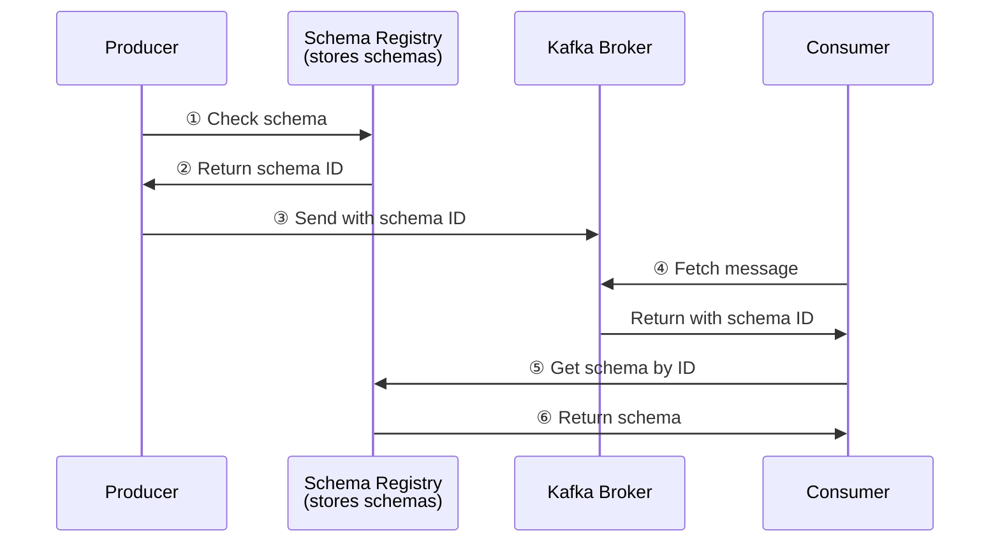

# Module 6: Topics, Partitions, and Data Management

## Overview
This module covers how to design, create, and manage Kafka topics effectively. You'll learn about partition count selection, replication strategies, retention policies, log compaction, and schema management using Schema Registry.

**Duration:** 2 hours

## Learning Objectives
By the end of this module, you will be able to:
- Design topics for optimal performance and scalability
- Configure partition count and replication factor
- Implement retention policies (time-based and size-based)
- Use log compaction for state management
- Manage topic configurations dynamically
- Implement schema management with Schema Registry
- Apply best practices for topic design

## Table of Contents
1. [Creating and Managing Topics](#creating-and-managing-topics)
2. [Topic Configuration Parameters](#topic-configuration-parameters)
3. [Partition Count and Replication Factor](#partition-count-and-replication-factor)
4. [Retention Policies](#retention-policies)
5. [Topic Compaction](#topic-compaction)
6. [Log Cleanup Policies](#log-cleanup-policies)
7. [Increasing Partitions](#increasing-partitions)
8. [Topic Naming Conventions](#topic-naming-conventions)
9. [Schema Management](#schema-management)
10. [Best Practices](#best-practices)
11. [Summary](#summary)

---

## Creating and Managing Topics

### Creating Topics

**Using CLI:**
```bash
kafka-topics.sh --create \
  --topic orders \
  --bootstrap-server localhost:9092 \
  --partitions 3 \
  --replication-factor 3 \
  --config retention.ms=604800000 \
  --config segment.ms=86400000
```

**Using Admin API (Java):**
```java
import org.apache.kafka.clients.admin.*;
import java.util.*;

Properties props = new Properties();
props.put(AdminClientConfig.BOOTSTRAP_SERVERS_CONFIG, "localhost:9092");

try (AdminClient admin = AdminClient.create(props)) {
    NewTopic newTopic = new NewTopic("orders", 3, (short) 3);
    
    // Topic-specific configurations
    Map<String, String> configs = new HashMap<>();
    configs.put("retention.ms", "604800000"); // 7 days
    configs.put("segment.ms", "86400000");    // 1 day
    newTopic.configs(configs);
    
    CreateTopicsResult result = admin.createTopics(Collections.singleton(newTopic));
    result.all().get(); // Block until complete
    System.out.println("Topic created successfully");
}
```

**Using Python:**
```python
from kafka.admin import KafkaAdminClient, NewTopic

admin_client = KafkaAdminClient(bootstrap_servers=['localhost:9092'])

topic = NewTopic(
    name='orders',
    num_partitions=3,
    replication_factor=3,
    topic_configs={
        'retention.ms': '604800000',
        'segment.ms': '86400000'
    }
)

admin_client.create_topics([topic])
print("Topic created successfully")
```

### Listing Topics

```bash
kafka-topics.sh --list --bootstrap-server localhost:9092
```

### Describing Topics

```bash
kafka-topics.sh --describe \
  --topic orders \
  --bootstrap-server localhost:9092
```

**Output:**
```
Topic: orders
PartitionCount: 3
ReplicationFactor: 3
Configs: retention.ms=604800000,segment.ms=86400000

Topic: orders	Partition: 0	Leader: 1	Replicas: 1,2,3	Isr: 1,2,3
Topic: orders	Partition: 1	Leader: 2	Replicas: 2,3,1	Isr: 2,3,1
Topic: orders	Partition: 2	Leader: 3	Replicas: 3,1,2	Isr: 3,1,2
```

### Deleting Topics

```bash
kafka-topics.sh --delete \
  --topic orders \
  --bootstrap-server localhost:9092
```

**Note:** Requires `delete.topic.enable=true` in broker config

### Altering Topics

```bash
# Increase partitions (cannot decrease!)
kafka-topics.sh --alter \
  --topic orders \
  --partitions 5 \
  --bootstrap-server localhost:9092

# Alter configurations
kafka-configs.sh --alter \
  --topic orders \
  --add-config retention.ms=864000000 \
  --bootstrap-server localhost:9092
```

---

## Topic Configuration Parameters

### Key Configuration Properties

| Property | Description | Default | Range |
|----------|-------------|---------|-------|
| `retention.ms` | Time to keep messages | 604800000 (7 days) | Long |
| `retention.bytes` | Max bytes per partition | -1 (unlimited) | Long |
| `segment.bytes` | Segment file size | 1073741824 (1GB) | Int |
| `segment.ms` | Time before rolling segment | 604800000 (7 days) | Long |
| `cleanup.policy` | delete or compact | delete | String |
| `compression.type` | Compression type | producer | String |
| `max.message.bytes` | Max message size | 1048576 (1MB) | Int |
| `min.insync.replicas` | Min ISR for acks=all | 1 | Int |
| `unclean.leader.election.enable` | Allow out-of-sync leaders | false | Boolean |

### Configuration Levels

**1. Broker Default** (server.properties)
```properties
log.retention.hours=168
log.segment.bytes=1073741824
```

**2. Topic-Specific** (overrides broker default)
```bash
kafka-configs.sh --alter \
  --topic my-topic \
  --add-config retention.ms=86400000 \
  --bootstrap-server localhost:9092
```

**3. View Effective Configuration**
```bash
kafka-configs.sh --describe \
  --topic my-topic \
  --bootstrap-server localhost:9092
```

---

## Partition Count and Replication Factor

### Choosing Partition Count

**Factors to Consider:**

1. **Throughput Requirements**
   - Target: 10MB/s, Single partition: 2MB/s → Need 5+ partitions

2. **Consumer Parallelism**
   - Want 10 consumers in group → Need 10+ partitions

3. **Broker Count**
   - 3 brokers → Start with 6-9 partitions (2-3x broker count)

4. **Message Ordering**
   - Need total order → 1 partition
   - Need order per key → Multiple partitions OK

5. **Future Growth**
   - Can increase partitions later (but not decrease)
   - Start conservatively, scale up as needed

### Partition Count Guidelines

```
Small clusters (1-3 brokers):   3-12 partitions
Medium clusters (4-10 brokers): 12-50 partitions
Large clusters (10+ brokers):   50-100+ partitions
```

**Formula:**
```
Partitions = max(
    throughput_required / partition_capacity,
    max_consumers_needed
)
```

### Replication Factor

**Common Values:**
- **1**: No redundancy (dev/testing only)
- **2**: Can tolerate 1 broker failure
- **3**: Can tolerate 2 broker failures (production standard)
- **5**: High availability (mission-critical)

**Rule of Thumb:**
```
Replication Factor = min(n + 1, brokers_count)
where n = number of failures to tolerate
```

**Example Configurations:**

**Dev/Testing:**
```bash
kafka-topics.sh --create \
  --topic test-topic \
  --partitions 1 \
  --replication-factor 1 \
  --bootstrap-server localhost:9092
```

**Production - Standard:**
```bash
kafka-topics.sh --create \
  --topic orders \
  --partitions 12 \
  --replication-factor 3 \
  --config min.insync.replicas=2 \
  --bootstrap-server localhost:9092
```

**Production - High Availability:**
```bash
kafka-topics.sh --create \
  --topic critical-events \
  --partitions 20 \
  --replication-factor 5 \
  --config min.insync.replicas=3 \
  --bootstrap-server localhost:9092
```

---

## Retention Policies

### Time-Based Retention

**Configure retention period:**
```bash
# Using retention.ms (milliseconds)
kafka-configs.sh --alter \
  --topic orders \
  --add-config retention.ms=86400000 \  # 1 day
  --bootstrap-server localhost:9092
```

**Common Values:**
```
1 hour:   3600000 ms
1 day:    86400000 ms
7 days:   604800000 ms
30 days:  2592000000 ms
Forever:  -1
```

**Example:**
```
Segment 1: Messages from day 1-7   [7 days old, kept]
Segment 2: Messages from day 8-14  [14 days old, kept]
Segment 3: Messages from day 15+   [eligibile for deletion]
```

### Size-Based Retention

**Configure retention size:**
```bash
# Max bytes per partition
kafka-configs.sh --alter \
  --topic orders \
  --add-config retention.bytes=1073741824 \  # 1GB
  --bootstrap-server localhost:9092
```

**How it works:**
```
Partition has segments totaling 1.2GB:
Segment 1: 200MB [old]  ← Deleted
Segment 2: 300MB [old]  ← Deleted
Segment 3: 400MB        ← Kept
Segment 4: 300MB [new]  ← Kept
After cleanup: 700MB total
```

### Combined Retention

**Both time AND size:**
```bash
kafka-configs.sh --alter \
  --topic orders \
  --add-config retention.ms=604800000 \
  --add-config retention.bytes=10737418240 \
  --bootstrap-server localhost:9092
```

**Whichever limit is reached first triggers deletion**

### Retention Examples

**Short-Term Events (1 day):**
```bash
kafka-topics.sh --create \
  --topic user-clicks \
  --partitions 10 \
  --replication-factor 3 \
  --config retention.ms=86400000 \
  --bootstrap-server localhost:9092
```

**Medium-Term Logs (7 days):**
```bash
kafka-topics.sh --create \
  --topic application-logs \
  --partitions 5 \
  --replication-factor 3 \
  --config retention.ms=604800000 \
  --bootstrap-server localhost:9092
```

**Long-Term Archive (1 year):**
```bash
kafka-topics.sh --create \
  --topic audit-events \
  --partitions 20 \
  --replication-factor 3 \
  --config retention.ms=31536000000 \
  --bootstrap-server localhost:9092
```

**Infinite Retention:**
```bash
kafka-topics.sh --create \
  --topic event-store \
  --partitions 30 \
  --replication-factor 3 \
  --config retention.ms=-1 \
  --bootstrap-server localhost:9092
```

---

## Topic Compaction

### What is Log Compaction?

**Regular Delete Policy:**
```
Time →
[K1:V1][K2:V1][K1:V2][K3:V1][K1:V3] → [deleted after retention]
```

**Compacted Log:**
```
[K1:V1][K2:V1][K1:V2][K3:V1][K1:V3]
            ↓ Compaction ↓
      [K2:V1][K3:V1][K1:V3]  ← Only latest value per key kept
```

### Use Cases

1. **Database Change Streams**
   - Latest state of each record

2. **Configuration Management**
   - Current configuration per service

3. **Cache Rebuilding**
   - Rebuild cache from compacted log

4. **State Stores**
   - Kafka Streams state stores

### Enabling Compaction

```bash
kafka-topics.sh --create \
  --topic user-profiles \
  --partitions 10 \
  --replication-factor 3 \
  --config cleanup.policy=compact \
  --config min.cleanable.dirty.ratio=0.5 \
  --config segment.ms=86400000 \
  --bootstrap-server localhost:9092
```

### Compaction Configuration

| Property | Description | Default |
|----------|-------------|---------|
| `cleanup.policy` | compact, delete, or compact,delete | delete |
| `min.cleanable.dirty.ratio` | Min ratio of dirty to total log | 0.5 |
| `delete.retention.ms` | Time to keep tombstones | 86400000 (1 day) |
| `segment.ms` | Time before segment eligible for compaction | 604800000 |
| `min.compaction.lag.ms` | Min time message stays uncompacted | 0 |
| `max.compaction.lag.ms` | Max time before compaction | Long.MAX_VALUE |

### Tombstone Records (Deletes)

**Delete a key from compacted topic:**
```java
// Send null value
ProducerRecord<String, String> tombstone = new ProducerRecord<>(
    "user-profiles",
    "user-123",
    null  // null value = tombstone
);
producer.send(tombstone);
```

**Effect:**
```
Before: [user-123:{"name":"John"}][user-123:null]
After compaction: [user-123:null]  ← Kept for delete.retention.ms
After retention:   []              ← Completely removed
```

### Compaction Example

**Use case: User Profile Store**

```java
// Producer
public class UserProfileProducer {
    public void updateProfile(String userId, UserProfile profile) {
        ProducerRecord<String, String> record = new ProducerRecord<>(
            "user-profiles",
            userId,                          // Key
            serializeProfile(profile)        // Value
        );
        producer.send(record);
    }
    
    public void deleteProfile(String userId) {
        ProducerRecord<String, String> tombstone = new ProducerRecord<>(
            "user-profiles",
            userId,
            null  // Tombstone
        );
        producer.send(tombstone);
    }
}

// Consumer (rebuild cache)
public class UserProfileCache {
    private Map<String, UserProfile> cache = new ConcurrentHashMap<>();
    
    public void rebuildCache() {
        consumer.seekToBeginning(consumer.assignment());
        
        while (true) {
            ConsumerRecords<String, String> records = consumer.poll(Duration.ofMillis(100));
            
            for (ConsumerRecord<String, String> record : records) {
                if (record.value() == null) {
                    // Tombstone - remove from cache
                    cache.remove(record.key());
                } else {
                    // Update cache
                    cache.put(record.key(), deserializeProfile(record.value()));
                }
            }
            
            if (records.isEmpty()) break; // Caught up
        }
    }
}
```

---

## Log Cleanup Policies

### cleanup.policy=delete (Default)

**Behavior:**
- Segments deleted after retention period
- Messages deleted permanently
- No key-based cleanup

**Configuration:**
```bash
kafka-configs.sh --alter \
  --topic events \
  --add-config cleanup.policy=delete \
  --add-config retention.ms=604800000 \
  --bootstrap-server localhost:9092
```

### cleanup.policy=compact

**Behavior:**
- Keep latest value per key
- Never delete active segment
- Old segments compacted

**Configuration:**
```bash
kafka-configs.sh --alter \
  --topic state-store \
  --add-config cleanup.policy=compact \
  --bootstrap-server localhost:9092
```

### cleanup.policy=compact,delete

**Behavior:**
- Compact AND delete after retention
- Best of both worlds

**Configuration:**
```bash
kafka-configs.sh --alter \
  --topic changelogs \
  --add-config cleanup.policy=compact,delete \
  --add-config retention.ms=604800000 \
  --add-config min.cleanable.dirty.ratio=0.5 \
  --bootstrap-server localhost:9092
```

**Use case:** Keep latest state per key, but also enforce retention limit

---

## Increasing Partitions

### Why Increase Partitions?

1. **Increase throughput**
2. **Add more consumers**
3. **Reduce consumer lag**

### How to Increase

```bash
# Check current partition count
kafka-topics.sh --describe \
  --topic orders \
  --bootstrap-server localhost:9092

# Increase from 3 to 6
kafka-topics.sh --alter \
  --topic orders \
  --partitions 6 \
  --bootstrap-server localhost:9092
```

### Important Considerations

**⚠️ Cannot Decrease Partitions**
- Once increased, cannot decrease
- Plan carefully

**⚠️ Key-Based Partitioning Breaks**
```
Before (3 partitions):
key "user-123" → hash % 3 = 1 → Partition 1

After (6 partitions):
key "user-123" → hash % 6 = 4 → Partition 4 ❌
```

**All new messages for "user-123" go to Partition 4**
**Old messages still in Partition 1**

**Result:** No longer guaranteed to read messages in order!

### Safe Scenarios for Increasing Partitions

✅ **No keys used** (round-robin partitioning)
✅ **Don't need ordering** across partition increase
✅ **Short retention** (old data expires soon)
✅ **One-time migration** (process all old data before new)

### Alternative: Create New Topic

Instead of altering:
```bash
# Create new topic with more partitions
kafka-topics.sh --create \
  --topic orders-v2 \
  --partitions 10 \
  --replication-factor 3 \
  --bootstrap-server localhost:9092

# Migrate producers to new topic
# Consumers process old topic until caught up
# Switch consumers to new topic
```

---

## Topic Naming Conventions

### Best Practices

**Use hierarchical naming:**
```
<environment>.<domain>.<dataset>.<detail>

Examples:
prod.payments.transactions.created
prod.payments.transactions.failed
dev.users.profiles.updated
test.analytics.events.clicks
```

**Alternative patterns:**
```
<domain>_<dataset>_<detail>

Examples:
payments_transactions_created
users_profiles_updated
analytics_events_clicks
```

### Anti-Patterns

❌ **Avoid special characters**
```
orders@prod  # @ not recommended
user-data!   # ! not recommended
```

❌ **Avoid spaces**
```
"order events"  # Requires quoting
```

❌ **Too generic**
```
data        # What data?
events      # What events?
messages    # Too vague
```

✅ **Good naming:**
```
ecommerce.orders.placed
user-service.registrations
payment-gateway.transactions.authorized
```

### Topic Organization

**By Domain:**
```
orders.created
orders.shipped
orders.cancelled
payments.authorized
payments.captured
```

**By Environment:**
```
dev.orders.created
staging.orders.created
prod.orders.created
```

**By Team:**
```
team-checkout.orders.created
team-fulfillment.shipments.created
team-analytics.events.tracked
```

---

## Schema Management

### Why Schema Management?

1. **Data Compatibility**: Ensure producers and consumers agree on format
2. **Evolution**: Safely evolve schemas over time
3. **Documentation**: Self-documenting data formats
4. **Validation**: Catch errors at serialization time

### Confluent Schema Registry

**Architecture:**


### Running Schema Registry

**Docker Compose:**
```yaml
version: '3.8'
services:
  schema-registry:
    image: confluentinc/cp-schema-registry:latest
    depends_on:
      - kafka
    ports:
      - "8081:8081"
    environment:
      SCHEMA_REGISTRY_HOST_NAME: schema-registry
      SCHEMA_REGISTRY_KAFKASTORE_BOOTSTRAP_SERVERS: kafka:9092
      SCHEMA_REGISTRY_LISTENERS: http://0.0.0.0:8081
```

### Avro Schema Example

**Define schema (order.avsc):**
```json
{
  "type": "record",
  "name": "Order",
  "namespace": "com.example",
  "fields": [
    {"name": "orderId", "type": "string"},
    {"name": "userId", "type": "string"},
    {"name": "amount", "type": "double"},
    {"name": "timestamp", "type": "long"},
    {
      "name": "items",
      "type": {
        "type": "array",
        "items": {
          "type": "record",
          "name": "OrderItem",
          "fields": [
            {"name": "productId", "type": "string"},
            {"name": "quantity", "type": "int"},
            {"name": "price", "type": "double"}
          ]
        }
      }
    }
  ]
}
```

**Producer with Avro:**
```java
Properties props = new Properties();
props.put(ProducerConfig.BOOTSTRAP_SERVERS_CONFIG, "localhost:9092");
props.put(ProducerConfig.KEY_SERIALIZER_CLASS_CONFIG, StringSerializer.class);
props.put(ProducerConfig.VALUE_SERIALIZER_CLASS_CONFIG, KafkaAvroSerializer.class);
props.put("schema.registry.url", "http://localhost:8081");

KafkaProducer<String, Order> producer = new KafkaProducer<>(props);

Order order = Order.newBuilder()
    .setOrderId("ord-123")
    .setUserId("user-456")
    .setAmount(99.99)
    .setTimestamp(System.currentTimeMillis())
    .setItems(Arrays.asList(
        OrderItem.newBuilder()
            .setProductId("prod-789")
            .setQuantity(2)
            .setPrice(49.99)
            .build()
    ))
    .build();

ProducerRecord<String, Order> record = new ProducerRecord<>("orders", order.getOrderId(), order);
producer.send(record);
```

**Consumer with Avro:**
```java
Properties props = new Properties();
props.put(ConsumerConfig.BOOTSTRAP_SERVERS_CONFIG, "localhost:9092");
props.put(ConsumerConfig.GROUP_ID_CONFIG, "order-consumers");
props.put(ConsumerConfig.KEY_DESERIALIZER_CLASS_CONFIG, StringDeserializer.class);
props.put(ConsumerConfig.VALUE_DESERIALIZER_CLASS_CONFIG, KafkaAvroDeserializer.class);
props.put("schema.registry.url", "http://localhost:8081");
props.put("specific.avro.reader", "true");

KafkaConsumer<String, Order> consumer = new KafkaConsumer<>(props);
consumer.subscribe(Collections.singletonList("orders"));

while (true) {
    ConsumerRecords<String, Order> records = consumer.poll(Duration.ofMillis(100));
    for (ConsumerRecord<String, Order> record : records) {
        Order order = record.value();
        System.out.println("Order ID: " + order.getOrderId());
        System.out.println("Amount: " + order.getAmount());
    }
}
```

### Schema Evolution

**Backward Compatibility** (new schema can read old data):
```json
{
  "fields": [
    {"name": "orderId", "type": "string"},
    {"name": "amount", "type": "double"},
    {"name": "email", "type": ["null", "string"], "default": null}  ← New optional field
  ]
}
```

**Forward Compatibility** (old schema can read new data):
```json
// Old schema must have defaults for fields it doesn't know about
```

**Full Compatibility** (both forward and backward):
- Add optional fields with defaults
- Remove optional fields

**Compatibility Modes:**
```bash
# Set compatibility for subject
curl -X PUT -H "Content-Type: application/json" \
  --data '{"compatibility": "BACKWARD"}' \
  http://localhost:8081/config/orders-value

# Options: BACKWARD, FORWARD, FULL, NONE
```

---

## Best Practices

### 1. Plan Partition Count Carefully
```bash
# Consider future growth
kafka-topics.sh --create \
  --topic orders \
  --partitions 20 \  # Can handle 2x current load
  --replication-factor 3 \
  --bootstrap-server localhost:9092
```

### 2. Use RF=3 for Production
```bash
--replication-factor 3 \
--config min.insync.replicas=2
```

### 3. Set Appropriate Retention
```bash
# Short-lived events
--config retention.ms=86400000  # 1 day

# Long-term storage
--config retention.ms=2592000000  # 30 days

# Audit logs
--config retention.ms=-1  # Forever
```

### 4. Use Compaction for State
```bash
kafka-topics.sh --create \
  --topic user-profiles \
  --config cleanup.policy=compact \
  --bootstrap-server localhost:9092
```

### 5. Standardize Naming
```
<environment>.<domain>.<entity>.<event>
prod.orders.created
prod.orders.shipped
```

### 6. Use Schema Registry
```java
props.put("schema.registry.url", "http://localhost:8081");
props.put(ProducerConfig.VALUE_SERIALIZER_CLASS_CONFIG, KafkaAvroSerializer.class);
```

### 7. Monitor Topic Metrics
```bash
# Check topic size
kafka-log-dirs.sh --describe \
  --bootstrap-server localhost:9092 \
  --topic-list orders

# Check consumer lag
kafka-consumer-groups.sh --describe \
  --group order-consumers \
  --bootstrap-server localhost:9092
```

### 8. Document Topics
```yaml
# topic-inventory.yaml
topics:
  - name: prod.orders.created
    partitions: 12
    replication_factor: 3
    retention_days: 7
    description: "Order creation events"
    owner: "team-checkout"
    schema: "Order.avsc"
```

---

## Summary

In this module, you learned:

1. **Creating Topics**: Using CLI and Admin API
2. **Configuration**: Key topic-level settings
3. **Partitions & Replication**: How to choose appropriate values
4. **Retention**: Time-based and size-based policies
5. **Compaction**: Keeping latest value per key
6. **Cleanup Policies**: delete, compact, and both
7. **Increasing Partitions**: When and how to scale
8. **Naming Conventions**: Best practices for topic names
9. **Schema Management**: Using Schema Registry for data governance

---

## Key Takeaways

✅ **Partition count affects parallelism** - Plan for growth

✅ **RF=3 is production standard** - Balance availability and cost

✅ **Retention depends on use case** - Time, size, or both

✅ **Compaction for state management** - Latest value per key

✅ **Cannot decrease partitions** - Plan carefully

✅ **Use Schema Registry** - Data compatibility and evolution

✅ **Naming matters** - Consistent conventions aid discovery

✅ **Monitor topic metrics** - Size, lag, throughput

---

## What's Next?

The next module covers:
- Kafka Connect for data integration
- Kafka Streams for stream processing
- Building real-time data pipelines
- Stateful processing and windowing

**Continue to [Module 7: Kafka Connect and Kafka Streams](module-07-connect-streams.md)**

---

## Additional Resources

- [Topic Configuration Reference](https://kafka.apache.org/documentation/#topicconfigs)
- [Log Compaction Documentation](https://kafka.apache.org/documentation/#compaction)
- [Schema Registry Documentation](https://docs.confluent.io/platform/current/schema-registry/index.html)
- [Avro Documentation](https://avro.apache.org/docs/current/)

---

**[📝 Practice Exercises](exercise/module-06-exercises.md)** | **[📚 Back to Course Home](README.md)**
