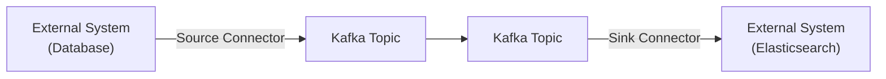

# Module 7: Kafka Connect and Kafka Streams

## Overview
This module introduces two powerful Kafka ecosystem components: Kafka Connect for data integration and Kafka Streams for stream processing. You'll learn how to build data pipelines and real-time processing applications.

**Duration:** 4 hours

## Learning Objectives
By the end of this module, you will be able to:
- Integrate external systems with Kafka using Kafka Connect
- Configure source and sink connectors
- Build stream processing applications with Kafka Streams
- Perform transformations, aggregations, and joins
- Implement stateful processing with windowing
- Test Kafka Streams applications

## Table of Contents
1. [Introduction to Kafka Connect](#introduction-to-kafka-connect)
2. [Source and Sink Connectors](#source-and-sink-connectors)
3. [Connector Configuration](#connector-configuration)
4. [Common Connectors](#common-connectors)
5. [Custom Connectors](#custom-connectors)
6. [Introduction to Kafka Streams](#introduction-to-kafka-streams)
7. [Streams API Basics](#streams-api-basics)
8. [KStream and KTable](#kstream-and-ktable)
9. [Transformations and Operations](#transformations-and-operations)
10. [Windowing and Aggregations](#windowing-and-aggregations)
11. [Joins in Kafka Streams](#joins-in-kafka-streams)
12. [Testing Kafka Streams](#testing-kafka-streams)
13. [Summary](#summary)

---

## Introduction to Kafka Connect

### What is Kafka Connect?

**Kafka Connect** is a framework for connecting Kafka with external systems like databases, key-value stores, search indexes, and file systems.

**Key Features:**
- **Scalable**: Distributed mode for high throughput
- **Fault Tolerant**: Automatic recovery and rebalancing
- **Configuration-Based**: No code required for standard connectors
- **Streaming and Batch**: Support both modes
- **Transformation**: Built-in SMTs (Single Message Transforms)

### Architecture



### Connect Modes

**Standalone Mode:**
- Single process
- For development/testing
- Configuration in properties files

**Distributed Mode:**
- Multiple worker processes
- Production-ready
- REST API for management
- Automatic load balancing

---

## Source and Sink Connectors

### Source Connectors

**Source Connectors** import data from external systems into Kafka.

**Examples:**
- Database → Kafka (CDC - Change Data Capture)
- File System → Kafka
- Message Queue → Kafka
- REST API → Kafka

**Flow:**
```
MySQL Database → JDBC Source Connector → Kafka Topic (users)
```

### Sink Connectors

**Sink Connectors** export data from Kafka to external systems.

**Examples:**
- Kafka → Database
- Kafka → Elasticsearch
- Kafka → S3
- Kafka → HDFS

**Flow:**
```
Kafka Topic (orders) → Elasticsearch Sink Connector → Elasticsearch
```

### Running Kafka Connect

**Standalone Mode:**
```bash
# Start Connect in standalone mode
connect-standalone.sh \
  config/connect-standalone.properties \
  config/connect-file-source.properties
```

**Distributed Mode:**
```bash
# Start Connect worker
connect-distributed.sh config/connect-distributed.properties
```

**Docker Compose:**
```yaml
services:
  kafka-connect:
    image: confluentinc/cp-kafka-connect:latest
    ports:
      - "8083:8083"
    environment:
      CONNECT_BOOTSTRAP_SERVERS: kafka:9092
      CONNECT_REST_PORT: 8083
      CONNECT_GROUP_ID: "connect-cluster"
      CONNECT_CONFIG_STORAGE_TOPIC: "connect-configs"
      CONNECT_OFFSET_STORAGE_TOPIC: "connect-offsets"
      CONNECT_STATUS_STORAGE_TOPIC: "connect-status"
      CONNECT_KEY_CONVERTER: "org.apache.kafka.connect.json.JsonConverter"
      CONNECT_VALUE_CONVERTER: "org.apache.kafka.connect.json.JsonConverter"
      CONNECT_REST_ADVERTISED_HOST_NAME: "kafka-connect"
```

---

## Connector Configuration

### Creating Connectors via REST API

**Create Source Connector:**
```bash
curl -X POST http://localhost:8083/connectors \
  -H "Content-Type: application/json" \
  -d '{
    "name": "jdbc-source-users",
    "config": {
      "connector.class": "io.confluent.connect.jdbc.JdbcSourceConnector",
      "tasks.max": "1",
      "connection.url": "jdbc:postgresql://localhost:5432/mydb",
      "connection.user": "postgres",
      "connection.password": "password",
      "table.whitelist": "users",
      "mode": "incrementing",
      "incrementing.column.name": "id",
      "topic.prefix": "postgres-"
    }
  }'
```

**Create Sink Connector:**
```bash
curl -X POST http://localhost:8083/connectors \
  -H "Content-Type: application/json" \
  -d '{
    "name": "elasticsearch-sink-orders",
    "config": {
      "connector.class": "io.confluent.connect.elasticsearch.ElasticsearchSinkConnector",
      "tasks.max": "1",
      "topics": "orders",
      "connection.url": "http://elasticsearch:9200",
      "type.name": "_doc",
      "key.ignore": "false"
    }
  }'
```

### Managing Connectors

**List connectors:**
```bash
curl http://localhost:8083/connectors
```

**Get connector status:**
```bash
curl http://localhost:8083/connectors/jdbc-source-users/status
```

**Pause connector:**
```bash
curl -X PUT http://localhost:8083/connectors/jdbc-source-users/pause
```

**Resume connector:**
```bash
curl -X PUT http://localhost:8083/connectors/jdbc-source-users/resume
```

**Delete connector:**
```bash
curl -X DELETE http://localhost:8083/connectors/jdbc-source-users
```

---

## Common Connectors

### 1. JDBC Source Connector

**Use Case:** Stream database changes to Kafka

**Configuration:**
```json
{
  "connector.class": "io.confluent.connect.jdbc.JdbcSourceConnector",
  "connection.url": "jdbc:mysql://localhost:3306/mydb",
  "connection.user": "user",
  "connection.password": "password",
  "table.whitelist": "orders,customers",
  "mode": "timestamp+incrementing",
  "timestamp.column.name": "updated_at",
  "incrementing.column.name": "id",
  "topic.prefix": "mysql-",
  "poll.interval.ms": "1000"
}
```

**Modes:**
- `bulk`: Full table snapshot (once)
- `incrementing`: Track ID column
- `timestamp`: Track timestamp column
- `timestamp+incrementing`: Both (recommended)

### 2. JDBC Sink Connector

**Use Case:** Write Kafka data to database

```json
{
  "connector.class": "io.confluent.connect.jdbc.JdbcSinkConnector",
  "connection.url": "jdbc:postgresql://localhost:5432/analytics",
  "topics": "processed-orders",
  "insert.mode": "upsert",
  "pk.mode": "record_key",
  "pk.fields": "order_id",
  "auto.create": "true",
  "auto.evolve": "true"
}
```

### 3. Elasticsearch Sink Connector

**Use Case:** Index Kafka data in Elasticsearch

```json
{
  "connector.class": "io.confluent.connect.elasticsearch.ElasticsearchSinkConnector",
  "topics": "logs,metrics",
  "connection.url": "http://elasticsearch:9200",
  "type.name": "_doc",
  "key.ignore": "false",
  "schema.ignore": "true",
  "batch.size": "100"
}
```

### 4. S3 Sink Connector

**Use Case:** Archive Kafka data to S3

```json
{
  "connector.class": "io.confluent.connect.s3.S3SinkConnector",
  "topics": "audit-logs",
  "s3.bucket.name": "my-kafka-bucket",
  "s3.region": "us-east-1",
  "flush.size": "1000",
  "storage.class": "io.confluent.connect.s3.storage.S3Storage",
  "format.class": "io.confluent.connect.s3.format.json.JsonFormat",
  "partitioner.class": "io.confluent.connect.storage.partitioner.TimeBasedPartitioner",
  "partition.duration.ms": "3600000",
  "path.format": "'year'=YYYY/'month'=MM/'day'=dd/'hour'=HH",
  "timestamp.extractor": "Record"
}
```

### 5. Debezium (CDC) Connectors

**Use Case:** Change Data Capture from databases

**PostgreSQL:**
```json
{
  "connector.class": "io.debezium.connector.postgresql.PostgresConnector",
  "database.hostname": "localhost",
  "database.port": "5432",
  "database.user": "postgres",
  "database.password": "password",
  "database.dbname": "mydb",
  "database.server.name": "dbserver1",
  "table.include.list": "public.orders,public.customers",
  "plugin.name": "pgoutput"
}
```

**MySQL:**
```json
{
  "connector.class": "io.debezium.connector.mysql.MySqlConnector",
  "database.hostname": "localhost",
  "database.port": "3306",
  "database.user": "debezium",
  "database.password": "password",
  "database.server.id": "184054",
  "database.server.name": "mysql-server",
  "table.include.list": "inventory.orders,inventory.customers",
  "database.history.kafka.bootstrap.servers": "kafka:9092",
  "database.history.kafka.topic": "schema-changes.inventory"
}
```

---

## Custom Connectors

### Creating a Simple Source Connector

```java
public class RandomNumberSourceConnector extends SourceConnector {
    private Map<String, String> config;
    
    @Override
    public void start(Map<String, String> props) {
        this.config = props;
    }
    
    @Override
    public Class<? extends Task> taskClass() {
        return RandomNumberSourceTask.class;
    }
    
    @Override
    public List<Map<String, String>> taskConfigs(int maxTasks) {
        List<Map<String, String>> configs = new ArrayList<>();
        for (int i = 0; i < maxTasks; i++) {
            configs.add(config);
        }
        return configs;
    }
    
    @Override
    public void stop() {}
    
    @Override
    public ConfigDef config() {
        return new ConfigDef()
            .define("topic", ConfigDef.Type.STRING, ConfigDef.Importance.HIGH, "Target topic");
    }
    
    @Override
    public String version() {
        return "1.0";
    }
}

public class RandomNumberSourceTask extends SourceTask {
    private String topic;
    
    @Override
    public void start(Map<String, String> props) {
        topic = props.get("topic");
    }
    
    @Override
    public List<SourceRecord> poll() throws InterruptedException {
        Thread.sleep(1000);
        
        SourceRecord record = new SourceRecord(
            Collections.singletonMap("source", "random"),
            Collections.singletonMap("position", System.currentTimeMillis()),
            topic,
            Schema.STRING_SCHEMA,
            UUID.randomUUID().toString(),
            Schema.INT32_SCHEMA,
            new Random().nextInt(100)
        );
        
        return Collections.singletonList(record);
    }
    
    @Override
    public void stop() {}
    
    @Override
    public String version() {
        return "1.0";
    }
}
```

---

## Introduction to Kafka Streams

### What is Kafka Streams?

**Kafka Streams** is a client library for building applications that process and analyze data stored in Kafka.

**Key Features:**
- **Stream Processing**: Real-time data processing
- **Stateful Processing**: Maintain state across records
- **Exactly-Once Semantics**: No duplicates or loss
- **Fault Tolerant**: Automatic recovery
- **Scalable**: Add more instances for parallelism
- **No Cluster Required**: Just a library, runs in your app

### Use Cases

1. **Real-time Analytics**: Count, aggregate, group events
2. **Data Transformation**: Enrich, filter, map data
3. **Anomaly Detection**: Identify unusual patterns
4. **Recommendations**: Real-time recommendation engines
5. **Monitoring**: Alert on metrics and thresholds

---

## Streams API Basics

### Simple Kafka Streams Application

**Maven dependency:**
```xml
<dependency>
    <groupId>org.apache.kafka</groupId>
    <artifactId>kafka-streams</artifactId>
    <version>3.6.1</version>
</dependency>
```

**Basic Application:**
```java
import org.apache.kafka.streams.*;
import org.apache.kafka.streams.kstream.*;

public class SimpleStreamsApp {
    public static void main(String[] args) {
        // Configuration
        Properties props = new Properties();
        props.put(StreamsConfig.APPLICATION_ID_CONFIG, "simple-app");
        props.put(StreamsConfig.BOOTSTRAP_SERVERS_CONFIG, "localhost:9092");
        props.put(StreamsConfig.DEFAULT_KEY_SERDE_CLASS_CONFIG, Serdes.String().getClass());
        props.put(StreamsConfig.DEFAULT_VALUE_SERDE_CLASS_CONFIG, Serdes.String().getClass());
        
        // Build topology
        StreamsBuilder builder = new StreamsBuilder();
        KStream<String, String> input = builder.stream("input-topic");
        
        input
            .filter((key, value) -> value.length() > 5)
            .mapValues(value -> value.toUpperCase())
            .to("output-topic");
        
        // Start application
        KafkaStreams streams = new KafkaStreams(builder.build(), props);
        streams.start();
        
        // Shutdown hook
        Runtime.getRuntime().addShutdownHook(new Thread(streams::close));
    }
}
```

---

## KStream and KTable

### KStream (Event Stream)

**KStream** represents an unbounded stream of events.

```java
KStream<String, String> stream = builder.stream("events");

// Each record is independent
stream.foreach((key, value) -> 
    System.out.println("Key: " + key + ", Value: " + value)
);
```

**Characteristics:**
- Append-only
- Each record is an independent event
- Like a Kafka topic with delete policy

### KTable (Changelog Stream)

**KTable** represents a changelog stream - latest value per key.

```java
KTable<String, String> table = builder.table("users");

// Only latest value per key matters
table.toStream().foreach((key, value) -> 
    System.out.println("User: " + key + ", Profile: " + value)
);
```

**Characteristics:**
- Update stream
- Only latest value per key matters
- Like a database table
- Backed by compacted topic

### Example: KStream vs KTable

```java
// KStream - All events
KStream<String, String> clickStream = builder.stream("clicks");
clickStream.foreach((userId, click) -> 
    System.out.println("User " + userId + " clicked")
);
// Output:
// User user1 clicked
// User user1 clicked  ← Both events processed
// User user2 clicked

// KTable - Latest state
KTable<String, String> userProfiles = builder.table("user-profiles");
userProfiles.toStream().foreach((userId, profile) -> 
    System.out.println("User " + userId + " profile: " + profile)
);
// Output:
// User user1 profile: {name: John, v1}
// User user1 profile: {name: John, v2}  ← Updated value
// User user2 profile: {name: Jane}
```

---

## Transformations and Operations

### Stateless Operations

**filter:**
```java
KStream<String, Integer> filtered = stream.filter((key, value) -> value > 100);
```

**map:**
```java
KStream<String, String> mapped = stream.map((key, value) -> 
    KeyValue.pair(key.toUpperCase(), value.toLowerCase())
);
```

**mapValues:**
```java
KStream<String, Integer> squared = stream.mapValues(value -> value * value);
```

**flatMap:**
```java
KStream<String, String> words = stream.flatMapValues(value -> 
    Arrays.asList(value.toLowerCase().split("\\W+"))
);
```

**branch:**
```java
KStream<String, Integer>[] branches = stream.branch(
    (key, value) -> value < 0,    // Negative
    (key, value) -> value == 0,   // Zero
    (key, value) -> value > 0     // Positive
);
```

**merge:**
```java
KStream<String, String> merged = stream1.merge(stream2);
```

### Stateful Operations

**groupBy / groupByKey:**
```java
KGroupedStream<String, Integer> grouped = stream.groupByKey();
```

**count:**
```java
KTable<String, Long> counts = grouped.count();
```

**aggregate:**
```java
KTable<String, Integer> aggregated = grouped.aggregate(
    () -> 0,                          // Initialize
    (key, value, aggregate) -> aggregate + value,  // Aggregate
    Materialized.with(Serdes.String(), Serdes.Integer())
);
```

**reduce:**
```java
KTable<String, Integer> reduced = grouped.reduce(
    (value1, value2) -> value1 + value2
);
```

---

## Windowing and Aggregations

### Window Types

**1. Tumbling Windows (Fixed, Non-Overlapping)**
```
Time:     0    5    10   15   20   25   30
Window 1: [----]
Window 2:      [----]
Window 3:           [----]
```

```java
TimeWindows windows = TimeWindows.ofSizeWithNoGrace(Duration.ofMinutes(5));
KTable<Windowed<String>, Long> counts = stream
    .groupByKey()
    .windowedBy(windows)
    .count();
```

**2. Hopping Windows (Fixed, Overlapping)**
```
Time:     0    5    10   15   20   25   30
Window 1: [--------]
Window 2:      [--------]
Window 3:           [--------]
```

```java
TimeWindows windows = TimeWindows
    .ofSizeWithNoGrace(Duration.ofMinutes(10))
    .advanceBy(Duration.ofMinutes(5));
```

**3. Sliding Windows (Based on timestamp difference)**
```java
Duration windowSize = Duration.ofMinutes(10);
Duration grace = Duration.ofMinutes(1);
```

**4. Session Windows (Based on inactivity)**
```java
SessionWindows windows = SessionWindows.ofInactivityGapWithNoGrace(Duration.ofMinutes(5));
```

### Windowed Aggregation Example

**Count clicks per user per 5-minute window:**
```java
KStream<String, String> clicks = builder.stream("clicks");

KTable<Windowed<String>, Long> windowedCounts = clicks
    .groupByKey()
    .windowedBy(TimeWindows.ofSizeWithNoGrace(Duration.ofMinutes(5)))
    .count();

windowedCounts.toStream().foreach((windowedKey, count) -> {
    String key = windowedKey.key();
    Window window = windowedKey.window();
    System.out.printf("User: %s, Window: %s-%s, Count: %d%n",
        key, window.startTime(), window.endTime(), count);
});
```

---

## Joins in Kafka Streams

### KStream-KStream Join

**Inner Join (Both sides must match within window):**
```java
KStream<String, String> orders = builder.stream("orders");
KStream<String, String> payments = builder.stream("payments");

JoinWindows joinWindow = JoinWindows.ofTimeDifferenceWithNoGrace(Duration.ofMinutes(5));

KStream<String, String> joined = orders.join(
    payments,
    (orderValue, paymentValue) -> "Order: " + orderValue + ", Payment: " + paymentValue,
    joinWindow
);
```

**Left Join:**
```java
KStream<String, String> leftJoined = orders.leftJoin(
    payments,
    (orderValue, paymentValue) -> {
        if (paymentValue != null) {
            return "Order: " + orderValue + ", Payment: " + paymentValue;
        } else {
            return "Order: " + orderValue + ", Payment: PENDING";
        }
    },
    joinWindow
);
```

### KStream-KTable Join

**Enrich stream with table data:**
```java
KStream<String, String> orders = builder.stream("orders");
KTable<String, String> customers = builder.table("customers");

KStream<String, String> enriched = orders.join(
    customers,
    (orderValue, customerValue) -> 
        "Order: " + orderValue + ", Customer: " + customerValue
);
```

### KTable-KTable Join

```java
KTable<String, String> users = builder.table("users");
KTable<String, String> addresses = builder.table("addresses");

KTable<String, String> joined = users.join(
    addresses,
    (userValue, addressValue) -> userValue + " | " + addressValue
);
```

---

## Testing Kafka Streams

### Test Dependencies

```xml
<dependency>
    <groupId>org.apache.kafka</groupId>
    <artifactId>kafka-streams-test-utils</artifactId>
    <version>3.6.1</version>
    <scope>test</scope>
</dependency>
```

### Unit Test Example

```java
import org.apache.kafka.streams.*;
import org.apache.kafka.streams.test.*;
import org.junit.jupiter.api.*;
import static org.assertj.core.api.Assertions.*;

public class WordCountTest {
    private TopologyTestDriver testDriver;
    private TestInputTopic<String, String> inputTopic;
    private TestOutputTopic<String, Long> outputTopic;
    
    @BeforeEach
    public void setup() {
        StreamsBuilder builder = new StreamsBuilder();
        
        // Build topology
        KStream<String, String> input = builder.stream("input");
        input
            .flatMapValues(value -> Arrays.asList(value.toLowerCase().split("\\W+")))
            .groupBy((key, word) -> word)
            .count()
            .toStream()
            .to("output");
        
        Properties props = new Properties();
        props.put(StreamsConfig.APPLICATION_ID_CONFIG, "test");
        props.put(StreamsConfig.BOOTSTRAP_SERVERS_CONFIG, "dummy:1234");
        props.put(StreamsConfig.DEFAULT_KEY_SERDE_CLASS_CONFIG, Serdes.String().getClass());
        props.put(StreamsConfig.DEFAULT_VALUE_SERDE_CLASS_CONFIG, Serdes.String().getClass());
        
        testDriver = new TopologyTestDriver(builder.build(), props);
        
        inputTopic = testDriver.createInputTopic("input", 
            Serdes.String().serializer(), 
            Serdes.String().serializer());
        
        outputTopic = testDriver.createOutputTopic("output", 
            Serdes.String().deserializer(), 
            Serdes.Long().deserializer());
    }
    
    @Test
    public void testWordCount() {
        // Input
        inputTopic.pipeInput("key1", "hello world");
        inputTopic.pipeInput("key2", "hello kafka");
        
        // Output
        assertThat(outputTopic.readKeyValuesToMap())
            .containsEntry("hello", 2L)
            .containsEntry("world", 1L)
            .containsEntry("kafka", 1L);
    }
    
    @AfterEach
    public void tearDown() {
        testDriver.close();
    }
}
```

---

## Summary

In this module, you learned:

1. **Kafka Connect**: Framework for integrating Kafka with external systems
2. **Source Connectors**: Import data into Kafka
3. **Sink Connectors**: Export data from Kafka
4. **Common Connectors**: JDBC, Elasticsearch, S3, Debezium
5. **Kafka Streams**: Library for stream processing
6. **KStream & KTable**: Event streams vs changelog streams
7. **Transformations**: Stateless and stateful operations
8. **Windowing**: Time-based aggregations
9. **Joins**: Combining multiple streams and tables
10. **Testing**: Unit testing Kafka Streams applications

---

## Key Takeaways

✅ **Kafka Connect simplifies integration** - No coding for standard connectors

✅ **Use Debezium for CDC** - Real-time database changes

✅ **Kafka Streams is just a library** - No separate cluster needed

✅ **KStream for events, KTable for state** - Choose based on use case

✅ **Windowing enables time-based aggregations** - Tumbling, hopping, sliding, session

✅ **Joins combine streams** - Enrich data from multiple sources

✅ **Test with TestDriver** - Unit test stream processing logic

---

## What's Next?

The next module covers:
- Kafka security (authentication, authorization, encryption)
- Performance tuning
- Monitoring with Prometheus and Grafana
- Multi-cluster replication
- Production best practices

**Continue to [Module 8: Advanced Topics and Best Practices](module-08-advanced.md)**

---

## Additional Resources

- [Kafka Connect Documentation](https://kafka.apache.org/documentation/#connect)
- [Kafka Streams Documentation](https://kafka.apache.org/documentation/streams/)
- [Confluent Hub (Connector Catalog)](https://www.confluent.io/hub/)
- [Debezium Documentation](https://debezium.io/documentation/)
- [Kafka Streams Examples](https://github.com/confluentinc/kafka-streams-examples)

---

**[📝 Practice Exercises](exercise/module-07-exercises.md)** | **[📚 Back to Course Home](README.md)**
