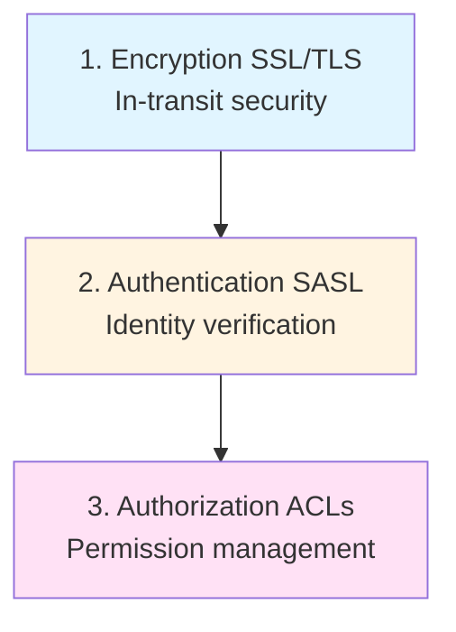
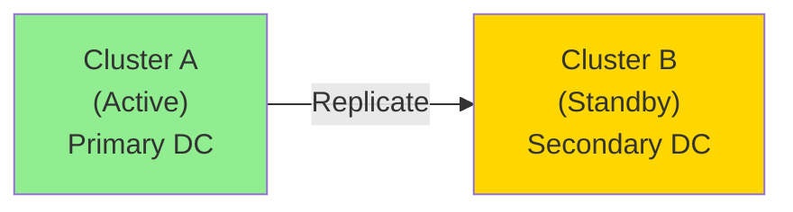
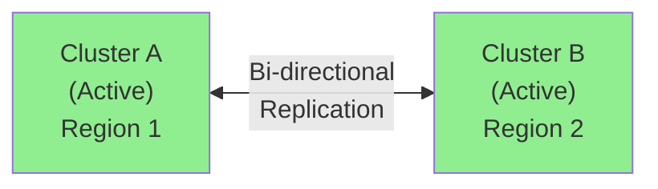

# Module 8: Advanced Topics and Best Practices

## Overview
This module covers production-ready Kafka operations, including security, performance tuning, monitoring, disaster recovery, and operational best practices. You'll learn how to secure, optimize, and operate Kafka clusters at scale.

**Duration:** 3 hours

## Learning Objectives
By the end of this module, you will be able to:
- Secure Kafka clusters with authentication and authorization
- Configure SSL/TLS encryption
- Implement SASL authentication
- Define and manage ACLs
- Tune Kafka for optimal performance
- Monitor Kafka with Prometheus and Grafana
- Plan capacity and scale clusters
- Implement disaster recovery strategies
- Apply production best practices

## Table of Contents
1. [Kafka Security](#kafka-security)
2. [SSL/TLS Configuration](#ssltls-configuration)
3. [SASL Authentication](#sasl-authentication)
4. [Access Control Lists (ACLs)](#access-control-lists-acls)
5. [Performance Tuning](#performance-tuning)
6. [Monitoring and Alerting](#monitoring-and-alerting)
7. [Capacity Planning](#capacity-planning)
8. [Multi-Cluster and Disaster Recovery](#multi-cluster-and-disaster-recovery)
9. [MirrorMaker](#mirrormaker)
10. [Operations Best Practices](#operations-best-practices)
11. [Testing Strategies](#testing-strategies)
12. [Common Pitfalls](#common-pitfalls)
13. [Summary](#summary)

---

## Kafka Security

### Security Layers



### Security Protocols

| Protocol | Encryption | Authentication |
|----------|------------|----------------|
| PLAINTEXT | No | No |
| SSL | Yes | Yes (optional) |
| SASL_PLAINTEXT | No | Yes |
| SASL_SSL | Yes | Yes |

---

## SSL/TLS Configuration

### Generate SSL Certificates

**1. Create Certificate Authority (CA):**
```bash
# Generate CA key
openssl req -new -x509 -keyout ca-key -out ca-cert -days 365 \
  -subj "/CN=KafkaCA" -passout pass:ca-password

# Create truststore and import CA cert
keytool -keystore kafka.truststore.jks -alias CARoot \
  -import -file ca-cert -storepass truststore-password -noprompt
```

**2. Create broker keystore:**
```bash
# Generate broker key and certificate
keytool -keystore kafka.broker.keystore.jks -alias broker \
  -validity 365 -genkey -keyalg RSA \
  -dname "CN=broker1.example.com" \
  -storepass keystore-password

# Create certificate signing request
keytool -keystore kafka.broker.keystore.jks -alias broker \
  -certreq -file cert-file -storepass keystore-password

# Sign certificate with CA
openssl x509 -req -CA ca-cert -CAkey ca-key -in cert-file \
  -out cert-signed -days 365 -CAcreateserial \
  -passin pass:ca-password

# Import CA and signed cert into keystore
keytool -keystore kafka.broker.keystore.jks -alias CARoot \
  -import -file ca-cert -storepass keystore-password -noprompt

keytool -keystore kafka.broker.keystore.jks -alias broker \
  -import -file cert-signed -storepass keystore-password -noprompt
```

### Broker SSL Configuration

**server.properties:**
```properties
# SSL settings
listeners=SSL://0.0.0.0:9093
advertised.listeners=SSL://broker1.example.com:9093

# Keystore
ssl.keystore.location=/var/private/ssl/kafka.broker.keystore.jks
ssl.keystore.password=keystore-password
ssl.key.password=key-password

# Truststore
ssl.truststore.location=/var/private/ssl/kafka.truststore.jks
ssl.truststore.password=truststore-password

# Client authentication (optional)
ssl.client.auth=required

# Security protocol map
listener.security.protocol.map=SSL:SSL
inter.broker.listener.name=SSL
```

### Client SSL Configuration

**Producer/Consumer:**
```java
Properties props = new Properties();
props.put("bootstrap.servers", "broker1.example.com:9093");
props.put("security.protocol", "SSL");
props.put("ssl.truststore.location", "/path/to/kafka.truststore.jks");
props.put("ssl.truststore.password", "truststore-password");

// If client authentication required
props.put("ssl.keystore.location", "/path/to/kafka.client.keystore.jks");
props.put("ssl.keystore.password", "keystore-password");
props.put("ssl.key.password", "key-password");
```

---

## SASL Authentication

### SASL Mechanisms

1. **SASL/PLAIN** - Simple username/password
2. **SASL/SCRAM** - Salted Challenge Response (recommended)
3. **SASL/GSSAPI** - Kerberos
4. **SASL/OAUTHBEARER** - OAuth 2.0

### SASL/SCRAM Configuration

**1. Create SCRAM credentials:**
```bash
kafka-configs.sh --bootstrap-server localhost:9092 \
  --alter --add-config 'SCRAM-SHA-512=[password=user1-secret]' \
  --entity-type users --entity-name user1

kafka-configs.sh --bootstrap-server localhost:9092 \
  --alter --add-config 'SCRAM-SHA-512=[password=user2-secret]' \
  --entity-type users --entity-name user2
```

**2. Broker configuration (server.properties):**
```properties
# Listeners
listeners=SASL_SSL://0.0.0.0:9093
advertised.listeners=SASL_SSL://broker1.example.com:9093

# SASL
sasl.enabled.mechanisms=SCRAM-SHA-512
sasl.mechanism.inter.broker.protocol=SCRAM-SHA-512
security.inter.broker.protocol=SASL_SSL

# SSL (same as before)
ssl.keystore.location=/var/private/ssl/kafka.broker.keystore.jks
ssl.keystore.password=keystore-password
# ... other SSL configs
```

**3. Create JAAS file (kafka_server_jaas.conf):**
```
KafkaServer {
  org.apache.kafka.common.security.scram.ScramLoginModule required
  username="admin"
  password="admin-secret";
};
```

**4. Set JAAS config in environment:**
```bash
export KAFKA_OPTS="-Djava.security.auth.login.config=/path/to/kafka_server_jaas.conf"
```

**5. Client configuration:**
```java
Properties props = new Properties();
props.put("bootstrap.servers", "broker1.example.com:9093");
props.put("security.protocol", "SASL_SSL");
props.put("sasl.mechanism", "SCRAM-SHA-512");
props.put("sasl.jaas.config", 
    "org.apache.kafka.common.security.scram.ScramLoginModule required " +
    "username=\"user1\" password=\"user1-secret\";");

// SSL truststore
props.put("ssl.truststore.location", "/path/to/kafka.truststore.jks");
props.put("ssl.truststore.password", "truststore-password");
```

---

## Access Control Lists (ACLs)

### ACL Components

- **Principal**: Who (User:alice, User:*, etc.)
- **Operation**: What (Read, Write, Create, Delete, etc.)
- **Resource**: Where (Topic, Group, Cluster, etc.)
- **Permission**: Allow or Deny

### Enabling ACLs

**server.properties:**
```properties
authorizer.class.name=kafka.security.authorizer.AclAuthorizer
super.users=User:admin;User:kafka
allow.everyone.if.no.acl.found=false
```

### Managing ACLs

**Grant producer access:**
```bash
kafka-acls.sh --bootstrap-server localhost:9093 \
  --add \
  --allow-principal User:producer1 \
  --operation Write \
  --operation Describe \
  --topic orders \
  --command-config client.properties
```

**Grant consumer access:**
```bash
# Topic access
kafka-acls.sh --bootstrap-server localhost:9093 \
  --add \
  --allow-principal User:consumer1 \
  --operation Read \
  --operation Describe \
  --topic orders \
  --command-config client.properties

# Consumer group access
kafka-acls.sh --bootstrap-server localhost:9093 \
  --add \
  --allow-principal User:consumer1 \
  --operation Read \
  --group order-consumers \
  --command-config client.properties
```

**Grant admin access:**
```bash
kafka-acls.sh --bootstrap-server localhost:9093 \
  --add \
  --allow-principal User:admin \
  --operation All \
  --cluster \
  --command-config client.properties
```

**List ACLs:**
```bash
kafka-acls.sh --bootstrap-server localhost:9093 \
  --list \
  --topic orders \
  --command-config client.properties
```

**Remove ACLs:**
```bash
kafka-acls.sh --bootstrap-server localhost:9093 \
  --remove \
  --allow-principal User:consumer1 \
  --operation Read \
  --topic orders \
  --command-config client.properties
```

---

## Performance Tuning

### Broker Tuning

**OS Level:**
```bash
# Increase file descriptors
ulimit -n 100000

# Increase max map count
sysctl -w vm.max_map_count=262144

# Swappiness
sysctl -w vm.swappiness=1

# Dirty page writeback
sysctl -w vm.dirty_ratio=80
sysctl -w vm.dirty_background_ratio=5
```

**server.properties:**
```properties
# Network threads (1-3 per core)
num.network.threads=8

# I/O threads (disk I/O, usually num disks)
num.io.threads=8

# Socket buffer sizes
socket.send.buffer.bytes=102400
socket.receive.buffer.bytes=102400
socket.request.max.bytes=104857600

# Replication
num.replica.fetchers=4

# Log segment
log.segment.bytes=1073741824
log.roll.hours=168

# Log flush (rely on OS page cache)
log.flush.interval.messages=10000
log.flush.interval.ms=1000
```

### Producer Tuning

**High Throughput:**
```java
props.put(ProducerConfig.BATCH_SIZE_CONFIG, 32768);
props.put(ProducerConfig.LINGER_MS_CONFIG, 10);
props.put(ProducerConfig.COMPRESSION_TYPE_CONFIG, "lz4");
props.put(ProducerConfig.BUFFER_MEMORY_CONFIG, 67108864); // 64MB
props.put(ProducerConfig.ACKS_CONFIG, "1");
```

**Low Latency:**
```java
props.put(ProducerConfig.BATCH_SIZE_CONFIG, 0);
props.put(ProducerConfig.LINGER_MS_CONFIG, 0);
props.put(ProducerConfig.COMPRESSION_TYPE_CONFIG, "none");
props.put(ProducerConfig.ACKS_CONFIG, "1");
```

**High Reliability:**
```java
props.put(ProducerConfig.ACKS_CONFIG, "all");
props.put(ProducerConfig.ENABLE_IDEMPOTENCE_CONFIG, true);
props.put(ProducerConfig.RETRIES_CONFIG, Integer.MAX_VALUE);
```

### Consumer Tuning

**High Throughput:**
```java
props.put(ConsumerConfig.FETCH_MIN_BYTES_CONFIG, 50000);
props.put(ConsumerConfig.FETCH_MAX_WAIT_MS_CONFIG, 500);
props.put(ConsumerConfig.MAX_POLL_RECORDS_CONFIG, 1000);
```

**Low Latency:**
```java
props.put(ConsumerConfig.FETCH_MIN_BYTES_CONFIG, 1);
props.put(ConsumerConfig.FETCH_MAX_WAIT_MS_CONFIG, 100);
props.put(ConsumerConfig.MAX_POLL_RECORDS_CONFIG, 100);
```

---

## Monitoring and Alerting

### Key Metrics

**Broker Metrics:**
- Under-replicated partitions
- Offline partitions
- Active controller count
- Request rate and latency
- Network throughput
- Disk usage

**Producer Metrics:**
- Record send rate
- Request latency
- Error rate
- Batch size

**Consumer Metrics:**
- Records consumed rate
- Consumer lag
- Rebalance rate
- Commit latency

### Prometheus Configuration

**1. Install JMX Exporter:**
```bash
wget https://repo1.maven.org/maven2/io/prometheus/jmx/jmx_prometheus_javaagent/0.20.0/jmx_prometheus_javaagent-0.20.0.jar
```

**2. Create JMX config (kafka-jmx.yaml):**
```yaml
lowercaseOutputName: true
rules:
- pattern: 'kafka.server<type=(.+), name=(.+)><>Value'
  name: kafka_server_$1_$2
- pattern: 'kafka.server<type=(.+), name=(.+), topic=(.+)><>Value'
  name: kafka_server_$1_$2
  labels:
    topic: "$3"
```

**3. Start Kafka with JMX exporter:**
```bash
export KAFKA_OPTS="-javaagent:/path/to/jmx_prometheus_javaagent-0.20.0.jar=7071:/path/to/kafka-jmx.yaml"
bin/kafka-server-start.sh config/server.properties
```

**4. Prometheus configuration (prometheus.yml):**
```yaml
scrape_configs:
  - job_name: 'kafka'
    static_configs:
      - targets: ['broker1:7071', 'broker2:7071', 'broker3:7071']
```

### Grafana Dashboards

**Key Panels:**
1. Under-replicated partitions (alert if > 0)
2. Offline partitions (alert if > 0)
3. Consumer lag per group
4. Broker disk usage
5. Network throughput
6. Request latency (p99)

**Alert Rules:**
```yaml
groups:
  - name: kafka_alerts
    rules:
      - alert: UnderReplicatedPartitions
        expr: kafka_server_replicamanager_underreplicatedpartitions > 0
        for: 5m
        labels:
          severity: critical
        annotations:
          summary: "Kafka has under-replicated partitions"
          
      - alert: OfflinePartitions
        expr: kafka_controller_kafkacontroller_offlinepartitionscount > 0
        for: 1m
        labels:
          severity: critical
        annotations:
          summary: "Kafka has offline partitions"
          
      - alert: HighConsumerLag
        expr: kafka_consumergroup_lag > 10000
        for: 5m
        labels:
          severity: warning
        annotations:
          summary: "Consumer lag is high"
```

---

## Capacity Planning

### Sizing Calculations

**1. Throughput Requirements:**
```
Daily data: 1TB/day
Peak throughput: 1TB / 86400s * 2 (peak factor) = ~23 MB/s
```

**2. Partition Throughput:**
```
Single partition: ~10-50 MB/s (typical)
Partitions needed: 23 MB/s / 10 MB/s = 3 partitions minimum
Recommendation: 6-12 partitions (leave headroom)
```

**3. Storage Requirements:**
```
Daily data: 1TB
Retention: 7 days
Replication factor: 3
Total storage: 1TB * 7 * 3 = 21TB
Add 20% overhead: 21TB * 1.2 = ~25TB
```

**4. Broker Count:**
```
Storage per broker: 10TB
Brokers needed: 25TB / 10TB = 3 brokers minimum
Recommendation: 5-6 brokers (handle failures, headroom)
```

**5. Memory:**
```
# Page cache (most important)
Memory = (producer_throughput + consumer_throughput) * 30s
       = (23 MB/s + 23 MB/s) * 30 = ~1.38 GB
Recommendation: 32-64 GB RAM per broker

# JVM heap
Heap: 6-8 GB per broker (keep under 16GB)
```

**6. Network:**
```
Peak throughput: 23 MB/s
Replication: 23 MB/s * 2 (to replicas) = 46 MB/s
Consumer replays: 23 MB/s
Total: ~100 MB/s = 800 Mbps
Recommendation: 10 Gbps network
```

---

## Multi-Cluster and Disaster Recovery

### Active-Passive DR



**Failover Process:**
1. Detect primary failure
2. Promote secondary to active
3. Redirect producers and consumers
4. When primary recovers, reverse replication

### Active-Active (Multi-Region)



**Use Case:** Global applications with regional data

**Challenges:**
- Event loops (solved with provenance tracking)
- Conflict resolution
- Network latency

---

## MirrorMaker

### MirrorMaker 2.0 (Recommended)

**Benefits over MirrorMaker 1:**
- Kafka Connect-based
- Topic creation automation
- Offset syncing
- Exactly-once semantics
- Active-active support

**Configuration (mm2.properties):**
```properties
# Cluster definitions
clusters = primary, secondary
primary.bootstrap.servers = primary-broker1:9092,primary-broker2:9092
secondary.bootstrap.servers = secondary-broker1:9092,secondary-broker2:9092

# Replication flows
primary->secondary.enabled = true
primary->secondary.topics = orders.*, payments.*

# Offset sync
sync.topic.configs.enabled = true
sync.topic.acls.enabled = true

# Replication policy
replication.policy.class = org.apache.kafka.connect.mirror.DefaultReplicationPolicy
replication.policy.separator = .
```

**Start MirrorMaker 2:**
```bash
bin/connect-mirror-maker.sh mm2.properties
```

**Topic Naming:**
```
Primary topic:   orders
Secondary topic: primary.orders
```

**Consumer Offset Migration:**
```
Primary group offset:   my-group, orders, partition 0, offset 1000
Secondary group offset: my-group, primary.orders, partition 0, offset 1000
```

---

## Operations Best Practices

### 1. Monitoring

✅ Set up Prometheus + Grafana
✅ Monitor under-replicated partitions
✅ Track consumer lag
✅ Alert on disk usage > 80%
✅ Monitor network saturation

### 2. Capacity Management

✅ Plan for 2-3x current load
✅ Keep disk usage under 70%
✅ Leave 20% CPU headroom
✅ Monitor and clean up unused topics

### 3. Topic Design

✅ Use meaningful naming conventions
✅ Set appropriate retention
✅ Choose partition count carefully
✅ Use RF=3 for production
✅ Set min.insync.replicas=2

### 4. Security

✅ Enable SSL/TLS encryption
✅ Use SASL authentication
✅ Implement ACLs
✅ Rotate credentials regularly
✅ Audit access logs

### 5. Upgrade Strategy

✅ Test in non-prod first
✅ Upgrade one broker at a time
✅ Monitor during upgrade
✅ Have rollback plan
✅ Upgrade clients after brokers

### 6. Backup

✅ Regular topic configuration backups
✅ Consumer offset backups
✅ Schema Registry backups
✅ Test restore procedures

### 7. Documentation

✅ Document cluster topology
✅ Maintain topic inventory
✅ Document data flows
✅ Keep runbooks updated
✅ Document disaster recovery procedures

---

## Testing Strategies

### 1. Performance Testing

```bash
# Producer performance
kafka-producer-perf-test.sh \
  --topic test \
  --num-records 1000000 \
  --record-size 1024 \
  --throughput -1 \
  --producer-props bootstrap.servers=localhost:9092

# Consumer performance
kafka-consumer-perf-test.sh \
  --topic test \
  --messages 1000000 \
  --bootstrap-server localhost:9092
```

### 2. Resilience Testing (Chaos Engineering)

**Test scenarios:**
- Kill broker (verify failover)
- Network partition
- Disk full
- High CPU load
- Memory pressure

**Tools:**
- Chaos Monkey
- Toxiproxy
- Pumba

### 3. End-to-End Testing

```java
@Test
public void testOrderFlow() {
    // Produce order
    producer.send(new ProducerRecord<>("orders", "order-123", orderJson));
    
    // Wait for processing
    await().atMost(10, SECONDS).until(() -> 
        orderRepository.findById("order-123").isPresent()
    );
    
    // Verify result
    Order order = orderRepository.findById("order-123").get();
    assertThat(order.getStatus()).isEqualTo("PROCESSED");
}
```

---

## Common Pitfalls

### 1. Too Many Partitions

❌ **Problem:** 1000+ partitions per broker
✅ **Solution:** Keep < 200 partitions per broker

### 2. Large Messages

❌ **Problem:** 10MB+ messages
✅ **Solution:** Store in object storage, send reference

### 3. No Compression

❌ **Problem:** wasting bandwidth and storage
✅ **Solution:** Use lz4 or snappy compression

### 4. Auto-Creating Topics

❌ **Problem:** Typos create unwanted topics
✅ **Solution:** Disable auto-creation: `auto.create.topics.enable=false`

### 5. Improper Retention

❌ **Problem:** Disk fills up
✅ **Solution:** Set appropriate `retention.ms` and `retention.bytes`

### 6. No Monitoring

❌ **Problem:** Problems discovered too late
✅ **Solution:** Comprehensive monitoring and alerting

### 7. Synchronous Producer

❌ **Problem:** `producer.send().get()` in every call
✅ **Solution:** Use async with callbacks

### 8. Not Handling Rebalances

❌ **Problem:** Data loss during rebalance
✅ **Solution:** Implement RebalanceListener

### 9. No Idempotence

❌ **Problem:** Duplicate messages on retry
✅ **Solution:** `enable.idempotence=true`

### 10. Ignoring Consumer Lag

❌ **Problem:** Consumers fall behind indefinitely
✅ **Solution:** Monitor lag, scale consumers

---

## Summary

In this module, you learned:

1. **Security**: SSL/TLS, SASL, ACLs for securing Kafka
2. **Performance Tuning**: Broker, producer, and consumer optimization
3. **Monitoring**: Prometheus, Grafana, and alerting
4. **Capacity Planning**: Sizing brokers, storage, network
5. **Disaster Recovery**: Multi-cluster, active-passive, active-active
6. **MirrorMaker**: Cross-cluster replication
7. **Best Practices**: Operations, testing, common pitfalls

---

## Key Takeaways

✅ **Security is multi-layered** - Encryption, authentication, authorization

✅ **Monitor proactively** - Don't wait for problems

✅ **Plan capacity carefully** - Consider growth and peak loads

✅ **Test resilience** - Chaos engineering reveals weaknesses

✅ **Document everything** - Topology, procedures, runbooks

✅ **Automate operations** - Reduce human error

✅ **Stay updated** - Follow Kafka releases and KIPs

---

## What's Next?

The final module provides a hands-on capstone project where you'll:
- Design a complete event-driven system
- Implement producers, consumers, and stream processing
- Deploy and monitor the application
- Apply all concepts from the course

**Continue to [Module 9: Practical Application - Building a Real-Time System](module-09-practical.md)**

---

## Additional Resources

- [Kafka Security Documentation](https://kafka.apache.org/documentation/#security)
- [Kafka Operations Guide](https://kafka.apache.org/documentation/#operations)
- [Confluent Platform Best Practices](https://docs.confluent.io/platform/current/kafka/deployment.html)
- [Kafka Performance Tuning](https://kafka.apache.org/documentation/#hwandos)
- [MirrorMaker 2 Documentation](https://cwiki.apache.org/confluence/display/KAFKA/KIP-382)

---

**[📝 Practice Exercises](exercise/module-08-exercises.md)** | **[📚 Back to Course Home](README.md)**
