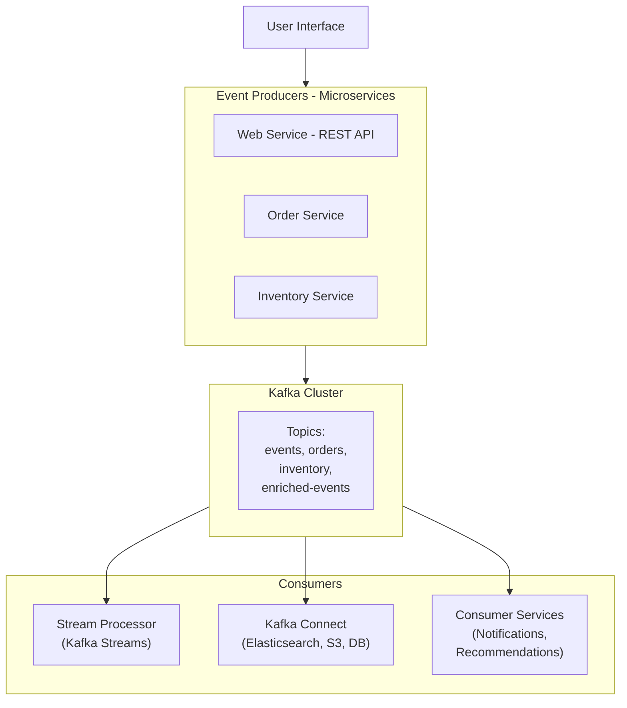
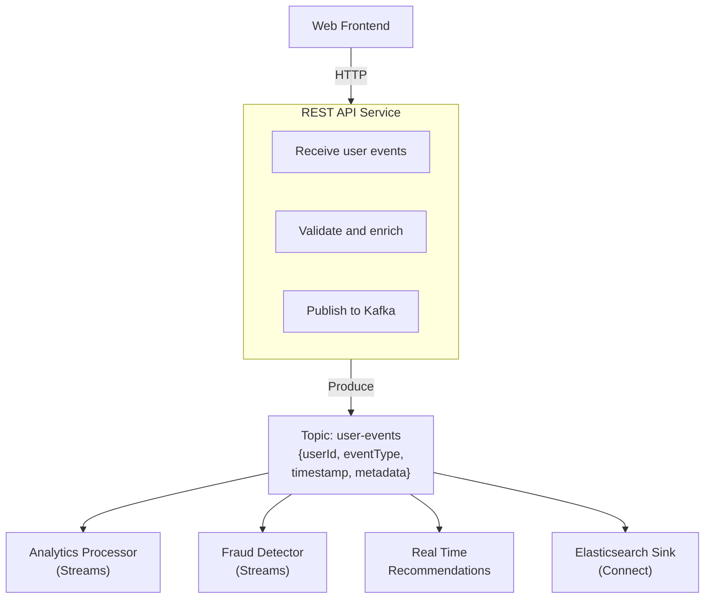

# Module 9: Practical Application - Building a Real-Time System

## Overview
This capstone module brings together all concepts learned throughout the course. You'll design and build a complete real-time event processing system from scratch, applying best practices for producers, consumers, stream processing, monitoring, and operations.

**Duration:** 4 hours

## Learning Objectives
By the end of this module, you will be able to:
- Design an end-to-end event-driven architecture
- Implement microservices communicating via Kafka
- Build stream processing pipelines with Kafka Streams
- Integrate with external systems using Kafka Connect
- Monitor and troubleshoot production systems
- Deploy and scale Kafka applications
- Apply all learned concepts in a real-world scenario

## Table of Contents
1. [Project Overview](#project-overview)
2. [Architecture Design](#architecture-design)
3. [Phase 1: Setup and Infrastructure](#phase-1-setup-and-infrastructure)
4. [Phase 2: Event Producer Services](#phase-2-event-producer-services)
5. [Phase 3: Stream Processing](#phase-3-stream-processing)
6. [Phase 4: Consumer Services](#phase-4-consumer-services)
7. [Phase 5: Data Integration](#phase-5-data-integration)
8. [Phase 6: Monitoring and Operations](#phase-6-monitoring-and-operations)
9. [Testing and Validation](#testing-and-validation)
10. [Deployment](#deployment)
11. [Performance Optimization](#performance-optimization)
12. [Summary](#summary)

---

## Project Overview

### Real-Time E-Commerce Analytics Platform

**Business Requirements:**
- Track user interactions (page views, searches, clicks, cart actions)
- Process orders in real-time
- Update inventory dynamically
- Generate real-time analytics dashboards
- Send personalized recommendations
- Detect and prevent fraud
- Archive data for historical analysis

**Technical Requirements:**
- High throughput (10,000+ events/second)
- Low latency (< 1 second end-to-end)
- Exactly-once processing
- Fault tolerance
- Scalability
- Comprehensive monitoring

### Components



---

## Architecture Design

### Event Flow Diagram



### Topic Design

| Topic | Partitions | RF | Retention | Purpose |
|-------|------------|----|-----------| --------|
| `user-events` | 12 | 3 | 7 days | Raw user interactions |
| `orders` | 6 | 3 | 30 days | Order events |
| `inventory-updates` | 6 | 3 | Compact | Inventory state |
| `enriched-events` | 12 | 3 | 7 days | Processed events |
| `fraud-alerts` | 3 | 3 | 90 days | Fraud detection results |
| `recommendations` | 6 | 3 | 1 day | User recommendations |
| `analytics-aggregates` | 6 | 3 | 30 days | Aggregated metrics |

---

## Phase 1: Setup and Infrastructure

### 1.1 Start Kafka Cluster

**docker-compose.yml:**
```yaml
version: '3.8'

services:
  kafka-1:
    image: apache/kafka:latest
    container_name: kafka-1
    ports:
      - "9092:9092"
    environment:
      KAFKA_NODE_ID: 1
      KAFKA_PROCESS_ROLES: broker,controller
      KAFKA_LISTENERS: PLAINTEXT://0.0.0.0:9092,CONTROLLER://0.0.0.0:9093
      KAFKA_ADVERTISED_LISTENERS: PLAINTEXT://localhost:9092
      KAFKA_CONTROLLER_LISTENER_NAMES: CONTROLLER
      KAFKA_LISTENER_SECURITY_PROTOCOL_MAP: CONTROLLER:PLAINTEXT,PLAINTEXT:PLAINTEXT
      KAFKA_CONTROLLER_QUORUM_VOTERS: 1@kafka-1:9093,2@kafka-2:9093,3@kafka-3:9093
      KAFKA_OFFSETS_TOPIC_REPLICATION_FACTOR: 3
      KAFKA_TRANSACTION_STATE_LOG_REPLICATION_FACTOR: 3
      KAFKA_TRANSACTION_STATE_LOG_MIN_ISR: 2
      KAFKA_LOG_DIRS: /tmp/kraft-logs
      CLUSTER_ID: MkU3OEVBNTcwNTJENDM2Qk
    volumes:
      - kafka-1-data:/tmp/kraft-logs

  kafka-2:
    image: apache/kafka:latest
    container_name: kafka-2
    ports:
      - "9093:9092"
    environment:
      KAFKA_NODE_ID: 2
      KAFKA_PROCESS_ROLES: broker,controller
      KAFKA_LISTENERS: PLAINTEXT://0.0.0.0:9092,CONTROLLER://0.0.0.0:9093
      KAFKA_ADVERTISED_LISTENERS: PLAINTEXT://localhost:9093
      KAFKA_CONTROLLER_LISTENER_NAMES: CONTROLLER
      KAFKA_LISTENER_SECURITY_PROTOCOL_MAP: CONTROLLER:PLAINTEXT,PLAINTEXT:PLAINTEXT
      KAFKA_CONTROLLER_QUORUM_VOTERS: 1@kafka-1:9093,2@kafka-2:9093,3@kafka-3:9093
      KAFKA_OFFSETS_TOPIC_REPLICATION_FACTOR: 3
      KAFKA_TRANSACTION_STATE_LOG_REPLICATION_FACTOR: 3
      KAFKA_TRANSACTION_STATE_LOG_MIN_ISR: 2
      KAFKA_LOG_DIRS: /tmp/kraft-logs
      CLUSTER_ID: MkU3OEVBNTcwNTJENDM2Qk
    volumes:
      - kafka-2-data:/tmp/kraft-logs

  kafka-3:
    image: apache/kafka:latest
    container_name: kafka-3
    ports:
      - "9094:9092"
    environment:
      KAFKA_NODE_ID: 3
      KAFKA_PROCESS_ROLES: broker,controller
      KAFKA_LISTENERS: PLAINTEXT://0.0.0.0:9092,CONTROLLER://0.0.0.0:9093
      KAFKA_ADVERTISED_LISTENERS: PLAINTEXT://localhost:9094
      KAFKA_CONTROLLER_LISTENER_NAMES: CONTROLLER
      KAFKA_LISTENER_SECURITY_PROTOCOL_MAP: CONTROLLER:PLAINTEXT,PLAINTEXT:PLAINTEXT
      KAFKA_CONTROLLER_QUORUM_VOTERS: 1@kafka-1:9093,2@kafka-2:9093,3@kafka-3:9093
      KAFKA_OFFSETS_TOPIC_REPLICATION_FACTOR: 3
      KAFKA_TRANSACTION_STATE_LOG_REPLICATION_FACTOR: 3
      KAFKA_TRANSACTION_STATE_LOG_MIN_ISR: 2
      KAFKA_LOG_DIRS: /tmp/kraft-logs
      CLUSTER_ID: MkU3OEVBNTcwNTJENDM2Qk
    volumes:
      - kafka-3-data:/tmp/kraft-logs

  schema-registry:
    image: confluentinc/cp-schema-registry:latest
    container_name: schema-registry
    depends_on:
      - kafka-1
      - kafka-2
      - kafka-3
    ports:
      - "8081:8081"
    environment:
      SCHEMA_REGISTRY_HOST_NAME: schema-registry
      SCHEMA_REGISTRY_KAFKASTORE_BOOTSTRAP_SERVERS: kafka-1:9092,kafka-2:9092,kafka-3:9092
      SCHEMA_REGISTRY_LISTENERS: http://0.0.0.0:8081

  postgres:
    image: postgres:15
    container_name: postgres
    ports:
      - "5432:5432"
    environment:
      POSTGRES_USER: postgres
      POSTGRES_PASSWORD: postgres
      POSTGRES_DB: ecommerce
    volumes:
      - postgres-data:/var/lib/postgresql/data

  elasticsearch:
    image: docker.elastic.co/elasticsearch/elasticsearch:8.11.0
    container_name: elasticsearch
    environment:
      - discovery.type=single-node
      - xpack.security.enabled=false
    ports:
      - "9200:9200"
    volumes:
      - elasticsearch-data:/usr/share/elasticsearch/data

  prometheus:
    image: prom/prometheus:latest
    container_name: prometheus
    ports:
      - "9090:9090"
    volumes:
      - ./prometheus.yml:/etc/prometheus/prometheus.yml
      - prometheus-data:/prometheus

  grafana:
    image: grafana/grafana:latest
    container_name: grafana
    ports:
      - "3000:3000"
    environment:
      - GF_SECURITY_ADMIN_PASSWORD=admin
    volumes:
      - grafana-data:/var/lib/grafana

volumes:
  kafka-1-data:
  kafka-2-data:
  kafka-3-data:
  postgres-data:
  elasticsearch-data:
  prometheus-data:
  grafana-data:
```

**Start services:**
```bash
docker-compose up -d
```

### 1.2 Create Topics

```bash
# User events
kafka-topics.sh --create \
  --topic user-events \
  --bootstrap-server localhost:9092 \
  --partitions 12 \
  --replication-factor 3 \
  --config retention.ms=604800000 \
  --config min.insync.replicas=2

# Orders
kafka-topics.sh --create \
  --topic orders \
  --bootstrap-server localhost:9092 \
  --partitions 6 \
  --replication-factor 3 \
  --config retention.ms=2592000000 \
  --config min.insync.replicas=2

# Inventory (compacted)
kafka-topics.sh --create \
  --topic inventory-updates \
  --bootstrap-server localhost:9092 \
  --partitions 6 \
  --replication-factor 3 \
  --config cleanup.policy=compact \
  --config min.insync.replicas=2

# Enriched events
kafka-topics.sh --create \
  --topic enriched-events \
  --bootstrap-server localhost:9092 \
  --partitions 12 \
  --replication-factor 3 \
  --config retention.ms=604800000

# Fraud alerts
kafka-topics.sh --create \
  --topic fraud-alerts \
  --bootstrap-server localhost:9092 \
  --partitions 3 \
  --replication-factor 3 \
  --config retention.ms=7776000000

# Recommendations
kafka-topics.sh --create \
  --topic recommendations \
  --bootstrap-server localhost:9092 \
  --partitions 6 \
  --replication-factor 3 \
  --config retention.ms=86400000

# Analytics aggregates
kafka-topics.sh --create \
  --topic analytics-aggregates \
  --bootstrap-server localhost:9092 \
  --partitions 6 \
  --replication-factor 3 \
  --config retention.ms=2592000000
```

---

## Phase 2: Event Producer Services

### 2.1 REST API Service (Spring Boot)

**pom.xml:**
```xml
<dependencies>
    <dependency>
        <groupId>org.springframework.boot</groupId>
        <artifactId>spring-boot-starter-web</artifactId>
    </dependency>
    <dependency>
        <groupId>org.springframework.kafka</groupId>
        <artifactId>spring-kafka</artifactId>
    </dependency>
    <dependency>
        <groupId>io.confluent</groupId>
        <artifactId>kafka-avro-serializer</artifactId>
        <version>7.5.0</version>
    </dependency>
</dependencies>
```

**application.yml:**
```yaml
spring:
  kafka:
    bootstrap-servers: localhost:9092
    producer:
      key-serializer: org.apache.kafka.common.serialization.StringSerializer
      value-serializer: io.confluent.kafka.serializers.KafkaAvroSerializer
      acks: all
      compression-type: lz4
      properties:
        enable.idempotence: true
        schema.registry.url: http://localhost:8081
```

**UserEvent.java:**
```java
@Data
@AllArgsConstructor
@NoArgsConstructor
public class UserEvent {
    private String eventId;
    private String userId;
    private String eventType; // PAGE_VIEW, CLICK, SEARCH, ADD_TO_CART, PURCHASE
    private Long timestamp;
    private Map<String, Object> metadata;
}
```

**EventController.java:**
```java
@RestController
@RequestMapping("/api/events")
@Slf4j
public class EventController {
    
    @Autowired
    private KafkaTemplate<String, UserEvent> kafkaTemplate;
    
    @PostMapping
    public ResponseEntity<String> trackEvent(@RequestBody UserEvent event) {
        event.setEventId(UUID.randomUUID().toString());
        event.setTimestamp(System.currentTimeMillis());
        
        kafkaTemplate.send("user-events", event.getUserId(), event)
            .whenComplete((result, ex) -> {
                if (ex == null) {
                    log.info("Event published: {}", event.getEventId());
                } else {
                    log.error("Failed to publish event", ex);
                }
            });
        
        return ResponseEntity.accepted().body(event.getEventId());
    }
}
```

### 2.2 Order Service

**OrderService.java:**
```java
@Service
@Slf4j
public class OrderService {
    
    @Autowired
    private KafkaTemplate<String, Order> kafkaTemplate;
    
    @Transactional
    public Order createOrder(CreateOrderRequest request) {
        // Create order
        Order order = new Order();
        order.setOrderId(UUID.randomUUID().toString());
        order.setUserId(request.getUserId());
        order.setItems(request.getItems());
        order.setTotalAmount(calculateTotal(request.getItems()));
        order.setStatus("PENDING");
        order.setCreatedAt(Instant.now());
        
        // Save to database
        orderRepository.save(order);
        
        // Publish event
        ProducerRecord<String, Order> record = new ProducerRecord<>(
            "orders",
            order.getOrderId(),
            order
        );
        
        // Add headers
        record.headers().add("event-type", "ORDER_CREATED".getBytes());
        record.headers().add("source", "order-service".getBytes());
        
        kafkaTemplate.send(record);
        
        log.info("Order created: {}", order.getOrderId());
        return order;
    }
    
    private BigDecimal calculateTotal(List<OrderItem> items) {
        return items.stream()
            .map(item -> item.getPrice().multiply(BigDecimal.valueOf(item.getQuantity())))
            .reduce(BigDecimal.ZERO, BigDecimal::add);
    }
}
```

### 2.3 Inventory Service

**InventoryService.java:**
```java
@Service
@Slf4j
public class InventoryService {
    
    @Autowired
    private KafkaTemplate<String, InventoryUpdate> kafkaTemplate;
    
    public void updateInventory(String productId, int quantity) {
        InventoryUpdate update = new InventoryUpdate();
        update.setProductId(productId);
        update.setQuantity(quantity);
        update.setTimestamp(System.currentTimeMillis());
        
        // Send to compacted topic (latest value per product)
        kafkaTemplate.send("inventory-updates", productId, update);
        
        log.info("Inventory updated: {} -> {}", productId, quantity);
    }
    
    public void reserveInventory(String orderId, List<OrderItem> items) {
        for (OrderItem item : items) {
            InventoryReservation reservation = new InventoryReservation();
            reservation.setOrderId(orderId);
            reservation.setProductId(item.getProductId());
            reservation.setQuantityReserved(item.getQuantity());
            reservation.setTimestamp(System.currentTimeMillis());
            
            kafkaTemplate.send("inventory-reservations", item.getProductId(), reservation);
        }
    }
}
```

---

## Phase 3: Stream Processing

### 3.1 Event Enrichment Processor

**EnrichmentProcessor.java:**
```java
@Component
@Slf4j
public class EnrichmentProcessor {
    
    public void start() {
        Properties props = new Properties();
        props.put(StreamsConfig.APPLICATION_ID_CONFIG, "event-enrichment");
        props.put(StreamsConfig.BOOTSTRAP_SERVERS_CONFIG, "localhost:9092");
        props.put(StreamsConfig.DEFAULT_KEY_SERDE_CLASS_CONFIG, Serdes.String().getClass());
        props.put(StreamsConfig.DEFAULT_VALUE_SERDE_CLASS_CONFIG, SpecificAvroSerde.class);
        props.put("schema.registry.url", "http://localhost:8081");
        
        StreamsBuilder builder = new StreamsBuilder();
        
        // User events stream
        KStream<String, UserEvent> events = builder.stream("user-events");
        
        // User profiles table (compacted topic)
        KTable<String, UserProfile> profiles = builder.table("user-profiles");
        
        // Enrich events with user profiles
        KStream<String, EnrichedEvent> enriched = events
            .join(profiles,
                (event, profile) -> {
                    EnrichedEvent enrichedEvent = new EnrichedEvent();
                    enrichedEvent.setEventId(event.getEventId());
                    enrichedEvent.setUserId(event.getUserId());
                    enrichedEvent.setEventType(event.getEventType());
                    enrichedEvent.setTimestamp(event.getTimestamp());
                    enrichedEvent.setUserSegment(profile.getSegment());
                    enrichedEvent.setUserTier(profile.getTier());
                    enrichedEvent.setMetadata(event.getMetadata());
                    return enrichedEvent;
                }
            );
        
        // Write to output topic
        enriched.to("enriched-events");
        
        KafkaStreams streams = new KafkaStreams(builder.build(), props);
        streams.start();
        
        Runtime.getRuntime().addShutdownHook(new Thread(streams::close));
    }
}
```

### 3.2 Real-Time Analytics Processor

**AnalyticsProcessor.java:**
```java
@Component
@Slf4j
public class AnalyticsProcessor {
    
    public void start() {
        Properties props = new Properties();
        props.put(StreamsConfig.APPLICATION_ID_CONFIG, "analytics-processor");
        props.put(StreamsConfig.BOOTSTRAP_SERVERS_CONFIG, "localhost:9092");
        
        StreamsBuilder builder = new StreamsBuilder();
        
        KStream<String, UserEvent> events = builder.stream("user-events");
        
        // Count events by type per 5-minute window
        KTable<Windowed<String>, Long> eventCounts = events
            .groupBy((key, value) -> value.getEventType())
            .windowedBy(TimeWindows.ofSizeWithNoGrace(Duration.ofMinutes(5)))
            .count();
        
        // Output to analytics topic
        eventCounts.toStream()
            .map((windowedKey, count) -> {
                String key = windowedKey.key();
                Window window = windowedKey.window();
                
                AnalyticsAggregate aggregate = new AnalyticsAggregate();
                aggregate.setEventType(key);
                aggregate.setWindowStart(window.startTime().toEpochMilli());
                aggregate.setWindowEnd(window.endTime().toEpochMilli());
                aggregate.setCount(count);
                
                return KeyValue.pair(key, aggregate);
            })
            .to("analytics-aggregates");
        
        // Calculate revenue per hour
        KTable<Windowed<String>, Double> hourlyRevenue = events
            .filter((key, value) -> "PURCHASE".equals(value.getEventType()))
            .groupByKey()
            .windowedBy(TimeWindows.ofSizeWithNoGrace(Duration.ofHours(1)))
            .aggregate(
                () -> 0.0,
                (key, value, aggregate) -> {
                    Double amount = (Double) value.getMetadata().get("amount");
                    return aggregate + (amount != null ? amount : 0.0);
                },
                Materialized.with(Serdes.String(), Serdes.Double())
            );
        
        KafkaStreams streams = new KafkaStreams(builder.build(), props);
        streams.start();
    }
}
```

### 3.3 Fraud Detection Processor

**FraudDetectionProcessor.java:**
```java
@Component
@Slf4j
public class FraudDetectionProcessor {
    
    public void start() {
        Properties props = new Properties();
        props.put(StreamsConfig.APPLICATION_ID_CONFIG, "fraud-detection");
        props.put(StreamsConfig.BOOTSTRAP_SERVERS_CONFIG, "localhost:9092");
        
        StreamsBuilder builder = new StreamsBuilder();
        
        KStream<String, Order> orders = builder.stream("orders");
        
        // Detect suspicious patterns
        KStream<String, FraudAlert> alerts = orders
            .filter((key, order) -> isSuspicious(order))
            .mapValues(order -> {
                FraudAlert alert = new FraudAlert();
                alert.setAlertId(UUID.randomUUID().toString());
                alert.setOrderId(order.getOrderId());
                alert.setUserId(order.getUserId());
                alert.setReason(detectFraudReason(order));
                alert.setSeverity(FraudSeverity.HIGH);
                alert.setTimestamp(System.currentTimeMillis());
                return alert;
            });
        
        alerts.to("fraud-alerts");
        
        // Count orders per user in 10-minute window
        KTable<Windowed<String>, Long> orderCounts = orders
            .groupBy((key, order) -> order.getUserId())
            .windowedBy(TimeWindows.ofSizeWithNoGrace(Duration.ofMinutes(10)))
            .count();
        
        // Alert if > 10 orders from same user in 10 minutes
        orderCounts.toStream()
            .filter((windowedKey, count) -> count > 10)
            .mapValues((windowedKey, count) -> {
                FraudAlert alert = new FraudAlert();
                alert.setAlertId(UUID.randomUUID().toString());
                alert.setUserId(windowedKey.key());
                alert.setReason("Too many orders in short time: " + count);
                alert.setSeverity(FraudSeverity.MEDIUM);
                alert.setTimestamp(System.currentTimeMillis());
                return alert;
            })
            .to("fraud-alerts");
        
        KafkaStreams streams = new KafkaStreams(builder.build(), props);
        streams.start();
    }
    
    private boolean isSuspicious(Order order) {
        // High-value order
        if (order.getTotalAmount().compareTo(BigDecimal.valueOf(10000)) > 0) {
            return true;
        }
        
        // Too many items
        if (order.getItems().size() > 50) {
            return true;
        }
        
        return false;
    }
    
    private String detectFraudReason(Order order) {
        if (order.getTotalAmount().compareTo(BigDecimal.valueOf(10000)) > 0) {
            return "High-value order: $" + order.getTotalAmount();
        }
        if (order.getItems().size() > 50) {
            return "Too many items: " + order.getItems().size();
        }
        return "Suspicious pattern detected";
    }
}
```

---

## Phase 4: Consumer Services

### 4.1 Notification Service

**NotificationConsumer.java:**
```java
@Component
@Slf4j
public class NotificationConsumer {
    
    @KafkaListener(topics = "orders", groupId = "notification-service")
    public void handleOrder(ConsumerRecord<String, Order> record) {
        Order order = record.value();
        
        if ("COMPLETED".equals(order.getStatus())) {
            sendOrderConfirmation(order);
        }
    }
    
    @KafkaListener(topics = "fraud-alerts", groupId = "notification-service")
    public void handleFraudAlert(ConsumerRecord<String, FraudAlert> record) {
        FraudAlert alert = record.value();
        
        if (alert.getSeverity() == FraudSeverity.HIGH) {
            sendUrgentAlert(alert);
        }
    }
    
    private void sendOrderConfirmation(Order order) {
        EmailMessage email = EmailMessage.builder()
            .to(getUserEmail(order.getUserId()))
            .subject("Order Confirmation: " + order.getOrderId())
            .body(buildOrderConfirmationBody(order))
            .build();
        
        emailService.send(email);
        log.info("Sent order confirmation: {}", order.getOrderId());
    }
    
    private void sendUrgentAlert(FraudAlert alert) {
        SlackMessage slack = SlackMessage.builder()
            .channel("#fraud-alerts")
            .text("🚨 High severity fraud alert: " + alert.getReason())
            .build();
        
        slackService.send(slack);
        log.warn("Sent fraud alert: {}", alert.getAlertId());
    }
}
```

### 4.2 Recommendation Consumer

**RecommendationConsumer.java:**
```java
@Component
@Slf4j
public class RecommendationConsumer {
    
    @Autowired
    private RecommendationEngine recommendationEngine;
    
    @Autowired
    private KafkaTemplate<String, Recommendation> kafkaTemplate;
    
    @KafkaListener(topics = "enriched-events", groupId = "recommendation-service")
    public void processEvent(ConsumerRecord<String, EnrichedEvent> record) {
        EnrichedEvent event = record.value();
        
        // Generate recommendations based on user behavior
        if ("PRODUCT_VIEW".equals(event.getEventType()) || 
            "ADD_TO_CART".equals(event.getEventType())) {
            
            List<String> recommendations = recommendationEngine.generate(
                event.getUserId(),
                event.getMetadata()
            );
            
            Recommendation rec = new Recommendation();
            rec.setUserId(event.getUserId());
            rec.setProducts(recommendations);
            rec.setTimestamp(System.currentTimeMillis());
            rec.setExpiresAt(System.currentTimeMillis() + 3600000); // 1 hour
            
            kafkaTemplate.send("recommendations", event.getUserId(), rec);
        }
    }
}
```

---

## Phase 5: Data Integration

### 5.1 Elasticsearch Sink Connector

```bash
curl -X POST http://localhost:8083/connectors \
  -H "Content-Type: application/json" \
  -d '{
    "name": "elasticsearch-sink-events",
    "config": {
      "connector.class": "io.confluent.connect.elasticsearch.ElasticsearchSinkConnector",
      "tasks.max": "3",
      "topics": "enriched-events,orders,fraud-alerts",
      "connection.url": "http://elasticsearch:9200",
      "type.name": "_doc",
      "key.ignore": "false",
      "schema.ignore": "true",
      "behavior.on.null.values": "delete",
      "batch.size": "100",
      "max.buffered.records": "1000"
    }
  }'
```

### 5.2 PostgreSQL Sink Connector

```bash
curl -X POST http://localhost:8083/connectors \
  -H "Content-Type: application/json" \
  -d '{
    "name": "postgres-sink-orders",
    "config": {
      "connector.class": "io.confluent.connect.jdbc.JdbcSinkConnector",
      "tasks.max": "2",
      "topics": "orders",
      "connection.url": "jdbc:postgresql://postgres:5432/ecommerce",
      "connection.user": "postgres",
      "connection.password": "postgres",
      "insert.mode": "upsert",
      "pk.mode": "record_key",
      "pk.fields": "order_id",
      "table.name.format": "orders",
      "auto.create": "false",
      "auto.evolve": "false"
    }
  }'
```

### 5.3 S3 Sink Connector (Archiving)

```bash
curl -X POST http://localhost:8083/connectors \
  -H "Content-Type: application/json" \
  -d '{
    "name": "s3-sink-archive",
    "config": {
      "connector.class": "io.confluent.connect.s3.S3SinkConnector",
      "tasks.max": "3",
      "topics": "user-events,orders",
      "s3.bucket.name": "kafka-archive-bucket",
      "s3.region": "us-east-1",
      "flush.size": "10000",
      "rotate.interval.ms": "3600000",
      "storage.class": "io.confluent.connect.s3.storage.S3Storage",
      "format.class": "io.confluent.connect.s3.format.parquet.ParquetFormat",
      "partitioner.class": "io.confluent.connect.storage.partitioner.TimeBasedPartitioner",
      "partition.duration.ms": "3600000",
      "path.format": "'\''year'\''=YYYY/'\'month\'' '=MM/'\''day'\''=dd/'\''hour'\''=HH",
      "timestamp.extractor": "Record"
    }
  }'
```

---

## Phase 6: Monitoring and Operations

### 6.1 Prometheus Configuration

**prometheus.yml:**
```yaml
global:
  scrape_interval: 15s

scrape_configs:
  - job_name: 'kafka'
    static_configs:
      - targets: ['kafka-1:7071', 'kafka-2:7071', 'kafka-3:7071']
  
  - job_name: 'producers'
    static_configs:
      - targets: ['api-service:8080', 'order-service:8080']
  
  - job_name: 'consumers'
    static_configs:
      - targets: ['notification-service:8080', 'recommendation-service:8080']
  
  - job_name: 'streams'
    static_configs:
      - targets: ['enrichment-processor:8080', 'analytics-processor:8080']
```

### 6.2 Grafana Dashboard

**Key Panels:**

1. **Kafka Broker Health**
   - Under-replicated partitions
   - Offline partitions
   - Active controller count

2. **Throughput**
   - Messages in per second
   - Messages out per second
   - Bytes in per second
   - Bytes out per second

3. **Latency**
   - Producer request latency (p99)
   - Consumer fetch latency (p99)

4. **Consumer Lag**
   - Lag per consumer group
   - Alert if lag > 10,000

5. **Stream Processing**
   - Records processed per second
   - Processing latency

### 6.3 Alert Rules

**alerts.yml:**
```yaml
groups:
  - name: kafka_alerts
    rules:
      - alert: UnderReplicatedPartitions
        expr: kafka_server_replicamanager_underreplicatedpartitions > 0
        for: 5m
        labels:
          severity: critical
        annotations:
          summary: "Kafka has under-replicated partitions"
          description: "{{ $value }} partitions are under-replicated"

      - alert: HighConsumerLag
        expr: kafka_consumergroup_lag{topic="orders"} > 10000
        for: 5m
        labels:
          severity: warning
        annotations:
          summary: "High consumer lag detected"
          description: "Consumer lag is {{ $value }}"

      - alert: HighFraudAlertRate
        expr: rate(fraud_alerts_total[5m]) > 10
        for: 5m
        labels:
          severity: warning
        annotations:
          summary: "High fraud alert rate"
```

---

## Testing and Validation

### End-to-End Test

```java
@SpringBootTest
@TestPropertySource(properties = {
    "spring.kafka.bootstrap-servers=${spring.embedded.kafka.brokers}"
})
@EmbeddedKafka(partitions = 1, topics = {
    "user-events", "orders", "enriched-events", "fraud-alerts"
})
public class E2ETest {
    
    @Autowired
    private KafkaTemplate<String, UserEvent> eventProducer;
    
    @Autowired
    private KafkaTemplate<String, Order> orderProducer;
    
    @Test
    public void testOrderFlow() throws Exception {
        // 1. User views product
        UserEvent viewEvent = new UserEvent();
        viewEvent.setUserId("user-123");
        viewEvent.setEventType("PRODUCT_VIEW");
        viewEvent.setMetadata(Map.of("productId", "prod-456"));
        
        eventProducer.send("user-events", "user-123", viewEvent);
        
        // 2. User places order
        Order order = new Order();
        order.setOrderId("order-789");
        order.setUserId("user-123");
        order.setTotalAmount(BigDecimal.valueOf(99.99));
        
        orderProducer.send("orders", "order-789", order);
        
        // 3. Wait for processing
        Thread.sleep(5000);
        
        // 4. Verify enriched event was created
        ConsumerRecord<String, EnrichedEvent> enrichedRecord = 
            consumeOneRecord("enriched-events", EnrichedEvent.class);
        assertThat(enrichedRecord.value().getUserId()).isEqualTo("user-123");
        
        // 5. Verify recommendation was generated
        ConsumerRecord<String, Recommendation> recRecord = 
            consumeOneRecord("recommendations", Recommendation.class);
        assertThat(recRecord.value().getUserId()).isEqualTo("user-123");
        assertThat(recRecord.value().getProducts()).isNotEmpty();
    }
}
```

---

## Deployment

### Kubernetes Deployment

**kafka-deployment.yaml:**
```yaml
apiVersion: apps/v1
kind: StatefulSet
metadata:
  name: kafka
spec:
  serviceName: kafka
  replicas: 3
  selector:
    matchLabels:
      app: kafka
  template:
    metadata:
      labels:
        app: kafka
    spec:
      containers:
      - name: kafka
        image: apache/kafka:latest
        ports:
        - containerPort: 9092
        env:
        - name: KAFKA_HEAP_OPTS
          value: "-Xms6g -Xmx6g"
        resources:
          requests:
            memory: "8Gi"
            cpu: "2"
          limits:
            memory: "16Gi"
            cpu: "4"
        volumeMounts:
        - name: kafka-data
          mountPath: /tmp/kraft-logs
  volumeClaimTemplates:
  - metadata:
      name: kafka-data
    spec:
      accessModes: ["ReadWriteOnce"]
      resources:
        requests:
          storage: 500Gi
```

---

## Performance Optimization

### Optimization Checklist

✅ **Producers:**
- Batch size: 32KB
- Linger ms: 10
- Compression: lz4
- Enable idempotence

✅ **Consumers:**
- Max poll records: 500
- Fetch min bytes: 50KB
- Manual offset commit

✅ **Topics:**
- Partitions: 12 (for high-throughput topics)
- Replication factor: 3
- min.insync.replicas: 2

✅ **Brokers:**
- Sufficient RAM for page cache
- Fast SSD storage
- 10 Gbps network

---

## Summary

In this module, you built a complete real-time e-commerce analytics platform with:

1. **Event Producer Services**: REST API, Order Service, Inventory Service
2. **Stream Processing**: Enrichment, Analytics, Fraud Detection
3. **Consumer Services**: Notifications, Recommendations
4. **Data Integration**: Elasticsearch, PostgreSQL, S3
5. **Monitoring**: Prometheus, Grafana, Alerting
6. **Testing**: Unit tests, E2E tests
7. **Deployment**: Docker Compose, Kubernetes

---

## Key Takeaways

✅ **Design for scalability** - Partition appropriately

✅ **Monitor everything** - Metrics, logs, alerts

✅ **Test thoroughly** - Unit, integration, E2E

✅ **Document architecture** - For maintainability

✅ **Plan for failures** - Replication, retries, DLQ

✅ **Optimize iteratively** - Measure, tune, repeat

---

**Congratulations!** 🎉

You've completed the Apache Kafka course and built a production-ready event-driven system. You now have the skills to design, implement, and operate Kafka-based applications at scale.

---

**[📝 Practice Exercises](exercise/module-09-exercises.md)** | **[📚 Back to Course Home](README.md)**
