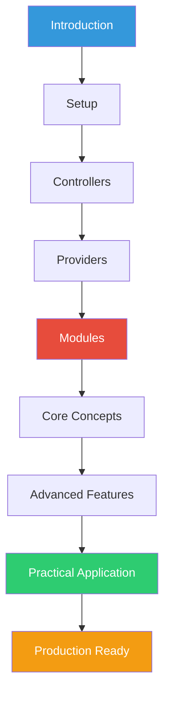

# NestJS Fundamentals Course

> A comprehensive guide to learning NestJS from Introduction to Building Production-Ready Applications


---

## 📚 About This Course

This course provides a complete learning path for NestJS, covering everything from basic concepts to building production-ready applications. Each module builds upon the previous one, ensuring a solid understanding of NestJS fundamentals and best practices.

**Course Level**: Beginner to Intermediate  
**Estimated Duration**: 20-30 hours  
**Prerequisites**: Basic JavaScript/TypeScript and Node.js knowledge

---

## 🎯 Learning Objectives

By the end of this course, you will be able to:

- ✅ Understand NestJS architecture and philosophy
- ✅ Build RESTful APIs with proper structure
- ✅ Implement dependency injection and IoC patterns
- ✅ Create modular, scalable applications
- ✅ Handle validation, errors, and exceptions
- ✅ Use middleware, pipes, guards, and interceptors
- ✅ Write unit and E2E tests
- ✅ Apply SOLID principles and best practices
- ✅ Build production-ready applications

---

## 📖 Course Modules

### [📋 Course Outline](course-outline.md)
View the complete course structure and topics covered in each module.

---

### Module 1: Introduction to NestJS
**[📘 View Module](module-01-introduction.md)**

Learn what NestJS is, its philosophy, and why it's a powerful framework for Node.js applications.

**Topics Covered:**
- What is NestJS?
- Philosophy & Architecture
- Core Concepts (OOP, FP, FRP)
- SOLID Principles
- Platform Support (Express & Fastify)

**Duration**: ~2 hours

---

### Module 2: Getting Started
**[📘 View Module](module-02-getting-started.md)**

Set up your development environment and create your first NestJS application.

**Topics Covered:**
- Prerequisites & Installation
- Project Setup (CLI, Git Clone, Manual)
- Understanding Project Structure
- Running the Application
- Development Tools (ESLint, Prettier)

**Duration**: ~2 hours

---

### Module 3: Controllers
**[📘 View Module](module-03-controllers.md)**

Master HTTP request handling, routing, and working with controllers.

**Topics Covered:**
- Introduction to Controllers
- Routing Basics & HTTP Methods
- Request Handling & Decorators
- Route Parameters
- Request Payloads & DTOs
- Query Parameters
- Response Handling
- Advanced Routing Features
- Asynchronous Operations

**Duration**: ~3 hours

---

### Module 4: Providers
**[📘 View Module](module-04-providers.md)**

Understand dependency injection and learn to create services and providers.

**Topics Covered:**
- Introduction to Providers
- Creating Services
- Dependency Injection Pattern
- Provider Scopes (Singleton, Request, Transient)
- Custom Providers (useValue, useClass, useFactory)
- Optional Providers
- Property-based Injection
- Provider Registration
- Manual Instantiation

**Duration**: ~3 hours

---

### Module 5: Modules
**[📘 View Module](module-05-modules.md)**

Organize your application into logical, reusable modules.

**Topics Covered:**
- Introduction to Modules
- Feature Modules
- Shared Modules
- Module Re-exporting
- Global Modules
- Dynamic Modules (forRoot, forFeature)
- Module Best Practices

**Duration**: ~3 hours

---

### Module 6: Core Fundamentals
**[📘 View Module](module-06-core-fundamentals.md)**

Dive deep into core NestJS concepts and application architecture.

**Topics Covered:**
- Application Bootstrap
- Platform Selection (Express vs Fastify)
- Exception Handling
- State Management
- SOLID Principles in Practice
- Development Best Practices
- Testing Fundamentals

**Duration**: ~3 hours

---

### Module 7: Additional Fundamentals
**[📘 View Module](module-07-additional-fundamentals.md)**

Learn about the request/response lifecycle and advanced features.

**Topics Covered:**
- Middleware
- Pipes (Validation & Transformation)
- Guards (Authentication & Authorization)
- Interceptors (Transformation & Logging)
- Custom Decorators
- Request Lifecycle

**Duration**: ~4 hours

---

### Module 8: Practical Application
**[📘 View Module](module-08-practical-application.md)**

Build a complete CRUD application putting all concepts together.

**Topics Covered:**
- Building a Task Management API
- Complete CRUD Operations
- Input Validation
- Error Handling
- Filtering & Pagination
- Testing (Unit & E2E)
- Best Practices Implementation

**Duration**: ~5 hours

---

## 🚀 Getting Started

### Option 1: Follow the Course Sequentially

1. Start with the [Course Outline](course-outline.md)
2. Begin with [Module 1: Introduction](module-01-introduction.md)
3. Progress through each module using the navigation links
4. Complete exercises and hands-on labs
5. Build the final project in Module 8

### Option 2: Jump to Specific Topics

Use the course outline or module links above to navigate directly to topics you want to learn.

### Option 3: Hands-On First

Jump straight to [Module 8: Practical Application](module-08-practical-application.md) to build the complete project, then refer back to earlier modules for deeper understanding.

---

## 💻 Prerequisites

Before starting this course, you should have:

- **Node.js** (version >= 20)
- **npm** or **yarn** package manager
- Basic understanding of **JavaScript/TypeScript**
- Familiarity with **Node.js** concepts
- Basic knowledge of **HTTP** and **RESTful APIs**
- A code editor (VS Code recommended)

### Recommended Knowledge

- ES6+ JavaScript features
- TypeScript basics
- Promises and async/await
- Object-oriented programming concepts

---

## 🛠️ Tools & Setup

### Required Tools

- **Node.js**: [Download](https://nodejs.org/)
- **npm/yarn**: Comes with Node.js
- **NestJS CLI**: `npm i -g @nestjs/cli`
- **VS Code**: [Download](https://code.visualstudio.com/)

### Recommended VS Code Extensions

- ESLint
- Prettier
- TypeScript and JavaScript Language Features
- Jest Runner
- REST Client

---

## 📝 Course Structure

Each module includes:

- **Detailed Explanations**: Clear, concise content with real-world examples
- **Code Examples**: Practical, working code snippets
- **Best Practices**: Industry-standard patterns and conventions
- **Exercises**: Hands-on practice to reinforce learning
- **Summary**: Key takeaways and important concepts
- **Additional Resources**: Links to official documentation and further reading

---

## 🎓 Learning Path



---

## 📚 Additional Resources

### Official Documentation
- [NestJS Official Docs](https://docs.nestjs.com/)
- [NestJS GitHub](https://github.com/nestjs/nest)
- [NestJS CLI](https://docs.nestjs.com/cli/overview)

### Community
- [NestJS Discord](https://discord.gg/G7Qnnhy)
- [Stack Overflow - nestjs tag](https://stackoverflow.com/questions/tagged/nestjs)
- [Reddit - r/nestjs](https://www.reddit.com/r/Nestjs/)

### Video Courses
- [Official NestJS Courses](https://courses.nestjs.com/)
- [YouTube - NestJS Official Channel](https://www.youtube.com/c/Nestjs)

### Repositories
- [Awesome NestJS](https://github.com/nestjs/awesome-nestjs)
- [NestJS Examples](https://github.com/nestjs/nest/tree/master/sample)

---

## 🏗️ Project Structure

```
learning/nestjs/
├── README.md                              # This file
├── course-outline.md                      # Complete course structure
├── module-01-introduction.md              # Module 1 content
├── module-02-getting-started.md           # Module 2 content
├── module-03-controllers.md               # Module 3 content
├── module-04-providers.md                 # Module 4 content
├── module-05-modules.md                   # Module 5 content
├── module-06-core-fundamentals.md         # Module 6 content
├── module-07-additional-fundamentals.md   # Module 7 content
└── module-08-practical-application.md     # Module 8 content
```

---

## ✅ Progress Tracking

Track your progress through the course:

- [ ] Module 1: Introduction to NestJS
- [ ] Module 2: Getting Started
- [ ] Module 3: Controllers
- [ ] Module 4: Providers
- [ ] Module 5: Modules
- [ ] Module 6: Core Fundamentals
- [ ] Module 7: Additional Fundamentals
- [ ] Module 8: Practical Application
- [ ] Final Project: Task Management API

---

## 🤝 Contributing

This course is designed to be comprehensive and up-to-date. If you find any issues or have suggestions for improvements:

1. Review the content thoroughly
2. Note specific areas for improvement
3. Consider best practices and latest NestJS features
4. Share feedback constructively

---

## 📜 License

This educational content is provided for learning purposes.

**NestJS** is [MIT licensed](https://github.com/nestjs/nest/blob/master/LICENSE).

---

## 🌟 Next Steps

Ready to start learning? Choose your path:

1. **📋 [View Course Outline](course-outline.md)** - See the complete curriculum
2. **📘 [Start Module 1](module-01-introduction.md)** - Begin with Introduction
3. **🚀 [Jump to Practical App](module-08-practical-application.md)** - Build immediately

---

## 💡 Tips for Success

1. **Practice Regularly**: Code along with examples
2. **Complete Exercises**: Hands-on practice is essential
3. **Build Projects**: Apply what you learn
4. **Read Documentation**: Refer to official NestJS docs
5. **Join Community**: Ask questions and help others
6. **Take Notes**: Document your learning journey
7. **Review Code**: Understand every line you write
8. **Test Your Code**: Write tests as you learn

---

## 🎯 Course Goals

By completing this course, you'll have:

- ✅ Built multiple working applications
- ✅ Understanding of NestJS architecture
- ✅ Ability to create production-ready APIs
- ✅ Knowledge of best practices
- ✅ Portfolio projects to showcase
- ✅ Confidence to build real-world applications

---

**Happy Learning! 🚀**

Start your NestJS journey today: [Begin with Module 1](module-01-introduction.md)

---

*Last Updated: February 9, 2026*
