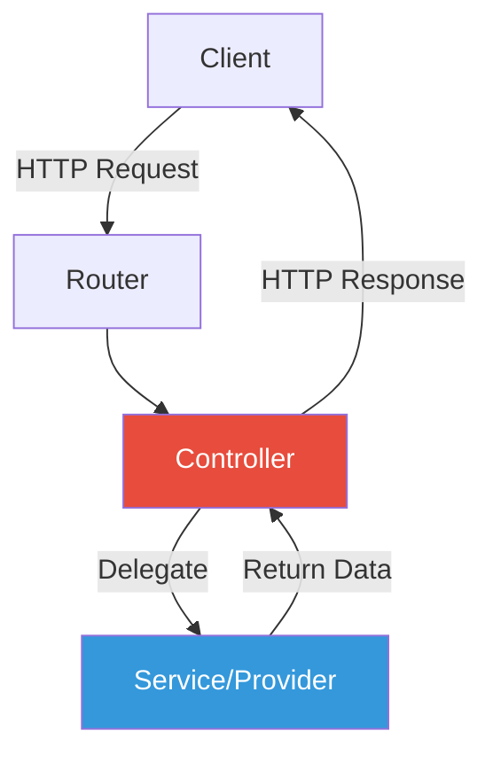

# Module 3: Controllers

## 3.1 Introduction to Controllers

### What Are Controllers?

Controllers are responsible for handling incoming **requests** and returning **responses** to the client.



### Purpose of Controllers
- ✅ Handle incoming HTTP requests
- ✅ Return responses to client
- ✅ Route requests to appropriate handlers
- ✅ Validate request data
- ✅ Delegate business logic to services

### Controller Basics

**Simple Controller Example**:
```typescript
import { Controller, Get } from '@nestjs/common';

@Controller('cats')
export class CatsController {
  @Get()
  findAll(): string {
    return 'This action returns all cats';
  }
}
```

**Key Components**:
1. `@Controller()` decorator - Defines the controller
2. Route path prefix - `'cats'` in this example
3. Handler methods - `findAll()` in this example
4. HTTP method decorators - `@Get()` in this example

---

## 3.2 Routing Basics

### Defining Routes

#### Route Path Prefix
```typescript
@Controller('cats')  // Prefix: /cats
export class CatsController {
  @Get()              // Route: GET /cats
  findAll() {}
  
  @Get('profile')     // Route: GET /cats/profile
  getProfile() {}
}
```

#### Without Prefix
```typescript
@Controller()  // No prefix
export class AppController {
  @Get()       // Route: GET /
  root() {}
  
  @Get('about')  // Route: GET /about
  about() {}
}
```

### HTTP Method Decorators

```typescript
import { Controller, Get, Post, Put, Delete, Patch, Options, Head, All } from '@nestjs/common';

@Controller('cats')
export class CatsController {
  @Get()
  findAll() {
    return 'GET /cats';
  }

  @Post()
  create() {
    return 'POST /cats';
  }

  @Put(':id')
  update() {
    return 'PUT /cats/:id';
  }

  @Delete(':id')
  remove() {
    return 'DELETE /cats/:id';
  }

  @Patch(':id')
  partialUpdate() {
    return 'PATCH /cats/:id';
  }

  @Options()
  options() {
    return 'OPTIONS /cats';
  }

  @Head()
  head() {
    // HEAD /cats
  }

  @All()
  handleAll() {
    return 'Handles all HTTP methods';
  }
}
```

### Creating Controllers with CLI

```bash
# Generate a controller
nest g controller cats

# Generate with --no-spec (without test file)
nest g controller cats --no-spec

# Generate in a specific directory
nest g controller modules/cats/cats

# Generate CRUD resource (controller + service + module)
nest g resource cats
```

---

## 3.3 Request Handling

### Request Object Access

#### Using @Req() Decorator
```typescript
import { Controller, Get, Req } from '@nestjs/common';
import { Request } from 'express';

@Controller('cats')
export class CatsController {
  @Get()
  findAll(@Req() request: Request): string {
    console.log(request.url);
    console.log(request.method);
    console.log(request.headers);
    return 'This action returns all cats';
  }
}
```

### Request Decorators

NestJS provides specialized decorators for accessing specific request properties:

```typescript
import {
  Controller,
  Get,
  Post,
  Req,
  Res,
  Next,
  Session,
  Param,
  Body,
  Query,
  Headers,
  Ip,
  HostParam
} from '@nestjs/common';

@Controller('example')
export class ExampleController {
  // Full request object
  @Get('request')
  withRequest(@Req() req) {
    return { method: req.method };
  }

  // Full response object (be careful!)
  @Get('response')
  withResponse(@Res() res) {
    res.status(200).json({ message: 'Success' });
  }

  // Next function (middleware)
  @Get('next')
  withNext(@Next() next) {
    console.log('Before...');
    next();
  }

  // Session data
  @Get('session')
  withSession(@Session() session) {
    return { sessionId: session.id };
  }

  // Route parameters
  @Get('param/:id')
  withParam(@Param('id') id: string) {
    return { id };
  }

  // Request body
  @Post('body')
  withBody(@Body() body) {
    return body;
  }

  // Query parameters
  @Get('query')
  withQuery(@Query('search') search: string) {
    return { search };
  }

  // Headers
  @Get('headers')
  withHeaders(@Headers('user-agent') userAgent: string) {
    return { userAgent };
  }

  // IP address
  @Get('ip')
  withIp(@Ip() ip: string) {
    return { ip };
  }

  // Host parameter
  @Controller({ host: ':account.example.com' })
  @Get()
  withHostParam(@HostParam('account') account: string) {
    return { account };
  }
}
```

### Decorator Reference Table

| Decorator | Express Equivalent |
|-----------|-------------------|
| `@Request()`, `@Req()` | `req` |
| `@Response()`, `@Res()`* | `res` |
| `@Next()` | `next` |
| `@Session()` | `req.session` |
| `@Param(key?: string)` | `req.params` / `req.params[key]` |
| `@Body(key?: string)` | `req.body` / `req.body[key]` |
| `@Query(key?: string)` | `req.query` / `req.query[key]` |
| `@Headers(name?: string)` | `req.headers` / `req.headers[name]` |
| `@Ip()` | `req.ip` |
| `@HostParam()` | `req.hosts` |

*Using `@Res()` switches to library-specific mode

---

## 3.4 Route Parameters

### Dynamic Routes

```typescript
@Controller('cats')
export class CatsController {
  // Route: GET /cats/:id
  @Get(':id')
  findOne(@Param('id') id: string): string {
    return `This action returns a #${id} cat`;
  }

  // Multiple parameters
  @Get(':userId/posts/:postId')
  getPost(
    @Param('userId') userId: string,
    @Param('postId') postId: string,
  ): string {
    return `User ${userId}, Post ${postId}`;
  }

  // All parameters as object
  @Get(':category/:id')
  getByCategory(@Param() params: any): string {
    return `Category: ${params.category}, ID: ${params.id}`;
  }
}
```

### Parameter DTOs

**Create DTO**:
```typescript
// dto/find-one.dto.ts
export class FindOneParams {
  id: string;
}
```

**Use in Controller**:
```typescript
import { FindOneParams } from './dto/find-one.dto';

@Get(':id')
findOne(@Param() params: FindOneParams): string {
  return `This action returns a #${params.id} cat`;
}
```

### Best Practices for Route Order

```typescript
@Controller('cats')
export class CatsController {
  // ✅ Static routes first
  @Get('recent')
  getRecent() {
    return 'Recent cats';
  }

  @Get('popular')
  getPopular() {
    return 'Popular cats';
  }

  // ✅ Dynamic routes last
  @Get(':id')
  findOne(@Param('id') id: string) {
    return `Cat #${id}`;
  }
}

// ❌ Bad order:
// @Get(':id') would catch 'recent' and 'popular'
```

---

## 3.5 Request Payloads

### Handling POST Requests

#### Create DTO (Data Transfer Object)
```typescript
// dto/create-cat.dto.ts
export class CreateCatDto {
  name: string;
  age: number;
  breed: string;
}
```

**Why Classes Over Interfaces?**
- ✅ Classes exist at runtime (TypeScript interfaces don't)
- ✅ Enable runtime validation with Pipes
- ✅ Work with decorators
- ✅ Can be instantiated

#### Use DTO in Controller
```typescript
import { Controller, Post, Body } from '@nestjs/common';
import { CreateCatDto } from './dto/create-cat.dto';

@Controller('cats')
export class CatsController {
  @Post()
  async create(@Body() createCatDto: CreateCatDto) {
    return {
      message: 'Cat created',
      data: createCatDto
    };
  }

  // Access specific body fields
  @Post('simple')
  createSimple(
    @Body('name') name: string,
    @Body('age') age: number,
  ) {
    return { name, age };
  }
}
```

### Complete CRUD Example

```typescript
// dto/create-cat.dto.ts
export class CreateCatDto {
  name: string;
  age: number;
  breed: string;
}

// dto/update-cat.dto.ts
export class UpdateCatDto {
  name?: string;
  age?: number;
  breed?: string;
}

// cats.controller.ts
import { Controller, Get, Post, Put, Delete, Body, Param } from '@nestjs/common';
import { CreateCatDto } from './dto/create-cat.dto';
import { UpdateCatDto } from './dto/update-cat.dto';

@Controller('cats')
export class CatsController {
  @Post()
  create(@Body() createCatDto: CreateCatDto) {
    return { message: 'Created', data: createCatDto };
  }

  @Get()
  findAll() {
    return { message: 'All cats' };
  }

  @Get(':id')
  findOne(@Param('id') id: string) {
    return { message: `Cat #${id}` };
  }

  @Put(':id')
  update(
    @Param('id') id: string,
    @Body() updateCatDto: UpdateCatDto,
  ) {
    return { message: `Updated cat #${id}`, data: updateCatDto };
  }

  @Delete(':id')
  remove(@Param('id') id: string) {
    return { message: `Deleted cat #${id}` };
  }
}
```

---

## 3.6 Query Parameters

### Basic Query Parameters

```typescript
import { Controller, Get, Query } from '@nestjs/common';

@Controller('cats')
export class CatsController {
  // GET /cats?limit=10&offset=0
  @Get()
  findAll(
    @Query('limit') limit: number,
    @Query('offset') offset: number,
  ) {
    return {
      limit: limit || 10,
      offset: offset || 0,
      data: []
    };
  }

  // All query parameters
  @Get('search')
  search(@Query() query: any) {
    // GET /cats/search?name=Fluffy&age=3&breed=Persian
    return {
      filters: query
    };
  }
}
```

### Query DTO

```typescript
// dto/list-all.dto.ts
export class ListAllDto {
  limit: number;
  offset: number;
  sortBy?: string;
  order?: 'asc' | 'desc';
}

// Controller
@Get()
findAll(@Query() query: ListAllDto) {
  return {
    limit: query.limit || 10,
    offset: query.offset || 0,
    sortBy: query.sortBy || 'createdAt',
    order: query.order || 'desc'
  };
}
```

### Complex Query Strings

For nested objects and arrays:

```typescript
// GET /cats?filter[where][name]=John&filter[where][age]=30
// GET /cats?items[]=1&items[]=2&items[]=3

// Express configuration (main.ts)
import { NestFactory } from '@nestjs/core';
import { NestExpressApplication } from '@nestjs/platform-express';

async function bootstrap() {
  const app = await NestFactory.create<NestExpressApplication>(AppModule);
  app.set('query parser', 'extended');
  await app.listen(3000);
}

// Fastify configuration
import { FastifyAdapter } from '@nestjs/platform-fastify';
import * as qs from 'qs';

const app = await NestFactory.create<NestFastifyApplication>(
  AppModule,
  new FastifyAdapter({
    querystringParser: (str) => qs.parse(str),
  }),
);
```

---

## 3.7 Response Handling

### Standard Response (Recommended)

```typescript
@Controller('cats')
export class CatsController {
  // Returns string
  @Get('string')
  getString(): string {
    return 'Hello';
  }

  // Returns object (auto-serialized to JSON)
  @Get('object')
  getObject() {
    return { name: 'Fluffy', age: 3 };
  }

  // Returns array (auto-serialized to JSON)
  @Get('array')
  getArray() {
    return [{ id: 1 }, { id: 2 }];
  }

  // Returns Promise
  @Get('promise')
  async getPromise(): Promise<any> {
    return { async: true };
  }
}
```

**Default Status Codes**:
- GET, PUT, DELETE: **200 OK**
- POST: **201 Created**

### Library-Specific Response

```typescript
import { Controller, Get, Res, HttpStatus } from '@nestjs/common';
import { Response } from 'express';

@Controller('cats')
export class CatsController {
  @Get()
  findAll(@Res() res: Response) {
    res.status(HttpStatus.OK).json({ message: 'Success' });
  }
}
```

**⚠️ Warning**: Using `@Res()` disables standard response handling!

### Passthrough Mode

```typescript
@Get()
findAll(@Res({ passthrough: true }) res: Response) {
  res.cookie('token', '123');  // Set cookie
  return { data: [] };         // Still return data normally
}
```

---

## 3.8 Advanced Routing

### Status Codes

```typescript
import { Controller, Post, HttpCode, HttpStatus } from '@nestjs/common';

@Controller('cats')
export class CatsController {
  @Post()
  @HttpCode(204)  // No Content
  create() {
    // Status code: 204
  }

  @Post('custom')
  @HttpCode(HttpStatus.CREATED)  // 201
  createCustom() {
    // Status code: 201
  }
}
```

### Custom Headers

```typescript
import { Controller, Post, Header } from '@nestjs/common';

@Controller('cats')
export class CatsController {
  @Post()
  @Header('Cache-Control', 'no-store')
  @Header('X-Custom-Header', 'value')
  create() {
    return { message: 'Created' };
  }
}
```

### Redirects

```typescript
import { Controller, Get, Redirect } from '@nestjs/common';

@Controller()
export class AppController {
  @Get('docs')
  @Redirect('https://docs.nestjs.com', 301)
  getDocs() {
    // Redirects to NestJS docs
  }

  // Dynamic redirect
  @Get('dynamic')
  @Redirect('https://nestjs.com', 302)
  dynamicRedirect(@Query('version') version: string) {
    if (version && version === '5') {
      return { url: 'https://docs.nestjs.com/v5/' };
    }
    // Falls back to default redirect
  }
}
```

### Route Wildcards

```typescript
@Controller('cats')
export class CatsController {
  // Matches: /cats/ab, /cats/abc, /cats/abcd, etc.
  @Get('ab*')
  findWithWildcard() {
    return 'Wildcard route';
  }

  // Express v5 requires named wildcards
  @Get('prefix-*')  // NestJS compatibility layer
  findPrefix() {
    return 'Prefix route';
  }
}
```

### Sub-domain Routing

```typescript
@Controller({ host: 'admin.example.com' })
export class AdminController {
  @Get()
  index() {
    return 'Admin panel';
  }
}

// Dynamic sub-domains
@Controller({ host: ':account.example.com' })
export class AccountController {
  @Get()
  getInfo(@HostParam('account') account: string) {
    return { account };
  }
}
```

**⚠️ Note**: Fastify doesn't support nested routers - use Express for sub-domain routing.

---

## 3.9 Asynchronous Operations

### Async/Await

```typescript
@Controller('cats')
export class CatsController {
  @Get()
  async findAll(): Promise<Cat[]> {
    const cats = await this.catsService.findAll();
    return cats;
  }
}
```

### RxJS Observables

```typescript
import { Observable, of } from 'rxjs';

@Controller('cats')
export class CatsController {
  @Get()
  findAll(): Observable<Cat[]> {
    return of([]);
  }

  @Get('rxjs')
  getRxJS(): Observable<any> {
    return this.httpService.get('/api/data').pipe(
      map(response => response.data),
      catchError(error => of([]))
    );
  }
}
```

---

## 3.10 Controller Registration

### Register in Module

```typescript
// app.module.ts
import { Module } from '@nestjs/common';
import { CatsController } from './cats/cats.controller';
import { CatsService } from './cats/cats.service';

@Module({
  controllers: [CatsController],  // Register here
  providers: [CatsService],
})
export class AppModule {}
```

### Multiple Controllers

```typescript
@Module({
  controllers: [
    AppController,
    CatsController,
    DogsController,
    UsersController,
  ],
  providers: [/*...*/],
})
export class AppModule {}
```

---

## 3.11 Complete Example

```typescript
// interfaces/cat.interface.ts
export interface Cat {
  id: number;
  name: string;
  age: number;
  breed: string;
}

// dto/create-cat.dto.ts
export class CreateCatDto {
  name: string;
  age: number;
  breed: string;
}

// dto/update-cat.dto.ts
export class UpdateCatDto {
  name?: string;
  age?: number;
  breed?: string;
}

// dto/list-query.dto.ts
export class ListQueryDto {
  limit?: number;
  offset?: number;
}

// cats.controller.ts
import { Controller, Get, Post, Put, Delete, Body, Param, Query, HttpCode, HttpStatus } from '@nestjs/common';
import { CatsService } from './cats.service';
import { CreateCatDto } from './dto/create-cat.dto';
import { UpdateCatDto } from './dto/update-cat.dto';
import { ListQueryDto } from './dto/list-query.dto';
import { Cat } from './interfaces/cat.interface';

@Controller('cats')
export class CatsController {
  constructor(private readonly catsService: CatsService) {}

  @Post()
  @HttpCode(HttpStatus.CREATED)
  async create(@Body() createCatDto: CreateCatDto): Promise<Cat> {
    return this.catsService.create(createCatDto);
  }

  @Get()
  async findAll(@Query() query: ListQueryDto): Promise<Cat[]> {
    return this.catsService.findAll(query);
  }

  @Get(':id')
  async findOne(@Param('id') id: string): Promise<Cat> {
    return this.catsService.findOne(+id);
  }

  @Put(':id')
  async update(
    @Param('id') id: string,
    @Body() updateCatDto: UpdateCatDto,
  ): Promise<Cat> {
    return this.catsService.update(+id, updateCatDto);
  }

  @Delete(':id')
  @HttpCode(HttpStatus.NO_CONTENT)
  async remove(@Param('id') id: string): Promise<void> {
    return this.catsService.remove(+id);
  }
}
```

---

## Summary

### Key Concepts
1. ✅ Controllers handle HTTP requests
2. ✅ Use decorators for routing (`@Get()`, `@Post()`, etc.)
3. ✅ Request decorators extract specific data (`@Param()`, `@Body()`, `@Query()`)
4. ✅ DTOs define request/response shapes
5. ✅ Support async/await and RxJS Observables
6. ✅ Must be registered in modules

### Best Practices
- ✅ Keep controllers thin - delegate logic to services
- ✅ Use DTOs for type safety
- ✅ Use specific decorators over `@Req()`
- ✅ Place static routes before dynamic ones
- ✅ Use async/await for cleaner code
- ✅ Return plain objects (auto-serialized)
- ✅ Avoid `@Res()` unless necessary

---

## Exercises

1. Create a UsersController with full CRUD operations
2. Add query parameters for filtering and pagination
3. Implement sub-routes (e.g., `/users/:id/posts`)
4. Create DTOs with validation
5. Test all endpoints with Postman or cURL

---

## 📚 Course Navigation

⬅️ **[Previous: Module 2 - Getting Started](module-02-getting-started.md)**

🏠 **[Back to Course Outline](course-outline.md)**

➡️ **[Next: Module 4 - Providers](module-04-providers.md)**
