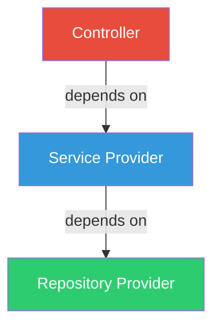

# Module 4: Providers

## 4.1 Introduction to Providers

### What Are Providers?

Providers are a fundamental concept in NestJS. Many basic NestJS classes can be treated as providers:
- **Services**
- **Repositories**
- **Factories**
- **Helpers**
- And more...

### Key Concept: Dependency Injection

The main idea of a provider is that it can be **injected** as a dependency. This means objects can create various relationships with each other, and the responsibility of "wiring up" these instances is largely delegated to the NestJS runtime system.



### The @Injectable() Decorator

```typescript
import { Injectable } from '@nestjs/common';

@Injectable()
export class CatsService {
  // This class can be managed by the NestJS IoC container
}
```

---

## 4.2 Services

### Creating a Service

Services handle business logic and data operations.

#### Basic Service Example

```typescript
// cats.service.ts
import { Injectable } from '@nestjs/common';
import { Cat } from './interfaces/cat.interface';

@Injectable()
export class CatsService {
  private readonly cats: Cat[] = [];

  create(cat: Cat) {
    this.cats.push(cat);
  }

  findAll(): Cat[] {
    return this.cats;
  }

  findOne(id: number): Cat {
    return this.cats.find(cat => cat.id === id);
  }

  update(id: number, cat: Cat): Cat {
    const index = this.cats.findIndex(c => c.id === id);
    if (index !== -1) {
      this.cats[index] = { ...this.cats[index], ...cat };
      return this.cats[index];
    }
    return null;
  }

  remove(id: number): void {
    const index = this.cats.findIndex(c => c.id === id);
    if (index !== -1) {
      this.cats.splice(index, 1);
    }
  }
}
```

#### Interface Definition

```typescript
// interfaces/cat.interface.ts
export interface Cat {
  id: number;
  name: string;
  age: number;
  breed: string;
}
```

### Using Service in Controller

```typescript
// cats.controller.ts
import { Controller, Get, Post, Body } from '@nestjs/common';
import { CreateCatDto } from './dto/create-cat.dto';
import { CatsService } from './cats.service';
import { Cat } from './interfaces/cat.interface';

@Controller('cats')
export class CatsController {
  // Inject the service via constructor
  constructor(private catsService: CatsService) {}

  @Post()
  async create(@Body() createCatDto: CreateCatDto) {
    this.catsService.create(createCatDto);
  }

  @Get()
  async findAll(): Promise<Cat[]> {
    return this.catsService.findAll();
  }
}
```

### Constructor Injection Shorthand

The `private` keyword is a TypeScript shorthand that:
1. Declares a class property
2. Assigns the constructor parameter to that property

```typescript
// These are equivalent:

// Long form
export class CatsController {
  private catsService: CatsService;
  
  constructor(catsService: CatsService) {
    this.catsService = catsService;
  }
}

// Short form (recommended)
export class CatsController {
  constructor(private catsService: CatsService) {}
}

// Even shorter with readonly
export class CatsController {
  constructor(private readonly catsService: CatsService) {}
}
```

### Generate Service with CLI

```bash
# Generate a service
nest g service cats

# Generate without test file
nest g service cats --no-spec

# Generate in specific directory
nest g service modules/cats/cats
```

---

## 4.3 Dependency Injection

### Understanding DI

Dependency Injection is a design pattern where a class receives its dependencies from external sources rather than creating them itself.

#### Without DI (Bad)
```typescript
export class CatsController {
  private catsService: CatsService;
  
  constructor() {
    // Controller creates its own dependency - tight coupling!
    this.catsService = new CatsService();
  }
}
```

#### With DI (Good)
```typescript
export class CatsController {
  // Dependency is injected - loose coupling!
  constructor(private readonly catsService: CatsService) {}
}
```

### How NestJS Resolves Dependencies

1. **Type Detection**: NestJS uses TypeScript metadata to detect types
2. **Token Creation**: Creates a token for each dependency
3. **Provider Lookup**: Looks up the provider in the module
4. **Instance Creation**: Creates or retrieves cached instance
5. **Injection**: Injects the instance

```typescript
// NestJS automatically:
// 1. Sees CatsController needs CatsService
// 2. Looks for CatsService in the providers array
// 3. Creates CatsService instance (or returns existing singleton)
// 4. Injects it into CatsController

@Module({
  controllers: [CatsController],
  providers: [CatsService],  // ← NestJS finds it here
})
export class AppModule {}
```

### Multiple Dependencies

```typescript
@Injectable()
export class CatsService {
  constructor(
    private readonly catsRepository: CatsRepository,
    private readonly logger: LoggerService,
    private readonly configService: ConfigService,
  ) {}
}
```

### Benefits of DI

1. ✅ **Loose Coupling**: Classes don't create their dependencies
2. ✅ **Testability**: Easy to mock dependencies in tests
3. ✅ **Flexibility**: Change implementations without changing consumers
4. ✅ **Reusability**: Share instances across the application
5. ✅ **Maintainability**: Clear dependency graph

---

## 4.4 Provider Scopes

### Singleton Scope (Default)

By default, providers are **singletons**:
- Created once when the application starts
- Shared across the entire application
- Lives for the application lifetime

```typescript
@Injectable()  // Default scope: SINGLETON
export class CatsService {
  private counter = 0;
  
  increment() {
    this.counter++;  // Shared state across all requests
  }
}
```

### Request Scope

A new instance is created for each request:

```typescript
import { Injectable, Scope } from '@nestjs/common';

@Injectable({ scope: Scope.REQUEST })
export class CatsService {
  private counter = 0;
  
  increment() {
    this.counter++;  // Separate state per request
  }
}
```

### Transient Scope

A new instance is created each time it's injected:

```typescript
@Injectable({ scope: Scope.TRANSIENT })
export class CatsService {
  // New instance for every injection
}
```

### Scope Comparison

| Scope | Lifetime | Use Case | Performance |
|-------|----------|----------|-------------|
| **SINGLETON** | Application | Most services | Best |
| **REQUEST** | Single request | Request-specific data | Moderate |
| **TRANSIENT** | Per injection | Stateless utilities | Lowest |

### When to Use Request Scope

- Per-request caching
- Request tracking
- Multi-tenancy
- GraphQL per-request context

```typescript
@Injectable({ scope: Scope.REQUEST })
export class RequestContextService {
  private requestId: string;
  
  setRequestId(id: string) {
    this.requestId = id;
  }
  
  getRequestId(): string {
    return this.requestId;
  }
}
```

---

## 4.5 Custom Providers

### Standard Provider (Class)

```typescript
@Module({
  providers: [CatsService],  // Shorthand
  // Equivalent to:
  // providers: [
  //   {
  //     provide: CatsService,
  //     useClass: CatsService,
  //   }
  // ],
})
export class AppModule {}
```

### Value Provider (useValue)

Inject a plain value or object:

```typescript
const mockCatsService = {
  findAll: () => ['test'],
};

@Module({
  providers: [
    {
      provide: CatsService,
      useValue: mockCatsService,
    },
  ],
})
export class AppModule {}
```

### Class Provider (useClass)

Provide an alternative implementation:

```typescript
@Injectable()
export class ConfigService {
  get(key: string): string {
    return process.env[key];
  }
}

@Injectable()
export class DevelopmentConfigService extends ConfigService {
  get(key: string): string {
    return 'development-' + process.env[key];
  }
}

@Module({
  providers: [
    {
      provide: ConfigService,
      useClass: process.env.NODE_ENV === 'development'
        ? DevelopmentConfigService
        : ConfigService,
    },
  ],
})
export class AppModule {}
```

### Factory Provider (useFactory)

Dynamically create provider:

```typescript
@Module({
  providers: [
    {
      provide: 'CONNECTION',
      useFactory: (configService: ConfigService) => {
        const connectionString = configService.get('DATABASE_URL');
        return createConnection(connectionString);
      },
      inject: [ConfigService],  // Dependencies for factory
    },
  ],
})
export class AppModule {}
```

### Async Factory Provider

```typescript
{
  provide: 'ASYNC_CONNECTION',
  useFactory: async (configService: ConfigService) => {
    const connection = await createConnection({
      host: configService.get('DB_HOST'),
      port: configService.get('DB_PORT'),
    });
    return connection;
  },
  inject: [ConfigService],
}
```

### Custom Tokens (String Tokens)

```typescript
// Define token
const DATABASE_CONNECTION = 'DATABASE_CONNECTION';

// Provide with token
@Module({
  providers: [
    {
      provide: DATABASE_CONNECTION,
      useFactory: () => createConnection(),
    },
  ],
})
export class AppModule {}

// Inject with token
@Injectable()
export class CatsService {
  constructor(
    @Inject(DATABASE_CONNECTION) private connection: Connection,
  ) {}
}
```

### Using Symbol Tokens

```typescript
export const CONFIG_OPTIONS = Symbol('CONFIG_OPTIONS');

@Module({
  providers: [
    {
      provide: CONFIG_OPTIONS,
      useValue: { apiKey: 'xxx' },
    },
  ],
})
export class AppModule {}
```

---

## 4.6 Optional Providers

### Using @Optional() Decorator

Sometimes dependencies might not be available, and you want to handle their absence gracefully:

```typescript
import { Injectable, Optional, Inject } from '@nestjs/common';

@Injectable()
export class HttpService {
  constructor(
    @Optional() @Inject('HTTP_OPTIONS') private httpOptions?: HttpOptions,
  ) {
    // httpOptions might be undefined
    this.httpOptions = httpOptions || { timeout: 3000 };
  }
}
```

### Use Cases

1. **Optional Configuration**
```typescript
@Injectable()
export class CatsService {
  constructor(
    @Optional() private configService?: ConfigService,
  ) {
    const timeout = this.configService?.get('TIMEOUT') ?? 5000;
  }
}
```

2. **Plugin Architecture**
```typescript
@Injectable()
export class AppService {
  constructor(
    @Optional() @Inject('PLUGINS') private plugins?: Plugin[],
  ) {
    this.plugins = plugins || [];
  }
}
```

---

## 4.7 Property-based Injection

### Constructor Injection (Recommended)

```typescript
@Injectable()
export class CatsService {
  constructor(private readonly logger: LoggerService) {}
}
```

### Property Injection (Alternative)

Use when constructor injection isn't possible (e.g., with inheritance):

```typescript
import { Injectable, Inject } from '@nestjs/common';

@Injectable()
export class CatsService {
  @Inject('LoggerService')
  private readonly logger: LoggerService;
  
  // No constructor needed
}
```

### When to Use Property Injection

**Use Case: Inheritance**
```typescript
@Injectable()
export class BaseService {
  @Inject(LoggerService)
  protected readonly logger: LoggerService;
}

@Injectable()
export class CatsService extends BaseService {
  // Automatically has logger without calling super()
  
  findAll() {
    this.logger.log('Finding all cats');
  }
}
```

**⚠️ Warning**: Prefer constructor injection when possible:
- More explicit
- Easier to test
- Clear dependencies
- Better type safety

---

## 4.8 Provider Registration

### Register in Module

```typescript
// cats.module.ts
import { Module } from '@nestjs/common';
import { CatsController } from './cats.controller';
import { CatsService } from './cats.service';

@Module({
  controllers: [CatsController],
  providers: [CatsService],  // Register provider
})
export class CatsModule {}
```

### Multiple Providers

```typescript
@Module({
  providers: [
    CatsService,
    DogsService,
    AnimalsService,
    LoggerService,
  ],
})
export class AnimalsModule {}
```

### Exporting Providers

Make providers available to other modules:

```typescript
@Module({
  providers: [CatsService],
  exports: [CatsService],  // Other modules can use it
})
export class CatsModule {}
```

### Importing and Using

```typescript
@Module({
  imports: [CatsModule],  // Import module
  controllers: [AppController],
})
export class AppModule {}

// Now AppController can inject CatsService
@Controller()
export class AppController {
  constructor(private catsService: CatsService) {}
}
```

---

## 4.9 Manual Instantiation

### Module Reference

Get providers programmatically:

```typescript
import { Injectable } from '@nestjs/common';
import { ModuleRef } from '@nestjs/core';

@Injectable()
export class CatsService {
  constructor(private moduleRef: ModuleRef) {}

  async getDynamicService(serviceName: string) {
    const service = this.moduleRef.get(serviceName);
    return service;
  }
}
```

### Lazy Loading

```typescript
@Injectable()
export class CatsService {
  constructor(private moduleRef: ModuleRef) {}

  async onModuleInit() {
    const lazyService = await this.moduleRef.resolve(LazyService);
  }
}
```

### In Bootstrap Function

```typescript
// main.ts
async function bootstrap() {
  const app = await NestFactory.create(AppModule);
  
  // Get service from app context
  const configService = app.get(ConfigService);
  const port = configService.get('PORT');
  
  await app.listen(port);
}
```

---

## 4.10 Complete Service Example

### Repository Pattern

```typescript
// cats.repository.ts
import { Injectable } from '@nestjs/common';
import { Cat } from './interfaces/cat.interface';

@Injectable()
export class CatsRepository {
  private cats: Cat[] = [];
  private idCounter = 1;

  create(cat: Omit<Cat, 'id'>): Cat {
    const newCat = { id: this.idCounter++, ...cat };
    this.cats.push(newCat);
    return newCat;
  }

  findAll(): Cat[] {
    return this.cats;
  }

  findById(id: number): Cat | undefined {
    return this.cats.find(cat => cat.id === id);
  }

  update(id: number, data: Partial<Cat>): Cat | undefined {
    const index = this.cats.findIndex(cat => cat.id === id);
    if (index === -1) return undefined;
    
    this.cats[index] = { ...this.cats[index], ...data };
    return this.cats[index];
  }

  delete(id: number): boolean {
    const index = this.cats.findIndex(cat => cat.id === id);
    if (index === -1) return false;
    
    this.cats.splice(index, 1);
    return true;
  }
}
```

### Service Layer

```typescript
// cats.service.ts
import { Injectable, NotFoundException } from '@nestjs/common';
import { CatsRepository } from './cats.repository';
import { CreateCatDto } from './dto/create-cat.dto';
import { UpdateCatDto } from './dto/update-cat.dto';
import { Cat } from './interfaces/cat.interface';

@Injectable()
export class CatsService {
  constructor(
    private readonly catsRepository: CatsRepository,
    private readonly logger: LoggerService,
  ) {}

  async create(createCatDto: CreateCatDto): Promise<Cat> {
    this.logger.log('Creating a new cat');
    return this.catsRepository.create(createCatDto);
  }

  async findAll(): Promise<Cat[]> {
    return this.catsRepository.findAll();
  }

  async findOne(id: number): Promise<Cat> {
    const cat = this.catsRepository.findById(id);
    if (!cat) {
      throw new NotFoundException(`Cat with ID ${id} not found`);
    }
    return cat;
  }

  async update(id: number, updateCatDto: UpdateCatDto): Promise<Cat> {
    const cat = await this.findOne(id);  // Throws if not found
    return this.catsRepository.update(id, updateCatDto);
  }

  async remove(id: number): Promise<void> {
    const cat = await this.findOne(id);  // Throws if not found
    this.catsRepository.delete(id);
    this.logger.log(`Cat with ID ${id} removed`);
  }
}
```

### Module Configuration

```typescript
// cats.module.ts
import { Module } from '@nestjs/common';
import { CatsController } from './cats.controller';
import { CatsService } from './cats.service';
import { CatsRepository } from './cats.repository';
import { LoggerService } from '../logger/logger.service';

@Module({
  controllers: [CatsController],
  providers: [
    CatsService,
    CatsRepository,
    LoggerService,
  ],
  exports: [CatsService],  // Available to other modules
})
export class CatsModule {}
```

---

## Summary

### Key Concepts

1. ✅ **Providers**: Services, repositories, factories, helpers
2. ✅ **@Injectable()**: Makes classes injectable
3. ✅ **Dependency Injection**: Automatic dependency resolution
4. ✅ **Scopes**: Singleton (default), Request, Transient
5. ✅ **Custom Providers**: useValue, useClass, useFactory
6. ✅ **Registration**: Must be in module's providers array
7. ✅ **Exporting**: Make available to other modules

### Best Practices

- ✅ Use constructor injection (not property injection)
- ✅ Keep services focused on single responsibility
- ✅ Use interfaces for type safety
- ✅ Inject interfaces, not concrete classes (when possible)
- ✅ Use repository pattern for data access
- ✅ Keep business logic in services, not controllers
- ✅ Use readonly for injected dependencies
- ✅ Prefer singleton scope unless you need request-specific state

### Design Patterns

1. **Service Pattern**: Business logic layer
2. **Repository Pattern**: Data access layer
3. **Factory Pattern**: Dynamic object creation
4. **Singleton Pattern**: Share instances (default)
5. **Dependency Injection**: Loose coupling

---

## Exercises

### Exercise 1: Create a User Service
```typescript
// 1. Create user.service.ts
// 2. Implement CRUD operations
// 3. Inject into UserController
// 4. Register in UserModule
```

### Exercise 2: Implement Repository Pattern
```typescript
// 1. Create user.repository.ts
// 2. Move data operations from service
// 3. Inject repository into service
// 4. Test the separation of concerns
```

### Exercise 3: Custom Provider
```typescript
// 1. Create a configuration provider
// 2. Use useFactory
// 3. Make it async
// 4. Inject ConfigService
```

### Exercise 4: Multi-layer Architecture
```typescript
// Create:
// - Controller (HTTP layer)
// - Service (Business logic)
// - Repository (Data access)
// - DTOs (Data transfer)
// - Interfaces (Contracts)
```

---

## Additional Resources

- [NestJS Providers Documentation](https://docs.nestjs.com/providers)
- [Dependency Injection Explained](https://angular.dev/guide/di)
- [Injection Scopes](https://docs.nestjs.com/fundamentals/injection-scopes)
- [Custom Providers](https://docs.nestjs.com/fundamentals/custom-providers)

---

## 📚 Course Navigation

⬅️ **[Previous: Module 3 - Controllers](module-03-controllers.md)**

🏠 **[Back to Course Outline](course-outline.md)**

➡️ **[Next: Module 5 - Modules](module-05-modules.md)**
