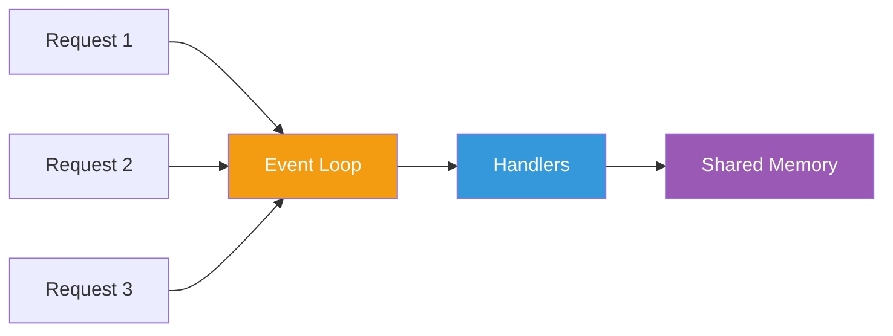

# Module 6: Core Fundamentals

## 6.1 Application Bootstrap

### The Bootstrap Process

Every NestJS application starts with a bootstrap function in `main.ts`:

```typescript
import { NestFactory } from '@nestjs/core';
import { AppModule } from './app.module';

async function bootstrap() {
  const app = await NestFactory.create(AppModule);
  await app.listen(3000);
}
bootstrap();
```

### NestFactory

The `NestFactory` class exposes static methods to create an application instance:

```typescript
// Basic creation
const app = await NestFactory.create(AppModule);

// With platform-specific type
const app = await NestFactory.create<NestExpressApplication>(AppModule);

// With Fastify
import { FastifyAdapter } from '@nestjs/platform-fastify';
const app = await NestFactory.create(
  AppModule,
  new FastifyAdapter()
);
```

### Application Configuration

```typescript
import { NestFactory } from '@nestjs/core';
import { AppModule } from './app.module';

async function bootstrap() {
  const app = await NestFactory.create(AppModule);

  // Enable CORS
  app.enableCors();

  // Set global prefix
  app.setGlobalPrefix('api');

  // Versioning
  app.enableVersioning({
    type: VersioningType.URI,
  });

  // Listen
  await app.listen(3000);
  
  console.log(`Application is running on: ${await app.getUrl()}`);
}
bootstrap();
```

### Error Handling During Bootstrap

```typescript
async function bootstrap() {
  const app = await NestFactory.create(AppModule, {
    abortOnError: false,  // Don't exit on error, throw instead
  });
  
  await app.listen(3000);
}

bootstrap().catch(err => {
  console.error('Failed to start application:', err);
  process.exit(1);
});
```

### Using Configuration Service in Bootstrap

```typescript
async function bootstrap() {
  const app = await NestFactory.create(AppModule);
  
  // Access service from app context
  const configService = app.get(ConfigService);
  const port = configService.get('PORT') || 3000;
  
  await app.listen(port);
}
```

---

## 6.2 Platform Selection

### Express Platform (Default)

```typescript
import { NestFactory } from '@nestjs/core';
import { NestExpressApplication } from '@nestjs/platform-express';
import { AppModule } from './app.module';

async function bootstrap() {
  const app = await NestFactory.create<NestExpressApplication>(AppModule);
  
  // Express-specific methods
  app.set('trust proxy', 1);
  app.set('view engine', 'pug');
  app.useStaticAssets('public');
  app.setBaseViewsDir('views');
  
  await app.listen(3000);
}
bootstrap();
```

#### When to Use Express

✅ **Good for**:
- Traditional web applications
- Need extensive middleware
- Team familiar with Express
- Require specific Express plugins

### Fastify Platform

```typescript
import { NestFactory } from '@nestjs/core';
import { NestFastifyApplication, FastifyAdapter } from '@nestjs/platform-fastify';
import { AppModule } from './app.module';

async function bootstrap() {
  const app = await NestFactory.create<NestFastifyApplication>(
    AppModule,
    new FastifyAdapter()
  );
  
  // Fastify-specific methods
  await app.register(require('fastify-helmet'));
  await app.register(require('fastify-compress'));
  
  await app.listen(3000, '0.0.0.0');
}
bootstrap();
```

#### When to Use Fastify

✅ **Good for**:
- Performance-critical applications
- High-throughput APIs
- Need lower overhead
- Modern plugin architecture

### Platform Comparison

| Feature | Express | Fastify |
|---------|---------|---------|
| **Performance** | Good | Excellent (2x faster) |
| **Middleware** | Rich ecosystem | Plugin-based |
| **Learning Curve** | Easy | Moderate |
| **Maturity** | Very mature | Mature |
| **Community** | Huge | Growing |
| **Request Validation** | Manual | Built-in |
| **Schema Support** | No | Yes (JSON Schema) |

### Platform-Agnostic Code

To keep code portable across platforms:

```typescript
// ✅ Good: Platform-agnostic
@Get()
async findAll(@Query() query: ListQueryDto) {
  return this.service.findAll(query);
}

// ❌ Bad: Platform-specific
@Get()
async findAll(@Req() req: Request) {  // Express Request type
  return this.service.findAll(req.query);
}
```

---

## 6.3 Exception Handling

### Built-in HTTP Exceptions

NestJS provides standard HTTP exception classes:

```typescript
import {
  BadRequestException,
  UnauthorizedException,
  NotFoundException,
  ForbiddenException,
  NotAcceptableException,
  RequestTimeoutException,
  ConflictException,
  GoneException,
  PayloadTooLargeException,
  UnsupportedMediaTypeException,
  UnprocessableEntityException,
  InternalServerErrorException,
  NotImplementedException,
  BadGatewayException,
  ServiceUnavailableException,
  GatewayTimeoutException,
} from '@nestjs/common';
```

### Throwing Exceptions

```typescript
import { Injectable, NotFoundException } from '@nestjs/common';

@Injectable()
export class CatsService {
  async findOne(id: number) {
    const cat = await this.catsRepository.findById(id);
    
    if (!cat) {
      throw new NotFoundException(`Cat with ID ${id} not found`);
    }
    
    return cat;
  }
}
```

### Exception Response Format

```json
{
  "statusCode": 404,
  "message": "Cat with ID 5 not found",
  "error": "Not Found"
}
```

### Custom Error Messages

```typescript
// Simple message
throw new BadRequestException('Invalid input data');

// Custom response
throw new BadRequestException({
  statusCode: 400,
  message: 'Validation failed',
  errors: ['Email is invalid', 'Age must be positive'],
});

// With error code
throw new NotFoundException('User not found', 'USER_NOT_FOUND');
```

### Exception Hierarchy

```typescript
try {
  await this.someOperation();
} catch (error) {
  if (error instanceof HttpException) {
    // Handle HTTP exceptions
    throw error;
  }
  
  // Handle other errors
  throw new InternalServerErrorException('Something went wrong');
}
```

### Creating Custom Exceptions

```typescript
// custom-exceptions/business-logic.exception.ts
export class BusinessLogicException extends HttpException {
  constructor(message: string) {
    super({
      statusCode: HttpStatus.UNPROCESSABLE_ENTITY,
      message,
      error: 'Business Logic Error',
    }, HttpStatus.UNPROCESSABLE_ENTITY);
  }
}

// Usage
throw new BusinessLogicException('Cannot delete user with active orders');
```

### Exception Filters

Create custom exception handlers:

```typescript
// filters/http-exception.filter.ts
import {
  ExceptionFilter,
  Catch,
  ArgumentsHost,
  HttpException,
  HttpStatus,
} from '@nestjs/common';
import { Request, Response } from 'express';

@Catch(HttpException)
export class HttpExceptionFilter implements ExceptionFilter {
  catch(exception: HttpException, host: ArgumentsHost) {
    const ctx = host.switchToHttp();
    const response = ctx.getResponse<Response>();
    const request = ctx.getRequest<Request>();
    const status = exception.getStatus();

    response.status(status).json({
      statusCode: status,
      timestamp: new Date().toISOString(),
      path: request.url,
      message: exception.message,
    });
  }
}

// Apply globally in main.ts
app.useGlobalFilters(new HttpExceptionFilter());

// Or apply to specific controller
@UseFilters(HttpExceptionFilter)
@Controller('cats')
export class CatsController {}
```

---

## 6.4 State Management

### Understanding Node.js Architecture

Node.js uses a **single-threaded, event-driven** architecture:



### Singleton Providers (Safe)

By default, NestJS providers are singletons and share state:

```typescript
@Injectable()
export class CounterService {
  private counter = 0;  // Shared across ALL requests
  
  increment() {
    this.counter++;
    return this.counter;
  }
}
```

**This is SAFE** because Node.js is single-threaded:
- No race conditions
- No thread-locking needed
- Predictable state changes

### Request-Scoped Providers

For per-request state:

```typescript
import { Injectable, Scope } from '@nestjs/common';

@Injectable({ scope: Scope.REQUEST })
export class RequestScopedService {
  private requestData: any;  // Separate per request
  
  setData(data: any) {
    this.requestData = data;
  }
  
  getData() {
    return this.requestData;
  }
}
```

### When to Use Request Scope

✅ **Good use cases**:
- Per-request caching
- Request tracking/tracing
- User context
- Multi-tenancy
- GraphQL context

❌ **Avoid for**:
- Regular business logic
- Stateless operations
- Performance-critical paths

### Performance Considerations

```typescript
// Singleton (Default) - Best Performance
@Injectable()  // Created once
export class FastService {}

// Request-scoped - Moderate Performance
@Injectable({ scope: Scope.REQUEST })  // Created per request
export class ModerateService {}

// Transient - Lowest Performance
@Injectable({ scope: Scope.TRANSIENT })  // Created per injection
export class SlowService {}
```

### Thread Safety in Node.js

```typescript
@Injectable()
export class StatisticsService {
  private stats = {
    requests: 0,
    errors: 0,
  };
  
  // This is SAFE - Node.js is single-threaded
  incrementRequests() {
    this.stats.requests++;  // No race condition
  }
  
  incrementErrors() {
    this.stats.errors++;  // No mutex needed
  }
  
  getStats() {
    return { ...this.stats };
  }
}
```

---

## 6.5 Development Best Practices

### 1. SOLID Principles in NestJS

#### Single Responsibility Principle
```typescript
// ✅ Good: Single responsibility
@Injectable()
export class UserService {
  create(dto: CreateUserDto) { /* ... */ }
  findAll() { /* ... */ }
}

@Injectable()
export class EmailService {
  sendWelcomeEmail(user: User) { /* ... */ }
}

// ❌ Bad: Multiple responsibilities
@Injectable()
export class UserService {
  create(dto: CreateUserDto) { /* ... */ }
  sendWelcomeEmail(user: User) { /* ... */ }  // Email logic here
}
```

#### Open/Closed Principle
```typescript
// ✅ Good: Open for extension
export abstract class PaymentProcessor {
  abstract process(amount: number): Promise<boolean>;
}

@Injectable()
export class StripeProcessor extends PaymentProcessor {
  async process(amount: number) { /* ... */ }
}

@Injectable()
export class PayPalProcessor extends PaymentProcessor {
  async process(amount: number) { /* ... */ }
}
```

#### Liskov Substitution Principle
```typescript
// ✅ Good: Subtypes are substitutable
interface Logger {
  log(message: string): void;
}

@Injectable()
export class ConsoleLogger implements Logger {
  log(message: string) {
    console.log(message);
  }
}

@Injectable()
export class FileLogger implements Logger {
  log(message: string) {
    // Write to file
  }
}
```

#### Interface Segregation Principle
```typescript
// ✅ Good: Focused interfaces
interface Readable {
  read(id: number): Promise<Entity>;
}

interface Writable {
  create(data: any): Promise<Entity>;
  update(id: number, data: any): Promise<Entity>;
}

// ❌ Bad: Fat interface
interface Repository {
  read(id: number): Promise<Entity>;
  create(data: any): Promise<Entity>;
  update(id: number, data: any): Promise<Entity>;
  delete(id: number): Promise<void>;
  search(query: string): Promise<Entity[]>;
  // Too many methods!
}
```

#### Dependency Inversion Principle
```typescript
// ✅ Good: Depend on abstractions
@Injectable()
export class OrderService {
  constructor(
    private readonly paymentService: IPaymentService,  // Interface
    private readonly notificationService: INotificationService,
  ) {}
}

// ❌ Bad: Depend on concrete classes
@Injectable()
export class OrderService {
  constructor(
    private readonly stripeService: StripeService,  // Concrete class
  ) {}
}
```

### 2. Code Organization

```typescript
// ✅ Good: Layered architecture
@Controller('users')
export class UsersController {
  constructor(private usersService: UsersService) {}
  
  @Post()
  create(@Body() dto: CreateUserDto) {
    return this.usersService.create(dto);  // Delegate to service
  }
}

@Injectable()
export class UsersService {
  constructor(private usersRepository: UsersRepository) {}
  
  async create(dto: CreateUserDto) {
    // Business logic here
    return this.usersRepository.create(dto);  // Delegate to repository
  }
}

@Injectable()
export class UsersRepository {
  async create(data: any) {
    // Data access logic here
  }
}
```

### 3. Error Handling Strategy

```typescript
@Injectable()
export class UsersService {
  constructor(
    private usersRepository: UsersRepository,
    private logger: LoggerService,
  ) {}
  
  async findOne(id: number): Promise<User> {
    try {
      const user = await this.usersRepository.findById(id);
      
      if (!user) {
        throw new NotFoundException(`User with ID ${id} not found`);
      }
      
      return user;
    } catch (error) {
      this.logger.error(`Error finding user ${id}:`, error.stack);
      
      if (error instanceof HttpException) {
        throw error;  // Re-throw HTTP exceptions
      }
      
      throw new InternalServerErrorException('Failed to retrieve user');
    }
  }
}
```

### 4. Configuration Management

```typescript
// config/configuration.ts
export default () => ({
  port: parseInt(process.env.PORT, 10) || 3000,
  database: {
    host: process.env.DATABASE_HOST,
    port: parseInt(process.env.DATABASE_PORT, 10) || 5432,
  },
});

// app.module.ts
import { ConfigModule } from '@nestjs/config';
import configuration from './config/configuration';

@Module({
  imports: [
    ConfigModule.forRoot({
      load: [configuration],
      isGlobal: true,
    }),
  ],
})
export class AppModule {}

// Usage
@Injectable()
export class AppService {
  constructor(private configService: ConfigService) {}
  
  getPort(): number {
    return this.configService.get<number>('port');
  }
}
```

### 5. Logging Strategy

```typescript
// logger/logger.service.ts
import { Injectable, LoggerService } from '@nestjs/common';

@Injectable()
export class CustomLogger implements LoggerService {
  log(message: string) {
    console.log(`[LOG] ${new Date().toISOString()} - ${message}`);
  }

  error(message: string, trace: string) {
    console.error(`[ERROR] ${new Date().toISOString()} - ${message}`, trace);
  }

  warn(message: string) {
    console.warn(`[WARN] ${new Date().toISOString()} - ${message}`);
  }

  debug(message: string) {
    console.debug(`[DEBUG] ${new Date().toISOString()} - ${message}`);
  }

  verbose(message: string) {
    console.log(`[VERBOSE] ${new Date().toISOString()} - ${message}`);
  }
}

// main.ts
const app = await NestFactory.create(AppModule, {
  logger: new CustomLogger(),
});
```

---

## 6.6 Testing Fundamentals

### Unit Testing Controllers

```typescript
// cats.controller.spec.ts
import { Test, TestingModule } from '@nestjs/testing';
import { CatsController } from './cats.controller';
import { CatsService } from './cats.service';

describe('CatsController', () => {
  let controller: CatsController;
  let service: CatsService;

  beforeEach(async () => {
    const module: TestingModule = await Test.createTestingModule({
      controllers: [CatsController],
      providers: [
        {
          provide: CatsService,
          useValue: {
            findAll: jest.fn().mockResolvedValue([]),
            findOne: jest.fn().mockResolvedValue({}),
            create: jest.fn().mockResolvedValue({}),
          },
        },
      ],
    }).compile();

    controller = module.get<CatsController>(CatsController);
    service = module.get<CatsService>(CatsService);
  });

  it('should be defined', () => {
    expect(controller).toBeDefined();
  });

  describe('findAll', () => {
    it('should return an array of cats', async () => {
      const result = await controller.findAll();
      expect(result).toEqual([]);
      expect(service.findAll).toHaveBeenCalled();
    });
  });
});
```

### Unit Testing Services

```typescript
// cats.service.spec.ts
import { Test, TestingModule } from '@nestjs/testing';
import { CatsService } from './cats.service';
import { CatsRepository } from './cats.repository';

describe('CatsService', () => {
  let service: CatsService;
  let repository: CatsRepository;

  beforeEach(async () => {
    const module: TestingModule = await Test.createTestingModule({
      providers: [
        CatsService,
        {
          provide: CatsRepository,
          useValue: {
            findAll: jest.fn(),
            findById: jest.fn(),
            create: jest.fn(),
          },
        },
      ],
    }).compile();

    service = module.get<CatsService>(CatsService);
    repository = module.get<CatsRepository>(CatsRepository);
  });

  describe('findOne', () => {
    it('should return a cat', async () => {
      const mockCat = { id: 1, name: 'Test' };
      jest.spyOn(repository, 'findById').mockResolvedValue(mockCat);

      const result = await service.findOne(1);
      expect(result).toEqual(mockCat);
      expect(repository.findById).toHaveBeenCalledWith(1);
    });

    it('should throw NotFoundException', async () => {
      jest.spyOn(repository, 'findById').mockResolvedValue(undefined);

      await expect(service.findOne(999)).rejects.toThrow(NotFoundException);
    });
  });
});
```

### E2E Testing

```typescript
// test/app.e2e-spec.ts
import { Test, TestingModule } from '@nestjs/testing';
import { INestApplication } from '@nestjs/common';
import * as request from 'supertest';
import { AppModule } from './../src/app.module';

describe('AppController (e2e)', () => {
  let app: INestApplication;

  beforeEach(async () => {
    const moduleFixture: TestingModule = await Test.createTestingModule({
      imports: [AppModule],
    }).compile();

    app = moduleFixture.createNestApplication();
    await app.init();
  });

  it('/ (GET)', () => {
    return request(app.getHttpServer())
      .get('/')
      .expect(200)
      .expect('Hello World!');
  });

  afterAll(async () => {
    await app.close();
  });
});
```

---

## Summary

### Key Concepts

1. ✅ **Bootstrap**: Application initialization with NestFactory
2. ✅ **Platform Selection**: Express vs Fastify
3. ✅ **Exception Handling**: Built-in HTTP exceptions
4. ✅ **State Management**: Singleton vs Request-scoped
5. ✅ **SOLID Principles**: Clean architecture patterns
6. ✅ **Testing**: Unit and E2E testing strategies

### Best Practices

- ✅ Use platform-agnostic code when possible
- ✅ Throw appropriate HTTP exceptions
- ✅ Default to singleton providers
- ✅ Follow SOLID principles
- ✅ Implement proper error handling
- ✅ Write comprehensive tests
- ✅ Use proper logging
- ✅ Separate concerns (Controller → Service → Repository)

---

## Exercises

1. Create a custom exception filter for logging errors
2. Implement request-scoped service for user context
3. Set up configuration module with validation
4. Write unit tests for a service
5. Create E2E tests for an API endpoint

---

## Additional Resources

- [Exception Filters](https://docs.nestjs.com/exception-filters)
- [Testing](https://docs.nestjs.com/fundamentals/testing)
- [SOLID Principles](https://en.wikipedia.org/wiki/SOLID)

---

## 📚 Course Navigation

⬅️ **[Previous: Module 5 - Modules](module-05-modules.md)**

🏠 **[Back to Course Outline](course-outline.md)**

➡️ **[Next: Module 7 - Additional Fundamentals](module-07-additional-fundamentals.md)**
