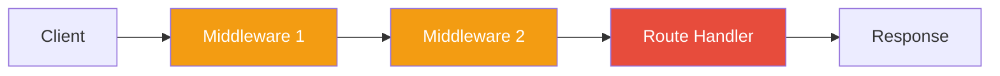
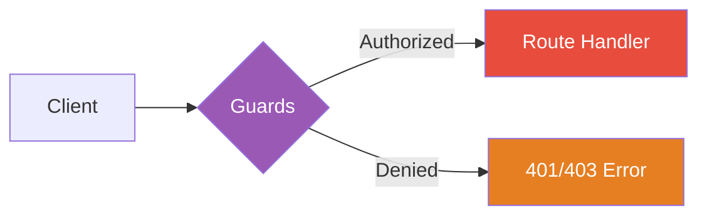
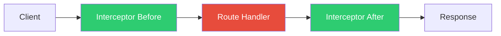
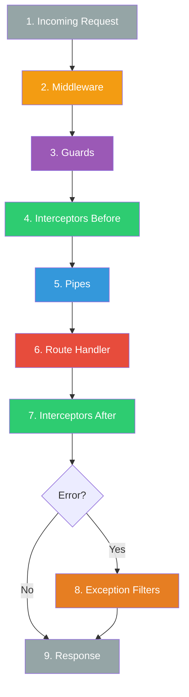

# Module 7: Additional Fundamentals

## 7.1 Middleware

### What is Middleware?

Middleware is a function called **before** the route handler. Middleware functions have access to the request and response objects and can:
- Execute code
- Modify request/response objects
- End the request-response cycle
- Call the next middleware in the stack



### Function Middleware

```typescript
// middleware/logger.middleware.ts
import { Request, Response, NextFunction } from 'express';

export function logger(req: Request, res: Response, next: NextFunction) {
  console.log(`[${new Date().toISOString()}] ${req.method} ${req.url}`);
  next();  // Pass control to next middleware
}
```

### Class-based Middleware

```typescript
// middleware/logger.middleware.ts
import { Injectable, NestMiddleware } from '@nestjs/common';
import { Request, Response, NextFunction } from 'express';

@Injectable()
export class LoggerMiddleware implements NestMiddleware {
  use(req: Request, res: Response, next: NextFunction) {
    console.log(`[${new Date().toISOString()}] ${req.method} ${req.url}`);
    next();
  }
}
```

### Applying Middleware

#### To Specific Routes
```typescript
// app.module.ts
import { Module, NestModule, MiddlewareConsumer } from '@nestjs/common';
import { LoggerMiddleware } from './middleware/logger.middleware';
import { CatsModule } from './cats/cats.module';

@Module({
  imports: [CatsModule],
})
export class AppModule implements NestModule {
  configure(consumer: MiddlewareConsumer) {
    consumer
      .apply(LoggerMiddleware)
      .forRoutes('cats');  // Apply to /cats routes
  }
}
```

#### To Specific HTTP Methods
```typescript
consumer
  .apply(LoggerMiddleware)
  .forRoutes({ path: 'cats', method: RequestMethod.GET });
```

#### To Multiple Routes
```typescript
consumer
  .apply(LoggerMiddleware)
  .forRoutes('cats', 'dogs', 'birds');
```

#### To All Routes
```typescript
consumer
  .apply(LoggerMiddleware)
  .forRoutes('*');
```

#### Excluding Routes
```typescript
consumer
  .apply(LoggerMiddleware)
  .exclude(
    { path: 'cats', method: RequestMethod.POST },
    'cats/(.*)',  // Wildcard exclusion
  )
  .forRoutes(CatsController);
```

### Multiple Middleware

```typescript
consumer
  .apply(LoggerMiddleware, AuthMiddleware, ValidationMiddleware)
  .forRoutes(CatsController);
```

### Middleware with Dependencies

```typescript
@Injectable()
export class AuthMiddleware implements NestMiddleware {
  constructor(
    private authService: AuthService,
    private configService: ConfigService,
  ) {}

  async use(req: Request, res: Response, next: NextFunction) {
    const token = req.headers.authorization;
    
    if (!token) {
      throw new UnauthorizedException('No token provided');
    }
    
    const isValid = await this.authService.validateToken(token);
    
    if (!isValid) {
      throw new UnauthorizedException('Invalid token');
    }
    
    next();
  }
}
```

### Global Middleware

```typescript
// main.ts
import { NestFactory } from '@nestjs/core';
import { AppModule } from './app.module';
import { logger } from './middleware/logger.middleware';

async function bootstrap() {
  const app = await NestFactory.create(AppModule);
  
  // Apply function middleware globally
  app.use(logger);
  
  await app.listen(3000);
}
bootstrap();
```

---

## 7.2 Pipes

### What are Pipes?

Pipes have two typical use cases:
1. **Transformation**: Transform input data
2. **Validation**: Validate input data


### Built-in Pipes

NestJS provides several built-in pipes:
- `ValidationPipe`
- `ParseIntPipe`
- `ParseFloatPipe`
- `ParseBoolPipe`
- `ParseArrayPipe`
- `ParseUUIDPipe`
- `ParseEnumPipe`
- `DefaultValuePipe`

### Using Built-in Pipes

#### ParseIntPipe
```typescript
@Get(':id')
async findOne(@Param('id', ParseIntPipe) id: number) {
  return this.catsService.findOne(id);
}

// GET /cats/123 → id = 123 (number)
// GET /cats/abc → 400 Bad Request
```

#### ParseUUIDPipe
```typescript
@Get(':id')
async findOne(
  @Param('id', new ParseUUIDPipe({ version: '4' })) id: string,
) {
  return this.catsService.findOne(id);
}
```

#### ParseEnumPipe
```typescript
enum Status {
  ACTIVE = 'active',
  INACTIVE = 'inactive',
}

@Get()
async findByStatus(
  @Query('status', new ParseEnumPipe(Status)) status: Status,
) {
  return this.catsService.findByStatus(status);
}
```

#### DefaultValuePipe
```typescript
@Get()
async findAll(
  @Query('page', new DefaultValuePipe(1), ParseIntPipe) page: number,
  @Query('limit', new DefaultValuePipe(10), ParseIntPipe) limit: number,
) {
  return this.catsService.findAll(page, limit);
}
```

### ValidationPipe

#### Installation
```bash
npm install class-validator class-transformer
```

#### Setup DTOs with Validation
```typescript
// dto/create-cat.dto.ts
import { IsString, IsInt, IsPositive, Min, Max } from 'class-validator';

export class CreateCatDto {
  @IsString()
  name: string;

  @IsInt()
  @IsPositive()
  @Min(0)
  @Max(30)
  age: number;

  @IsString()
  breed: string;
}
```

#### Apply ValidationPipe
```typescript
// Globally in main.ts
async function bootstrap() {
  const app = await NestFactory.create(AppModule);
  
  app.useGlobalPipes(new ValidationPipe({
    whitelist: true,  // Strip non-whitelisted properties
    forbidNonWhitelisted: true,  // Throw error if non-whitelisted
    transform: true,  // Auto-transform payloads
  }));
  
  await app.listen(3000);
}

// At controller level
@UsePipes(new ValidationPipe())
@Controller('cats')
export class CatsController {}

// At method level
@Post()
@UsePipes(new ValidationPipe())
async create(@Body() createCatDto: CreateCatDto) {}

// At parameter level
@Post()
async create(@Body(new ValidationPipe()) createCatDto: CreateCatDto) {}
```

### Custom Pipes

```typescript
// pipes/parse-int.pipe.ts
import { PipeTransform, Injectable, ArgumentMetadata, BadRequestException } from '@nestjs/common';

@Injectable()
export class ParseIntPipe implements PipeTransform<string, number> {
  transform(value: string, metadata: ArgumentMetadata): number {
    const val = parseInt(value, 10);
    
    if (isNaN(val)) {
      throw new BadRequestException('Validation failed. Not a number.');
    }
    
    return val;
  }
}

// Usage
@Get(':id')
async findOne(@Param('id', ParseIntPipe) id: number) {
  return this.catsService.findOne(id);
}
```

### Advanced Validation

```typescript
// dto/create-user.dto.ts
import {
  IsEmail,
  IsString,
  MinLength,
  MaxLength,
  Matches,
  IsOptional,
  ValidateNested,
} from 'class-validator';
import { Type } from 'class-transformer';

export class AddressDto {
  @IsString()
  street: string;

  @IsString()
  city: string;
}

export class CreateUserDto {
  @IsEmail()
  email: string;

  @IsString()
  @MinLength(8)
  @MaxLength(20)
  @Matches(/((?=.*\d)|(?=.*\W+))(?![.\n])(?=.*[A-Z])(?=.*[a-z]).*$/, {
    message: 'Password too weak',
  })
  password: string;

  @IsString()
  @MinLength(2)
  @MaxLength(50)
  name: string;

  @IsOptional()
  @ValidateNested()
  @Type(() => AddressDto)
  address?: AddressDto;
}
```

---

## 7.3 Guards

### What are Guards?

Guards determine whether a request will be handled by the route handler. They are used for:
- Authentication
- Authorization
- Role-based access control



### Creating a Guard

```typescript
// guards/auth.guard.ts
import { Injectable, CanActivate, ExecutionContext } from '@nestjs/common';
import { Observable } from 'rxjs';

@Injectable()
export class AuthGuard implements CanActivate {
  canActivate(
    context: ExecutionContext,
  ): boolean | Promise<boolean> | Observable<boolean> {
    const request = context.switchToHttp().getRequest();
    return this.validateRequest(request);
  }

  private validateRequest(request: any): boolean {
    // Validation logic here
    const token = request.headers.authorization;
    return !!token;
  }
}
```

### Applying Guards

```typescript
// Globally
app.useGlobalGuards(new AuthGuard());

// At controller level
@Controller('cats')
@UseGuards(AuthGuard)
export class CatsController {}

// At route level
@Post()
@UseGuards(AuthGuard)
async create(@Body() createCatDto: CreateCatDto) {}
```

### Role-Based Guards

```typescript
// decorators/roles.decorator.ts
import { SetMetadata } from '@nestjs/common';

export const Roles = (...roles: string[]) => SetMetadata('roles', roles);

// guards/roles.guard.ts
import { Injectable, CanActivate, ExecutionContext } from '@nestjs/common';
import { Reflector } from '@nestjs/core';

@Injectable()
export class RolesGuard implements CanActivate {
  constructor(private reflector: Reflector) {}

  canActivate(context: ExecutionContext): boolean {
    const requiredRoles = this.reflector.get<string[]>('roles', context.getHandler());
    
    if (!requiredRoles) {
      return true;  // No roles required
    }
    
    const request = context.switchToHttp().getRequest();
    const user = request.user;
    
    return requiredRoles.some((role) => user.roles?.includes(role));
  }
}

// Usage
@Post()
@Roles('admin')
@UseGuards(RolesGuard)
async create(@Body() createCatDto: CreateCatDto) {}
```

### Authentication Guard Example

```typescript
@Injectable()
export class JwtAuthGuard implements CanActivate {
  constructor(private jwtService: JwtService) {}

  async canActivate(context: ExecutionContext): Promise<boolean> {
    const request = context.switchToHttp().getRequest();
    const token = this.extractTokenFromHeader(request);
    
    if (!token) {
      throw new UnauthorizedException();
    }
    
    try {
      const payload = await this.jwtService.verifyAsync(token);
      request.user = payload;  // Attach user to request
    } catch {
      throw new UnauthorizedException();
    }
    
    return true;
  }

  private extractTokenFromHeader(request: Request): string | undefined {
    const [type, token] = request.headers.authorization?.split(' ') ?? [];
    return type === 'Bearer' ? token : undefined;
  }
}
```

---

## 7.4 Interceptors

### What are Interceptors?

Interceptors can:
- Bind extra logic before/after method execution
- Transform the result returned from a function
- Transform exceptions
- Extend basic function behavior
- Override a function entirely



### Creating an Interceptor

```typescript
// interceptors/logging.interceptor.ts
import {
  Injectable,
  NestInterceptor,
  ExecutionContext,
  CallHandler,
} from '@nestjs/common';
import { Observable } from 'rxjs';
import { tap } from 'rxjs/operators';

@Injectable()
export class LoggingInterceptor implements NestInterceptor {
  intercept(context: ExecutionContext, next: CallHandler): Observable<any> {
    console.log('Before...');
    const now = Date.now();
    
    return next.handle().pipe(
      tap(() => console.log(`After... ${Date.now() - now}ms`)),
    );
  }
}
```

### Applying Interceptors

```typescript
// Globally
app.useGlobalInterceptors(new LoggingInterceptor());

// At controller level
@UseInterceptors(LoggingInterceptor)
@Controller('cats')
export class CatsController {}

// At route level
@Post()
@UseInterceptors(LoggingInterceptor)
async create() {}
```

### Response Transformation

```typescript
// interceptors/transform.interceptor.ts
import { Injectable, NestInterceptor, ExecutionContext, CallHandler } from '@nestjs/common';
import { Observable } from 'rxjs';
import { map } from 'rxjs/operators';

export interface Response<T> {
  data: T;
  statusCode: number;
  message: string;
}

@Injectable()
export class TransformInterceptor<T> implements NestInterceptor<T, Response<T>> {
  intercept(context: ExecutionContext, next: CallHandler): Observable<Response<T>> {
    return next.handle().pipe(
      map(data => ({
        data,
        statusCode: context.switchToHttp().getResponse().statusCode,
        message: 'Success',
      })),
    );
  }
}

// Before: { id: 1, name: "Cat" }
// After: { data: { id: 1, name: "Cat" }, statusCode: 200, message: "Success" }
```

### Exception Handling

```typescript
// interceptors/errors.interceptor.ts
import {
  Injectable,
  NestInterceptor,
  ExecutionContext,
  CallHandler,
  BadGatewayException,
} from '@nestjs/common';
import { Observable, throwError } from 'rxjs';
import { catchError } from 'rxjs/operators';

@Injectable()
export class ErrorsInterceptor implements NestInterceptor {
  intercept(context: ExecutionContext, next: CallHandler): Observable<any> {
    return next.handle().pipe(
      catchError(err => throwError(() => new BadGatewayException())),
    );
  }
}
```

### Timeout Interceptor

```typescript
// interceptors/timeout.interceptor.ts
import { Injectable, NestInterceptor, ExecutionContext, CallHandler, RequestTimeoutException } from '@nestjs/common';
import { Observable, throwError, TimeoutError } from 'rxjs';
import { catchError, timeout } from 'rxjs/operators';

@Injectable()
export class TimeoutInterceptor implements NestInterceptor {
  intercept(context: ExecutionContext, next: CallHandler): Observable<any> {
    return next.handle().pipe(
      timeout(5000),
      catchError(err => {
        if (err instanceof TimeoutError) {
          return throwError(() => new RequestTimeoutException());
        }
        return throwError(() => err);
      }),
    );
  }
}
```

### Cache Interceptor

```typescript
// interceptors/cache.interceptor.ts
import { Injectable, NestInterceptor, ExecutionContext, CallHandler } from '@nestjs/common';
import { Observable, of } from 'rxjs';

@Injectable()
export class CacheInterceptor implements NestInterceptor {
  private cache = new Map();

  intercept(context: ExecutionContext, next: CallHandler): Observable<any> {
    const request = context.switchToHttp().getRequest();
    const key = request.url;

    if (this.cache.has(key)) {
      return of(this.cache.get(key));
    }

    return next.handle().pipe(
      tap(response => this.cache.set(key, response)),
    );
  }
}
```

---

## 7.5 Custom Decorators

### Parameter Decorators

```typescript
// decorators/user.decorator.ts
import { createParamDecorator, ExecutionContext } from '@nestjs/common';

export const User = createParamDecorator(
  (data: unknown, ctx: ExecutionContext) => {
    const request = ctx.switchToHttp().getRequest();
    return request.user;
  },
);

// Usage
@Get('profile')
getProfile(@User() user: UserEntity) {
  return user;
}
```

### Extracting Specific Properties

```typescript
export const User = createParamDecorator(
  (data: string, ctx: ExecutionContext) => {
    const request = ctx.switchToHttp().getRequest();
    const user = request.user;

    return data ? user?.[data] : user;
  },
);

// Usage
@Get('email')
getEmail(@User('email') email: string) {
  return { email };
}
```

### Combining Decorators

```typescript
// decorators/auth.decorator.ts
import { applyDecorators, UseGuards } from '@nestjs/common';
import { AuthGuard } from '../guards/auth.guard';
import { RolesGuard } from '../guards/roles.guard';
import { Roles } from './roles.decorator';

export function Auth(...roles: string[]) {
  return applyDecorators(
    Roles(...roles),
    UseGuards(AuthGuard, RolesGuard),
  );
}

// Usage
@Post()
@Auth('admin')
async create(@Body() createCatDto: CreateCatDto) {}
```

### Method Decorators

```typescript
// decorators/timeout.decorator.ts
import { SetMetadata } from '@nestjs/common';

export const Timeout = (milliseconds: number) => 
  SetMetadata('timeout', milliseconds);

// Usage with interceptor
@Get()
@Timeout(5000)
findAll() {}
```

---

## Request Lifecycle Summary



---

## Summary

### Key Concepts

1. ✅ **Middleware**: Execute before route handler
2. ✅ **Pipes**: Transform and validate data
3. ✅ **Guards**: Control access to routes
4. ✅ **Interceptors**: Transform requests/responses
5. ✅ **Custom Decorators**: Simplify code reuse

### When to Use What

| Need | Use |
|------|-----|
| Logging, CORS, Body parsing | **Middleware** |
| Data validation | **Pipes** |
| Authentication, Authorization | **Guards** |
| Response transformation | **Interceptors** |
| Extract request data | **Custom Decorators** |

---

## Exercises

1. Create a logging middleware that tracks request duration
2. Build a ValidationPipe for custom DTO validation
3. Implement a JWT authentication guard
4. Create an interceptor that adds timestamps to responses
5. Build custom decorators for common patterns

---

## Additional Resources

- [Middleware](https://docs.nestjs.com/middleware)
- [Pipes](https://docs.nestjs.com/pipes)
- [Guards](https://docs.nestjs.com/guards)
- [Interceptors](https://docs.nestjs.com/interceptors)
- [Custom Decorators](https://docs.nestjs.com/custom-decorators)

---

## 📚 Course Navigation

⬅️ **[Previous: Module 6 - Core Fundamentals](module-06-core-fundamentals.md)**

🏠 **[Back to Course Outline](course-outline.md)**

➡️ **[Next: Module 8 - Practical Application](module-08-practical-application.md)**
