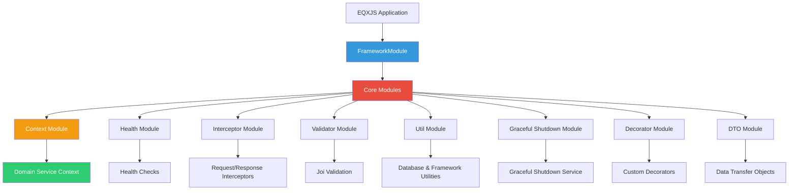
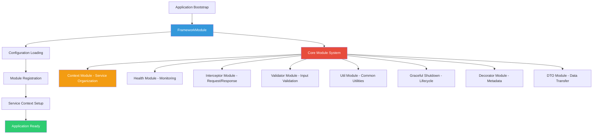
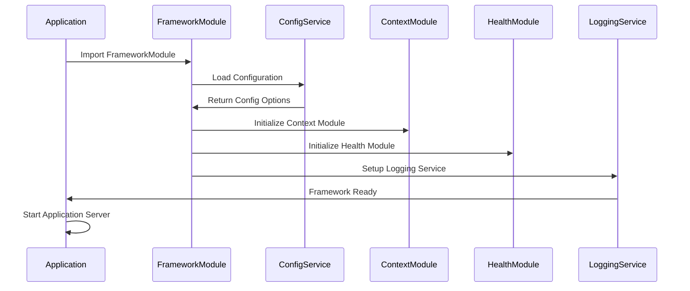
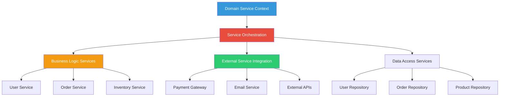

# Module 1: EQXJS Ecosystem Foundation

This foundational module introduces the EQXJS framework ecosystem, covering the complete architecture, 8 core modules, and essential configuration patterns. You'll learn to build production-ready applications with comprehensive logging, monitoring, and environment-specific configurations that form the backbone of enterprise applications.

By the end of this module, you'll have implemented:

- **Complete Framework Setup**: FrameworkModule configuration with all 8 core modules
- **Multi-Environment Configuration**: Development, staging, and production environment setup
- **Domain Service Architecture**: Context-based service organization with dependency injection
- **Enterprise Logging System**: Structured logging with correlation IDs and observability
- **Monitoring Foundation**: Telemetry, metrics collection, and observability patterns
- **Production-Ready Application**: Scalable application structure following EQXJS patterns



---

## Module Structure

### Section 1: EQXJS Framework Architecture

#### 1.1 Framework Philosophy and Design Principles

**EQXJS Core Principles:**

- **Domain-Driven Design**: Business logic organization around domains
- **Configuration-First**: Environment-specific behavior without code changes
- **Observability by Design**: Built-in logging, metrics, and tracing
- **Production-Ready Defaults**: Enterprise patterns and best practices
- **Developer Experience**: TypeScript-first with comprehensive tooling

**Framework Architecture Overview:**



#### 1.2 Eight Core Modules Deep Dive

**1. Context Module - Service Organization**

```typescript
// Domain Service Context Pattern
@Injectable()
export class DomainServiceContext {
  constructor(
    private readonly userService: UserService,
    private readonly orderService: OrderService,
    private readonly inventoryService: InventoryService,
  ) {}

  // Business workflow orchestration
  async processOrder(orderData: CreateOrderDto): Promise<Order> {
    const user = await this.userService.validateUser(orderData.userId);
    const availability = await this.inventoryService.checkAvailability(
      orderData.items,
    );
    return this.orderService.createOrder(orderData, user, availability);
  }
}
```

**2. Health Module - System Monitoring**

```typescript
// Health Check Integration
@Controller("health")
export class HealthController {
  constructor(private readonly healthService: HealthService) {}

  @Get()
  @PublicEndpoint()
  async checkHealth(): Promise<HealthResponse> {
    return this.healthService.getSystemHealth();
  }
}
```

**3. Interceptor Module - Request/Response Processing**

```typescript
// HTTP Request Interceptor
@Injectable()
export class AppInterceptor implements NestInterceptor {
  intercept(context: ExecutionContext, next: CallHandler): Observable<any> {
    const request = context.switchToHttp().getRequest();
    const correlationId = this.generateCorrelationId();

    request.correlationId = correlationId;

    return next.handle().pipe(
      map((data) => ({
        correlationId,
        timestamp: new Date().toISOString(),
        data,
      })),
    );
  }
}
```

**Framework Module Loading Sequence:**



### Section 2: FrameworkModule Configuration (2 hours)

#### 2.1 Environment-Specific Configuration

**Configuration Architecture:**

```typescript
// Framework Configuration Interface
export interface FrameworkOptions {
  environment: "development" | "staging" | "production";
  appName: string;
  version: string;
  port: number;

  // Database Configuration
  database: {
    uri: string;
    options: MongooseModuleOptions;
  };

  // Logging Configuration
  logging: {
    level: "debug" | "info" | "warn" | "error";
    format: "json" | "text";
    correlationId: boolean;
    requestLogging: boolean;
  };

  // Health Check Configuration
  health: {
    enableHealthCheck: boolean;
    endpoints: string[];
    timeout: number;
  };

  // Graceful Shutdown Configuration
  gracefulShutdown: {
    enabled: boolean;
    timeout: number;
    signals: string[];
  };
}
```

**Multi-Environment Setup:**

```typescript
// config/development.ts
export const developmentConfig: FrameworkOptions = {
  environment: "development",
  appName: "my-eqxjs-app",
  version: "1.0.0",
  port: 3000,

  database: {
    uri: "mongodb://localhost:27017/myapp_dev",
    options: {
      useNewUrlParser: true,
      useUnifiedTopology: true,
    },
  },

  logging: {
    level: "debug",
    format: "text",
    correlationId: true,
    requestLogging: true,
  },

  health: {
    enableHealthCheck: true,
    endpoints: ["/health", "/health/detailed"],
    timeout: 5000,
  },

  gracefulShutdown: {
    enabled: true,
    timeout: 10000,
    signals: ["SIGTERM", "SIGINT"],
  },
};

// config/production.ts
export const productionConfig: FrameworkOptions = {
  environment: "production",
  appName: process.env.APP_NAME || "my-eqxjs-app",
  version: process.env.APP_VERSION || "1.0.0",
  port: parseInt(process.env.PORT) || 8080,

  database: {
    uri: process.env.MONGODB_URI,
    options: {
      useNewUrlParser: true,
      useUnifiedTopology: true,
      maxPoolSize: 10,
      serverSelectionTimeoutMS: 5000,
    },
  },

  logging: {
    level: "info",
    format: "json",
    correlationId: true,
    requestLogging: false,
  },

  health: {
    enableHealthCheck: true,
    endpoints: ["/health", "/health/liveness", "/health/readiness"],
    timeout: 3000,
  },

  gracefulShutdown: {
    enabled: true,
    timeout: 30000,
    signals: ["SIGTERM", "SIGINT", "SIGUSR2"],
  },
};
```

#### 2.2 Framework Module Integration

**FrameworkModule Bootstrap:**

```typescript
import { Module, DynamicModule } from "@nestjs/common";
import { ConfigModule } from "@nestjs/config";
import { MongooseModule } from "@nestjs/mongoose";

import { ContextModule } from "./context/context.module";
import { HealthModule } from "./health/health.module";
import { InterceptorModule } from "./interceptor/interceptor.module";
import { ValidatorModule } from "./validator/validator.module";
import { UtilModule } from "./util/util.module";
import { GracefulShutdownModule } from "./graceful-shutdown/graceful-shutdown.module";
import { DecoratorModule } from "./decorator/decorator.module";
import { DTOModule } from "./dto/dto.module";

@Module({})
export class FrameworkModule {
  static forRoot(options: FrameworkOptions): DynamicModule {
    return {
      module: FrameworkModule,
      imports: [
        ConfigModule.forRoot({
          isGlobal: true,
          load: [() => options],
        }),

        MongooseModule.forRoot(options.database.uri, options.database.options),

        // Core EQXJS Modules
        ContextModule.forRoot(options),
        HealthModule.forRoot(options.health),
        InterceptorModule.forRoot(options),
        ValidatorModule.forRoot(),
        UtilModule.forRoot(),
        GracefulShutdownModule.forRoot(options.gracefulShutdown),
        DecoratorModule.forRoot(),
        DTOModule.forRoot(),
      ],
      exports: [
        ContextModule,
        HealthModule,
        InterceptorModule,
        ValidatorModule,
        UtilModule,
        GracefulShutdownModule,
        DecoratorModule,
        DTOModule,
      ],
    };
  }
}
```

**Application Bootstrap with Framework:**

```typescript
// main.ts
import { NestFactory } from "@nestjs/core";
import { AppModule } from "./app.module";
import { getConfig } from "./config";

async function bootstrap() {
  const config = getConfig();

  const app = await NestFactory.create(AppModule);

  // Framework-provided global configuration
  app.setGlobalPrefix("api");

  await app.listen(config.port);

  console.log(`Application is running on: ${await app.getUrl()}`);
}

bootstrap();

// app.module.ts
import { Module } from "@nestjs/common";
import { FrameworkModule } from "@eqxjs/common-library";
import { getConfig } from "./config";

import { UserModule } from "./user/user.module";
import { OrderModule } from "./order/order.module";

@Module({
  imports: [FrameworkModule.forRoot(getConfig()), UserModule, OrderModule],
})
export class AppModule {}
```

### Section 3: Domain Service Context Implementation (2 hours)

#### 3.1 Service Context Architecture

**Domain Service Context Pattern:**



**Domain Service Context Implementation:**

```typescript
// context/domain-service.context.ts
import { Injectable, Logger } from "@nestjs/common";
import { ConfigService } from "@nestjs/config";

@Injectable()
export class DomainServiceContext {
  private readonly logger = new Logger(DomainServiceContext.name);

  constructor(
    private readonly configService: ConfigService,
    private readonly userService: UserService,
    private readonly orderService: OrderService,
    private readonly inventoryService: InventoryService,
    private readonly paymentService: PaymentService,
    private readonly notificationService: NotificationService,
  ) {
    this.logger.log("Domain Service Context initialized");
  }

  // User Domain Operations
  async createUserProfile(userData: CreateUserDto): Promise<User> {
    this.logger.debug(`Creating user profile: ${userData.email}`);

    try {
      const user = await this.userService.create(userData);
      await this.notificationService.sendWelcomeEmail(user);

      this.logger.log(`User profile created successfully: ${user.id}`);
      return user;
    } catch (error) {
      this.logger.error(`Failed to create user profile: ${error.message}`);
      throw error;
    }
  }

  // Order Domain Operations
  async processOrderWorkflow(orderData: CreateOrderDto): Promise<Order> {
    this.logger.debug(
      `Processing order workflow for user: ${orderData.userId}`,
    );

    try {
      // 1. Validate user
      const user = await this.userService.findById(orderData.userId);
      if (!user) {
        throw new Error("User not found");
      }

      // 2. Check inventory availability
      const availability = await this.inventoryService.checkAvailability(
        orderData.items,
      );

      if (!availability.available) {
        throw new Error("Insufficient inventory");
      }

      // 3. Calculate pricing
      const pricing = await this.orderService.calculatePricing(orderData.items);

      // 4. Process payment
      const paymentResult = await this.paymentService.processPayment({
        userId: user.id,
        amount: pricing.total,
        items: orderData.items,
      });

      // 5. Create order
      const order = await this.orderService.createOrder({
        ...orderData,
        paymentId: paymentResult.id,
        total: pricing.total,
      });

      // 6. Reserve inventory
      await this.inventoryService.reserveItems(orderData.items, order.id);

      // 7. Send confirmation
      await this.notificationService.sendOrderConfirmation(user, order);

      this.logger.log(`Order processed successfully: ${order.id}`);
      return order;
    } catch (error) {
      this.logger.error(`Order processing failed: ${error.message}`);
      // Implement compensation/rollback logic here
      throw error;
    }
  }

  // Inventory Domain Operations
  async updateInventoryLevels(updates: InventoryUpdateDto[]): Promise<void> {
    this.logger.debug(`Updating inventory levels for ${updates.length} items`);

    try {
      await this.inventoryService.batchUpdate(updates);
      this.logger.log("Inventory levels updated successfully");
    } catch (error) {
      this.logger.error(`Inventory update failed: ${error.message}`);
      throw error;
    }
  }
}
```

#### 3.2 Dependency Injection and Service Discovery

**Service Context Module Configuration:**

```typescript
// context/domain-service.module.ts
import { Module } from "@nestjs/common";
import { DomainServiceContext } from "./domain-service.context";

// Service Imports
import { UserModule } from "../user/user.module";
import { OrderModule } from "../order/order.module";
import { InventoryModule } from "../inventory/inventory.module";
import { PaymentModule } from "../payment/payment.module";
import { NotificationModule } from "../notification/notification.module";

@Module({
  imports: [
    UserModule,
    OrderModule,
    InventoryModule,
    PaymentModule,
    NotificationModule,
  ],
  providers: [DomainServiceContext],
  exports: [DomainServiceContext],
})
export class DomainServiceModule {}
```

**Service Context Integration in Controllers:**

```typescript
// controllers/order.controller.ts
import { Controller, Post, Body, UseGuards } from "@nestjs/common";
import { DomainServiceContext } from "../context/domain-service.context";
import { CreateOrderDto } from "./dto/create-order.dto";
import { JwtAuthGuard } from "../auth/jwt-auth.guard";

@Controller("orders")
@UseGuards(JwtAuthGuard)
export class OrderController {
  constructor(private readonly domainServiceContext: DomainServiceContext) {}

  @Post()
  async createOrder(@Body() createOrderDto: CreateOrderDto): Promise<Order> {
    return this.domainServiceContext.processOrderWorkflow(createOrderDto);
  }
}
```

### Section 4: Enterprise Logging and Observability (2 hours)

#### 4.1 Structured Logging with Correlation IDs

**Logging Configuration and Setup:**

```typescript
// logging/logger.service.ts
import { Injectable, Logger, LoggerService } from "@nestjs/common";
import { ConfigService } from "@nestjs/config";
import * as winston from "winston";

@Injectable()
export class EnterpriseLoggerService implements LoggerService {
  private logger: winston.Logger;
  private correlationId: string;

  constructor(private configService: ConfigService) {
    this.setupLogger();
  }

  private setupLogger(): void {
    const logLevel = this.configService.get("logging.level", "info");
    const logFormat = this.configService.get("logging.format", "json");

    const formats = [
      winston.format.timestamp(),
      winston.format.errors({ stack: true }),
    ];

    if (logFormat === "json") {
      formats.push(winston.format.json());
    } else {
      formats.push(
        winston.format.printf(({ level, message, timestamp, ...meta }) => {
          return `${timestamp} [${level.toUpperCase()}] ${message} ${
            Object.keys(meta).length ? JSON.stringify(meta) : ""
          }`;
        }),
      );
    }

    this.logger = winston.createLogger({
      level: logLevel,
      format: winston.format.combine(...formats),
      transports: [
        new winston.transports.Console(),
        new winston.transports.File({ filename: "logs/app.log" }),
        new winston.transports.File({
          filename: "logs/error.log",
          level: "error",
        }),
      ],
    });
  }

  setCorrelationId(correlationId: string): void {
    this.correlationId = correlationId;
  }

  log(message: string, context?: string, meta?: any): void {
    this.logger.info(message, {
      context,
      correlationId: this.correlationId,
      ...meta,
    });
  }

  error(message: string, trace?: string, context?: string, meta?: any): void {
    this.logger.error(message, {
      trace,
      context,
      correlationId: this.correlationId,
      ...meta,
    });
  }

  warn(message: string, context?: string, meta?: any): void {
    this.logger.warn(message, {
      context,
      correlationId: this.correlationId,
      ...meta,
    });
  }

  debug(message: string, context?: string, meta?: any): void {
    this.logger.debug(message, {
      context,
      correlationId: this.correlationId,
      ...meta,
    });
  }

  verbose(message: string, context?: string, meta?: any): void {
    this.logger.verbose(message, {
      context,
      correlationId: this.correlationId,
      ...meta,
    });
  }
}
```

#### 4.2 Request Tracing and Performance Monitoring

**Request Tracing Interceptor:**

```typescript
// interceptor/request-tracing.interceptor.ts
import {
  Injectable,
  NestInterceptor,
  ExecutionContext,
  CallHandler,
} from "@nestjs/common";
import { Observable } from "rxjs";
import { tap } from "rxjs/operators";
import { v4 as uuidv4 } from "uuid";
import { EnterpriseLoggerService } from "../logging/logger.service";

@Injectable()
export class RequestTracingInterceptor implements NestInterceptor {
  constructor(private readonly logger: EnterpriseLoggerService) {}

  intercept(context: ExecutionContext, next: CallHandler): Observable<any> {
    const request = context.switchToHttp().getRequest();
    const response = context.switchToHttp().getResponse();

    // Generate or extract correlation ID
    const correlationId =
      request.headers["x-correlation-id"] ||
      request.headers["correlation-id"] ||
      uuidv4();

    // Set correlation ID in request and response
    request.correlationId = correlationId;
    response.setHeader("X-Correlation-ID", correlationId);

    // Set correlation ID in logger context
    this.logger.setCorrelationId(correlationId);

    const startTime = Date.now();
    const method = request.method;
    const url = request.url;
    const userAgent = request.headers["user-agent"] || "";

    this.logger.log("Request started", "RequestTracing", {
      method,
      url,
      userAgent,
      correlationId,
    });

    return next.handle().pipe(
      tap({
        next: (data) => {
          const duration = Date.now() - startTime;
          this.logger.log("Request completed", "RequestTracing", {
            method,
            url,
            statusCode: response.statusCode,
            duration,
            correlationId,
          });
        },
        error: (error) => {
          const duration = Date.now() - startTime;
          this.logger.error("Request failed", error.stack, "RequestTracing", {
            method,
            url,
            statusCode: response.statusCode,
            duration,
            correlationId,
            error: error.message,
          });
        },
      }),
    );
  }
}
```

**Performance Monitoring Service:**

```typescript
// monitoring/performance.service.ts
import { Injectable } from "@nestjs/common";
import { EnterpriseLoggerService } from "../logging/logger.service";
import * as os from "os";
import * as process from "process";

interface SystemMetrics {
  memory: {
    used: number;
    total: number;
    percentage: number;
  };
  cpu: {
    usage: number;
    loadAverage: number[];
  };
  uptime: number;
  timestamp: string;
}

@Injectable()
export class PerformanceMonitoringService {
  constructor(private readonly logger: EnterpriseLoggerService) {
    this.startMetricsCollection();
  }

  private startMetricsCollection(): void {
    // Collect system metrics every 30 seconds
    setInterval(() => {
      this.collectAndLogMetrics();
    }, 30000);
  }

  private collectAndLogMetrics(): void {
    const metrics = this.getSystemMetrics();

    this.logger.log("System metrics collected", "PerformanceMonitoring", {
      metrics,
    });

    // Alert if memory usage is high
    if (metrics.memory.percentage > 80) {
      this.logger.warn("High memory usage detected", "PerformanceMonitoring", {
        memoryUsage: metrics.memory.percentage,
      });
    }
  }

  getSystemMetrics(): SystemMetrics {
    const memoryUsage = process.memoryUsage();
    const totalMemory = os.totalmem();
    const freeMemory = os.freemem();
    const usedMemory = totalMemory - freeMemory;

    return {
      memory: {
        used: Math.round(usedMemory / 1024 / 1024), // MB
        total: Math.round(totalMemory / 1024 / 1024), // MB
        percentage: Math.round((usedMemory / totalMemory) * 100),
      },
      cpu: {
        usage: Math.round(process.cpuUsage().user / 1000), // microseconds to milliseconds
        loadAverage: os.loadavg(),
      },
      uptime: Math.round(process.uptime()),
      timestamp: new Date().toISOString(),
    };
  }

  // Performance timer for tracking specific operations
  startTimer(operation: string): () => void {
    const startTime = process.hrtime.bigint();
    const correlationId = Math.random().toString(36).substr(2, 9);

    this.logger.debug(`Starting ${operation}`, "PerformanceTimer", {
      operation,
      correlationId,
    });

    return () => {
      const endTime = process.hrtime.bigint();
      const duration = Number(endTime - startTime) / 1000000; // Convert to milliseconds

      this.logger.debug(`Completed ${operation}`, "PerformanceTimer", {
        operation,
        duration,
        correlationId,
      });
    };
  }
}
```

---

## Lab Exercises

### Lab Exercise 1.1: Multi-Environment Framework Setup

**Objective**: Configure FrameworkModule with environment-specific settings and validate configuration loading.

**Tasks:**

1. Create configuration files for development, staging, and production environments
2. Implement FrameworkModule.forRoot() with proper type safety
3. Test configuration loading and module initialization
4. Validate environment variable handling and defaults

**Success Criteria:**

- All environments load with correct configuration
- TypeScript compilation without errors
- Application starts successfully in all environments
- Configuration validation works properly

### Lab Exercise 1.2: Domain Service Context Implementation

**Objective**: Build domain service contexts with proper dependency injection and service orchestration.

**Tasks:**

1. Create DomainServiceContext with business logic orchestration
2. Implement proper error handling and logging
3. Set up service dependencies with constructor injection
4. Build unit tests for service context methods

**Success Criteria:**

- Domain service context properly orchestrates business operations
- Error handling provides meaningful error messages
- All dependencies are properly injected
- Unit tests pass with good coverage

### Lab Exercise 1.3: Enterprise Logging and Monitoring (45 minutes)

**Objective**: Implement structured logging with correlation IDs and performance monitoring.

**Tasks:**

1. Configure EnterpriseLoggerService with Winston
2. Implement RequestTracingInterceptor for correlation ID tracking
3. Set up PerformanceMonitoringService for system metrics
4. Test logging output in different formats (JSON and text)

**Success Criteria:**

- Structured logs include correlation IDs and proper metadata
- Request tracing works across service boundaries
- Performance metrics are collected and logged
- Log format switches properly between environments

---

## Advanced Topics and Best Practices

### Production Deployment Considerations

**Container Optimization:**

```dockerfile
# Multi-stage Docker build for EQXJS applications
FROM node:18-alpine AS builder
WORKDIR /app
COPY package*.json ./
RUN npm ci --only=production

FROM node:18-alpine AS runner
WORKDIR /app
COPY --from=builder /app/node_modules ./node_modules
COPY . .
RUN npm run build

EXPOSE 3000
CMD ["node", "dist/main"]
```

**Kubernetes Health Check Configuration:**

```yaml
# kubernetes/deployment.yaml
apiVersion: apps/v1
kind: Deployment
metadata:
  name: eqxjs-app
spec:
  replicas: 3
  selector:
    matchLabels:
      app: eqxjs-app
  template:
    metadata:
      labels:
        app: eqxjs-app
    spec:
      containers:
        - name: app
          image: eqxjs-app:latest
          ports:
            - containerPort: 3000
          livenessProbe:
            httpGet:
              path: /health/liveness
              port: 3000
            initialDelaySeconds: 30
            periodSeconds: 10
          readinessProbe:
            httpGet:
              path: /health/readiness
              port: 3000
            initialDelaySeconds: 5
            periodSeconds: 5
```

### Performance Optimization Strategies

**Memory Management:**

```typescript
// Implement proper resource cleanup
export class ResourceManager {
  private connections: Map<string, any> = new Map();

  async cleanup(): Promise<void> {
    for (const [key, connection] of this.connections) {
      await connection.close();
    }
    this.connections.clear();
  }
}
```

**Caching Strategy:**

```typescript
// Implement caching at the service context level
@Injectable()
export class CachedDomainServiceContext extends DomainServiceContext {
  private cache = new Map<string, any>();

  async getCachedUser(userId: string): Promise<User> {
    const cacheKey = `user:${userId}`;

    if (this.cache.has(cacheKey)) {
      return this.cache.get(cacheKey);
    }

    const user = await super.getUserById(userId);
    this.cache.set(cacheKey, user);

    return user;
  }
}
```