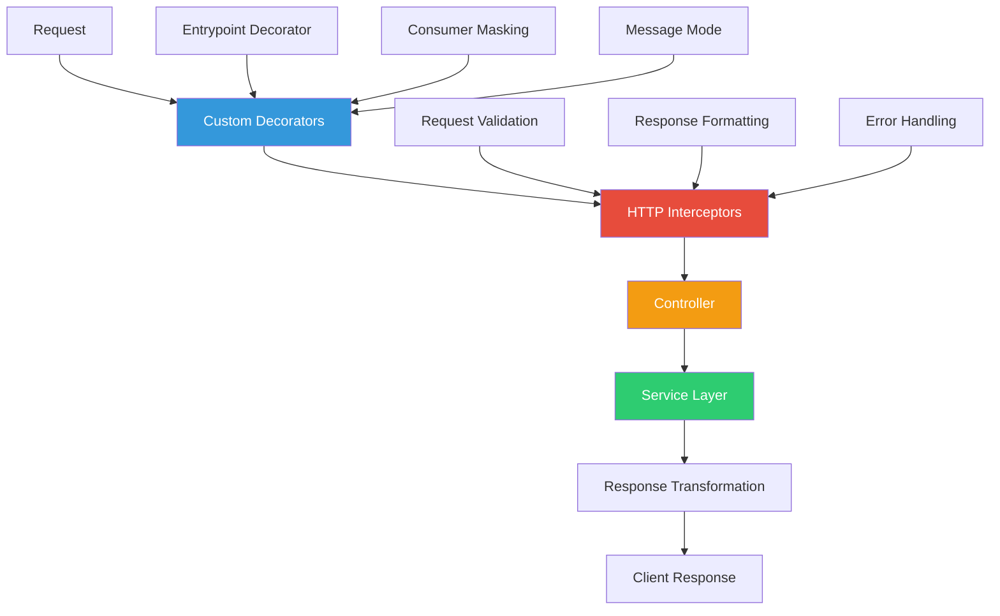
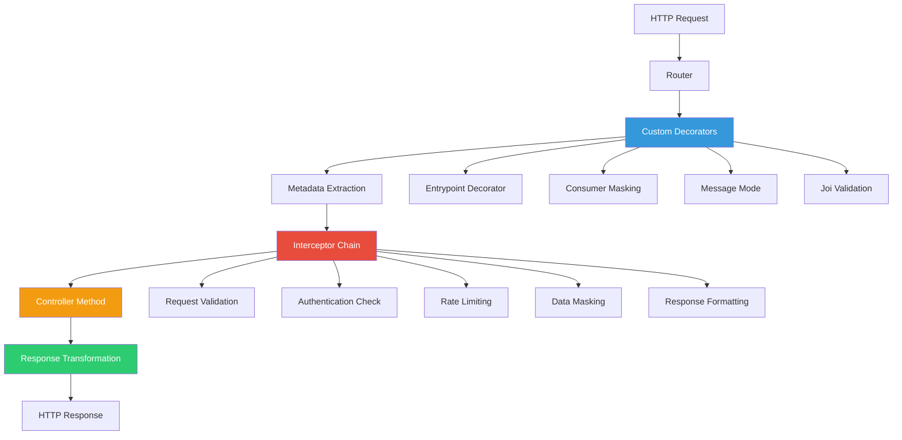
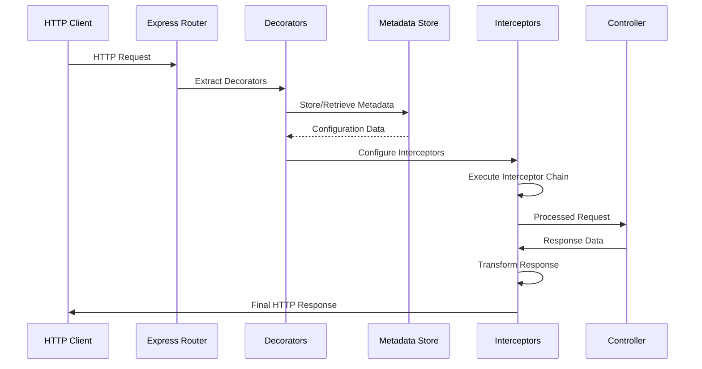
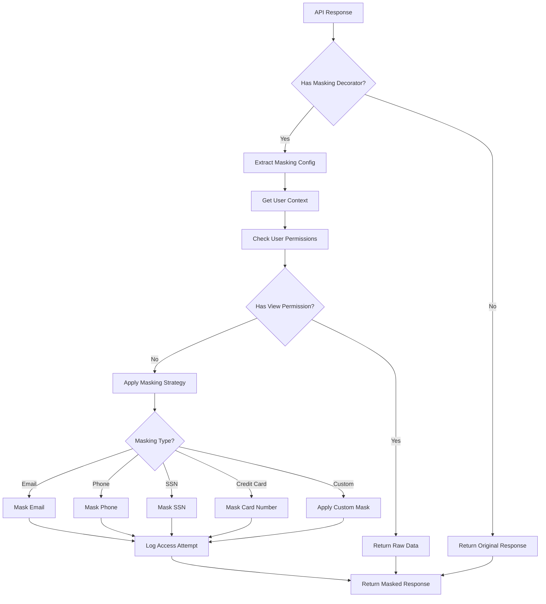
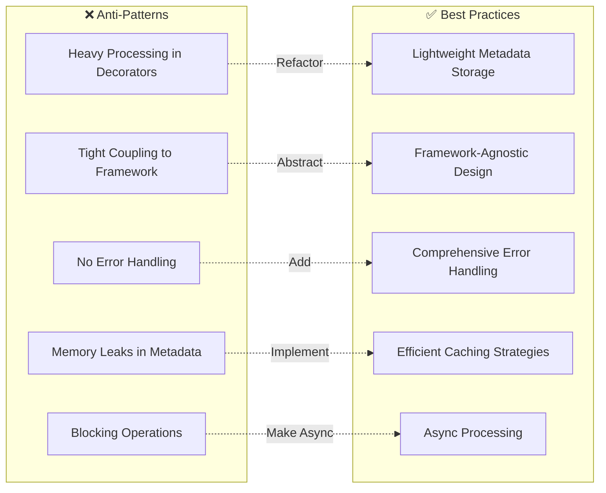

# Module 2: Advanced Decorators and Interceptors

## Overview

This comprehensive module focuses on implementing advanced decorator patterns, interceptor systems, and data protection mechanisms in EQXJS applications. You'll master custom decorators for metadata-driven development, sophisticated interceptor patterns for request/response transformation, and enterprise-grade data masking for privacy protection.

## Learning Objectives

By the end of this module, you will be able to:

- **Custom Decorator System**: Metadata-driven API configuration with entrypoint decorators
- **Data Protection Framework**: Consumer masking decorators with role-based access control
- **Message Mode System**: Communication pattern decorators for different processing strategies
- **Advanced Interceptors**: HTTP/REST interceptors with error handling and transformation
- **Validation Framework**: Joi schema integration with comprehensive input validation
- **Production Security**: Enterprise-grade data masking and audit systems

## Exercises

- [Module 2 Exercises](exercise/module-02-exercises.md)



---

## Module Structure

### Section 1: Decorator Architecture Fundamentals

#### 1.1 TypeScript Decorator Patterns

**EQXJS Decorator Request Flow:**



**Decorator Composition Pipeline:**



#### 1.2 EQXJS Decorator Architecture

Understanding decorator fundamentals:

```typescript
// Basic decorator structure in EQXJS
export function CustomDecorator(options?: DecoratorOptions) {
  return function (
    target: any,
    propertyKey: string,
    descriptor: PropertyDescriptor,
  ) {
    // Decorator implementation
    const existingMetadata =
      Reflect.getMetadata("custom:metadata", target) || {};
    const newMetadata = {
      ...existingMetadata,
      [propertyKey]: options,
    };

    Reflect.defineMetadata("custom:metadata", newMetadata, target);
    return descriptor;
  };
}
```

Key concepts:

- **Reflect-metadata**: Storing and retrieving decorator metadata
- **Target objects**: Understanding class, method, and property targets
- **Descriptor modification**: Enhancing method behavior
- **Decorator composition**: Combining multiple decorators effectively

---

### Section 2: Implementing Custom Entrypoint Decorators

#### Lab Exercise 2.1: Building the Entrypoint Configuration System

**Objective**: Create comprehensive entrypoint decorators for metadata-driven API configuration

#### Step 1: Create Entrypoint Decorator Interface

```typescript
// src/decorator/entrypoint-option.dto.ts
export interface EntrypointOptions {
  path?: string;
  method?: "GET" | "POST" | "PUT" | "DELETE" | "PATCH";
  summary?: string;
  description?: string;
  tags?: string[];
  authentication?: boolean;
  rateLimit?: {
    windowMs: number;
    max: number;
    message?: string;
    keyGenerator?: (req: any) => string;
  };
  cache?: {
    ttl: number;
    key?: string;
    condition?: (req: any, res: any) => boolean;
  };
  validation?: {
    body?: any;
    query?: any;
    params?: any;
    headers?: any;
  };
  monitoring?: {
    track?: boolean;
    slowThreshold?: number;
    errorThreshold?: number;
  };
}
```

#### Step 2: Advanced Entrypoint Decorator Implementation

```typescript
// src/decorator/entrypoint-option.dto.ts
export interface EntrypointOptions {
  path?: string;
  method?: "GET" | "POST" | "PUT" | "DELETE" | "PATCH";
  summary?: string;
  description?: string;
  tags?: string[];
  authentication?: boolean;
  rateLimit?: {
    windowMs: number;
    max: number;
  };
  cache?: {
    ttl: number;
    key?: string;
  };
  validation?: {
    body?: any;
    query?: any;
    params?: any;
  };
}
```

```typescript
// src/decorator/entrypoint.decorator.ts
import {
  SetMetadata,
  applyDecorators,
  UseGuards,
  UseInterceptors,
} from "@nestjs/common";
import {
  ApiOperation,
  ApiTags,
  ApiSecurity,
  ApiResponse,
} from "@nestjs/swagger";
import { ThrottlerGuard } from "@nestjs/throttler";
import { CacheInterceptor } from "@nestjs/cache-manager";
import { EntrypointOptions } from "./entrypoint-option.dto";

export const ENTRYPOINT_METADATA = "entrypoint:metadata";

export function Entrypoint(options: EntrypointOptions = {}) {
  const decorators = [];

  // Add Swagger documentation
  if (options.summary || options.description) {
    decorators.push(
      ApiOperation({
        summary: options.summary,
        description: options.description,
        operationId: options.path?.replace(/[^a-zA-Z0-9]/g, "_"),
      }),
    );
  }

  if (options.tags && options.tags.length > 0) {
    decorators.push(ApiTags(...options.tags));
  }

  // Add authentication requirement
  if (options.authentication !== false) {
    decorators.push(ApiSecurity("bearer"));
  }

  // Add rate limiting
  if (options.rateLimit) {
    decorators.push(UseGuards(ThrottlerGuard));
  }

  // Add caching
  if (options.cache) {
    decorators.push(UseInterceptors(CacheInterceptor));
  }

  // Add standard responses
  decorators.push(
    ApiResponse({ status: 200, description: "Successful operation" }),
    ApiResponse({
      status: 400,
      description: "Bad request - validation failed",
    }),
    ApiResponse({
      status: 401,
      description: "Unauthorized - authentication required",
    }),
    ApiResponse({
      status: 403,
      description: "Forbidden - insufficient permissions",
    }),
    ApiResponse({
      status: 429,
      description: "Too many requests - rate limit exceeded",
    }),
    ApiResponse({ status: 500, description: "Internal server error" }),
  );

  // Store metadata for runtime access
  decorators.push(SetMetadata(ENTRYPOINT_METADATA, options));

  return applyDecorators(...decorators);
}
```

#### Step 3: Enhanced Metadata Helper Service

```typescript
// src/decorator/decorator-metadata.service.ts
import { Injectable, Logger } from "@nestjs/common";
import { Reflector } from "@nestjs/core";
import { ENTRYPOINT_METADATA } from "./entrypoint.decorator";
import { EntrypointOptions } from "./entrypoint-option.dto";

@Injectable()
export class DecoratorMetadataService {
  private readonly logger = new Logger(DecoratorMetadataService.name);

  constructor(private readonly reflector: Reflector) {}

  getEntrypointMetadata(
    handler: Function,
    controllerClass: Function,
  ): EntrypointOptions {
    const metadata =
      this.reflector.getAllAndOverride<EntrypointOptions>(ENTRYPOINT_METADATA, [
        handler,
        controllerClass,
      ]) || {};

    this.logger.debug(
      `Retrieved entrypoint metadata for ${handler.name}:`,
      metadata,
    );
    return metadata;
  }

  hasAuthentication(handler: Function, controllerClass: Function): boolean {
    const metadata = this.getEntrypointMetadata(handler, controllerClass);
    return metadata.authentication !== false; // Default to true
  }

  getRateLimitConfig(handler: Function, controllerClass: Function) {
    const metadata = this.getEntrypointMetadata(handler, controllerClass);
    return metadata.rateLimit;
  }

  getCacheConfig(handler: Function, controllerClass: Function) {
    const metadata = this.getEntrypointMetadata(handler, controllerClass);
    return metadata.cache;
  }

  getValidationConfig(handler: Function, controllerClass: Function) {
    const metadata = this.getEntrypointMetadata(handler, controllerClass);
    return metadata.validation;
  }

  getMonitoringConfig(handler: Function, controllerClass: Function) {
    const metadata = this.getEntrypointMetadata(handler, controllerClass);
    return (
      metadata.monitoring || {
        track: true,
        slowThreshold: 1000,
        errorThreshold: 5,
      }
    );
  }

  // Performance optimization: cache metadata lookups
  private metadataCache = new Map<string, EntrypointOptions>();

  getCachedMetadata(
    handler: Function,
    controllerClass: Function,
  ): EntrypointOptions {
    const cacheKey = `${controllerClass.name}.${handler.name}`;

    if (this.metadataCache.has(cacheKey)) {
      return this.metadataCache.get(cacheKey);
    }

    const metadata = this.getEntrypointMetadata(handler, controllerClass);
    this.metadataCache.set(cacheKey, metadata);
    return metadata;
  }
}
```

#### Step 4: Production-Ready Usage Example

```typescript
// src/controllers/user.controller.ts
import {
  Controller,
  Get,
  Post,
  Put,
  Delete,
  Body,
  Param,
  Query,
} from "@nestjs/common";
import { ApiTags } from "@nestjs/swagger";
import { Entrypoint } from "../decorator/entrypoint.decorator";
import { CreateUserDto, UpdateUserDto, UserQueryDto } from "../dto/user.dto";

@Controller("users")
@ApiTags("User Management")
export class UserController {
  @Get()
  @Entrypoint({
    summary: "Get all users",
    description:
      "Retrieve a paginated list of all users in the system with advanced filtering",
    tags: ["Users", "Management"],
    authentication: true,
    cache: {
      ttl: 300, // 5 minutes
      key: "users:list",
      condition: (req) => !req.query.realtime,
    },
    rateLimit: {
      windowMs: 60000, // 1 minute
      max: 100, // 100 requests per minute
      message: "Too many requests to user listing endpoint",
    },
    validation: {
      query: UserQueryDto,
    },
    monitoring: {
      track: true,
      slowThreshold: 500,
      errorThreshold: 3,
    },
  })
  async getAllUsers(@Query() query: UserQueryDto) {
    return {
      users: [],
      total: 0,
      page: query.page || 1,
      limit: query.limit || 10,
      filters: query,
    };
  }

  @Post()
  @Entrypoint({
    summary: "Create new user",
    description:
      "Create a new user account with comprehensive validation and audit logging",
    tags: ["Users"],
    authentication: true,
    validation: {
      body: CreateUserDto,
    },
    rateLimit: {
      windowMs: 300000, // 5 minutes
      max: 10, // 10 user creations per 5 minutes
    },
    monitoring: {
      track: true,
      slowThreshold: 2000, // User creation can be slower
    },
  })
  async createUser(@Body() createUserDto: CreateUserDto) {
    return {
      message: "User created successfully",
      id: "user_" + Date.now(),
      data: createUserDto,
      createdAt: new Date(),
    };
  }

  @Put(":id")
  @Entrypoint({
    summary: "Update user",
    description:
      "Update existing user with partial data and optimistic locking",
    tags: ["Users"],
    authentication: true,
    validation: {
      params: { id: "string" },
      body: UpdateUserDto,
    },
    monitoring: {
      track: true,
    },
  })
  async updateUser(
    @Param("id") id: string,
    @Body() updateUserDto: UpdateUserDto,
  ) {
    return {
      message: "User updated successfully",
      id,
      data: updateUserDto,
      updatedAt: new Date(),
    };
  }

  @Delete(":id")
  @Entrypoint({
    summary: "Delete user",
    description: "Soft delete user account with cascading relationship cleanup",
    tags: ["Users", "Admin"],
    authentication: true,
    validation: {
      params: { id: "string" },
    },
    rateLimit: {
      windowMs: 300000, // 5 minutes
      max: 5, // Only 5 deletions per 5 minutes
    },
  })
  async deleteUser(@Param("id") id: string) {
    return {
      message: "User deleted successfully",
      id,
      deletedAt: new Date(),
    };
  }
}
```

**Testing the Entrypoint Decorator:**

```typescript
// src/controllers/user.controller.spec.ts
import { Test, TestingModule } from "@nestjs/testing";
import { UserController } from "./user.controller";
import { DecoratorMetadataService } from "../decorator/decorator-metadata.service";
import { Reflector } from "@nestjs/core";

describe("UserController Entrypoint Decorators", () => {
  let controller: UserController;
  let metadataService: DecoratorMetadataService;

  beforeEach(async () => {
    const module: TestingModule = await Test.createTestingModule({
      controllers: [UserController],
      providers: [DecoratorMetadataService, Reflector],
    }).compile();

    controller = module.get<UserController>(UserController);
    metadataService = module.get<DecoratorMetadataService>(
      DecoratorMetadataService,
    );
  });

  it("should extract entrypoint metadata correctly", () => {
    const metadata = metadataService.getEntrypointMetadata(
      controller.getAllUsers,
      UserController,
    );

    expect(metadata.summary).toBe("Get all users");
    expect(metadata.cache?.ttl).toBe(300);
    expect(metadata.rateLimit?.max).toBe(100);
  });

  it("should have authentication enabled by default", () => {
    const hasAuth = metadataService.hasAuthentication(
      controller.getAllUsers,
      UserController,
    );

    expect(hasAuth).toBe(true);
  });
});
```

---

### Section 3: Consumer Masking and Data Protection

#### Lab Exercise 2.2: Enterprise Data Masking System

**Objective**: Implement comprehensive data masking for privacy protection and compliance

**Data Privacy Architecture:**



#### Step 1: Advanced Masking Configuration

```typescript
// src/decorator/masking.types.ts
export type MaskingStrategy =
  | "full" // Complete masking: ****
  | "partial" // Partial masking: ab****ef
  | "email" // Email masking: a****@example.com
  | "phone" // Phone masking: ***-***-1234
  | "ssn" // SSN masking: ***-**-1234
  | "creditCard" // Credit card masking: ****-****-****-1234
  | "iban" // IBAN masking: DE**************1234
  | "address" // Address masking: 123 ****** St
  | "custom"; // Custom function

export interface MaskingFieldConfig {
  strategy: MaskingStrategy;
  customMask?: (value: string) => string;
  conditions?: {
    roles?: string[];
    permissions?: string[];
    userAttributes?: Record<string, any>;
  };
  auditLevel?: "none" | "access" | "detailed";
  preserveLength?: boolean;
  maskCharacter?: string;
}

export interface MaskingOptions {
  fields: {
    [fieldName: string]: MaskingFieldConfig;
  };
  auditLog?: boolean;
  preserveType?: boolean;
  enableCaching?: boolean;
  cacheTimeout?: number;
  onMaskingApplied?: (
    fieldName: string,
    originalValue: any,
    maskedValue: any,
    userContext: any,
  ) => void;
}

export interface AuditLogEntry {
  timestamp: Date;
  userId: string;
  userRole: string[];
  endpoint: string;
  fieldName: string;
  maskingStrategy: MaskingStrategy;
  accessLevel: "allowed" | "masked" | "denied";
  ipAddress?: string;
  userAgent?: string;
}
```

#### Step 2: Enhanced Consumer Masking Decorator

```typescript
// src/decorator/consumer-masking.decorator.ts
import { SetMetadata } from "@nestjs/common";
import { MaskingOptions } from "./masking.types";

export const CONSUMER_MASKING_METADATA = "consumer:masking";

export function ConsumerMasking(options: MaskingOptions) {
  return SetMetadata(CONSUMER_MASKING_METADATA, options);
}

// Masking utility functions
export class MaskingUtils {
  static maskFull(value: string): string {
    return "*".repeat(value.length);
  }

  static maskPartial(value: string): string {
    if (value.length <= 4) return this.maskFull(value);
    const start = value.substring(0, 2);
    const end = value.substring(value.length - 2);
    const middle = "*".repeat(value.length - 4);
    return start + middle + end;
  }

  static maskEmail(email: string): string {
    const [user, domain] = email.split("@");
    if (!domain) return this.maskFull(email);

    const maskedUser =
      user.length > 2
        ? user.charAt(0) +
          "*".repeat(user.length - 2) +
          user.charAt(user.length - 1)
        : "*".repeat(user.length);

    return maskedUser + "@" + domain;
  }

  static maskPhone(phone: string): string {
    const cleaned = phone.replace(/\D/g, "");
    if (cleaned.length === 10) {
      return "***-***-" + cleaned.substring(6);
    }
    return this.maskPartial(phone);
  }

  static maskCreditCard(cardNumber: string): string {
    const cleaned = cardNumber.replace(/\D/g, "");
    if (cleaned.length >= 13) {
      return "****-****-****-" + cleaned.substring(cleaned.length - 4);
    }
    return this.maskFull(cardNumber);
  }
}
```

3. **Create Masking Interceptor**:

```typescript
// src/interceptor/consumer-masking.interceptor.ts
import {
  Injectable,
  NestInterceptor,
  ExecutionContext,
  CallHandler,
} from "@nestjs/common";
import { Reflector } from "@nestjs/core";
import { Observable } from "rxjs";
import { map } from "rxjs/operators";
import { CONSUMER_MASKING_METADATA } from "../decorator/consumer-masking.decorator";
import { MaskingOptions, MaskingStrategy } from "../decorator/masking.types";
import { MaskingUtils } from "../decorator/consumer-masking.decorator";

@Injectable()
export class ConsumerMaskingInterceptor implements NestInterceptor {
  constructor(private reflector: Reflector) {}

  intercept(context: ExecutionContext, next: CallHandler): Observable<any> {
    const maskingOptions = this.reflector.get<MaskingOptions>(
      CONSUMER_MASKING_METADATA,
      context.getHandler(),
    );

    if (!maskingOptions) {
      return next.handle();
    }

    const request = context.switchToHttp().getRequest();
    const userRoles = request.user?.roles || [];
    const userPermissions = request.user?.permissions || [];

    return next
      .handle()
      .pipe(
        map((data) =>
          this.maskSensitiveData(
            data,
            maskingOptions,
            userRoles,
            userPermissions,
          ),
        ),
      );
  }

  private maskSensitiveData(
    data: any,
    options: MaskingOptions,
    userRoles: string[],
    userPermissions: string[],
  ): any {
    if (typeof data !== "object" || data === null) {
      return data;
    }

    if (Array.isArray(data)) {
      return data.map((item) =>
        this.maskSensitiveData(item, options, userRoles, userPermissions),
      );
    }

    const maskedData = { ...data };

    Object.entries(options.fields).forEach(([fieldName, config]) => {
      if (maskedData.hasOwnProperty(fieldName)) {
        // Check if user has permission to see unmasked data
        if (
          this.hasPermissionToView(
            config.conditions,
            userRoles,
            userPermissions,
          )
        ) {
          return; // Skip masking for authorized users
        }

        const originalValue = maskedData[fieldName];
        if (typeof originalValue === "string") {
          maskedData[fieldName] = this.applyMasking(
            originalValue,
            config.strategy,
            config.customMask,
          );
        }
      }
    });

    return maskedData;
  }

  private hasPermissionToView(
    conditions: any,
    userRoles: string[],
    userPermissions: string[],
  ): boolean {
    if (!conditions) return false;

    if (conditions.roles?.length > 0) {
      const hasRole = conditions.roles.some((role: string) =>
        userRoles.includes(role),
      );
      if (hasRole) return true;
    }

    if (conditions.permissions?.length > 0) {
      const hasPermission = conditions.permissions.some((perm: string) =>
        userPermissions.includes(perm),
      );
      if (hasPermission) return true;
    }

    return false;
  }

  private applyMasking(
    value: string,
    strategy: MaskingStrategy,
    customMask?: (value: string) => string,
  ): string {
    if (strategy === "custom" && customMask) {
      return customMask(value);
    }

    switch (strategy) {
      case "full":
        return MaskingUtils.maskFull(value);
      case "partial":
        return MaskingUtils.maskPartial(value);
      case "email":
        return MaskingUtils.maskEmail(value);
      case "phone":
        return MaskingUtils.maskPhone(value);
      case "creditCard":
        return MaskingUtils.maskCreditCard(value);
      default:
        return MaskingUtils.maskFull(value);
    }
  }
}
```

4. **Usage Example**:

```typescript
// src/controllers/profile.controller.ts
@Controller("profile")
export class ProfileController {
  @Get("sensitive-data")
  @ConsumerMasking({
    fields: {
      email: {
        strategy: "email",
        conditions: {
          roles: ["admin", "support"],
          permissions: ["view:sensitive_data"],
        },
      },
      phone: {
        strategy: "phone",
      },
      ssn: {
        strategy: "ssn",
        conditions: {
          roles: ["admin"],
        },
      },
      creditCard: {
        strategy: "creditCard",
      },
      customField: {
        strategy: "custom",
        customMask: (value) => "🔒 CLASSIFIED",
      },
    },
    auditLog: true,
  })
  async getSensitiveProfile() {
    return {
      name: "John Doe",
      email: "john.doe@company.com",
      phone: "555-123-4567",
      ssn: "123-45-6789",
      creditCard: "4111-1111-1111-1111",
      customField: "TOP SECRET DATA",
    };
  }
}
```

**Deliverable**: Complete masking system with role-based access control

### Message Mode Decorators

**Format**: Communication Patterns Workshop

**Lab Exercise 3: Message Mode Implementation**

**Objective**: Build decorators for different communication patterns

**Step-by-Step Instructions:**

1. **Define Message Modes**:

```typescript
// src/decorator/message-mode.types.ts
export enum MessageMode {
  SYNC = "synchronous",
  ASYNC = "asynchronous",
  FIRE_AND_FORGET = "fire_and_forget",
  REQUEST_REPLY = "request_reply",
  PUBLISH_SUBSCRIBE = "publish_subscribe",
  STREAM = "stream",
}

export interface MessageModeOptions {
  mode: MessageMode;
  timeout?: number;
  retries?: {
    count: number;
    delay: number;
    exponentialBackoff?: boolean;
  };
  queue?: string;
  topic?: string;
  priority?: "low" | "normal" | "high" | "critical";
  deadLetterQueue?: boolean;
  compression?: boolean;
}
```

2. **Create Message Mode Decorator**:

```typescript
// src/decorator/set-message-mode.decorator.ts
import { SetMetadata } from "@nestjs/common";
import { MessageModeOptions } from "./message-mode.types";

export const MESSAGE_MODE_METADATA = "message:mode";

export function SetMessageMode(options: MessageModeOptions) {
  return SetMetadata(MESSAGE_MODE_METADATA, options);
}

// Message processing utility
export class MessageProcessor {
  static async processSync<T>(handler: () => Promise<T>): Promise<T> {
    return await handler();
  }

  static async processAsync<T>(
    handler: () => Promise<T>,
    options: MessageModeOptions,
  ): Promise<{ jobId: string; status: "queued" }> {
    const jobId = `job_${Date.now()}_${Math.random().toString(36).substr(2, 9)}`;

    // Queue the job for async processing
    setImmediate(async () => {
      try {
        await this.executeWithRetries(handler, options.retries);
      } catch (error) {
        if (options.deadLetterQueue) {
          await this.sendToDeadLetterQueue(jobId, error.message);
        }
      }
    });

    return { jobId, status: "queued" };
  }

  static async processFireAndForget<T>(
    handler: () => Promise<T>,
  ): Promise<void> {
    setImmediate(async () => {
      try {
        await handler();
      } catch (error) {
        // Log error but don't throw
        console.error("Fire and forget operation failed:", error);
      }
    });
  }

  private static async executeWithRetries<T>(
    handler: () => Promise<T>,
    retryConfig?: {
      count: number;
      delay: number;
      exponentialBackoff?: boolean;
    },
  ): Promise<T> {
    if (!retryConfig) {
      return await handler();
    }

    let lastError: Error;

    for (let attempt = 0; attempt <= retryConfig.count; attempt++) {
      try {
        return await handler();
      } catch (error) {
        lastError = error;

        if (attempt < retryConfig.count) {
          const delay = retryConfig.exponentialBackoff
            ? retryConfig.delay * Math.pow(2, attempt)
            : retryConfig.delay;

          await this.delay(delay);
        }
      }
    }

    throw lastError;
  }

  private static delay(ms: number): Promise<void> {
    return new Promise((resolve) => setTimeout(resolve, ms));
  }

  private static async sendToDeadLetterQueue(
    jobId: string,
    error: string,
  ): Promise<void> {
    // Implementation would integrate with actual message queue
    console.error(`Job ${jobId} sent to dead letter queue: ${error}`);
  }
}
```

**Deliverable**: Message mode system with different processing patterns

### HTTP and REST Interceptors

**Format**: Advanced Interceptor Workshop

**Lab Exercise 4: Advanced HTTP Interceptors**

**Objective**: Build comprehensive request/response transformation

**Step-by-Step Instructions:**

1. **Create HTTP Interceptor**:

```typescript
// src/interceptor/http.interceptor.ts
import {
  Injectable,
  NestInterceptor,
  ExecutionContext,
  CallHandler,
  HttpException,
  HttpStatus,
} from "@nestjs/common";
import { Observable, throwError } from "rxjs";
import { map, catchError, timeout, retry } from "rxjs/operators";

@Injectable()
export class HttpInterceptor implements NestInterceptor {
  intercept(context: ExecutionContext, next: CallHandler): Observable<any> {
    const request = context.switchToHttp().getRequest();
    const response = context.switchToHttp().getResponse();

    const startTime = Date.now();

    // Add correlation ID
    const correlationId =
      request.headers["x-correlation-id"] || this.generateCorrelationId();
    request.correlationId = correlationId;
    response.setHeader("x-correlation-id", correlationId);

    // Add request timing
    response.setHeader("x-request-start", startTime.toString());

    return next.handle().pipe(
      timeout(30000), // 30 second timeout
      retry(2), // Retry failed requests twice
      map((data) => this.transformResponse(data, request, response, startTime)),
      catchError((error) => this.handleError(error, request, response)),
    );
  }

  private transformResponse(
    data: any,
    request: any,
    response: any,
    startTime: number,
  ): any {
    const duration = Date.now() - startTime;

    // Add timing headers
    response.setHeader("x-response-time", duration.toString());

    // Transform response format
    return {
      success: true,
      timestamp: new Date().toISOString(),
      correlationId: request.correlationId,
      data,
      meta: {
        duration,
        path: request.url,
        method: request.method,
      },
    };
  }

  private handleError(
    error: any,
    request: any,
    response: any,
  ): Observable<never> {
    const correlationId = request.correlationId;

    let status = HttpStatus.INTERNAL_SERVER_ERROR;
    let message = "Internal server error";

    if (error instanceof HttpException) {
      status = error.getStatus();
      message = error.message;
    }

    const errorResponse = {
      success: false,
      timestamp: new Date().toISOString(),
      correlationId,
      error: {
        status,
        message,
        path: request.url,
        method: request.method,
      },
    };

    return throwError(() => new HttpException(errorResponse, status));
  }

  private generateCorrelationId(): string {
    return `${Date.now()}-${Math.random().toString(36).substr(2, 9)}`;
  }
}
```

2. **Create REST-specific Interceptor**:

```typescript
// src/interceptor/rest.interceptor.ts
import {
  Injectable,
  NestInterceptor,
  ExecutionContext,
  CallHandler,
} from "@nestjs/common";
import { Observable } from "rxjs";
import { map } from "rxjs/operators";

@Injectable()
export class RestInterceptor implements NestInterceptor {
  intercept(context: ExecutionContext, next: CallHandler): Observable<any> {
    const request = context.switchToHttp().getRequest();
    const response = context.switchToHttp().getResponse();

    // Handle different HTTP methods
    this.setRestHeaders(request, response);

    return next
      .handle()
      .pipe(map((data) => this.formatRestResponse(data, request, response)));
  }

  private setRestHeaders(request: any, response: any): void {
    // Set CORS headers
    response.setHeader("Access-Control-Allow-Origin", "*");
    response.setHeader(
      "Access-Control-Allow-Methods",
      "GET, POST, PUT, DELETE, PATCH, OPTIONS",
    );
    response.setHeader(
      "Access-Control-Allow-Headers",
      "Origin, X-Requested-With, Content-Type, Accept, Authorization, x-correlation-id",
    );

    // Set content type
    response.setHeader("Content-Type", "application/json; charset=utf-8");

    // Set caching headers based on method
    if (request.method === "GET") {
      response.setHeader("Cache-Control", "public, max-age=300");
    } else {
      response.setHeader(
        "Cache-Control",
        "no-cache, no-store, must-revalidate",
      );
    }
  }

  private formatRestResponse(data: any, request: any, response: any): any {
    const method = request.method;

    // Handle different REST patterns
    switch (method) {
      case "POST":
        response.status(201); // Created
        return {
          message: "Resource created successfully",
          data,
          location: this.buildLocationHeader(request, data),
        };

      case "PUT":
      case "PATCH":
        return {
          message: "Resource updated successfully",
          data,
        };

      case "DELETE":
        response.status(204); // No Content
        return;

      case "GET":
      default:
        return data;
    }
  }

  private buildLocationHeader(request: any, data: any): string {
    const baseUrl = `${request.protocol}://${request.get("Host")}${request.baseUrl}`;
    const id = data?.id || data?._id || "unknown";
    return `${baseUrl}/${id}`;
  }
}
```

**Deliverable**: Complete interceptor system for HTTP and REST handling

### Joi Validation Integration

**Format**: Validation Workshop

**Lab Exercise 5: Joi Schema Validation**

**Objective**: Integrate Joi validation with DTOs

**Step-by-Step Instructions:**

1. **Create Validation Schema**:

```typescript
// src/validators/joi.schema.ts
import * as Joi from "joi";

export const UserValidationSchema = {
  create: Joi.object({
    username: Joi.string()
      .alphanum()
      .min(3)
      .max(30)
      .required()
      .description("Username must be alphanumeric, 3-30 characters"),

    email: Joi.string()
      .email({
        minDomainSegments: 2,
        tlds: { allow: ["com", "net", "org", "edu"] },
      })
      .required()
      .description("Valid email address required"),

    password: Joi.string()
      .pattern(
        /^(?=.*[a-z])(?=.*[A-Z])(?=.*\d)(?=.*[@$!%*?&])[A-Za-z\d@$!%*?&]{8,}$/,
      )
      .required()
      .description(
        "Password must be at least 8 characters with uppercase, lowercase, number, and special character",
      ),

    age: Joi.number()
      .integer()
      .min(18)
      .max(120)
      .optional()
      .description("Age must be between 18 and 120"),

    roles: Joi.array()
      .items(Joi.string().valid("user", "admin", "moderator"))
      .optional()
      .default(["user"])
      .description("User roles"),

    metadata: Joi.object({
      department: Joi.string().optional(),
      location: Joi.string().optional(),
      preferences: Joi.object().optional(),
    }).optional(),
  }),

  update: Joi.object({
    username: Joi.string().alphanum().min(3).max(30).optional(),

    email: Joi.string()
      .email({
        minDomainSegments: 2,
        tlds: { allow: ["com", "net", "org", "edu"] },
      })
      .optional(),

    age: Joi.number().integer().min(18).max(120).optional(),

    roles: Joi.array()
      .items(Joi.string().valid("user", "admin", "moderator"))
      .optional(),

    metadata: Joi.object({
      department: Joi.string().optional(),
      location: Joi.string().optional(),
      preferences: Joi.object().optional(),
    }).optional(),
  }),
};

export const QueryValidationSchema = {
  pagination: Joi.object({
    page: Joi.number().integer().min(1).default(1),
    limit: Joi.number().integer().min(1).max(100).default(10),
    sortBy: Joi.string().optional(),
    sortOrder: Joi.string().valid("asc", "desc").default("asc"),
  }),

  userFilter: Joi.object({
    username: Joi.string().optional(),
    email: Joi.string().email().optional(),
    role: Joi.string().valid("user", "admin", "moderator").optional(),
    ageMin: Joi.number().integer().min(18).optional(),
    ageMax: Joi.number().integer().max(120).optional(),
    department: Joi.string().optional(),
  }),
};
```

2. **Create Validation Decorator**:

```typescript
// src/decorator/joi-validation.decorator.ts
import { SetMetadata } from "@nestjs/common";
import * as Joi from "joi";

export const JOI_VALIDATION_METADATA = "joi:validation";

export interface JoiValidationOptions {
  body?: Joi.ObjectSchema;
  query?: Joi.ObjectSchema;
  params?: Joi.ObjectSchema;
  errorMessage?: string;
  stripUnknown?: boolean;
  allowUnknown?: boolean;
}

export function JoiValidation(options: JoiValidationOptions) {
  return SetMetadata(JOI_VALIDATION_METADATA, options);
}
```

3. **Create Validation Interceptor**:

```typescript
// src/interceptor/joi-validation.interceptor.ts
import {
  Injectable,
  NestInterceptor,
  ExecutionContext,
  CallHandler,
  BadRequestException,
} from "@nestjs/common";
import { Reflector } from "@nestjs/core";
import { Observable } from "rxjs";
import {
  JOI_VALIDATION_METADATA,
  JoiValidationOptions,
} from "../decorator/joi-validation.decorator";

@Injectable()
export class JoiValidationInterceptor implements NestInterceptor {
  constructor(private reflector: Reflector) {}

  intercept(context: ExecutionContext, next: CallHandler): Observable<any> {
    const validationOptions = this.reflector.get<JoiValidationOptions>(
      JOI_VALIDATION_METADATA,
      context.getHandler(),
    );

    if (!validationOptions) {
      return next.handle();
    }

    const request = context.switchToHttp().getRequest();
    this.validateRequest(request, validationOptions);

    return next.handle();
  }

  private validateRequest(request: any, options: JoiValidationOptions): void {
    const errors: string[] = [];

    // Validate body
    if (options.body && request.body) {
      const { error, value } = options.body.validate(request.body, {
        stripUnknown: options.stripUnknown ?? true,
        allowUnknown: options.allowUnknown ?? false,
      });

      if (error) {
        errors.push(`Body validation: ${this.formatJoiError(error)}`);
      } else {
        request.body = value;
      }
    }

    // Validate query
    if (options.query && request.query) {
      const { error, value } = options.query.validate(request.query, {
        stripUnknown: options.stripUnknown ?? true,
        allowUnknown: options.allowUnknown ?? false,
      });

      if (error) {
        errors.push(`Query validation: ${this.formatJoiError(error)}`);
      } else {
        request.query = value;
      }
    }

    // Validate params
    if (options.params && request.params) {
      const { error, value } = options.params.validate(request.params, {
        stripUnknown: options.stripUnknown ?? true,
        allowUnknown: options.allowUnknown ?? false,
      });

      if (error) {
        errors.push(`Params validation: ${this.formatJoiError(error)}`);
      } else {
        request.params = value;
      }
    }

    if (errors.length > 0) {
      throw new BadRequestException({
        message: options.errorMessage || "Validation failed",
        errors,
        timestamp: new Date().toISOString(),
      });
    }
  }

  private formatJoiError(error: any): string {
    return error.details.map((detail: any) => detail.message).join(", ");
  }
}
```

4. **Usage Example with All Features**:

```typescript
// src/controllers/advanced-user.controller.ts
import { Controller, Get, Post, Put, Body, Query, Param } from "@nestjs/common";
import { Entrypoint } from "../decorator/entrypoint.decorator";
import { ConsumerMasking } from "../decorator/consumer-masking.decorator";
import {
  SetMessageMode,
  MessageMode,
} from "../decorator/set-message-mode.decorator";
import { JoiValidation } from "../decorator/joi-validation.decorator";
import {
  UserValidationSchema,
  QueryValidationSchema,
} from "../validators/joi.schema";

@Controller("advanced-users")
export class AdvancedUserController {
  @Get()
  @Entrypoint({
    summary: "Get users with filtering",
    description: "Retrieve filtered and paginated user list",
    tags: ["Users", "Advanced"],
    cache: { ttl: 60 },
  })
  @ConsumerMasking({
    fields: {
      email: { strategy: "email" },
      phone: { strategy: "phone" },
    },
  })
  @JoiValidation({
    query: QueryValidationSchema.pagination.concat(
      QueryValidationSchema.userFilter,
    ),
  })
  async getUsers(@Query() query: any) {
    return {
      users: [
        {
          id: "1",
          username: "john_doe",
          email: "john@example.com",
          phone: "555-123-4567",
        },
      ],
      pagination: {
        page: query.page,
        limit: query.limit,
        total: 1,
      },
    };
  }

  @Post()
  @Entrypoint({
    summary: "Create user asynchronously",
    description: "Create a new user with async processing",
    tags: ["Users"],
  })
  @SetMessageMode({
    mode: MessageMode.ASYNC,
    retries: {
      count: 3,
      delay: 1000,
      exponentialBackoff: true,
    },
    deadLetterQueue: true,
  })
  @JoiValidation({
    body: UserValidationSchema.create,
  })
  async createUser(@Body() userData: any) {
    return { jobId: "job_12345", status: "queued" };
  }

  @Put(":id")
  @Entrypoint({
    summary: "Update user",
    description: "Update existing user with validation",
    tags: ["Users"],
  })
  @SetMessageMode({
    mode: MessageMode.SYNC,
    timeout: 5000,
  })
  @JoiValidation({
    body: UserValidationSchema.update,
    params: Joi.object({
      id: Joi.string().required(),
    }),
  })
  async updateUser(@Param("id") id: string, @Body() updateData: any) {
    return { id, ...updateData, updatedAt: new Date() };
  }
}
```

**Deliverable**: Complete validation system integrated with all decorators

### Module Integration and Testing

**Format**: Integration Workshop

**Lab Exercise 6: Complete Module Integration**

**Objective**: Integrate all components and test the complete system

**Integration Steps**:

1. **Create Module Configuration**:

```typescript
// src/modules/advanced-decorators.module.ts
import { Module } from "@nestjs/common";
import { APP_INTERCEPTOR } from "@nestjs/core";
import { AdvancedUserController } from "../controllers/advanced-user.controller";
import { DecoratorMetadataService } from "../decorator/decorator-metadata.service";
import { HttpInterceptor } from "../interceptor/http.interceptor";
import { RestInterceptor } from "../interceptor/rest.interceptor";
import { ConsumerMaskingInterceptor } from "../interceptor/consumer-masking.interceptor";
import { JoiValidationInterceptor } from "../interceptor/joi-validation.interceptor";

@Module({
  controllers: [AdvancedUserController],
  providers: [
    DecoratorMetadataService,
    {
      provide: APP_INTERCEPTOR,
      useClass: JoiValidationInterceptor,
    },
    {
      provide: APP_INTERCEPTOR,
      useClass: HttpInterceptor,
    },
    {
      provide: APP_INTERCEPTOR,
      useClass: RestInterceptor,
    },
    {
      provide: APP_INTERCEPTOR,
      useClass: ConsumerMaskingInterceptor,
    },
  ],
})
export class AdvancedDecoratorsModule {}
```

2. **Create Test Suite**:

```typescript
// src/controllers/advanced-user.controller.spec.ts
import { Test, TestingModule } from "@nestjs/testing";
import { AdvancedUserController } from "./advanced-user.controller";
import { DecoratorMetadataService } from "../decorator/decorator-metadata.service";

describe("AdvancedUserController", () => {
  let controller: AdvancedUserController;
  let service: DecoratorMetadataService;

  beforeEach(async () => {
    const module: TestingModule = await Test.createTestingModule({
      controllers: [AdvancedUserController],
      providers: [DecoratorMetadataService],
    }).compile();

    controller = module.get<AdvancedUserController>(AdvancedUserController);
    service = module.get<DecoratorMetadataService>(DecoratorMetadataService);
  });

  it("should be defined", () => {
    expect(controller).toBeDefined();
  });

  describe("getUsers", () => {
    it("should return filtered users with masking", async () => {
      const query = { page: 1, limit: 10 };
      const result = await controller.getUsers(query);

      expect(result).toHaveProperty("users");
      expect(result).toHaveProperty("pagination");
      expect(result.users[0].email).toContain("*");
    });
  });

  describe("createUser", () => {
    it("should create user asynchronously", async () => {
      const userData = {
        username: "testuser",
        email: "test@example.com",
        password: "Password123!",
      };

      const result = await controller.createUser(userData);

      expect(result).toHaveProperty("jobId");
      expect(result).toHaveProperty("status", "queued");
    });
  });
});
```

**Deliverable**: Fully integrated and tested advanced decorators module

- [ ] Proper consumer masking implementation with role-based access
- [ ] Advanced interceptor chain with error handling
- [ ] Production-ready validation and security features

**Code Quality (30%)**

- [ ] TypeScript best practices and type safety
- [ ] Clean decorator architecture and separation of concerns
- [ ] Comprehensive error handling and logging
- [ ] Performance optimization and caching strategies

**Security Implementation (20%)**

- [ ] Role-based data masking validation
- [ ] Audit logging for sensitive operations
- [ ] Input validation and sanitization
- [ ] Authentication and authorization integration

**Integration and Testing (10%)**

- [ ] End-to-end decorator functionality tests
- [ ] Security validation of masking systems
- [ ] Performance testing with interceptors
- [ ] Documentation and usage examples

### Production Best Practices

#### Decorator Performance Optimization

```typescript
// Advanced metadata caching strategy
class DecoratorMetadataCache {
  private cache = new Map<string, { metadata: any; expiry: number }>();
  private readonly CACHE_TTL = 300000; // 5 minutes

  get(key: string): any | null {
    const cached = this.cache.get(key);
    if (cached && Date.now() < cached.expiry) {
      return cached.metadata;
    }
    return null;
  }

  set(key: string, metadata: any): void {
    this.cache.set(key, { metadata, expiry: Date.now() + this.CACHE_TTL });
  }

  invalidate(pattern: string): void {
    for (const [key] of this.cache) {
      if (key.includes(pattern)) {
        this.cache.delete(key);
      }
    }
  }
}
```

#### Security Monitoring Integration

```typescript
// compliance and audit integration
import { Injectable } from "@nestjs/common";

@Injectable()
export class ComplianceService {
  async logDataAccess(entry: AuditLogEntry): Promise<void> {
    // Send to compliance system
    // Store in audit database
    // Alert on suspicious patterns
  }

  async validateDataAccess(
    user: any,
    sensitiveFields: string[],
  ): Promise<boolean> {
    // Check user permissions
    // Validate business rules
    // Log access attempts
    return true;
  }
}
```

### Common Pitfalls and Solutions

**Decorator Anti-Patterns:**



**Performance Issues**

- ❌ Synchronous decorator processing blocking request handling
- ✅ Asynchronous metadata processing with proper caching

**Security Vulnerabilities**

- ❌ Insufficient validation of decorator parameters
- ✅ Comprehensive input validation and sanitization

**Memory Management**

- ❌ Unbounded metadata caching leading to memory leaks
- ✅ Time-based cache expiration with size limits

---

**Previous: [Module 1 - EQXJS Ecosystem Foundation](Module-01-EQXJS-Ecosystem-Foundation.md)** | **Next: [Module 3 - Health Checks and Service Management](Module-03-Health-Checks-and-Service-Management.md)**
