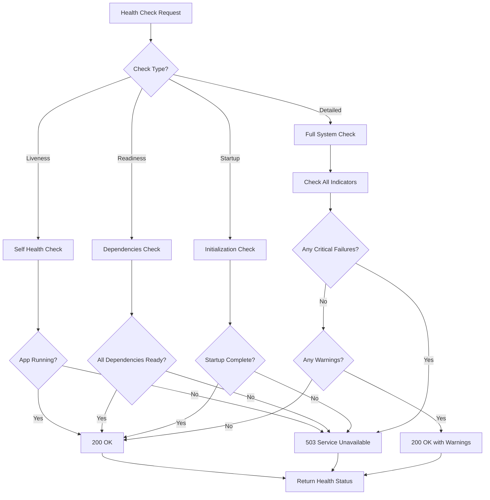
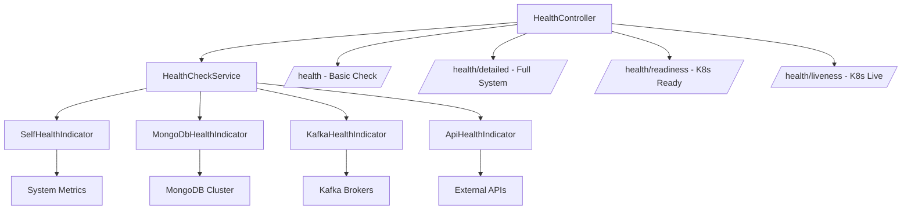
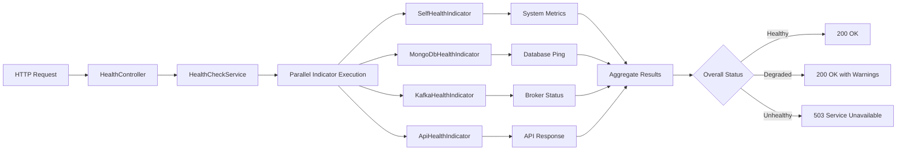
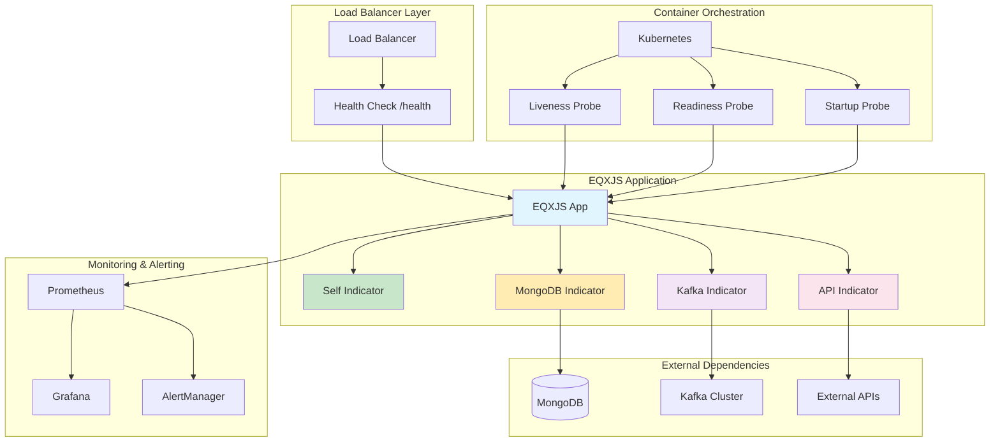
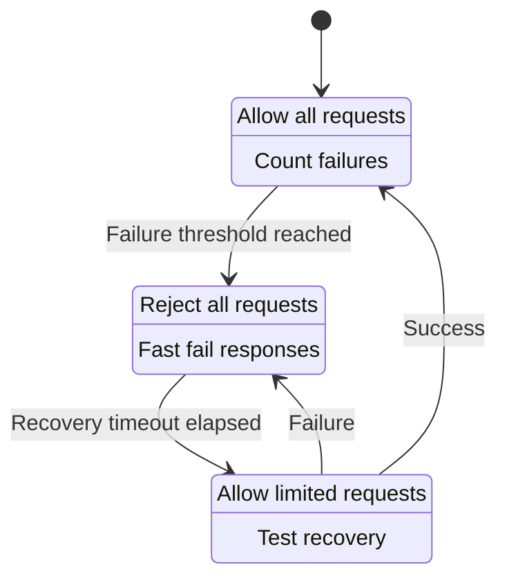
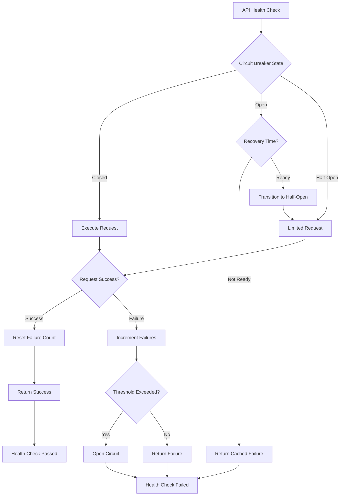
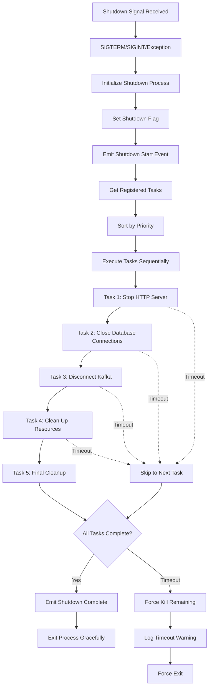
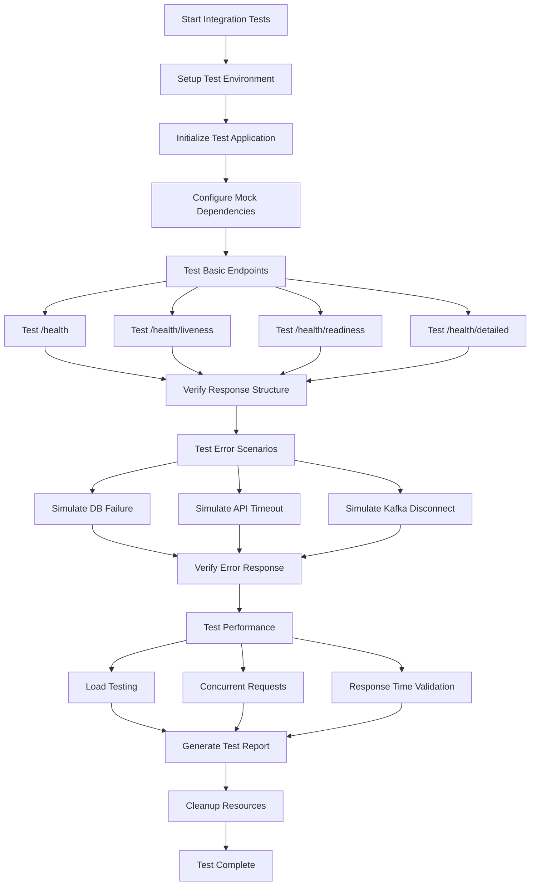
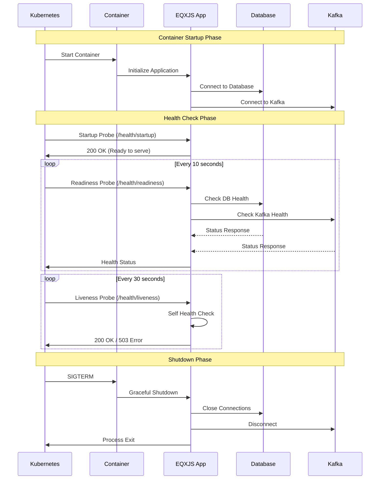

# Module 3: Health Checks and Service Management

## Overview

This comprehensive module focuses on implementing robust health monitoring systems and graceful shutdown mechanisms in EQXJS applications. You'll learn to build production-ready monitoring solutions that ensure system reliability, observability, and graceful handling of service lifecycle events.

## Learning Objectives

By the end of this module, you will be able to:

- **Complete Health Check System**: Multi-layered health monitoring architecture
- **External Service Monitoring**: MongoDB, Kafka, and API health indicators with resilience patterns
- **Production-Ready Endpoints**: Kubernetes-compatible liveness, readiness, and startup probes
- **Graceful Shutdown Mechanisms**: Resource cleanup and connection management
- **Monitoring Integration**: Observability patterns for distributed systems

## Exercises

- [Module 3 Exercises](exercise/module-03-exercises.md)

---

## Module Structure

### Section 1: Health Check Architecture Fundamentals

#### 1.1 Health Check Patterns and Standards

**Industry Standards and Best Practices**

```typescript
// Health Check Response Standard
interface HealthCheckResponse {
  status: "up" | "down" | "degraded";
  timestamp: string;
  uptime: number;
  version: string;
  details: Record<string, ComponentHealth>;
}

interface ComponentHealth {
  status: "up" | "down";
  responseTime?: number;
  details?: any;
  error?: string;
}
```

**Health Check Types:**

- **Liveness Probes**: "Is the application running?"
- **Readiness Probes**: "Can the application serve traffic?"
- **Startup Probes**: "Has the application finished initializing?"

**Health Check Decision Flow:**



#### 1.2 EQXJS Health Module Architecture

**Core Components Overview:**



**Health Check Execution Flow:**



#### 1.3 Performance and Caching Considerations

**Health Check Performance Patterns:**

```typescript
// Caching Strategy for High-Throughput Systems
@Injectable()
export class CachedHealthIndicator extends HealthIndicator {
  private cache: Map<
    string,
    { result: HealthIndicatorResult; timestamp: number }
  > = new Map();
  private readonly CACHE_TTL = 5000; // 5 seconds

  async isHealthy(key: string): Promise<HealthIndicatorResult> {
    const cached = this.cache.get(key);
    if (cached && Date.now() - cached.timestamp < this.CACHE_TTL) {
      return cached.result;
    }

    const result = await this.performHealthCheck(key);
    this.cache.set(key, { result, timestamp: Date.now() });
    return result;
  }
}
```

**Production Monitoring Architecture:**



---

### Section 2: Implementing Core Health Module (2 hours)

#### Lab Exercise 3.1: Building the Foundation Health System

**Objective**: Set up the complete EQXJS Health Module with configurable endpoints

#### Step 1: Health Module Configuration

```typescript
// src/healthcheck/health.module.ts
import { Module } from "@nestjs/common";
import { TerminusModule } from "@nestjs/terminus";
import { HttpModule } from "@nestjs/axios";
import { HealthController } from "./health.controller";
import { SelfHealthIndicator } from "./indicators/self.indicator";
import { MongoDbMultiHealthIndicator } from "./indicators/mongodb.indicator";
import { KafkaHealthIndicator } from "./indicators/kafka.indicator";
import { ApiHealthIndicator } from "./indicators/api.indicator";

@Module({
  imports: [
    TerminusModule,
    HttpModule.register({
      timeout: 5000,
      maxRedirects: 5,
      retries: 2,
    }),
  ],
  controllers: [HealthController],
  providers: [
    SelfHealthIndicator,
    MongoDbMultiHealthIndicator,
    KafkaHealthIndicator,
    ApiHealthIndicator,
  ],
  exports: [
    SelfHealthIndicator,
    MongoDbMultiHealthIndicator,
    KafkaHealthIndicator,
    ApiHealthIndicator,
  ],
})
export class HealthModule {}
```

#### Step 2: Advanced Health Controller Implementation

```typescript
// src/healthcheck/health.controller.ts
import { Controller, Get, Header, Query, Logger } from "@nestjs/common";
import {
  HealthCheck,
  HealthCheckService,
  HealthCheckResult,
  HealthIndicatorFunction,
} from "@nestjs/terminus";
import { SelfHealthIndicator } from "./indicators/self.indicator";
import { MongoDbMultiHealthIndicator } from "./indicators/mongodb.indicator";
import { KafkaHealthIndicator } from "./indicators/kafka.indicator";
import { ApiHealthIndicator } from "./indicators/api.indicator";
import {
  INTERNAL_DB_CONNECTION_STRINGS,
  INTERNAL_KAFKA_OPT,
  INTERNAL_API_ENDPOINTS,
} from "./health.util";

@Controller("health")
export class HealthController {
  private readonly logger = new Logger(HealthController.name);

  constructor(
    private health: HealthCheckService,
    private self: SelfHealthIndicator,
    private mongoMulti: MongoDbMultiHealthIndicator,
    private kafkaHealth: KafkaHealthIndicator,
    private apiHealth: ApiHealthIndicator,
  ) {}

  /**
   * Basic health check - Fast response for load balancers
   */
  @Get()
  @Header("Cache-Control", "no-cache, no-store, must-revalidate")
  @Header("Pragma", "no-cache")
  @Header("Expires", "0")
  @HealthCheck()
  async check(): Promise<HealthCheckResult> {
    return this.health.check([() => this.self.isHealthy("application")]);
  }

  /**
   * Detailed health check - Comprehensive system status
   */
  @Get("detailed")
  @Header("Cache-Control", "no-cache, no-store, must-revalidate")
  @HealthCheck()
  async detailedCheck(
    @Query("timeout") timeout?: string,
  ): Promise<HealthCheckResult> {
    const timeoutMs = timeout ? parseInt(timeout, 10) : 10000;

    const checks: HealthIndicatorFunction[] = [
      () => this.self.isHealthy("application"),
    ];

    // Add MongoDB checks if configured
    if (
      INTERNAL_DB_CONNECTION_STRINGS &&
      INTERNAL_DB_CONNECTION_STRINGS.length > 0
    ) {
      checks.push(() =>
        this.mongoMulti.pingCheck(
          "mongodb-cluster",
          INTERNAL_DB_CONNECTION_STRINGS,
          {
            timeoutMs,
          },
        ),
      );
    }

    // Add Kafka checks if configured
    if (INTERNAL_KAFKA_OPT) {
      checks.push(() => this.kafkaHealth.isHealthy("kafka-cluster"));
    }

    // Add API checks if configured
    if (INTERNAL_API_ENDPOINTS && INTERNAL_API_ENDPOINTS.length > 0) {
      INTERNAL_API_ENDPOINTS.forEach((endpoint, index) => {
        checks.push(() =>
          this.apiHealth.pingCheck(`external-api-${index}`, endpoint.url, {
            timeout: timeoutMs,
          }),
        );
      });
    }

    return this.health.check(checks);
  }

  /**
   * Kubernetes readiness probe - Can serve traffic?
   */
  @Get("readiness")
  @Header("Cache-Control", "no-cache, no-store, must-revalidate")
  @HealthCheck()
  async readinessCheck(): Promise<HealthCheckResult> {
    const checks: HealthIndicatorFunction[] = [];

    // Essential dependencies for serving traffic
    if (
      INTERNAL_DB_CONNECTION_STRINGS &&
      INTERNAL_DB_CONNECTION_STRINGS.length > 0
    ) {
      checks.push(() =>
        this.mongoMulti.pingCheck(
          "mongodb-ready",
          INTERNAL_DB_CONNECTION_STRINGS,
          {
            timeoutMs: 3000,
          },
        ),
      );
    }

    if (INTERNAL_KAFKA_OPT) {
      checks.push(() => this.kafkaHealth.isHealthy("kafka-ready"));
    }

    // If no external dependencies, check self
    if (checks.length === 0) {
      checks.push(() => this.self.isHealthy("ready"));
    }

    return this.health.check(checks);
  }

  /**
   * Kubernetes liveness probe - Is application alive?
   */
  @Get("liveness")
  @Header("Cache-Control", "no-cache, no-store, must-revalidate")
  @HealthCheck()
  async livenessCheck(): Promise<HealthCheckResult> {
    return this.health.check([() => this.self.isHealthy("alive")]);
  }

  /**
   * Kubernetes startup probe - Has application started?
   */
  @Get("startup")
  @Header("Cache-Control", "no-cache, no-store, must-revalidate")
  @HealthCheck()
  async startupCheck(): Promise<HealthCheckResult> {
    return this.health.check([() => this.self.isHealthy("startup")]);
  }
}
```

#### Step 3: Enhanced Self Health Indicator

```typescript
// src/healthcheck/indicators/self.indicator.ts
import { Injectable } from "@nestjs/common";
import {
  HealthIndicator,
  HealthIndicatorResult,
  HealthCheckError,
} from "@nestjs/terminus";
import { performance, PerformanceObserver } from "perf_hooks";

@Injectable()
export class SelfHealthIndicator extends HealthIndicator {
  private readonly logger = new Logger(SelfHealthIndicator.name);
  private readonly startTime = Date.now();
  private performanceMetrics: any[] = [];

  constructor() {
    super();
    this.initializePerformanceMonitoring();
  }

  async isHealthy(key: string): Promise<HealthIndicatorResult> {
    try {
      const metrics = this.collectSystemMetrics();
      const healthData = {
        status: "up",
        ...metrics,
        checks: this.performHealthChecks(metrics),
      };

      const isHealthy = this.evaluateHealth(healthData);
      const result = this.getStatus(key, isHealthy, healthData);

      if (!isHealthy) {
        throw new HealthCheckError(`Self check failed for ${key}`, result);
      }

      return result;
    } catch (error) {
      const errorResult = this.getStatus(key, false, {
        error: error.message,
        timestamp: new Date().toISOString(),
      });
      throw new HealthCheckError(
        `Self check error for ${key}: ${error.message}`,
        errorResult,
      );
    }
  }

  private collectSystemMetrics() {
    const uptime = Date.now() - this.startTime;
    const memoryUsage = process.memoryUsage();
    const cpuUsage = process.cpuUsage();
    const resourceUsage = process.resourceUsage();

    return {
      uptime: {
        milliseconds: uptime,
        seconds: Math.floor(uptime / 1000),
        human: this.formatUptime(uptime),
      },
      memory: {
        rss: this.formatBytes(memoryUsage.rss),
        heapTotal: this.formatBytes(memoryUsage.heapTotal),
        heapUsed: this.formatBytes(memoryUsage.heapUsed),
        external: this.formatBytes(memoryUsage.external),
        arrayBuffers: this.formatBytes(memoryUsage.arrayBuffers || 0),
        heapUsedPercentage: Math.round(
          (memoryUsage.heapUsed / memoryUsage.heapTotal) * 100,
        ),
      },
      cpu: {
        user: cpuUsage.user,
        system: cpuUsage.system,
        userCPUTime: Math.round(cpuUsage.user / 1000), // Convert to milliseconds
        systemCPUTime: Math.round(cpuUsage.system / 1000),
      },
      system: {
        platform: process.platform,
        arch: process.arch,
        nodeVersion: process.version,
        pid: process.pid,
      },
      performance: {
        averageResponseTime: this.calculateAverageResponseTime(),
        recentMetrics: this.performanceMetrics.slice(-5), // Last 5 measurements
      },
      timestamp: new Date().toISOString(),
    };
  }

  private performHealthChecks(metrics: any) {
    const checks = {
      memoryUsage: {
        status: metrics.memory.heapUsedPercentage < 85 ? "healthy" : "warning",
        value: `${metrics.memory.heapUsedPercentage}%`,
        threshold: "85%",
      },
      uptime: {
        status: metrics.uptime.seconds > 10 ? "healthy" : "starting",
        value: metrics.uptime.human,
      },
      performance: {
        status:
          metrics.performance.averageResponseTime < 1000 ? "healthy" : "slow",
        value: `${metrics.performance.averageResponseTime}ms`,
        threshold: "1000ms",
      },
    };

    return checks;
  }

  private evaluateHealth(healthData: any): boolean {
    const { checks } = healthData;

    // Critical failures
    if (checks.memoryUsage.status === "critical") return false;
    if (healthData.uptime.seconds < 5) return false; // Still starting up

    // Warning conditions - still healthy but monitored
    const warningCount = Object.values(checks).filter(
      (check: any) => check.status === "warning",
    ).length;

    return warningCount < 2; // Fail if more than 1 warning
  }

  private initializePerformanceMonitoring() {
    const obs = new PerformanceObserver((list) => {
      for (const entry of list.getEntries()) {
        if (entry.entryType === "measure") {
          this.performanceMetrics.push({
            name: entry.name,
            duration: entry.duration,
            timestamp: entry.startTime,
          });

          // Keep only last 100 measurements
          if (this.performanceMetrics.length > 100) {
            this.performanceMetrics.shift();
          }
        }
      }
    });

    obs.observe({ entryTypes: ["measure"] });
  }

  private calculateAverageResponseTime(): number {
    if (this.performanceMetrics.length === 0) return 0;

    const recent = this.performanceMetrics.slice(-10);
    const average =
      recent.reduce((sum, metric) => sum + metric.duration, 0) / recent.length;
    return Math.round(average);
  }

  private formatBytes(bytes: number): string {
    const sizes = ["Bytes", "KB", "MB", "GB"];
    if (bytes === 0) return "0 Bytes";
    const i = Math.floor(Math.log(bytes) / Math.log(1024));
    return Math.round((bytes / Math.pow(1024, i)) * 100) / 100 + " " + sizes[i];
  }

  private formatUptime(uptime: number): string {
    const seconds = Math.floor(uptime / 1000);
    const minutes = Math.floor(seconds / 60);
    const hours = Math.floor(minutes / 60);
    const days = Math.floor(hours / 24);

    if (days > 0) return `${days}d ${hours % 24}h ${minutes % 60}m`;
    if (hours > 0) return `${hours}h ${minutes % 60}m ${seconds % 60}s`;
    if (minutes > 0) return `${minutes}m ${seconds % 60}s`;
    return `${seconds}s`;
  }
}
```

---

### Section 3: Advanced Health Indicators (2.5 hours)

#### Lab Exercise 3.2: Multi-System Health Monitoring

**Objective**: Implement sophisticated health indicators for MongoDB, Kafka, and external APIs with resilience patterns

#### MongoDB Health Indicator with Connection Pooling

```typescript
// src/healthcheck/indicators/mongodb.indicator.ts
import { Injectable, Logger } from "@nestjs/common";
import {
  HealthCheckError,
  HealthIndicator,
  HealthIndicatorResult,
} from "@nestjs/terminus";
import { MongoClient, MongoClientOptions } from "mongodb";

interface MongoConnectionConfig {
  dbName: string;
  connectionString: string;
  priority?: number; // 1 = critical, 2 = important, 3 = optional
}

interface MongoHealthOptions {
  database?: string;
  timeoutMs?: number;
  clientOptions?: MongoClientOptions;
  retries?: number;
  retryDelay?: number;
}

@Injectable()
export class MongoDbMultiHealthIndicator extends HealthIndicator {
  private readonly logger = new Logger(MongoDbMultiHealthIndicator.name);
  private connectionPool = new Map<string, MongoClient>();
  private lastHealthCheck = new Map<
    string,
    { result: any; timestamp: number }
  >();

  async pingCheck(
    key: string,
    connectionConfigs: MongoConnectionConfig[],
    options: MongoHealthOptions = {},
  ): Promise<HealthIndicatorResult> {
    const {
      timeoutMs = 3000,
      clientOptions = {},
      retries = 2,
      retryDelay = 1000,
    } = options;

    const results: Record<string, any> = {};
    let criticalHealthy = true;
    let overallHealthy = true;
    const errors: string[] = [];

    for (const config of connectionConfigs) {
      const subKey = `${config.dbName}`;
      let attempt = 0;
      let connectionHealthy = false;
      let lastError: string;

      while (attempt <= retries && !connectionHealthy) {
        try {
          const startTime = Date.now();

          // Use connection pooling for better performance
          let client = this.connectionPool.get(config.connectionString);
          if (!client) {
            client = new MongoClient(config.connectionString, {
              ...clientOptions,
              connectTimeoutMS: timeoutMs,
              serverSelectionTimeoutMS: timeoutMs,
              maxPoolSize: 10,
              minPoolSize: 2,
            });
            this.connectionPool.set(config.connectionString, client);
          }

          await client.connect();
          const db = client.db(config.dbName);

          // Perform comprehensive health check
          const [pingResult, stats, serverStatus] = await Promise.all([
            db.command({ ping: 1 }),
            db.stats().catch(() => null), // Optional - might fail due to permissions
            db
              .admin()
              .serverStatus()
              .catch(() => null), // Optional
          ]);

          const responseTime = Date.now() - startTime;

          if (pingResult.ok === 1) {
            connectionHealthy = true;
            results[subKey] = {
              status: "up",
              responseTime: `${responseTime}ms`,
              database: config.dbName,
              priority: config.priority || 2,
              details: {
                ping: pingResult,
                ...(stats && { stats: this.formatDbStats(stats) }),
                ...(serverStatus && {
                  serverInfo: {
                    version: serverStatus.version,
                    uptime: serverStatus.uptime,
                    connections: serverStatus.connections,
                  },
                }),
              },
            };
          } else {
            throw new Error("Ping command returned ok !== 1");
          }
        } catch (error) {
          attempt++;
          lastError = error instanceof Error ? error.message : "Unknown error";

          if (attempt <= retries) {
            await this.delay(retryDelay);
          }
        }
      }

      if (!connectionHealthy) {
        results[subKey] = {
          status: "down",
          error: lastError,
          attempts: attempt,
          priority: config.priority || 2,
        };

        // Check if this is a critical connection
        if ((config.priority || 2) === 1) {
          criticalHealthy = false;
        }
        overallHealthy = false;
        errors.push(`${config.dbName}: ${lastError}`);
      }
    }

    // Health evaluation based on priority
    const status = this.getStatus(key, criticalHealthy, {
      overall: criticalHealthy ? "healthy" : "critical",
      details: results,
      summary: {
        total: connectionConfigs.length,
        healthy: Object.values(results).filter((r: any) => r.status === "up")
          .length,
        critical_healthy: Object.values(results).filter(
          (r: any) => r.status === "up" && r.priority === 1,
        ).length,
      },
      errors: errors.length > 0 ? errors : undefined,
    });

    if (!criticalHealthy) {
      throw new HealthCheckError(`Critical MongoDB connections failed`, status);
    }

    return status;
  }

  private formatDbStats(stats: any) {
    return {
      collections: stats.collections,
      indexes: stats.indexes,
      dataSize: this.formatBytes(stats.dataSize),
      indexSize: this.formatBytes(stats.indexSize),
      storageSize: this.formatBytes(stats.storageSize),
    };
  }

  private formatBytes(bytes: number): string {
    const sizes = ["B", "KB", "MB", "GB"];
    if (bytes === 0) return "0 B";
    const i = Math.floor(Math.log(bytes) / Math.log(1024));
    return Math.round((bytes / Math.pow(1024, i)) * 100) / 100 + " " + sizes[i];
  }

  private delay(ms: number): Promise<void> {
    return new Promise((resolve) => setTimeout(resolve, ms));
  }

  // Cleanup method for graceful shutdown
  async closeConnections(): Promise<void> {
    for (const [uri, client] of this.connectionPool.entries()) {
      try {
        await client.close();
        this.connectionPool.delete(uri);
      } catch (error) {
        this.logger.warn(
          `Error closing MongoDB connection ${uri}: ${error.message}`,
        );
      }
    }
  }
}
```

#### Kafka Health Indicator with Cluster Awareness

```typescript
// src/healthcheck/indicators/kafka.indicator.ts
import { Injectable, Logger } from "@nestjs/common";
import {
  HealthIndicator,
  HealthIndicatorResult,
  HealthCheckError,
} from "@nestjs/terminus";
import { Kafka, KafkaConfig, Admin, Producer } from "kafkajs";
import { INTERNAL_KAFKA_OPT } from "../health.util";

interface KafkaHealthDetails {
  brokers: Array<{
    nodeId: number;
    host: string;
    port: number;
    rack?: string;
  }>;
  topics: number;
  partitions: number;
  clusterInfo: any;
  responseTime: number;
}

@Injectable()
export class KafkaHealthIndicator extends HealthIndicator {
  private readonly logger = new Logger(KafkaHealthIndicator.name);
  private kafka: Kafka;
  private admin: Admin;
  private producer: Producer;
  private lastHealthCheck: { result: any; timestamp: number } | null = null;
  private readonly CACHE_TTL = 10000; // 10 seconds cache

  constructor() {
    super();
    if (INTERNAL_KAFKA_OPT) {
      this.initializeKafka();
    }
  }

  async isHealthy(key: string): Promise<HealthIndicatorResult> {
    if (!INTERNAL_KAFKA_OPT) {
      throw new HealthCheckError(
        "Kafka configuration not provided",
        this.getStatus(key, false, { error: "Configuration missing" }),
      );
    }

    // Use cached result if available and not expired
    if (
      this.lastHealthCheck &&
      Date.now() - this.lastHealthCheck.timestamp < this.CACHE_TTL
    ) {
      return this.lastHealthCheck.result;
    }

    try {
      const startTime = Date.now();

      // Initialize connections if needed
      if (!this.admin) {
        await this.initializeKafka();
      }

      // Perform comprehensive health checks
      const [brokers, metadata, clusterInfo] = await Promise.all([
        this.admin.describeCluster(),
        this.admin.listTopics(),
        this.admin
          .describeConfigs({
            resources: [{ type: 2, name: "test" }], // Broker configs
          })
          .catch(() => null), // May fail due to permissions
      ]);

      const responseTime = Date.now() - startTime;

      // Test producer connectivity
      await this.testProducerConnectivity();

      const healthDetails: KafkaHealthDetails = {
        brokers: brokers.brokers.map((broker) => ({
          nodeId: broker.nodeId,
          host: broker.host,
          port: broker.port,
          rack: broker.rack,
        })),
        topics: metadata.length,
        partitions: await this.countTotalPartitions(),
        clusterInfo,
        responseTime,
      };

      // Evaluate cluster health
      const isHealthy = this.evaluateClusterHealth(healthDetails);

      const result = this.getStatus(key, isHealthy, {
        cluster: {
          status: isHealthy ? "healthy" : "degraded",
          controllerId: brokers.controllerId,
          clusterId: brokers.clusterId,
        },
        connectivity: {
          brokersReachable: healthDetails.brokers.length,
          totalBrokers: healthDetails.brokers.length,
          responseTime: `${responseTime}ms`,
        },
        resources: {
          topics: healthDetails.topics,
          partitions: healthDetails.partitions,
        },
        timestamp: new Date().toISOString(),
      });

      // Cache the result
      this.lastHealthCheck = { result, timestamp: Date.now() };

      if (!isHealthy) {
        throw new HealthCheckError("Kafka cluster health check failed", result);
      }

      return result;
    } catch (error) {
      const errorResult = this.getStatus(key, false, {
        error: error.message,
        details: "Failed to connect to Kafka cluster",
        timestamp: new Date().toISOString(),
      });

      throw new HealthCheckError(
        `Kafka health check failed: ${error.message}`,
        errorResult,
      );
    }
  }

  private async initializeKafka(): Promise<void> {
    try {
      this.kafka = new Kafka(INTERNAL_KAFKA_OPT as KafkaConfig);
      this.admin = this.kafka.admin();
      this.producer = this.kafka.producer({
        maxInFlightRequests: 1,
        idempotent: false,
        transactionTimeout: 5000,
      });

      await Promise.all([this.admin.connect(), this.producer.connect()]);

      this.logger.log("Kafka health monitoring initialized");
    } catch (error) {
      this.logger.error(
        "Failed to initialize Kafka for health monitoring:",
        error,
      );
      throw error;
    }
  }

  private async testProducerConnectivity(): Promise<void> {
    try {
      // Send a test message to check producer connectivity
      // Use a health check topic if available, otherwise skip this test
      const testTopic = process.env.KAFKA_HEALTH_TOPIC || "__health_check";

      await this.producer.send({
        topic: testTopic,
        messages: [
          {
            value: JSON.stringify({
              type: "health_check",
              timestamp: Date.now(),
              source: "eqxjs-health-indicator",
            }),
          },
        ],
      });
    } catch (error) {
      // Producer connectivity failed - this might be expected if health topic doesn't exist
      this.logger.warn("Producer connectivity test failed:", error.message);
    }
  }

  private async countTotalPartitions(): Promise<number> {
    try {
      const topics = await this.admin.listTopics();
      if (topics.length === 0) return 0;

      const metadata = await this.admin.fetchTopicMetadata({ topics });
      return metadata.topics.reduce(
        (total, topic) => total + topic.partitions.length,
        0,
      );
    } catch (error) {
      this.logger.warn("Failed to count partitions:", error.message);
      return 0;
    }
  }

  private evaluateClusterHealth(details: KafkaHealthDetails): boolean {
    // Cluster is healthy if:
    // 1. At least one broker is reachable
    // 2. Response time is reasonable (< 5 seconds)
    // 3. Basic cluster operations work

    if (details.brokers.length === 0) return false;
    if (details.responseTime > 5000) return false;

    return true;
  }

  // Cleanup for graceful shutdown
  async disconnect(): Promise<void> {
    try {
      await Promise.all([
        this.admin?.disconnect(),
        this.producer?.disconnect(),
      ]);
      this.logger.log("Kafka connections closed for health monitoring");
    } catch (error) {
      this.logger.warn(
        "Error disconnecting Kafka health monitoring:",
        error.message,
      );
    }
  }
}
```

#### External API Health Indicator with Circuit Breaker

**Circuit Breaker State Machine:**



**API Health Check Flow:**



```typescript
// src/healthcheck/indicators/api.indicator.ts
import { Injectable, Logger } from "@nestjs/common";
import {
  HealthIndicator,
  HealthIndicatorResult,
  HealthCheckError,
} from "@nestjs/terminus";
import { HttpService } from "@nestjs/axios";
import { AxiosResponse } from "axios";
import { firstValueFrom, timeout, catchError, of } from "rxjs";

interface ApiHealthOptions {
  timeout?: number;
  retries?: number;
  retryDelay?: number;
  expectedStatus?: number[];
  headers?: Record<string, string>;
  validateResponse?: (response: AxiosResponse) => boolean;
}

interface CircuitBreaker {
  failures: number;
  lastFailure: number;
  state: "closed" | "open" | "half-open";
  nextAttempt: number;
}

@Injectable()
export class ApiHealthIndicator extends HealthIndicator {
  private readonly logger = new Logger(ApiHealthIndicator.name);
  private circuitBreakers = new Map<string, CircuitBreaker>();
  private readonly FAILURE_THRESHOLD = 5;
  private readonly RECOVERY_TIMEOUT = 30000; // 30 seconds
  private readonly HALF_OPEN_MAX_CALLS = 1;

  constructor(private readonly httpService: HttpService) {
    super();
  }

  async pingCheck(
    key: string,
    url: string,
    options: ApiHealthOptions = {},
  ): Promise<HealthIndicatorResult> {
    const {
      timeout: timeoutMs = 5000,
      retries = 2,
      retryDelay = 1000,
      expectedStatus = [200, 204],
      headers = {},
      validateResponse,
    } = options;

    const circuitBreaker = this.getCircuitBreaker(url);

    // Check circuit breaker state
    if (circuitBreaker.state === "open") {
      if (Date.now() < circuitBreaker.nextAttempt) {
        const result = this.getStatus(key, false, {
          status: "circuit_breaker_open",
          url,
          failures: circuitBreaker.failures,
          nextAttempt: new Date(circuitBreaker.nextAttempt).toISOString(),
        });
        throw new HealthCheckError(`Circuit breaker open for ${url}`, result);
      }
      // Transition to half-open
      circuitBreaker.state = "half-open";
    }

    let lastError: string;
    let attempt = 0;

    while (attempt <= retries) {
      try {
        const startTime = Date.now();

        const response$ = this.httpService
          .get(url, {
            headers: {
              "User-Agent": "EQXJS-Health-Check/1.0",
              Accept: "application/json",
              ...headers,
            },
            timeout: timeoutMs,
            validateStatus: (status) => expectedStatus.includes(status),
          })
          .pipe(
            timeout(timeoutMs),
            catchError((error) => {
              throw error;
            }),
          );

        const response = await firstValueFrom(response$);
        const responseTime = Date.now() - startTime;

        // Custom response validation
        if (validateResponse && !validateResponse(response)) {
          throw new Error("Response validation failed");
        }

        // Success - reset circuit breaker
        this.onSuccess(circuitBreaker);

        const result = this.getStatus(key, true, {
          status: "up",
          url,
          statusCode: response.status,
          responseTime: `${responseTime}ms`,
          contentType: response.headers["content-type"],
          attempt: attempt + 1,
          circuitBreaker: {
            state: circuitBreaker.state,
            failures: circuitBreaker.failures,
          },
          timestamp: new Date().toISOString(),
        });

        return result;
      } catch (error) {
        attempt++;
        lastError = this.extractErrorMessage(error);

        if (attempt <= retries) {
          await this.delay(retryDelay);
        }
      }
    }

    // All attempts failed - record failure in circuit breaker
    this.onFailure(circuitBreaker);

    const result = this.getStatus(key, false, {
      status: "down",
      url,
      error: lastError,
      attempts: attempt,
      circuitBreaker: {
        state: circuitBreaker.state,
        failures: circuitBreaker.failures,
      },
      timestamp: new Date().toISOString(),
    });

    throw new HealthCheckError(
      `API health check failed for ${url}: ${lastError}`,
      result,
    );
  }

  private getCircuitBreaker(url: string): CircuitBreaker {
    if (!this.circuitBreakers.has(url)) {
      this.circuitBreakers.set(url, {
        failures: 0,
        lastFailure: 0,
        state: "closed",
        nextAttempt: 0,
      });
    }
    return this.circuitBreakers.get(url);
  }

  private onSuccess(circuitBreaker: CircuitBreaker): void {
    circuitBreaker.failures = 0;
    circuitBreaker.state = "closed";
    circuitBreaker.nextAttempt = 0;
  }

  private onFailure(circuitBreaker: CircuitBreaker): void {
    circuitBreaker.failures++;
    circuitBreaker.lastFailure = Date.now();

    if (circuitBreaker.failures >= this.FAILURE_THRESHOLD) {
      circuitBreaker.state = "open";
      circuitBreaker.nextAttempt = Date.now() + this.RECOVERY_TIMEOUT;
    }
  }

  private extractErrorMessage(error: any): string {
    if (error.code === "ECONNREFUSED") return "Connection refused";
    if (error.code === "ENOTFOUND") return "DNS resolution failed";
    if (error.code === "ETIMEDOUT") return "Connection timeout";
    if (error.response?.status) return `HTTP ${error.response.status}`;
    return error.message || "Unknown error";
  }

  private delay(ms: number): Promise<void> {
    return new Promise((resolve) => setTimeout(resolve, ms));
  }

  // Get circuit breaker statistics for monitoring
  getCircuitBreakerStats(): Record<string, any> {
    const stats = {};
    for (const [url, cb] of this.circuitBreakers.entries()) {
      stats[url] = {
        state: cb.state,
        failures: cb.failures,
        lastFailure: cb.lastFailure
          ? new Date(cb.lastFailure).toISOString()
          : null,
        nextAttempt: cb.nextAttempt
          ? new Date(cb.nextAttempt).toISOString()
          : null,
      };
    }
    return stats;
  }
}
```

---

### Section 4: Graceful Shutdown and Production Readiness (2 hours)

#### Lab Exercise 3.3: Enterprise Shutdown Mechanisms

**Objective**: Implement comprehensive graceful shutdown with resource management

#### Enhanced Graceful Shutdown Service

**Graceful Shutdown Process Flow:**



**Shutdown Task Priority System:**

```mermaid
gantt
    title Graceful Shutdown Task Execution
    dateFormat X
    axisFormat %s

    section Priority 1 (Critical)
    Stop Accepting Requests    :done, p1, 0, 2

    section Priority 2 (High)
    Finish In-Flight Requests  :done, p2, 2, 5

    section Priority 3 (Medium)
    Close Database Connections :done, p3, 5, 8
    Disconnect Kafka          :done, p4, 8, 11

    section Priority 4 (Low)
    Clear Caches              :done, p5, 11, 13
    Clean Temp Files          :done, p6, 13, 15

    section Priority 5 (Final)
    Final Cleanup             :done, p7, 15, 17
```



```typescript
// src/graceful-shutdown/graceful-shutdown.service.ts
import { Injectable, Logger, OnModuleDestroy } from "@nestjs/common";
import { EventEmitter } from "events";

export interface GracefulShutdownOptions {
  gracePeriodMs?: number;
  forceKillTimeoutMs?: number;
  enableSignalHandlers?: boolean;
  shutdownSignals?: NodeJS.Signals[];
}

export interface ShutdownTask {
  name: string;
  handler: () => Promise<void>;
  priority: number; // 1 = highest priority, 10 = lowest
  timeout?: number;
}

@Injectable()
export class GracefulShutdownService
  extends EventEmitter
  implements OnModuleDestroy
{
  private readonly logger = new Logger(GracefulShutdownService.name);
  private shutdownTasks = new Map<string, ShutdownTask>();
  private isShuttingDown = false;
  private shutdownStartTime: number;
  private options: Required<GracefulShutdownOptions>;

  constructor(options: GracefulShutdownOptions = {}) {
    super();
    this.options = {
      gracePeriodMs: 30000, // 30 seconds
      forceKillTimeoutMs: 10000, // 10 seconds after grace period
      enableSignalHandlers: true,
      shutdownSignals: ["SIGTERM", "SIGINT"],
      ...options,
    };

    if (this.options.enableSignalHandlers) {
      this.setupSignalHandlers();
    }
  }

  /**
   * Register a shutdown task
   */
  registerShutdownTask(task: ShutdownTask): void {
    this.shutdownTasks.set(task.name, task);
    this.logger.debug(
      `Registered shutdown task: ${task.name} (priority: ${task.priority})`,
    );
  }

  /**
   * Unregister a shutdown task
   */
  unregisterShutdownTask(name: string): void {
    this.shutdownTasks.delete(name);
    this.logger.debug(`Unregistered shutdown task: ${name}`);
  }

  /**
   * Initiate graceful shutdown
   */
  async shutdown(reason = "Manual shutdown"): Promise<void> {
    if (this.isShuttingDown) {
      this.logger.warn("Shutdown already in progress");
      return;
    }

    this.isShuttingDown = true;
    this.shutdownStartTime = Date.now();

    this.logger.warn(`Starting graceful shutdown: ${reason}`);
    this.emit("shutdown:start", { reason, timestamp: new Date() });

    try {
      // Execute shutdown tasks in priority order
      const tasks = Array.from(this.shutdownTasks.values()).sort(
        (a, b) => a.priority - b.priority,
      );

      for (const task of tasks) {
        await this.executeShutdownTask(task);
      }

      const shutdownTime = Date.now() - this.shutdownStartTime;
      this.logger.log(`Graceful shutdown completed in ${shutdownTime}ms`);
      this.emit("shutdown:complete", { duration: shutdownTime });
    } catch (error) {
      this.logger.error("Error during graceful shutdown:", error);
      this.emit("shutdown:error", { error });
    }
  }

  /**
   * Get shutdown status
   */
  getShutdownStatus(): {
    isShuttingDown: boolean;
    startTime?: Date;
    elapsedMs?: number;
    registeredTasks: string[];
  } {
    return {
      isShuttingDown: this.isShuttingDown,
      startTime: this.shutdownStartTime
        ? new Date(this.shutdownStartTime)
        : undefined,
      elapsedMs: this.shutdownStartTime
        ? Date.now() - this.shutdownStartTime
        : undefined,
      registeredTasks: Array.from(this.shutdownTasks.keys()),
    };
  }

  private async executeShutdownTask(task: ShutdownTask): Promise<void> {
    const taskTimeout = task.timeout || 5000;

    this.logger.log(
      `Executing shutdown task: ${task.name} (timeout: ${taskTimeout}ms)`,
    );
    this.emit("shutdown:task:start", { taskName: task.name });

    try {
      const startTime = Date.now();

      // Create timeout promise
      const timeoutPromise = new Promise<never>((_, reject) => {
        setTimeout(
          () => reject(new Error(`Task timeout: ${task.name}`)),
          taskTimeout,
        );
      });

      // Race between task execution and timeout
      await Promise.race([task.handler(), timeoutPromise]);

      const duration = Date.now() - startTime;
      this.logger.log(`Completed shutdown task: ${task.name} (${duration}ms)`);
      this.emit("shutdown:task:complete", { taskName: task.name, duration });
    } catch (error) {
      this.logger.error(`Failed to execute shutdown task: ${task.name}`, error);
      this.emit("shutdown:task:error", { taskName: task.name, error });
      // Continue with other tasks even if one fails
    }
  }

  private setupSignalHandlers(): void {
    this.options.shutdownSignals.forEach((signal) => {
      process.once(signal, () => {
        this.logger.warn(`Received ${signal}, initiating graceful shutdown`);
        this.shutdown(`Signal: ${signal}`);
      });
    });

    // Handle uncaught exceptions
    process.once("uncaughtException", (error) => {
      this.logger.error("Uncaught Exception, shutting down:", error);
      this.shutdown("Uncaught Exception");
    });

    // Handle unhandled promise rejections
    process.once("unhandledRejection", (reason, promise) => {
      this.logger.error("Unhandled Rejection at:", promise, "reason:", reason);
      this.shutdown("Unhandled Rejection");
    });
  }

  async onModuleDestroy(): Promise<void> {
    if (!this.isShuttingDown) {
      await this.shutdown("Module destroy");
    }
  }
}
```

#### Domain Service Context with Shutdown Integration

```typescript
// src/context/domain-service.context.ts
import {
  Injectable,
  Logger,
  OnModuleInit,
  OnModuleDestroy,
} from "@nestjs/common";
import { GracefulShutdownService } from "../graceful-shutdown/graceful-shutdown.service";

@Injectable()
export class DomainServiceContext implements OnModuleInit, OnModuleDestroy {
  private readonly logger = new Logger(DomainServiceContext.name);
  private resources = new Map<string, any>();
  private initialized = false;

  constructor(private readonly gracefulShutdown: GracefulShutdownService) {}

  async onModuleInit(): Promise<void> {
    this.logger.log("Initializing Domain Service Context");

    // Register shutdown tasks
    this.gracefulShutdown.registerShutdownTask({
      name: "domain-service-context",
      handler: () => this.cleanup(),
      priority: 5, // Medium priority
      timeout: 15000, // 15 seconds
    });

    await this.initializeResources();
    this.initialized = true;
    this.logger.log("Domain Service Context initialized");
  }

  async onModuleDestroy(): Promise<void> {
    // This will be handled by the graceful shutdown service
    this.logger.log("Domain Service Context destruction initiated");
  }

  private async initializeResources(): Promise<void> {
    // Initialize domain-specific resources
    // This could include database connections, external service clients, etc.
    this.logger.debug("Initializing domain resources");
  }

  private async cleanup(): Promise<void> {
    this.logger.log("Starting domain service context cleanup");

    try {
      // Close database connections
      await this.closeDatabaseConnections();

      // Stop background tasks
      await this.stopBackgroundTasks();

      // Clear caches
      this.clearCaches();

      this.initialized = false;
      this.logger.log("Domain service context cleanup completed");
    } catch (error) {
      this.logger.error("Error during domain service context cleanup:", error);
      throw error;
    }
  }

  private async closeDatabaseConnections(): Promise<void> {
    this.logger.debug("Closing database connections");
    // Implementation would close specific database connections
    // For example, MongoDB connections from health indicators
  }

  private async stopBackgroundTasks(): Promise<void> {
    this.logger.debug("Stopping background tasks");
    // Stop any scheduled tasks, workers, etc.
  }

  private clearCaches(): void {
    this.logger.debug("Clearing caches");
    this.resources.clear();
  }

  isInitialized(): boolean {
    return this.initialized;
  }
}
```

---

### Section 5: Integration Testing and Production Deployment (1.5 hours)

#### Lab Exercise 3.4: End-to-End Health Monitoring

**Objective**: Test and validate the complete health monitoring system

#### Health Check Integration Test

**Testing Strategy Flow:**



**Container Health Check Lifecycle:**



```typescript
// test/health/health-integration.spec.ts
import { Test, TestingModule } from "@nestjs/testing";
import { INestApplication } from "@nestjs/common";
import * as request from "supertest";
import { HealthModule } from "../../src/healthcheck/health.module";
import { TerminusModule } from "@nestjs/terminus";

describe("Health Check Integration", () => {
  let app: INestApplication;

  beforeAll(async () => {
    const moduleFixture: TestingModule = await Test.createTestingModule({
      imports: [HealthModule, TerminusModule],
    }).compile();

    app = moduleFixture.createNestApplication();
    await app.init();
  });

  afterAll(async () => {
    await app.close();
  });

  describe("Basic Health Endpoints", () => {
    it("/health (GET) should return 200", async () => {
      return request(app.getHttpServer())
        .get("/health")
        .expect(200)
        .expect((response) => {
          expect(response.body).toHaveProperty("status");
          expect(response.body).toHaveProperty("info");
          expect(response.body).toHaveProperty("details");
        });
    });

    it("/health/liveness (GET) should return basic liveness", async () => {
      return request(app.getHttpServer())
        .get("/health/liveness")
        .expect(200)
        .expect((response) => {
          expect(response.body.status).toBe("ok");
          expect(response.body.info).toHaveProperty("alive");
        });
    });

    it("/health/readiness (GET) should check readiness", async () => {
      return request(app.getHttpServer())
        .get("/health/readiness")
        .expect((response) => {
          expect([200, 503]).toContain(response.status);
          expect(response.body).toHaveProperty("status");
        });
    });
  });

  describe("Detailed Health Checks", () => {
    it("/health/detailed should provide comprehensive status", async () => {
      return request(app.getHttpServer())
        .get("/health/detailed")
        .expect((response) => {
          expect([200, 503]).toContain(response.status);
          expect(response.body).toHaveProperty("details");
          expect(response.body.details).toHaveProperty("application");
        });
    });

    it("should handle timeout parameter", async () => {
      return request(app.getHttpServer())
        .get("/health/detailed?timeout=3000")
        .expect((response) => {
          expect([200, 503]).toContain(response.status);
          // Should complete within reasonable time even with timeout
        })
        .timeout(5000);
    });
  });

  describe("Response Headers", () => {
    it("should set no-cache headers", async () => {
      return request(app.getHttpServer())
        .get("/health")
        .expect(200)
        .expect("Cache-Control", "no-cache, no-store, must-revalidate")
        .expect("Pragma", "no-cache")
        .expect("Expires", "0");
    });
  });

  describe("Error Handling", () => {
    it("should handle invalid endpoints gracefully", async () => {
      return request(app.getHttpServer()).get("/health/invalid").expect(404);
    });
  });
});
```

#### Production Configuration Template

```yaml
# docker-compose.health.yml
version: "3.8"

services:
  app:
    build: .
    ports:
      - "3000:3000"
    environment:
      - NODE_ENV=production
      - MONGODB_URI=mongodb://mongo:27017/app
      - KAFKA_BROKERS=kafka:9092
    healthcheck:
      test: ["CMD", "curl", "-f", "http://localhost:3000/health/liveness"]
      interval: 30s
      timeout: 10s
      retries: 3
      start_period: 60s
    depends_on:
      mongo:
        condition: service_healthy
      kafka:
        condition: service_healthy

  mongo:
    image: mongo:6
    healthcheck:
      test: echo 'db.runCommand("ping").ok' | mongosh localhost:27017/test --quiet
      interval: 10s
      timeout: 10s
      retries: 5

  kafka:
    image: confluentinc/cp-kafka:latest
    environment:
      KAFKA_ZOOKEEPER_CONNECT: zookeeper:2181
      KAFKA_ADVERTISED_LISTENERS: PLAINTEXT://kafka:9092
    healthcheck:
      test: kafka-topics --bootstrap-server kafka:9092 --list
      interval: 10s
      timeout: 10s
      retries: 5

  zookeeper:
    image: confluentinc/cp-zookeeper:latest
    environment:
      ZOOKEEPER_CLIENT_PORT: 2181
```

#### Kubernetes Health Check Configuration

```yaml
# k8s-deployment.yml
apiVersion: apps/v1
kind: Deployment
metadata:
  name: eqxjs-app
spec:
  replicas: 3
  selector:
    matchLabels:
      app: eqxjs-app
  template:
    metadata:
      labels:
        app: eqxjs-app
    spec:
      containers:
        - name: app
          image: eqxjs-app:latest
          ports:
            - containerPort: 3000

          # Liveness probe - restart if unhealthy
          livenessProbe:
            httpGet:
              path: /health/liveness
              port: 3000
            initialDelaySeconds: 30
            periodSeconds: 30
            timeoutSeconds: 10
            failureThreshold: 3

          # Readiness probe - remove from service if not ready
          readinessProbe:
            httpGet:
              path: /health/readiness
              port: 3000
            initialDelaySeconds: 10
            periodSeconds: 10
            timeoutSeconds: 5
            failureThreshold: 2

          # Startup probe - initial health check
          startupProbe:
            httpGet:
              path: /health/startup
              port: 3000
            initialDelaySeconds: 10
            periodSeconds: 5
            timeoutSeconds: 3
            failureThreshold: 12 # Allow 1 minute for startup

          resources:
            requests:
              memory: "128Mi"
              cpu: "100m"
            limits:
              memory: "512Mi"
              cpu: "500m"

          env:
            - name: NODE_ENV
              value: "production"
            - name: MONGODB_URI
              valueFrom:
                secretKeyRef:
                  name: app-secrets
                  key: mongodb-uri
            - name: KAFKA_BROKERS
              valueFrom:
                configMapKeyRef:
                  name: app-config
                  key: kafka-brokers

---
apiVersion: v1
kind: Service
metadata:
  name: eqxjs-app-service
spec:
  selector:
    app: eqxjs-app
  ports:
    - protocol: TCP
      port: 80
      targetPort: 3000
  type: LoadBalancer
```

---

**Previous: [Module 2 - Advanced Decorators and Interceptors](Module-02-Advanced-Decorators-and-Interceptors.md)** | **Next: [Module 4 - Security and Exception Handling](Module-04-Security-and-Exception-Handling.md)**
