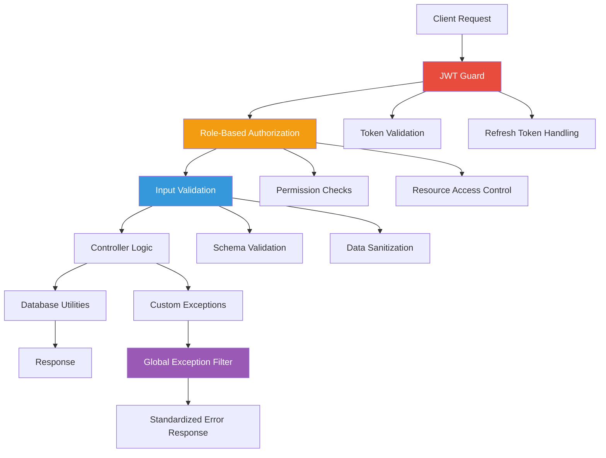
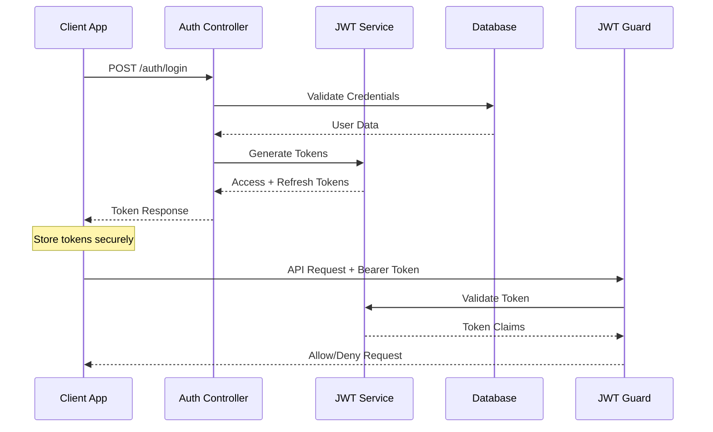
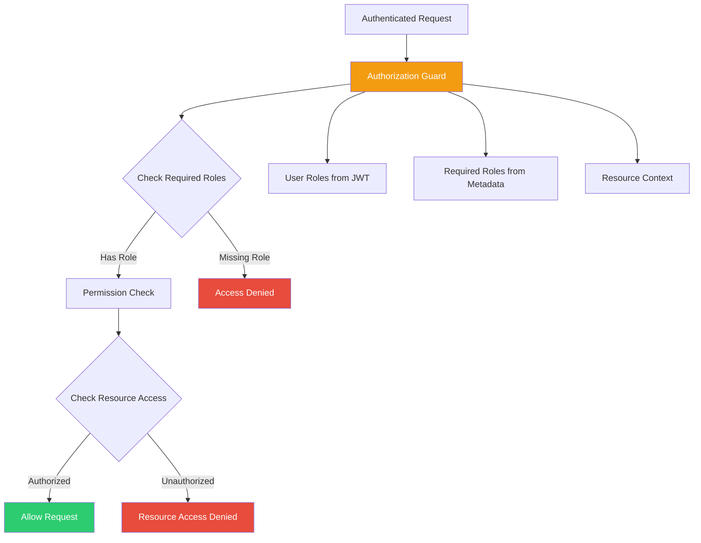
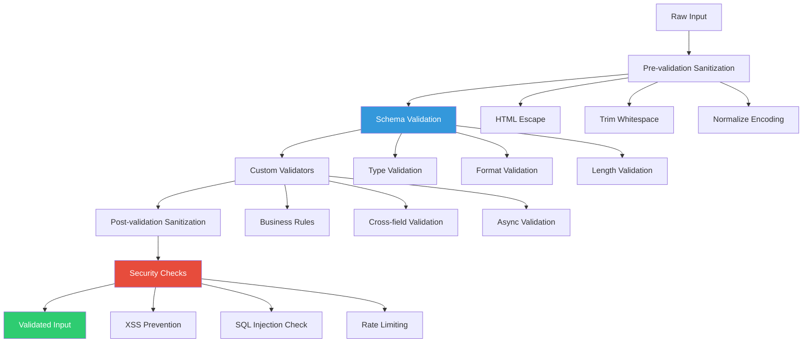
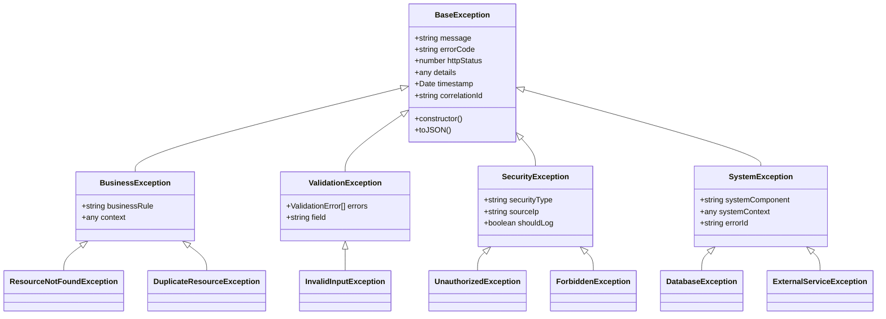
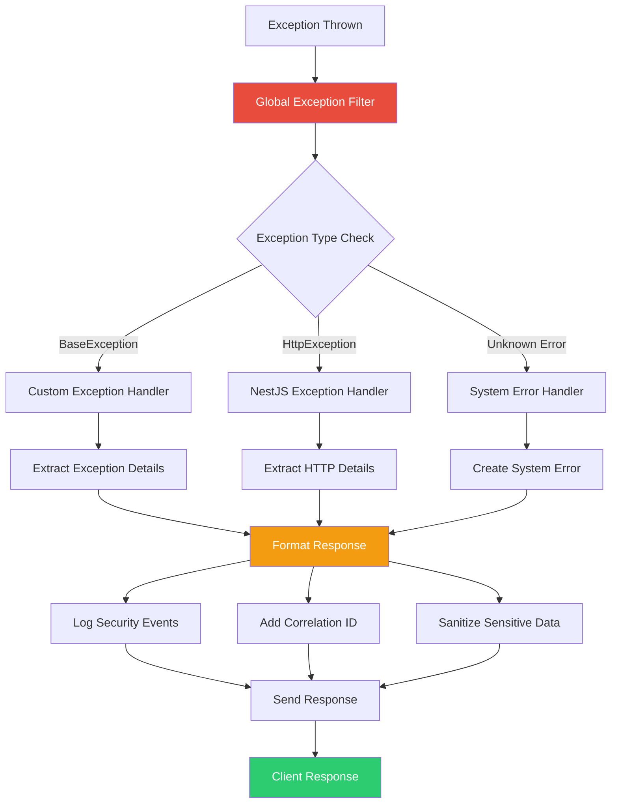

# Module 4: Security and Exception Handling

## Overview

This advanced module focuses on implementing enterprise-grade security patterns, authentication/authorization systems, and comprehensive exception handling in EQXJS applications. You'll master JWT-based authentication, role-based access control, input validation, custom exception hierarchies, and global error handling patterns that ensure secure and robust applications.

## Learning Objectives

By the end of this module, you will be able to:

- **JWT Authentication System**: Secure token-based authentication with refresh token patterns
- **Role-Based Authorization**: Multi-level access control with guard patterns and policies
- **Input Validation Framework**: Comprehensive sanitization and validation for security
- **Custom Exception Hierarchy**: Type-safe error handling with proper error classification
- **Global Exception Filters**: Standardized error responses with proper HTTP status codes
- **Database Security Utilities**: Connection optimization and security best practices
- **Production Security Monitoring**: Audit logging and security event tracking

## Exercises

- [Module 4 Exercises](exercise/module-04-exercises.md)



---

## Module Structure

### Section 1: JWT-Based Authentication Architecture

#### 1.1 JWT Security Fundamentals

**EQXJS Authentication Flow:**



**JWT Token Structure in EQXJS:**

```typescript
// JWT Payload Interface
export interface JwtPayload {
  sub: string; // Subject (user ID)
  username: string; // Username
  email: string; // User email
  roles: string[]; // User roles array
  permissions: string[]; // Specific permissions
  iat: number; // Issued at
  exp: number; // Expiration time
  jti: string; // JWT ID for revocation
}

// Refresh Token Payload
export interface RefreshTokenPayload {
  sub: string;
  tokenFamily: string; // Token rotation family
  iat: number;
  exp: number;
}
```

#### 1.2 JWT Service Implementation

**Core JWT Service:**

```typescript
import { Injectable, UnauthorizedException } from "@nestjs/common";
import { JwtService } from "@nestjs/jwt";
import { ConfigService } from "@nestjs/config";
import * as crypto from "crypto";

@Injectable()
export class EqxJwtService {
  private readonly accessTokenSecret: string;
  private readonly refreshTokenSecret: string;
  private readonly accessTokenExpiry = "15m";
  private readonly refreshTokenExpiry = "7d";

  constructor(
    private readonly jwtService: JwtService,
    private readonly configService: ConfigService,
  ) {
    this.accessTokenSecret =
      this.configService.get<string>("JWT_ACCESS_SECRET");
    this.refreshTokenSecret =
      this.configService.get<string>("JWT_REFRESH_SECRET");
  }

  /**
   * Generate access and refresh token pair
   */
  async generateTokenPair(payload: JwtPayload): Promise<TokenPair> {
    const tokenFamily = crypto.randomUUID();

    // Generate access token
    const accessToken = this.jwtService.sign(
      { ...payload, jti: crypto.randomUUID() },
      {
        secret: this.accessTokenSecret,
        expiresIn: this.accessTokenExpiry,
      },
    );

    // Generate refresh token
    const refreshTokenPayload: RefreshTokenPayload = {
      sub: payload.sub,
      tokenFamily,
      iat: Math.floor(Date.now() / 1000),
      exp: Math.floor(Date.now() / 1000) + 7 * 24 * 60 * 60, // 7 days
    };

    const refreshToken = this.jwtService.sign(refreshTokenPayload, {
      secret: this.refreshTokenSecret,
      expiresIn: this.refreshTokenExpiry,
    });

    return {
      accessToken,
      refreshToken,
      tokenType: "Bearer",
      expiresIn: 900, // 15 minutes in seconds
    };
  }

  /**
   * Validate access token
   */
  async validateAccessToken(token: string): Promise<JwtPayload> {
    try {
      return this.jwtService.verify(token, {
        secret: this.accessTokenSecret,
      }) as JwtPayload;
    } catch (error) {
      throw new UnauthorizedException("Invalid access token");
    }
  }

  /**
   * Validate refresh token
   */
  async validateRefreshToken(token: string): Promise<RefreshTokenPayload> {
    try {
      return this.jwtService.verify(token, {
        secret: this.refreshTokenSecret,
      }) as RefreshTokenPayload;
    } catch (error) {
      throw new UnauthorizedException("Invalid refresh token");
    }
  }

  /**
   * Refresh token pair
   */
  async refreshTokens(
    refreshToken: string,
    userPayload: JwtPayload,
  ): Promise<TokenPair> {
    const refreshPayload = await this.validateRefreshToken(refreshToken);

    if (refreshPayload.sub !== userPayload.sub) {
      throw new UnauthorizedException("Token subject mismatch");
    }

    return this.generateTokenPair(userPayload);
  }
}

// Token interfaces
export interface TokenPair {
  accessToken: string;
  refreshToken: string;
  tokenType: "Bearer";
  expiresIn: number;
}
```

#### 1.3 JWT Authentication Guard

**Custom JWT Guard Implementation:**

```typescript
import {
  Injectable,
  ExecutionContext,
  UnauthorizedException,
} from "@nestjs/common";
import { AuthGuard } from "@nestjs/passport";
import { EqxJwtService } from "./jwt.service";
import { Reflector } from "@nestjs/core";

@Injectable()
export class JwtAuthGuard extends AuthGuard("jwt") {
  constructor(
    private readonly jwtService: EqxJwtService,
    private readonly reflector: Reflector,
  ) {
    super();
  }

  async canActivate(context: ExecutionContext): Promise<boolean> {
    const request = context.switchToHttp().getRequest();

    // Check if route is public
    const isPublic = this.reflector.getAllAndOverride<boolean>("isPublic", [
      context.getHandler(),
      context.getClass(),
    ]);

    if (isPublic) {
      return true;
    }

    // Extract token from header
    const token = this.extractTokenFromHeader(request);
    if (!token) {
      throw new UnauthorizedException("Access token required");
    }

    try {
      // Validate token
      const payload = await this.jwtService.validateAccessToken(token);

      // Add user to request
      request.user = payload;

      return true;
    } catch (error) {
      throw new UnauthorizedException("Invalid access token");
    }
  }

  private extractTokenFromHeader(request: any): string | undefined {
    const [type, token] = request.headers.authorization?.split(" ") ?? [];
    return type === "Bearer" ? token : undefined;
  }
}
```

---

### Section 2: Role-Based Authorization System

#### 2.1 Authorization Architecture

**Role-Based Access Control (RBAC) Flow:**



#### 2.2 Role and Permission Definitions

**Role System Implementation:**

```typescript
// Role and Permission Types
export enum UserRole {
  SUPER_ADMIN = "super_admin",
  ADMIN = "admin",
  MANAGER = "manager",
  USER = "user",
  GUEST = "guest",
}

export enum Permission {
  // User Management
  CREATE_USER = "create:user",
  READ_USER = "read:user",
  UPDATE_USER = "update:user",
  DELETE_USER = "delete:user",

  // Resource Management
  CREATE_RESOURCE = "create:resource",
  READ_RESOURCE = "read:resource",
  UPDATE_RESOURCE = "update:resource",
  DELETE_RESOURCE = "delete:resource",

  // System Administration
  MANAGE_SYSTEM = "manage:system",
  VIEW_LOGS = "view:logs",
  CONFIGURE_SETTINGS = "configure:settings",
}

// Role-Permission Mapping
export const ROLE_PERMISSIONS: Record<UserRole, Permission[]> = {
  [UserRole.SUPER_ADMIN]: Object.values(Permission),
  [UserRole.ADMIN]: [
    Permission.CREATE_USER,
    Permission.READ_USER,
    Permission.UPDATE_USER,
    Permission.DELETE_USER,
    Permission.CREATE_RESOURCE,
    Permission.READ_RESOURCE,
    Permission.UPDATE_RESOURCE,
    Permission.DELETE_RESOURCE,
    Permission.VIEW_LOGS,
  ],
  [UserRole.MANAGER]: [
    Permission.READ_USER,
    Permission.UPDATE_USER,
    Permission.CREATE_RESOURCE,
    Permission.READ_RESOURCE,
    Permission.UPDATE_RESOURCE,
  ],
  [UserRole.USER]: [
    Permission.READ_USER,
    Permission.READ_RESOURCE,
    Permission.UPDATE_RESOURCE,
  ],
  [UserRole.GUEST]: [Permission.READ_RESOURCE],
};
```

#### 2.3 Authorization Guards and Decorators

**Custom Authorization Decorators:**

```typescript
import { SetMetadata } from "@nestjs/common";
import { UserRole, Permission } from "./auth.types";

// Role-based authorization
export const ROLES_KEY = "roles";
export const Roles = (...roles: UserRole[]) => SetMetadata(ROLES_KEY, roles);

// Permission-based authorization
export const PERMISSIONS_KEY = "permissions";
export const RequirePermissions = (...permissions: Permission[]) =>
  SetMetadata(PERMISSIONS_KEY, permissions);

// Public route (skip authentication)
export const PUBLIC_KEY = "isPublic";
export const Public = () => SetMetadata(PUBLIC_KEY, true);

// Resource ownership check
export const RESOURCE_OWNER_KEY = "resourceOwner";
export const ResourceOwner = () => SetMetadata(RESOURCE_OWNER_KEY, true);
```

**Authorization Guard Implementation:**

```typescript
import {
  Injectable,
  CanActivate,
  ExecutionContext,
  ForbiddenException,
} from "@nestjs/common";
import { Reflector } from "@nestjs/core";
import { UserRole, Permission, ROLE_PERMISSIONS } from "./auth.types";

@Injectable()
export class RoleGuard implements CanActivate {
  constructor(private reflector: Reflector) {}

  canActivate(context: ExecutionContext): boolean {
    const request = context.switchToHttp().getRequest();
    const user = request.user;

    if (!user) {
      throw new ForbiddenException("User not authenticated");
    }

    // Check required roles
    const requiredRoles = this.reflector.getAllAndOverride<UserRole[]>(
      "roles",
      [context.getHandler(), context.getClass()],
    );

    if (requiredRoles) {
      const hasRole = requiredRoles.some((role) => user.roles.includes(role));
      if (!hasRole) {
        throw new ForbiddenException("Insufficient role privileges");
      }
    }

    // Check required permissions
    const requiredPermissions = this.reflector.getAllAndOverride<Permission[]>(
      "permissions",
      [context.getHandler(), context.getClass()],
    );

    if (requiredPermissions) {
      const userPermissions = this.getUserPermissions(user.roles);
      const hasPermission = requiredPermissions.every((permission) =>
        userPermissions.includes(permission),
      );

      if (!hasPermission) {
        throw new ForbiddenException("Insufficient permissions");
      }
    }

    // Check resource ownership
    const requiresOwnership = this.reflector.getAllAndOverride<boolean>(
      "resourceOwner",
      [context.getHandler(), context.getClass()],
    );

    if (requiresOwnership) {
      return this.checkResourceOwnership(context, user);
    }

    return true;
  }

  private getUserPermissions(roles: string[]): Permission[] {
    const permissions = new Set<Permission>();

    roles.forEach((role) => {
      const rolePermissions = ROLE_PERMISSIONS[role as UserRole] || [];
      rolePermissions.forEach((permission) => permissions.add(permission));
    });

    return Array.from(permissions);
  }

  private checkResourceOwnership(
    context: ExecutionContext,
    user: any,
  ): boolean {
    const request = context.switchToHttp().getRequest();
    const resourceUserId = request.params.userId || request.body.userId;

    // Super admin can access any resource
    if (user.roles.includes(UserRole.SUPER_ADMIN)) {
      return true;
    }

    // User can only access their own resources
    if (resourceUserId && resourceUserId !== user.sub) {
      throw new ForbiddenException(
        "Access denied: resource ownership required",
      );
    }

    return true;
  }
}
```

---

### Section 3: Input Validation and Sanitization

#### 3.1 Validation Architecture

**Input Validation Pipeline:**



#### 3.2 Custom Validation Pipes

**EQXJS Security Validation Pipe:**

```typescript
import { Injectable, PipeTransform, BadRequestException } from "@nestjs/common";
import { validate } from "class-validator";
import { plainToClass } from "class-transformer";
import * as DOMPurify from "dompurify";
import { JSDOM } from "jsdom";

@Injectable()
export class SecurityValidationPipe implements PipeTransform<any> {
  private readonly window = new JSDOM("").window;
  private readonly purify = DOMPurify(this.window);

  async transform(value: any, { metatype }: any): Promise<any> {
    if (!metatype || !this.toValidate(metatype)) {
      return value;
    }

    // Sanitize input data
    const sanitizedValue = this.sanitizeInput(value);

    // Transform to class instance
    const object = plainToClass(metatype, sanitizedValue);

    // Validate using class-validator
    const errors = await validate(object, {
      whitelist: true,
      forbidNonWhitelisted: true,
      transform: true,
    });

    if (errors.length > 0) {
      const errorMessages = this.formatValidationErrors(errors);
      throw new BadRequestException({
        message: "Validation failed",
        errors: errorMessages,
      });
    }

    return object;
  }

  private toValidate(metatype: any): boolean {
    const types = [String, Boolean, Number, Array, Object];
    return !types.includes(metatype);
  }

  private sanitizeInput(value: any): any {
    if (typeof value === "string") {
      // Remove HTML tags and sanitize
      return this.purify.sanitize(value, { ALLOWED_TAGS: [] });
    }

    if (Array.isArray(value)) {
      return value.map((item) => this.sanitizeInput(item));
    }

    if (value && typeof value === "object") {
      const sanitized: any = {};
      for (const key in value) {
        if (value.hasOwnProperty(key)) {
          sanitized[key] = this.sanitizeInput(value[key]);
        }
      }
      return sanitized;
    }

    return value;
  }

  private formatValidationErrors(errors: any[]): any[] {
    return errors.map((error) => ({
      field: error.property,
      value: error.value,
      constraints: error.constraints,
    }));
  }
}
```

#### 3.3 Security DTO Classes

**Secure DTO Implementation:**

```typescript
import {
  IsString,
  IsEmail,
  IsOptional,
  IsEnum,
  Length,
  Matches,
  IsUrl,
  IsPhoneNumber,
  ValidateNested,
  IsArray,
} from "class-validator";
import { Transform, Type } from "class-transformer";
import { ApiProperty } from "@nestjs/swagger";

export class CreateUserDto {
  @ApiProperty({
    description: "User username (alphanumeric, underscores, hyphens)",
    example: "john_doe",
  })
  @IsString()
  @Length(3, 30)
  @Matches(/^[a-zA-Z0-9_-]+$/, {
    message:
      "Username can only contain alphanumeric characters, underscores, and hyphens",
  })
  @Transform(({ value }) => value?.toString().toLowerCase().trim())
  username: string;

  @ApiProperty({
    description: "User email address",
    example: "john@example.com",
  })
  @IsEmail({}, { message: "Please provide a valid email address" })
  @Transform(({ value }) => value?.toString().toLowerCase().trim())
  email: string;

  @ApiProperty({
    description:
      "User password (8-50 characters, at least one uppercase, lowercase, number)",
    example: "SecurePassword123",
  })
  @IsString()
  @Length(8, 50)
  @Matches(/^(?=.*[a-z])(?=.*[A-Z])(?=.*\d)(?=.*[@$!%*?&])[A-Za-z\d@$!%*?&]/, {
    message:
      "Password must contain at least one uppercase letter, one lowercase letter, one number, and one special character",
  })
  password: string;

  @ApiProperty({
    description: "User first name",
    example: "John",
  })
  @IsString()
  @Length(1, 50)
  @Matches(/^[a-zA-Z\s'-]+$/, {
    message:
      "First name can only contain letters, spaces, hyphens, and apostrophes",
  })
  @Transform(({ value }) => value?.toString().trim())
  firstName: string;

  @ApiProperty({
    description: "User last name",
    example: "Doe",
  })
  @IsString()
  @Length(1, 50)
  @Matches(/^[a-zA-Z\s'-]+$/, {
    message:
      "Last name can only contain letters, spaces, hyphens, and apostrophes",
  })
  @Transform(({ value }) => value?.toString().trim())
  lastName: string;

  @ApiProperty({
    description: "User phone number",
    example: "+1234567890",
    required: false,
  })
  @IsOptional()
  @IsPhoneNumber(null, { message: "Please provide a valid phone number" })
  phoneNumber?: string;

  @ApiProperty({
    description: "User roles",
    example: ["user"],
    enum: ["super_admin", "admin", "manager", "user", "guest"],
    isArray: true,
  })
  @IsArray()
  @IsEnum(["super_admin", "admin", "manager", "user", "guest"], { each: true })
  roles: string[];
}

export class UpdateUserDto {
  @ApiProperty({ required: false })
  @IsOptional()
  @IsString()
  @Length(1, 50)
  @Transform(({ value }) => value?.toString().trim())
  firstName?: string;

  @ApiProperty({ required: false })
  @IsOptional()
  @IsString()
  @Length(1, 50)
  @Transform(({ value }) => value?.toString().trim())
  lastName?: string;

  @ApiProperty({ required: false })
  @IsOptional()
  @IsPhoneNumber(null)
  phoneNumber?: string;

  @ApiProperty({ required: false })
  @IsOptional()
  @IsUrl({}, { message: "Please provide a valid URL" })
  profilePicture?: string;
}
```

---

### Section 4: Custom Exception Hierarchy

#### 4.1 Exception Architecture

**EQXJS Exception Hierarchy:**



#### 4.2 Base Exception Classes

**EQXJS Base Exception Implementation:**

```typescript
import { HttpStatus } from "@nestjs/common";

export abstract class BaseException extends Error {
  public readonly errorCode: string;
  public readonly httpStatus: HttpStatus;
  public readonly details?: any;
  public readonly timestamp: Date;
  public readonly correlationId?: string;

  constructor(
    message: string,
    errorCode: string,
    httpStatus: HttpStatus,
    details?: any,
    correlationId?: string,
  ) {
    super(message);
    this.name = this.constructor.name;
    this.errorCode = errorCode;
    this.httpStatus = httpStatus;
    this.details = details;
    this.timestamp = new Date();
    this.correlationId = correlationId;

    // Ensure proper stack trace
    Error.captureStackTrace(this, this.constructor);
  }

  toJSON() {
    return {
      name: this.name,
      message: this.message,
      errorCode: this.errorCode,
      httpStatus: this.httpStatus,
      details: this.details,
      timestamp: this.timestamp.toISOString(),
      correlationId: this.correlationId,
    };
  }
}

// Business Logic Exceptions
export class BusinessException extends BaseException {
  public readonly businessRule: string;
  public readonly context?: any;

  constructor(
    message: string,
    errorCode: string,
    businessRule: string,
    context?: any,
    correlationId?: string,
  ) {
    super(message, errorCode, HttpStatus.BAD_REQUEST, context, correlationId);
    this.businessRule = businessRule;
    this.context = context;
  }
}

// Validation Exceptions
export class ValidationException extends BaseException {
  public readonly errors: ValidationError[];
  public readonly field?: string;

  constructor(
    message: string,
    errors: ValidationError[],
    field?: string,
    correlationId?: string,
  ) {
    super(
      message,
      "VALIDATION_ERROR",
      HttpStatus.BAD_REQUEST,
      { errors, field },
      correlationId,
    );
    this.errors = errors;
    this.field = field;
  }
}

// Security Exceptions
export class SecurityException extends BaseException {
  public readonly securityType: string;
  public readonly sourceIp?: string;
  public readonly shouldLog: boolean;

  constructor(
    message: string,
    errorCode: string,
    securityType: string,
    httpStatus: HttpStatus,
    sourceIp?: string,
    shouldLog: boolean = true,
    correlationId?: string,
  ) {
    super(
      message,
      errorCode,
      httpStatus,
      { securityType, sourceIp },
      correlationId,
    );
    this.securityType = securityType;
    this.sourceIp = sourceIp;
    this.shouldLog = shouldLog;
  }
}

// System Exceptions
export class SystemException extends BaseException {
  public readonly systemComponent: string;
  public readonly systemContext?: any;
  public readonly errorId: string;

  constructor(
    message: string,
    errorCode: string,
    systemComponent: string,
    systemContext?: any,
    correlationId?: string,
  ) {
    const errorId = `SYS_${Date.now()}_${Math.random().toString(36).substr(2, 9)}`;
    super(
      message,
      errorCode,
      HttpStatus.INTERNAL_SERVER_ERROR,
      { systemComponent, systemContext, errorId },
      correlationId,
    );
    this.systemComponent = systemComponent;
    this.systemContext = systemContext;
    this.errorId = errorId;
  }
}

export interface ValidationError {
  field: string;
  value: any;
  constraints: Record<string, string>;
}
```

#### 4.3 Specific Exception Classes

**Domain-Specific Exceptions:**

```typescript
// Resource Management Exceptions
export class ResourceNotFoundException extends BusinessException {
  constructor(resource: string, id: string, correlationId?: string) {
    super(
      `${resource} with ID ${id} not found`,
      "RESOURCE_NOT_FOUND",
      "resource_existence_check",
      { resource, id },
      correlationId,
    );
  }
}

export class DuplicateResourceException extends BusinessException {
  constructor(
    resource: string,
    field: string,
    value: string,
    correlationId?: string,
  ) {
    super(
      `${resource} with ${field} '${value}' already exists`,
      "DUPLICATE_RESOURCE",
      "resource_uniqueness_check",
      { resource, field, value },
      correlationId,
    );
  }
}

// Authentication & Authorization Exceptions
export class AuthenticationException extends SecurityException {
  constructor(reason: string, sourceIp?: string, correlationId?: string) {
    super(
      "Authentication failed",
      "AUTHENTICATION_FAILED",
      "authentication",
      HttpStatus.UNAUTHORIZED,
      sourceIp,
      true,
      correlationId,
    );
  }
}

export class AuthorizationException extends SecurityException {
  constructor(
    resource: string,
    action: string,
    sourceIp?: string,
    correlationId?: string,
  ) {
    super(
      `Access denied for ${action} on ${resource}`,
      "AUTHORIZATION_FAILED",
      "authorization",
      HttpStatus.FORBIDDEN,
      sourceIp,
      true,
      correlationId,
    );
  }
}

// Input Validation Exceptions
export class InvalidInputException extends ValidationException {
  constructor(
    field: string,
    value: any,
    constraint: string,
    correlationId?: string,
  ) {
    super(
      `Invalid input for field '${field}': ${constraint}`,
      [{ field, value, constraints: { [constraint]: constraint } }],
      field,
      correlationId,
    );
  }
}

// Database Exceptions
export class DatabaseException extends SystemException {
  constructor(operation: string, error: Error, correlationId?: string) {
    super(
      `Database operation failed: ${operation}`,
      "DATABASE_ERROR",
      "database",
      { operation, originalError: error.message },
      correlationId,
    );
  }
}

// External Service Exceptions
export class ExternalServiceException extends SystemException {
  constructor(
    service: string,
    operation: string,
    statusCode?: number,
    correlationId?: string,
  ) {
    super(
      `External service '${service}' failed for operation '${operation}'`,
      "EXTERNAL_SERVICE_ERROR",
      "external_service",
      { service, operation, statusCode },
      correlationId,
    );
  }
}

// Rate Limiting Exception
export class RateLimitException extends SecurityException {
  constructor(
    limit: number,
    windowMs: number,
    sourceIp?: string,
    correlationId?: string,
  ) {
    super(
      `Rate limit exceeded: ${limit} requests per ${windowMs}ms`,
      "RATE_LIMIT_EXCEEDED",
      "rate_limiting",
      HttpStatus.TOO_MANY_REQUESTS,
      sourceIp,
      true,
      correlationId,
    );
  }
}
```

---

### Section 5: Global Exception Filters

#### 5.1 Exception Filter Architecture

**Global Exception Handling Flow:**



#### 5.2 Global Exception Filter Implementation

**EQXJS Global Exception Filter:**

```typescript
import {
  ExceptionFilter,
  Catch,
  ArgumentsHost,
  HttpException,
  HttpStatus,
  Logger,
} from "@nestjs/common";
import { Request, Response } from "express";
import { BaseException, SecurityException } from "./exceptions";

@Catch()
export class GlobalExceptionFilter implements ExceptionFilter {
  private readonly logger = new Logger(GlobalExceptionFilter.name);

  catch(exception: unknown, host: ArgumentsHost): void {
    const ctx = host.switchToHttp();
    const response = ctx.getResponse<Response>();
    const request = ctx.getRequest<Request>();

    // Extract correlation ID from request
    const correlationId =
      (request.headers["x-correlation-id"] as string) ||
      (request.headers["correlation-id"] as string);

    let errorResponse: ErrorResponse;

    if (exception instanceof BaseException) {
      errorResponse = this.handleBaseException(
        exception,
        request,
        correlationId,
      );
    } else if (exception instanceof HttpException) {
      errorResponse = this.handleHttpException(
        exception,
        request,
        correlationId,
      );
    } else {
      errorResponse = this.handleSystemError(exception, request, correlationId);
    }

    // Log the exception
    this.logException(exception, errorResponse, request);

    // Send response
    response.status(errorResponse.statusCode).json(errorResponse);
  }

  private handleBaseException(
    exception: BaseException,
    request: Request,
    correlationId?: string,
  ): ErrorResponse {
    return {
      success: false,
      statusCode: exception.httpStatus,
      errorCode: exception.errorCode,
      message: exception.message,
      details: this.sanitizeDetails(exception.details),
      timestamp: exception.timestamp.toISOString(),
      path: request.url,
      method: request.method,
      correlationId,
    };
  }

  private handleHttpException(
    exception: HttpException,
    request: Request,
    correlationId?: string,
  ): ErrorResponse {
    const status = exception.getStatus();
    const exceptionResponse = exception.getResponse() as any;

    return {
      success: false,
      statusCode: status,
      errorCode: `HTTP_${status}`,
      message:
        typeof exceptionResponse === "string"
          ? exceptionResponse
          : exceptionResponse.message || exception.message,
      details:
        typeof exceptionResponse === "object"
          ? this.sanitizeDetails(exceptionResponse)
          : undefined,
      timestamp: new Date().toISOString(),
      path: request.url,
      method: request.method,
      correlationId,
    };
  }

  private handleSystemError(
    exception: unknown,
    request: Request,
    correlationId?: string,
  ): ErrorResponse {
    const errorId = `ERR_${Date.now()}_${Math.random().toString(36).substr(2, 9)}`;

    return {
      success: false,
      statusCode: HttpStatus.INTERNAL_SERVER_ERROR,
      errorCode: "INTERNAL_SERVER_ERROR",
      message: "An unexpected error occurred",
      details: {
        errorId,
        // Only include error details in development
        ...(process.env.NODE_ENV === "development" && {
          originalMessage:
            exception instanceof Error ? exception.message : String(exception),
        }),
      },
      timestamp: new Date().toISOString(),
      path: request.url,
      method: request.method,
      correlationId,
    };
  }

  private sanitizeDetails(details: any): any {
    if (!details) return undefined;

    // Remove sensitive information
    const sensitiveFields = [
      "password",
      "token",
      "secret",
      "key",
      "credential",
    ];
    const sanitized = JSON.parse(JSON.stringify(details));

    const sanitizeObject = (obj: any): any => {
      if (Array.isArray(obj)) {
        return obj.map(sanitizeObject);
      }

      if (obj && typeof obj === "object") {
        const result: any = {};
        Object.keys(obj).forEach((key) => {
          if (
            sensitiveFields.some((field) => key.toLowerCase().includes(field))
          ) {
            result[key] = "[REDACTED]";
          } else {
            result[key] = sanitizeObject(obj[key]);
          }
        });
        return result;
      }

      return obj;
    };

    return sanitizeObject(sanitized);
  }

  private logException(
    exception: unknown,
    errorResponse: ErrorResponse,
    request: Request,
  ): void {
    const logContext = {
      method: request.method,
      url: request.url,
      statusCode: errorResponse.statusCode,
      errorCode: errorResponse.errorCode,
      correlationId: errorResponse.correlationId,
      userAgent: request.headers["user-agent"],
      ip: request.ip,
    };

    if (exception instanceof SecurityException && exception.shouldLog) {
      this.logger.warn(`Security Exception: ${exception.message}`, {
        ...logContext,
        securityType: exception.securityType,
        sourceIp: exception.sourceIp,
      });
    } else if (exception instanceof BaseException) {
      this.logger.error(`Business Exception: ${exception.message}`, {
        ...logContext,
        stack: exception.stack,
      });
    } else if (errorResponse.statusCode >= 500) {
      this.logger.error(`System Error: ${errorResponse.message}`, {
        ...logContext,
        stack: exception instanceof Error ? exception.stack : undefined,
      });
    } else {
      this.logger.warn(`HTTP Exception: ${errorResponse.message}`, logContext);
    }
  }
}

export interface ErrorResponse {
  success: false;
  statusCode: number;
  errorCode: string;
  message: string;
  details?: any;
  timestamp: string;
  path: string;
  method: string;
  correlationId?: string;
}
```

---

### Section 6: Database Security Utilities

#### 6.1 Database Connection Security

**Secure Database Configuration:**

```typescript
import { Injectable, OnModuleInit, OnModuleDestroy } from "@nestjs/common";
import { ConfigService } from "@nestjs/config";
import { MongoClient, Db, MongoClientOptions } from "mongodb";
import { DatabaseException } from "../exceptions";

@Injectable()
export class DatabaseUtilService implements OnModuleInit, OnModuleDestroy {
  private client: MongoClient;
  private db: Db;
  private readonly logger = new Logger(DatabaseUtilService.name);

  constructor(private readonly configService: ConfigService) {}

  async onModuleInit(): Promise<void> {
    await this.connect();
  }

  async onModuleDestroy(): Promise<void> {
    await this.disconnect();
  }

  private async connect(): Promise<void> {
    try {
      const connectionString = this.configService.get<string>("DATABASE_URL");
      const options: MongoClientOptions = {
        // Security options
        tls: true,
        tlsAllowInvalidCertificates: false,
        tlsAllowInvalidHostnames: false,

        // Connection pool options
        maxPoolSize: this.configService.get<number>("DB_MAX_POOL_SIZE", 10),
        minPoolSize: this.configService.get<number>("DB_MIN_POOL_SIZE", 5),
        maxIdleTimeMS: this.configService.get<number>(
          "DB_MAX_IDLE_TIME",
          30000,
        ),

        // Timeouts
        serverSelectionTimeoutMS: 5000,
        socketTimeoutMS: 0,
        connectTimeoutMS: 10000,

        // Monitoring
        monitorCommands: true,

        // Compression
        compressors: ["snappy", "zlib"],

        // Read/Write concerns
        readConcern: "majority",
        writeConcern: {
          w: "majority",
          wtimeout: 5000,
        },

        // Authentication
        authSource: "admin",
        authMechanism: "SCRAM-SHA-256",
      };

      this.client = new MongoClient(connectionString, options);
      await this.client.connect();

      this.db = this.client.db(this.configService.get<string>("DATABASE_NAME"));

      this.logger.log("Database connected successfully");
    } catch (error) {
      this.logger.error("Database connection failed", error);
      throw new DatabaseException("connect", error as Error);
    }
  }

  private async disconnect(): Promise<void> {
    try {
      if (this.client) {
        await this.client.close();
        this.logger.log("Database disconnected successfully");
      }
    } catch (error) {
      this.logger.error("Database disconnection failed", error);
    }
  }

  /**
   * Get database instance with connection validation
   */
  async getDatabase(): Promise<Db> {
    if (!this.db) {
      throw new DatabaseException(
        "getDatabase",
        new Error("Database not initialized"),
      );
    }

    // Ping to ensure connection is alive
    try {
      await this.db.admin().ping();
      return this.db;
    } catch (error) {
      this.logger.warn("Database ping failed, attempting reconnection");
      await this.connect();
      return this.db;
    }
  }

  /**
   * Execute database operation with error handling
   */
  async executeOperation<T>(
    operation: string,
    callback: (db: Db) => Promise<T>,
    correlationId?: string,
  ): Promise<T> {
    try {
      const db = await this.getDatabase();
      return await callback(db);
    } catch (error) {
      this.logger.error(`Database operation '${operation}' failed`, {
        operation,
        error: error.message,
        correlationId,
      });
      throw new DatabaseException(operation, error as Error, correlationId);
    }
  }

  /**
   * Execute transactional operation
   */
  async executeTransaction<T>(
    operations: Array<(db: Db, session: any) => Promise<void>>,
    correlationId?: string,
  ): Promise<T> {
    const session = this.client.startSession();

    try {
      let result: T;

      await session.withTransaction(async () => {
        const db = await this.getDatabase();

        for (const operation of operations) {
          await operation(db, session);
        }
      });

      return result;
    } catch (error) {
      this.logger.error("Transaction failed", {
        error: error.message,
        correlationId,
      });
      throw new DatabaseException("transaction", error as Error, correlationId);
    } finally {
      await session.endSession();
    }
  }

  /**
   * Health check for database connection
   */
  async healthCheck(): Promise<boolean> {
    try {
      const db = await this.getDatabase();
      await db.admin().ping();
      return true;
    } catch (error) {
      this.logger.error("Database health check failed", error);
      return false;
    }
  }

  /**
   * Get connection statistics
   */
  async getConnectionStats(): Promise<any> {
    try {
      const db = await this.getDatabase();
      const stats = await db.stats();
      const serverStatus = await db.admin().serverStatus();

      return {
        collections: stats.collections,
        dataSize: stats.dataSize,
        indexSize: stats.indexSize,
        connections: serverStatus.connections,
        uptime: serverStatus.uptime,
      };
    } catch (error) {
      this.logger.error("Failed to get connection stats", error);
      throw new DatabaseException("getConnectionStats", error as Error);
    }
  }
}
```

#### 6.2 Database Query Security Utilities

**Secure Query Builder:**

```typescript
import { Injectable } from "@nestjs/common";
import { FilterQuery, UpdateQuery } from "mongodb";
import { InvalidInputException } from "../exceptions";

@Injectable()
export class SecureQueryBuilder {
  private readonly maxLimit = 1000;
  private readonly defaultLimit = 50;

  /**
   * Build secure find query with validation
   */
  buildFindQuery<T>(options: FindQueryOptions): SecureFindQuery<T> {
    // Validate and sanitize filter
    const filter = this.sanitizeFilter(options.filter || {});

    // Validate pagination
    const limit = this.validateLimit(options.limit);
    const skip = this.validateSkip(options.skip);

    // Validate sorting
    const sort = this.validateSort(options.sort);

    // Validate projection
    const projection = this.validateProjection(options.projection);

    return {
      filter,
      limit,
      skip,
      sort,
      projection,
    };
  }

  /**
   * Build secure update query with validation
   */
  buildUpdateQuery<T>(updateData: any): UpdateQuery<T> {
    // Remove sensitive fields that should not be updated directly
    const sanitizedData = this.sanitizeUpdateData(updateData);

    // Prevent NoSQL injection in update operations
    const secureUpdate = this.sanitizeFilter(sanitizedData);

    return {
      $set: secureUpdate,
      $currentDate: { updatedAt: true },
    } as UpdateQuery<T>;
  }

  /**
   * Build secure aggregation pipeline
   */
  buildAggregationPipeline(stages: any[]): any[] {
    return stages.map((stage) => this.sanitizeFilter(stage));
  }

  private sanitizeFilter(filter: any): any {
    if (!filter || typeof filter !== "object") {
      return {};
    }

    const sanitized: any = {};

    for (const [key, value] of Object.entries(filter)) {
      // Prevent NoSQL injection attempts
      if (this.isUnsafeKey(key)) {
        throw new InvalidInputException(
          key,
          value,
          "Unsafe query operator detected",
        );
      }

      // Recursively sanitize nested objects
      if (value && typeof value === "object" && !Array.isArray(value)) {
        sanitized[key] = this.sanitizeFilter(value);
      } else if (Array.isArray(value)) {
        sanitized[key] = value.map((item) =>
          typeof item === "object" ? this.sanitizeFilter(item) : item,
        );
      } else {
        sanitized[key] = value;
      }
    }

    return sanitized;
  }

  private sanitizeUpdateData(updateData: any): any {
    const sensitiveFields = [
      "_id",
      "id",
      "createdAt",
      "password",
      "passwordHash",
      "salt",
    ];

    const sanitized: any = {};

    for (const [key, value] of Object.entries(updateData)) {
      if (sensitiveFields.includes(key)) {
        continue; // Skip sensitive fields
      }

      if (this.isUnsafeKey(key)) {
        throw new InvalidInputException(
          key,
          value,
          "Unsafe update field detected",
        );
      }

      sanitized[key] = value;
    }

    return sanitized;
  }

  private isUnsafeKey(key: string): boolean {
    const unsafeOperators = [
      "$where",
      "$regex",
      "$function",
      "$accumulator",
      "$function",
      "eval",
      "javascript",
    ];

    return unsafeOperators.some(
      (operator) => key.includes(operator) || key.startsWith("$"),
    );
  }

  private validateLimit(limit?: number): number {
    if (limit === undefined || limit === null) {
      return this.defaultLimit;
    }

    if (!Number.isInteger(limit) || limit < 1) {
      throw new InvalidInputException(
        "limit",
        limit,
        "Limit must be a positive integer",
      );
    }

    if (limit > this.maxLimit) {
      throw new InvalidInputException(
        "limit",
        limit,
        `Limit cannot exceed ${this.maxLimit}`,
      );
    }

    return limit;
  }

  private validateSkip(skip?: number): number {
    if (skip === undefined || skip === null) {
      return 0;
    }

    if (!Number.isInteger(skip) || skip < 0) {
      throw new InvalidInputException(
        "skip",
        skip,
        "Skip must be a non-negative integer",
      );
    }

    return skip;
  }

  private validateSort(sort?: any): any {
    if (!sort) {
      return { createdAt: -1 }; // Default sort
    }

    if (typeof sort !== "object") {
      throw new InvalidInputException("sort", sort, "Sort must be an object");
    }

    const validSortValues = [1, -1, "asc", "desc"];
    const sanitizedSort: any = {};

    for (const [key, value] of Object.entries(sort)) {
      if (!validSortValues.includes(value as any)) {
        throw new InvalidInputException(
          `sort.${key}`,
          value,
          'Sort value must be 1, -1, "asc", or "desc"',
        );
      }
      sanitizedSort[key] = value;
    }

    return sanitizedSort;
  }

  private validateProjection(projection?: any): any {
    if (!projection) {
      return undefined;
    }

    if (typeof projection !== "object") {
      throw new InvalidInputException(
        "projection",
        projection,
        "Projection must be an object",
      );
    }

    // Ensure sensitive fields are not projected
    const sensitiveFields = [
      "password",
      "passwordHash",
      "salt",
      "refreshToken",
    ];
    const sanitizedProjection: any = { ...projection };

    sensitiveFields.forEach((field) => {
      if (sanitizedProjection[field] === 1) {
        delete sanitizedProjection[field];
      }
    });

    return sanitizedProjection;
  }
}

interface FindQueryOptions {
  filter?: any;
  limit?: number;
  skip?: number;
  sort?: any;
  projection?: any;
}

interface SecureFindQuery<T> {
  filter: FilterQuery<T>;
  limit: number;
  skip: number;
  sort: any;
  projection?: any;
}
```

---

## Hands-On Labs

### Lab 4.1: JWT Authentication Implementation

**Objective**: Implement a complete JWT authentication system with refresh token rotation.

**Duration**: 90 minutes

**Tasks**:

1. **Setup JWT Module** (15 minutes)
   - Configure JWT module with environment variables
   - Implement JWT service with token generation and validation
   - Set up refresh token rotation mechanism

2. **Create Authentication Controller** (30 minutes)
   - Implement login endpoint with credential validation
   - Create token refresh endpoint
   - Add logout functionality with token blacklisting

3. **Implement JWT Guards** (30 minutes)
   - Create custom JWT authentication guard
   - Implement token extraction and validation logic
   - Add support for public routes

4. **Testing Authentication Flow** (15 minutes)
   - Test login with valid/invalid credentials
   - Verify token refresh mechanism
   - Test protected route access

**Expected Deliverable**:

```typescript
// Authentication flow working with:
// - Secure token generation
// - Token refresh rotation
// - Proper error handling
// - Security logging
```

### Lab 4.2: Role-Based Authorization System

**Objective**: Build a comprehensive role-based authorization system with permissions.

**Duration**: 120 minutes

**Tasks**:

1. **Define Role Hierarchy** (20 minutes)
   - Create role enums and permission mappings
   - Design role inheritance structure
   - Implement permission calculation logic

2. **Create Authorization Guards** (40 minutes)
   - Implement role-based authorization guard
   - Add permission-based access control
   - Create resource ownership validation

3. **Build Authorization Decorators** (30 minutes)
   - Create role requirement decorators
   - Implement permission requirement decorators
   - Add resource owner validation decorator

4. **Controller Implementation** (30 minutes)
   - Apply authorization to API endpoints
   - Test different role access patterns
   - Implement dynamic permission checks

**Expected Deliverable**:

```typescript
// Working authorization system with:
// - Multi-level role hierarchy
// - Permission-based access control
// - Resource ownership validation
// - Comprehensive access logging
```

### Lab 4.3: Input Validation and Security

**Objective**: Create a comprehensive input validation and sanitization system.

**Duration**: 90 minutes

**Tasks**:

1. **Custom Validation Pipes** (30 minutes)
   - Implement security validation pipe
   - Add XSS prevention and sanitization
   - Create custom validation decorators

2. **Secure DTO Classes** (30 minutes)
   - Design DTOs with comprehensive validation
   - Implement password strength validation
   - Add email and phone number validation

3. **Security Middleware** (30 minutes)
   - Create rate limiting middleware
   - Implement request size validation
   - Add IP-based access control

**Expected Deliverable**:

```typescript
// Secure validation system with:
// - XSS prevention
// - Input sanitization
// - Rate limiting
// - Comprehensive validation rules
```

### Lab 4.4: Exception Handling Implementation

**Objective**: Build a robust exception handling system with global filters.

**Duration**: 120 minutes

**Tasks**:

1. **Exception Hierarchy Design** (30 minutes)
   - Create base exception class
   - Implement domain-specific exceptions
   - Design exception categorization

2. **Global Exception Filter** (45 minutes)
   - Implement global exception filter
   - Add error response standardization
   - Create security event logging

3. **Exception Usage** (30 minutes)
   - Apply exceptions in business logic
   - Test exception propagation
   - Verify error response format

4. **Monitoring Integration** (15 minutes)
   - Add exception monitoring
   - Implement alert triggers
   - Create error dashboards

**Expected Deliverable**:

```typescript
// Complete exception handling with:
// - Hierarchical exception classes
// - Global error handling
// - Standardized responses
// - Security monitoring
```

### Lab 4.5: Database Security Implementation

**Objective**: Implement secure database utilities with connection optimization.

**Duration**: 90 minutes

**Tasks**:

1. **Secure Connection Setup** (25 minutes)
   - Configure secure MongoDB connection
   - Implement connection pooling
   - Add connection monitoring

2. **Query Security** (30 minutes)
   - Build secure query builder
   - Implement NoSQL injection prevention
   - Add query validation and sanitization

3. **Transaction Management** (25 minutes)
   - Implement secure transaction handling
   - Add rollback mechanisms
   - Create transaction monitoring

4. **Performance Optimization** (10 minutes)
   - Optimize connection settings
   - Implement query caching
   - Add performance monitoring

**Expected Deliverable**:

```typescript
// Secure database utilities with:
// - Secure connection configuration
// - NoSQL injection prevention
// - Transaction management
// - Performance optimization
```

---

## Assessment and Review

### Assessment Criteria

**Technical Implementation (60%)**:

- JWT authentication system completeness and security
- Role-based authorization implementation accuracy
- Input validation and sanitization effectiveness
- Exception handling system robustness
- Database security implementation quality

**Code Quality (20%)**:

- TypeScript best practices adherence
- Error handling completeness
- Security considerations implementation
- Code organization and readability

**Security Practices (20%)**:

- Authentication security measures
- Authorization access control accuracy
- Input validation security effectiveness
- Exception handling security compliance
- Database security implementation

### Review Questions

1. **Authentication Security**:
   - How does JWT token rotation enhance security?
   - What are the security implications of token storage?
   - How do you handle token revocation effectively?

2. **Authorization Design**:
   - How does role hierarchy affect permission inheritance?
   - When should you use resource-based access control?
   - How do you handle dynamic permission updates?

3. **Input Validation**:
   - What are the key differences between validation and sanitization?
   - How do you prevent various injection attacks?
   - When should validation occur in the request pipeline?

4. **Exception Handling**:
   - How does exception hierarchy improve error management?
   - What information should be included in error responses?
   - How do you balance error detail with security?

5. **Database Security**:
   - How does connection pooling affect security?
   - What are the key NoSQL injection prevention techniques?
   - How do you ensure transaction integrity in distributed systems?

---

## Additional Resources

### Security Best Practices Documentation

- [OWASP Security Guidelines](https://owasp.org/www-project-top-ten/)
- [JWT Security Best Practices](https://datatracker.ietf.org/doc/html/draft-ietf-oauth-jwt-bcp)
- [Node.js Security Checklist](https://blog.risingstack.com/node-js-security-checklist/)

### Advanced Topics for Further Learning

- **OAuth 2.0 and OpenID Connect Integration**
- **Multi-Factor Authentication (MFA) Implementation**
- **API Rate Limiting and DDoS Protection**
- **Security Monitoring and Incident Response**
- **Compliance and Audit Logging**

### Tools and Libraries

- **Security Testing**: OWASP ZAP, Burp Suite
- **JWT Libraries**: jsonwebtoken, passport-jwt
- **Validation Libraries**: class-validator, joi
- **Security Middleware**: helmet, express-rate-limit
- **Monitoring**: Winston, Sentry, DataDog

---

**Previous: [Module 3 - Health Checks and Service Management](Module-03-Health-Checks-and-Service-Management.md)** | **Next: [Module 5 - Data Processing and Pipes](Module-05-Data-Processing-and-Pipes.md)**
