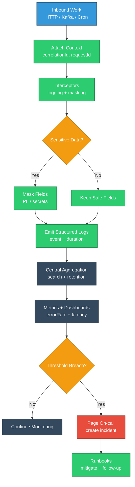

# Module 6: Logging and Monitoring Systems

## EQXJS Framework - Observability, Masking, and Production Diagnostics

---

## Learning Objectives

After completing this module, you will be able to:

- Design structured logging for enterprise NestJS services using EQXJS patterns
- Implement data masking strategies for PII/secret protection
- Add correlation IDs and distributed tracing-friendly context propagation
- Integrate logging with health checks and operational monitoring
- Define actionable metrics, alerts, and dashboards for production readiness

---

## Overview

Observability is the backbone of operating enterprise services. EQXJS provides building blocks (logger, masking decorators, interceptors, utilities, health tools) to standardize how services emit logs, how sensitive data is protected, and how operational signals are collected.

This module focuses on patterns you should apply consistently across services:

- **Structured logs** (machine-parseable, consistent fields)
- **Correlation** (trace requests across modules/services)
- **Masking** (ensure logs are safe by default)
- **Metrics** (quantify performance and reliability)



---

## 6.1 EQXJS Logger Architecture

### What “structured logging” means

Instead of free-form strings, emit objects with stable keys:

- `timestamp`
- `level`
- `service`
- `module`
- `requestId` / `correlationId`
- `event` (logical action)
- `durationMs`
- `status` / `result`
- `error` (standardized shape)

### Baseline logging wrapper

Create a service that wraps the framework logger so your team logs consistently:

```typescript
import { Injectable } from "@nestjs/common";
// import { LoggerService } from '@corp-ais/eqxjs-logger'; // framework logger

export interface LogContext {
  correlationId?: string;
  requestId?: string;
  userId?: string;
  organizationId?: string;
  module?: string;
  operation?: string;
}

@Injectable()
export class AppLogService {
  // constructor(private readonly logger: LoggerService) {}

  info(
    message: string,
    ctx: LogContext = {},
    extra: Record<string, unknown> = {},
  ) {
    this.write("info", message, ctx, extra);
  }

  warn(
    message: string,
    ctx: LogContext = {},
    extra: Record<string, unknown> = {},
  ) {
    this.write("warn", message, ctx, extra);
  }

  error(
    message: string,
    ctx: LogContext = {},
    extra: Record<string, unknown> = {},
  ) {
    this.write("error", message, ctx, extra);
  }

  private write(
    level: "info" | "warn" | "error",
    message: string,
    ctx: LogContext,
    extra: Record<string, unknown>,
  ) {
    const payload = {
      level,
      message,
      ...ctx,
      ...extra,
      timestamp: new Date().toISOString(),
    };

    // this.logger.log(payload);
    // Fallback if using Nest Logger or console:
    // eslint-disable-next-line no-console
    console.log(JSON.stringify(payload));
  }
}
```

### Logging levels

Use levels consistently:

- `debug`: internal diagnostics (avoid in production unless needed)
- `info`: business events and system milestones
- `warn`: unexpected but recoverable conditions
- `error`: failures requiring attention

---

## 6.2 Data Masking and Privacy

### Why masking matters

Logs are often sent to shared systems and retained for long periods. Mask PII and secrets by default:

- passwords, access tokens, refresh tokens
- citizen IDs / national IDs
- card numbers, bank account numbers
- email/phone (often considered personal data)

### Field-based masking patterns

Use masking decorators (like `@ConsumerMasking`) where applicable and standardize keys your organization treats as sensitive:

```typescript
export const SENSITIVE_KEYS = [
  "password",
  "token",
  "accessToken",
  "refreshToken",
  "authorization",
  "ssn",
  "nationalId",
  "cardNumber",
];

export function maskValue(value: unknown): unknown {
  if (value === null || value === undefined) return value;
  if (typeof value !== "string") return "***";
  if (value.length <= 4) return "***";
  return value.slice(0, 2) + "***" + value.slice(-2);
}

export function maskObject(obj: unknown): unknown {
  if (!obj || typeof obj !== "object") return obj;
  if (Array.isArray(obj)) return obj.map(maskObject);

  const result: Record<string, unknown> = {};
  for (const [key, val] of Object.entries(obj as Record<string, unknown>)) {
    if (SENSITIVE_KEYS.includes(key)) {
      result[key] = maskValue(val);
    } else {
      result[key] = maskObject(val);
    }
  }
  return result;
}
```

### Masking at ingestion points

Mask at:

- inbound request logging
- consumer message logging
- outbound HTTP client logging

Avoid storing raw payloads in error logs.

---

## 6.3 Correlation and Tracing

### Correlation ID strategy

A practical baseline:

- If inbound request has `x-correlation-id`, keep it.
- Else generate a new one.
- Ensure every log line during that request includes it.

### Context propagation

Use a request-scoped provider or AsyncLocalStorage pattern to attach context.

```typescript
import { Injectable } from "@nestjs/common";
import { AsyncLocalStorage } from "node:async_hooks";

export interface RequestContext {
  correlationId: string;
  requestId?: string;
  userId?: string;
}

@Injectable()
export class RequestContextStore {
  private readonly als = new AsyncLocalStorage<RequestContext>();

  run(ctx: RequestContext, fn: () => Promise<any>) {
    return this.als.run(ctx, fn);
  }

  get(): RequestContext | undefined {
    return this.als.getStore();
  }
}
```

### Tracing-friendly logs

Add fields that make logs compatible with tracing tools:

- `traceId`, `spanId` (if you have OpenTelemetry)
- `service`, `environment`, `version`

---

## 6.4 Centralized Logging Systems

### Log aggregation goals

Centralization should enable:

- fast search by `correlationId`
- dashboards for `errorRate`, `latencyP95`, `timeoutRate`
- alert rules by service/module

### Operational log guidelines

- Avoid logging full payloads by default
- Log sizes should be bounded (truncate large arrays/strings)
- Use stable event names: `user.created`, `payment.authorized`, `kafka.consume.failed`

### Retention considerations

Retention depends on compliance and operations:

- operational logs: shorter retention
- audit logs: longer retention, controlled access

---

## 6.5 Observability and Monitoring

### Core metrics to track

Baseline service metrics:

- request rate (RPS)
- error rate (% 4xx/5xx)
- latency (p50/p95/p99)
- dependency latency (DB, Kafka, HTTP)
- queue lag / consumer lag

### Alerting patterns

Alerts should be:

- actionable
- routed to owners
- linked to runbooks

Examples:

- `errorRate > 2% for 10m`
- `latencyP95 > 1500ms for 5m`
- `consumerLag > threshold for 15m`

### Dashboard design

Design dashboards per service:

- RED (Rate, Errors, Duration)
- Dependency panels
- Health endpoints status
- Top error codes and exceptions

---

## Summary

In this module, you learned how to build production-grade observability:

- Structured logging conventions
- Safe-by-default masking for sensitive data
- Correlation IDs and context propagation
- Centralized logging practices
- Metrics, alerts, and dashboards

## Exercises

- [Module 6 Exercises](exercise/module-06-exercises.md)

## Next Steps

- Complete the [Module 6 Exercises](exercise/module-06-exercises.md)
- Apply the logging conventions to one service end-to-end
- Continue to [Module 7: Transport and HTTP Integration](Module-07-Transport-and-HTTP-Integration.md)

---

**Previous: [Module 5 - Data Processing and Pipes](Module-05-Data-Processing-and-Pipes.md)** | **Next: [Module 7 - Transport and HTTP Integration](Module-07-Transport-and-HTTP-Integration.md)**
