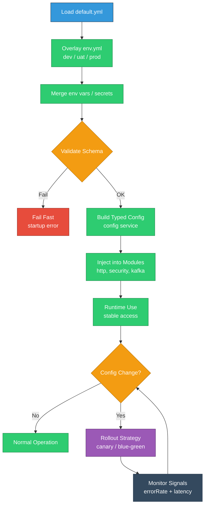

# Module 8: Configuration Management and Commander

## EQXJS Framework - YAML Config, Environments, and Command Patterns

---

## Learning Objectives

After completing this module, you will be able to:

- Design a multi-environment configuration strategy using YAML + env vars
- Validate configuration early to fail fast with clear errors
- Structure configuration by domains (http, security, database, kafka, logging)
- Apply command patterns for consistent operational tasks
- Implement safe configuration reload and rollout patterns

---

## Overview

Configuration is a major source of production incidents: wrong endpoints, missing secrets, invalid zones, mismatched feature flags. EQXJS promotes configuration as a first-class capability using a YAML-based system (with environment overlays) and command patterns for operational behavior.

This module covers:

- YAML config structure and layering
- Validation and type safety
- Zone/environment strategies
- Command execution patterns (operational commands, scheduled jobs)



---

## 8.1 YAML Configuration System

### Recommended config structure

Use a stable top-level structure that matches platform needs:

```yaml
app:
  name: "user-service"
  env: "dev"
  version: "1.0.0"

http:
  port: 3000
  basePath: "/api"
  timeouts:
    requestMs: 15000

logging:
  level: "info"
  mask:
    enabled: true
    keys:
      - "password"
      - "token"
      - "authorization"

security:
  jwt:
    issuer: "corp"
    audience: "internal"
    accessTokenMinutes: 15

dependencies:
  usersApi:
    baseUrl: "https://users.dev.internal"
    timeoutMs: 5000
```

### Layering environments

Common patterns:

- `config/default.yml`
- `config/dev.yml`
- `config/uat.yml`
- `config/prod.yml`

Rules:

- default defines the schema keys
- env overlays override values
- secrets come from env vars or secret stores

---

## 8.2 Environment Management

### Zone-based environments

If you deploy per zone (e.g., `th1`, `th2`), keep zone-specific overrides minimal:

- base URLs
- region-specific endpoints
- feature flags

### Environment variables

Use env vars for secrets and dynamic runtime values:

- `JWT_PRIVATE_KEY`
- `DATABASE_URL`
- `KAFKA_BROKERS`

Always validate presence and format.

---

## 8.3 Configuration Validation

### Fail fast

Validate at startup so the service never becomes "half-configured".

```typescript
import * as Joi from "joi";

export const AppConfigSchema = Joi.object({
  app: Joi.object({
    name: Joi.string().required(),
    env: Joi.string().valid("dev", "uat", "prod").required(),
    version: Joi.string().required(),
  }).required(),

  http: Joi.object({
    port: Joi.number().integer().min(1).max(65535).required(),
    basePath: Joi.string().default("/"),
    timeouts: Joi.object({
      requestMs: Joi.number().integer().min(1000).max(120000).default(15000),
    }).default(),
  }).required(),

  dependencies: Joi.object({
    usersApi: Joi.object({
      baseUrl: Joi.string().uri().required(),
      timeoutMs: Joi.number().integer().min(100).max(60000).default(5000),
    }).required(),
  }).required(),
});
```

### Type-safe config access

Expose a typed config service so modules don’t read raw YAML everywhere.

---

## 8.4 Command Pattern Implementation

### Why commands

Commands standardize:

- operational tasks (backfills, retries, cleanup)
- idempotency and safety checks
- consistent logging and error reporting

### Example command shape

```typescript
export interface CommandContext {
  correlationId: string;
  dryRun?: boolean;
}

export interface Command<TInput, TResult> {
  name: string;
  execute(input: TInput, ctx: CommandContext): Promise<TResult>;
}

export class RebuildIndexCommand implements Command<
  { index: string },
  { ok: boolean }
> {
  name = "rebuild-index";

  async execute(
    input: { index: string },
    ctx: CommandContext,
  ): Promise<{ ok: boolean }> {
    // Validate, log, execute
    if (ctx.dryRun) {
      return { ok: true };
    }
    return { ok: true };
  }
}
```

### Command registry

Keep a registry of commands and validate parameters.

---

## 8.5 Configuration Reload and Rollouts

### Safe reload guidelines

If reload is supported:

- reload only non-breaking values (timeouts, feature flags)
- never reload secrets without careful handling
- include rollback path

### Rollout strategies

- canary releases for config changes
- measure error rate/latency
- rollback quickly if regression occurs

---

## Summary

In this module, you learned:

- How to structure YAML configuration and environment overlays
- How to validate config with Joi and fail fast
- How to build a typed config access layer
- How command patterns support operations and reliability
- How to approach safe config reload and rollouts

## Exercises

- [Module 8 Exercises](exercise/module-08-exercises.md)

## Next Steps

- Complete the [Module 8 Exercises](exercise/module-08-exercises.md)
- Refactor one service to adopt the standard config shape
- Continue to [Module 9: Utilities and Framework Constants](Module-09-Utilities-and-Framework-Constants.md)

---

**Previous: [Module 7 - Transport and HTTP Integration](Module-07-Transport-and-HTTP-Integration.md)** | **Next: [Module 9 - Utilities and Framework Constants](Module-09-Utilities-and-Framework-Constants.md)**
