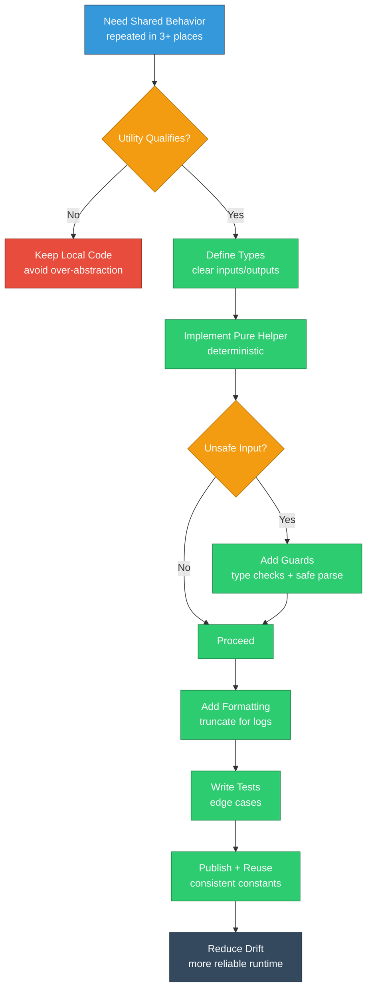

# Module 9: Utilities and Framework Constants

## EQXJS Framework - Context, Helpers, and Standardization

---

## Learning Objectives

After completing this module, you will be able to:

- Identify and apply common utility patterns in EQXJS services
- Use message/request context consistently across async flows
- Standardize constants and enums across modules to reduce drift
- Implement type guards and safe helpers for runtime reliability
- Build small utilities that improve code quality without over-engineering

---

## Overview

Utility modules often become dumping grounds. In enterprise systems, utilities should be:

- small
- well-named
- stable
- tested
- reusable across services

EQXJS utilities (and your own shared util layer) typically cover:

- message context propagation
- standardized constants (headers, error codes)
- type guards and safe parsing
- formatting helpers



---

## 9.1 Framework Utility Principles

### Good utility checklist

A utility is “good” if it:

- reduces duplicated code in 3+ places
- is deterministic and side-effect-free (when possible)
- has clear input/output types
- handles edge cases safely

Avoid utilities that:

- hide business logic
- depend on global state
- introduce implicit behavior

---

## 9.2 Message/Request Context Management

### What context is used for

Context is the metadata that should flow with work:

- `correlationId`
- `requestId`
- `userId`
- `organizationId`
- `channel` (http, kafka, cron)

### Minimal context type

```typescript
export interface MessageContext {
  correlationId: string;
  requestId?: string;
  userId?: string;
  organizationId?: string;
  channel?: "http" | "kafka" | "cron" | "cli";
  timestamp?: string;
}
```

### Context creation helpers

```typescript
export function createContext(
  partial: Partial<MessageContext> = {},
): MessageContext {
  return {
    correlationId: partial.correlationId ?? generateCorrelationId(),
    requestId: partial.requestId,
    userId: partial.userId,
    organizationId: partial.organizationId,
    channel: partial.channel,
    timestamp: partial.timestamp ?? new Date().toISOString(),
  };
}

export function generateCorrelationId(): string {
  // Use crypto.randomUUID() in Node 18+ when available
  // fallback to a simple random id if needed
  return (
    globalThis.crypto?.randomUUID?.() ??
    `corr_${Date.now()}_${Math.random().toString(36).slice(2)}`
  );
}
```

### Context propagation rules

- propagate inbound `x-correlation-id` if present
- never overwrite correlation id mid-flow
- attach context to logs and outbound calls

---

## 9.3 Constants and Enumerations

### Why constants matter

Constants prevent drift across teams and repositories.

Recommended constant categories:

- header names
- error codes
- validation limits
- event names

### Example constants

```typescript
export const HEADER_CORRELATION_ID = "x-correlation-id";
export const HEADER_REQUEST_ID = "x-request-id";

export enum ErrorCode {
  VALIDATION_FAILED = "VALIDATION_FAILED",
  UNAUTHORIZED = "UNAUTHORIZED",
  FORBIDDEN = "FORBIDDEN",
  DEPENDENCY_TIMEOUT = "DEPENDENCY_TIMEOUT",
  DEPENDENCY_FAILURE = "DEPENDENCY_FAILURE",
  INTERNAL_ERROR = "INTERNAL_ERROR",
}

export enum EventName {
  USER_CREATED = "user.created",
  USER_UPDATED = "user.updated",
  USER_DELETED = "user.deleted",
}
```

### Versioning guidance

- avoid breaking changes to shared constants
- add new values instead
- document deprecations

---

## 9.4 Type Guards and Safe Parsing

### Type guards

```typescript
export function isRecord(value: unknown): value is Record<string, unknown> {
  return typeof value === "object" && value !== null && !Array.isArray(value);
}

export function isNonEmptyString(value: unknown): value is string {
  return typeof value === "string" && value.trim().length > 0;
}
```

### Safe JSON parsing

```typescript
export function safeJsonParse<T = unknown>(
  input: string,
): { ok: true; value: T } | { ok: false; error: string } {
  try {
    return { ok: true, value: JSON.parse(input) as T };
  } catch (e: any) {
    return { ok: false, error: e?.message ?? "Invalid JSON" };
  }
}
```

### Safe enum parsing

```typescript
export function parseEnumValue<T extends Record<string, string>>(
  enumObj: T,
  input: unknown,
): T[keyof T] | undefined {
  if (typeof input !== "string") return undefined;
  const values = Object.values(enumObj);
  return values.includes(input) ? (input as T[keyof T]) : undefined;
}
```

---

## 9.5 Formatting and Helper Utilities

### Duration formatting

```typescript
export function formatDurationMs(ms: number): string {
  if (!Number.isFinite(ms) || ms < 0) return "0ms";
  if (ms < 1000) return `${Math.round(ms)}ms`;
  const sec = ms / 1000;
  if (sec < 60) return `${sec.toFixed(2)}s`;
  const min = Math.floor(sec / 60);
  const rem = sec % 60;
  return `${min}m ${rem.toFixed(1)}s`;
}
```

### Truncation for safe logs

```typescript
export function truncateString(value: string, maxLen = 500): string {
  if (value.length <= maxLen) return value;
  return value.slice(0, maxLen) + "…";
}

export function truncateArray<T>(arr: T[], maxItems = 50): T[] {
  if (arr.length <= maxItems) return arr;
  return arr.slice(0, maxItems);
}
```

---

## Summary

In this module, you learned:

- Utility design principles for enterprise codebases
- Context creation and propagation patterns
- Standard constants and enums to reduce drift
- Type guards and safe parsing helpers
- Formatting utilities that keep logs safe and consistent

## Exercises

- [Module 9 Exercises](exercise/module-09-exercises.md)

## Next Steps

- Complete the [Module 9 Exercises](exercise/module-09-exercises.md)
- Identify 3 duplicated patterns in your service and extract small utilities
- Continue to [Module 10: Advanced Enterprise Patterns](Module-10-Advanced-Enterprise-Patterns.md)

---

**Previous: [Module 8 - Configuration Management and Commander](Module-08-Configuration-Management-and-Commander.md)** | **Next: [Module 10 - Advanced Enterprise Patterns](Module-10-Advanced-Enterprise-Patterns.md)**
