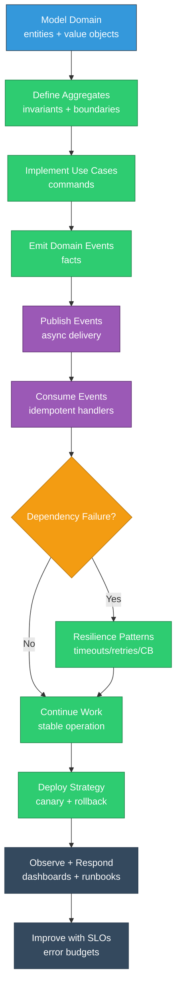

# Module 10: Advanced Enterprise Patterns

## EQXJS Framework - DDD, Distributed Resilience, and Production Architecture

---

## Learning Objectives

After completing this module, you will be able to:

- Apply domain-driven design (DDD) patterns in a NestJS/EQXJS service
- Use event-driven architecture patterns with strong boundaries
- Implement distributed-system resilience patterns (timeouts, retries, circuit breakers)
- Design for production operations: deploy strategies, rollback, and incident response
- Establish consistent error taxonomy and operational runbooks

---

## Overview

This module is about building systems that keep working under real-world conditions:

- dependencies fail
- networks partition
- configs drift
- load spikes
- teams deploy continuously

You’ll connect what you learned in earlier modules into end-to-end enterprise patterns.



---

## 10.1 Domain-Driven Design (DDD) in Practice

### Core DDD vocabulary

- **Entity**: identity-based object (e.g., User)
- **Value Object**: immutable, equality-based (e.g., Email)
- **Aggregate**: consistency boundary (e.g., Order aggregate)
- **Repository**: persistence abstraction
- **Domain Event**: records meaningful domain change

### Example: value object

```typescript
export class Email {
  private constructor(private readonly value: string) {}

  static create(input: string): Email {
    const normalized = input.trim().toLowerCase();
    if (!/^[^@]+@[^@]+\.[^@]+$/.test(normalized)) {
      throw new Error("INVALID_EMAIL");
    }
    return new Email(normalized);
  }

  toString() {
    return this.value;
  }
}
```

### Example: aggregate with domain events

```typescript
export interface DomainEvent {
  name: string;
  payload: unknown;
  occurredAt: string;
}

export class UserAggregate {
  private events: DomainEvent[] = [];

  constructor(
    public readonly id: string,
    private email: Email,
    private status: "active" | "inactive",
  ) {}

  activate() {
    if (this.status === "active") return;
    this.status = "active";
    this.events.push({
      name: "user.activated",
      payload: { userId: this.id },
      occurredAt: new Date().toISOString(),
    });
  }

  pullEvents(): DomainEvent[] {
    const out = [...this.events];
    this.events = [];
    return out;
  }
}
```

---

## 10.2 Event-Driven Architecture

### Recommended event rules

- Events represent facts (past tense)
- Events are immutable
- Consumers must be idempotent
- Include correlation IDs for traceability

### Idempotency key pattern

```typescript
export interface ConsumedEvent {
  id: string; // unique event id
  name: string;
  payload: any;
  context: {
    correlationId: string;
    producer: string;
    createdAt: string;
  };
}

export class IdempotencyStore {
  private readonly seen = new Set<string>();

  has(eventId: string) {
    return this.seen.has(eventId);
  }

  mark(eventId: string) {
    this.seen.add(eventId);
  }
}
```

---

## 10.3 Distributed Resilience Patterns

### Timeouts

- Always set timeouts for dependency calls
- Treat missing timeouts as a bug

### Retries (safe retries only)

Retry only when:

- operation is idempotent OR protected by idempotency key
- error is retriable (network/5xx)

### Circuit breaker

- open on repeated failures
- half-open to probe
- close when healthy

### Bulkheads

- separate pools for different dependency types
- prevent one dependency from starving others

---

## 10.4 Error Taxonomy and Operational Exceptions

### Standard error categories

- `VALIDATION_FAILED`
- `AUTHENTICATION_FAILED`
- `AUTHORIZATION_FAILED`
- `DEPENDENCY_TIMEOUT`
- `DEPENDENCY_UNAVAILABLE`
- `CONCURRENCY_CONFLICT`
- `INTERNAL_ERROR`

### Error response structure

Use consistent fields:

- `code`
- `message`
- `correlationId`
- `details` (optional)

---

## 10.5 Production Deployment Patterns

### Blue/green deployment

- deploy new version side-by-side
- switch traffic
- rollback quickly

### Canary releases

- route small % traffic to new version
- watch metrics
- promote or rollback

### Feature flags

- deploy code safely
- toggle behavior via config
- ensure flags are removable

---

## 10.6 Incident Response and Runbooks

### What to include in a runbook

- symptom and impact
- dashboards to check
- logs to query (include examples)
- mitigation steps
- rollback steps
- follow-up actions

### SLO thinking

Track:

- availability
- latency
- freshness (for async systems)

Use error budgets to manage change.

---

## Summary

In this module, you learned how to:

- model domains with DDD building blocks
- design event-driven systems with idempotent consumers
- apply resilience patterns for distributed failures
- standardize errors for better operations
- plan safe deployments and incident response

## Exercises

- [Module 10 Exercises](exercise/module-10-exercises.md)

## Next Steps

- Complete the [Module 10 Exercises](exercise/module-10-exercises.md)
- Apply DDD boundaries to one real use case
- Ensure every dependency call has a timeout and correlation headers

---

**Previous: [Module 9 - Utilities and Framework Constants](Module-09-Utilities-and-Framework-Constants.md)**
